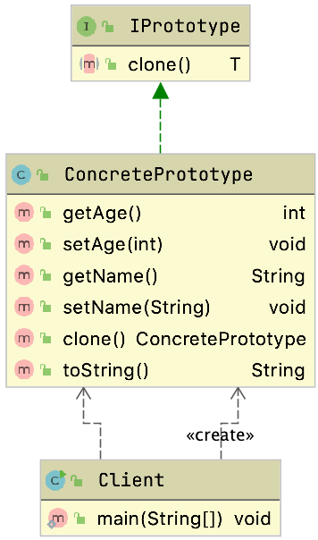

# 原型模式

​	原型实例指定创建对象的种类，并且通过拷贝这些原型创建新的对象，并且通过`拷贝`这些原型创建新的对象

​	调用者不需要知道任何创建细节，不调用构造函数

​	其属于一种创建型模式

## 通用类图




## 优点

- 性能好
  - 是在内存二进制流的拷贝，比直接new一个对象性能好，而且循环体内产生大量对象时，可以更好地提现优点
- 逃避构造函数的约束
  - 直接在内存中拷贝构造函数是不会执行的

## 适用场景

- 类初始化消耗资源较多
- new 产生的一个对象需要非常繁琐的过程（数据准备、访问权限等）
  - 省略了自己去get,set的过程
- 构造函数比较复杂时
- 循环体中产生大量对象时

## 使用

- 通过一个特定的方法来拷贝对应的对象

### 自己提供接口并且实现

### 使用JDK的clone方法

## 浅克隆

#### 测试

```java
@Data
public class ConcretePrototype implements Cloneable {

  private int age;
  private String name;
  private List<String> hobbies;

  @Override
  public ConcretePrototype clone() {
    try {
      return (ConcretePrototype)super.clone();
    } catch (CloneNotSupportedException e) {
      e.printStackTrace();
      return null;
    }
  }
}
```


```java
public static void main(String[] args) {
  ConcretePrototype prototype = new ConcretePrototype();
  prototype.setAge(18);
  prototype.setName("zzy");
  List<String> hobbies = new ArrayList<String>();
  hobbies.add("music");
  hobbies.add("article");
  prototype.setHobbies(hobbies);

  //拷贝原型对象
  ConcretePrototype cloneType = prototype.clone();
  cloneType.getHobbies().add("program");


  System.out.println("原型对象：" + prototype);
  System.out.println("克隆对象：" + cloneType);
  System.out.println(prototype == cloneType);


  System.out.println("原型对象的爱好：" + prototype.getHobbies());
  System.out.println("克隆对象的爱好：" + cloneType.getHobbies());
  System.out.println(prototype.getHobbies() == cloneType.getHobbies());

}
```

> 原型对象：ConcretePrototype{age=18, name='zzy', hobbies=[music, article, program]}
> 克隆对象：ConcretePrototype{age=18, name='zzy', hobbies=[music, article, program]}
> false
> 原型对象的爱好：[music, article, program]
> 克隆对象的爱好：[music, article, program]
> true

通过结果可以看到通过`clone`拷贝出来对象的集合类型的内存地址没有改变

> 基本数据类型直接拷贝了，但是引用数据类型拷贝的是属性的内存地址，具体的元素并没有拷贝

这种方式会给我们未来的使用带来风险

## 深克隆

### 序列化和反序列化的方式

#### 手写流

> 这种方式对象一定要记得序列化

```java
public ConcretePrototype deepClone(){
  try {
    ByteArrayOutputStream bos = new ByteArrayOutputStream();
    ObjectOutputStream oos = new ObjectOutputStream(bos);
    oos.writeObject(this);

    ByteArrayInputStream bis = new ByteArrayInputStream(bos.toByteArray());
    ObjectInputStream ois = new ObjectInputStream(bis);

    return (ConcretePrototype)ois.readObject();
  }catch (Exception e){
    e.printStackTrace();
    return null;
  }
```

- 缺点
  - 性能不好
  - 占用IO
  - 没有通过构造方法来生成对象
    - 会破坏单例模式

#### 通过json序列化和反序列化

### 常用的工具

#### Spring 的BeanUtils

`org.springframework.beans.BeanUtils#copyProperties`

### Apache的Beanutils

`org.apache.commons.beanutils.BeanUtils`

> 不推荐使用，性能差
>
> 对于对象拷贝加了很多的检验，包括类型的转换，甚至还会检验对象所属的类的可访问性,非常复杂，这也造就了它的差劲的性能，


## 原型模式在源码中的提现

### ArrayList

```java
public class ArrayList<E> extends AbstractList<E>
  implements List<E>, RandomAccess, Cloneable, java.io.Serializable
{
  public Object clone() {
    try {
      ArrayList<?> v = (ArrayList<?>) super.clone();
      v.elementData = Arrays.copyOf(elementData, size);
      v.modCount = 0;
      return v;
    } catch (CloneNotSupportedException e) {
      // this shouldn't happen, since we are Cloneable
      throw new InternalError(e);
    }
  }
}
```

### HashMap

```java
public class HashMap<K,V> extends AbstractMap<K,V>
  implements Map<K,V>, Cloneable, Serializable {
  public Object clone() {
    HashMap<K,V> result;
    try {
      result = (HashMap<K,V>)super.clone();
    } catch (CloneNotSupportedException e) {
      // this shouldn't happen, since we are Cloneable
      throw new InternalError(e);
    }
    result.reinitialize();
    result.putMapEntries(this, false);
    return result;
  }
}
```


## 注意事项

### 构造函数不会被执行

​	对象拷贝时构造函数确实没有被执行，这点从原理来讲也是可以讲得通的，Object类的clone方法的原理是从内存中（具体地说就是堆内存）以二进制流的方式进行拷贝，重新分配一个内存块，那构造函数没有被执行也是非常正常的了。

### 深拷贝和浅拷贝

> 深拷贝和浅拷贝建议不要混合使用，特别是在涉及类的继承 时，父类有多个引用的情况就非常复杂，建议的方案是深拷贝和浅拷贝

### final修饰的变量是不会被拷贝的


## 问题

> 通过实现`Cloneable`接口怎么实现克隆原理是什么？有什么问题？代码中是如何验证是深克隆还是浅克隆的？

一般都是直接基于内存二进制流来进行拷贝，不会经过构造函数，性能能够提升很多。

- 注意
  - 是浅拷贝的
    - 引用数据类型是不会被拷贝的，拷贝的是内存地址，不会创建一个新的
    - final修饰的变量是不会被拷贝的
- 验证方式
  - 通过比较内存地址来判断

> 深克隆有哪些解决办法？

- 通过序列化和反序列化
- 通过Json工具

> 如果我需要单例，怎么防止克隆破坏单例

- 重写readResolve方法