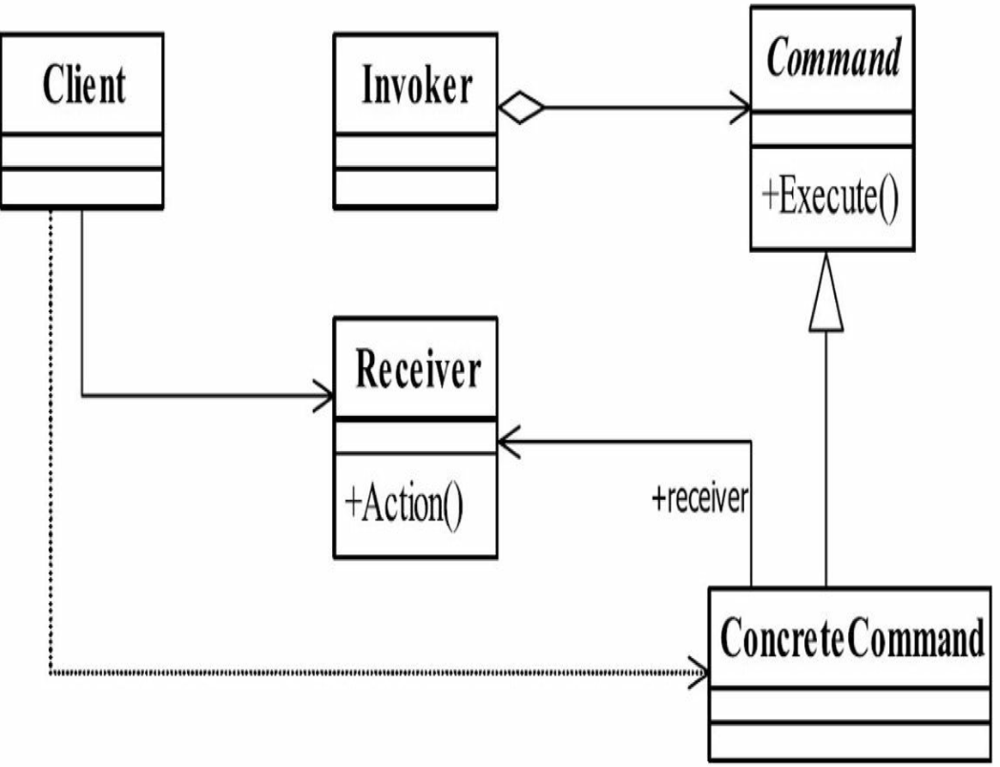
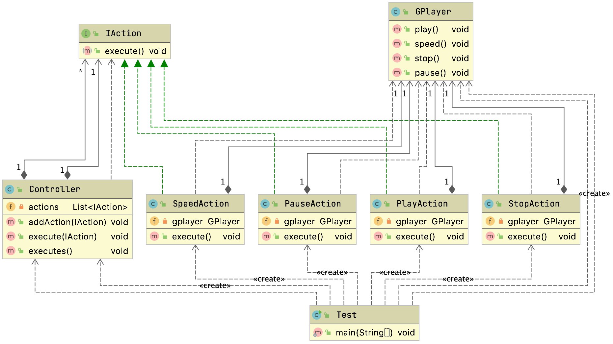

# 命令模式

## 定义

- 命令封装
  - 每一个命令是一个操作
- 解耦请求方和接收方
- 请求方只需要请求执行命令，不需要关心命令是怎么被接受，操作和是否被执行

> 行为型模式

## 生活中的场景

遥控器

餐厅点菜

把需求和执行解耦

## 适用场景

- 现实语义中具备命令的操作
  - shell命令
  - 命令菜单
- 调用者和请求的接受者需要解耦
  - 调用者不需要关心具体命令的执行细节，只需要把对应的命令传递出去就行了
- 需要抽象出等待执行的行为
  - 撤销
  - 恢复等操作
- 需要支持命令宏
  - 命令组合操作

> shell 中的help命令


## 通用类图



- Receive接收者角色该角色就是干活的角色,命令传递到这里是应该被执行的
- Command命令角色需要执行的所有命令都在这里声明。
- Invoker调用者角色接收到命令,并执行命令。

## 具体案例

​	假如我们自己开发一个播放器,播放器有播放功能、有拖动进度条功能、停止播放功能、暂停功能,我们自己去操作播放器的时候并不是直接调用播放器的方法,而是通过一个控制条去传递指令给播放器内核,那么具体传达什么指令,会被封装为一个ー个的按钮。

​	那么每个按钮的就相当于是对一条命令的封装。用控制条实现了用户发送指令与播放器內核接收指令的解耦。

### 播放器定义

```java
public class GPlayer {
  public void play(){
    System.out.println("正常播放");
  }

  public void speed(){
    System.out.println("拖动进度条");
  }

  public void stop(){
    System.out.println("停止播放");
  }

  public void pause(){
    System.out.println("暂停播放");
  }
}
```

### 抽象执行的动作定义

```java
public interface IAction {
    void execute();
}
```

### 播放动作

```java
public class PlayAction implements IAction {
  private GPlayer gplayer;

  public PlayAction(GPlayer gplayer) {
    this.gplayer = gplayer;
  }

  public void execute() {
    gplayer.play();
  }
}
```

### 暂停动作

```java
public class PauseAction implements IAction {
  private GPlayer gplayer;

  public PauseAction(GPlayer gplayer) {
    this.gplayer = gplayer;
  }

  public void execute() {
    gplayer.pause();
  }
}
```

### 具体的执行类

这个是具体的执行类，也是我们提供给客户的基础动作入口

```java
public class Controller {
  private List<IAction> actions = new ArrayList<IAction>();

  public void addAction(IAction action){
    actions.add(action);
  }

  public void execute(IAction action){
    action.execute();
  }

  public void executes(){
    for (IAction action:actions) {
      action.execute();
    }
    actions.clear();
  }
}
```

测试

```java
public class Test {
  public static void main(String[] args) {

    GPlayer player = new GPlayer();
    Controller controller = new Controller();
    controller.execute(new PlayAction(player));

    controller.addAction(new PauseAction(player));
    controller.addAction(new PlayAction(player));
    controller.addAction(new StopAction(player));
    controller.addAction(new SpeedAction(player));
    controller.executes();
  }
}
```

> 也可以构建一个链通过建造者模式来快速增加Action



## 源码中的体现

### JDK Runnable

Runnable是抽象，具体的实现是用户来实现的

`Thread#start`执行后会抢CPU

通过有接口的命令抽象，我们可以有很多的扩展，Run中的逻辑就是一条一条的命令，我们调用者并不需要底层是如何调度CPu的，只需要传入命令也就是`Runnable`就行了

### Junit Test

```java
public interface Test {
  /**
     * Counts the number of test cases that will be run by this test.
     */
  public abstract int countTestCases();

  /**
     * Runs a test and collects its result in a TestResult instance.
     */
  public abstract void run(TestResult result);
}
```

`junit.framework.TestCase`

```java
@SuppressWarnings("deprecation")
public static void assertTrue(String message, boolean condition) {
  Assert.assertTrue(message, condition);
}

@SuppressWarnings("deprecation")
public static void assertTrue(boolean condition) {
  Assert.assertTrue(condition);
}
```

同理，单元测试，用户可以不用关心内核，直接调用就行了


## 总结

### 优缺点

#### 优点

- 类间解耦
  - 调用者和接受者之间没有任何依赖关系
  - 调用者实现的时候只需要调用Command抽象类的execute方法就行了
  - 不需要了解到底是谁在执行
- 可扩展性
  - Command的子类非常容易扩展，调用者Invoker和高层次的Client不产生严重的代码耦合
- 命令模式结合其他模式会更优秀
  - 命令模式可以结合责任链模式,实现命令族解析任务
  - 结合模板方法模式,则可以减少Command子类的膨胀问题。

#### 缺点

- <font color="red">如果有N个命令，就需要N个Command的子类，类膨胀非常大</font>

### 使用场景

​	只要你认为是命令的地方就可以采用命令模式,例如,在GUI开发中,一个按钮的点击是一个命令,可以采用命令模式;模拟DOS命令的时候,当然也要采用命令模式;触发-反馈机制的处理等。

****
