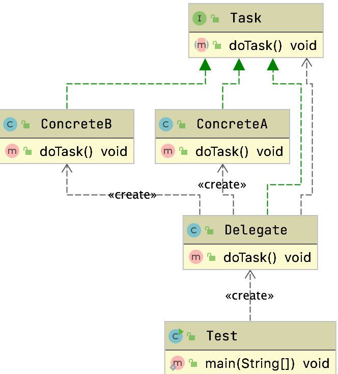
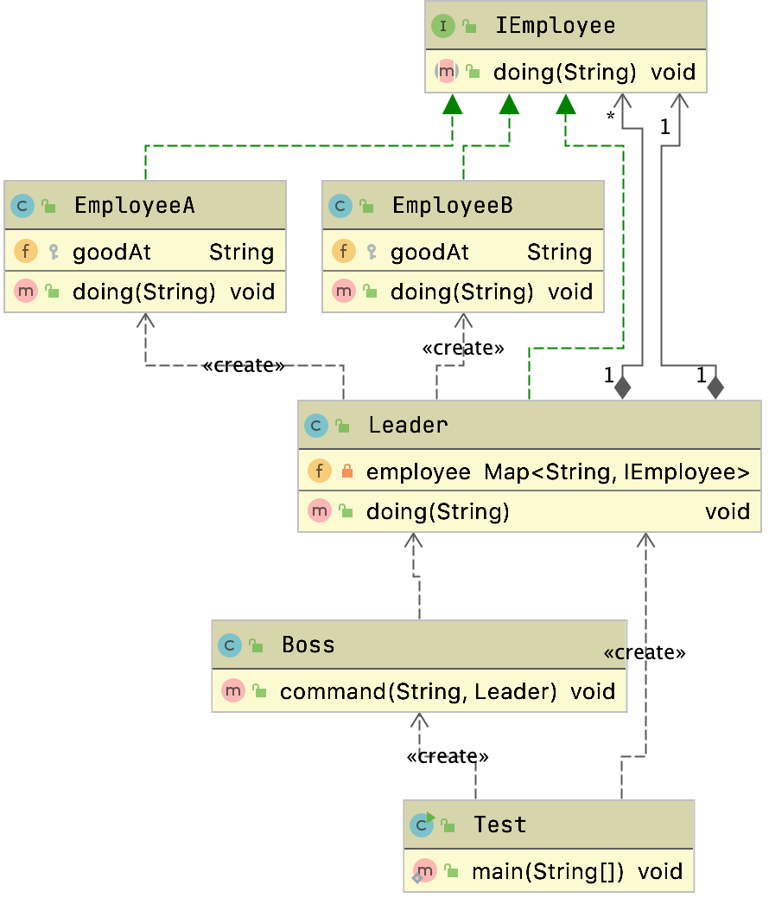

# 委派模式

​	精简程序逻辑，便于阅读

​	其基本作用是负责任务的调度和分配任务，和代理模式很像，可以看做是一种特殊情况下的静态代理的`全权代理`，但是`代理模式注重过程`，但是`委派模式注重结果`。

​	是一种行为型模式。

​	一般`Delegate`，`Dispatcher`结尾的都是委派

> 不属于GOF23种设计模式

## 通用类图



### Delegate 委派角色

负载在各个具体角色实例之间做出决策，并且判断和调用具体的方法

Deletgate委派类，委派类收到任务后，交给对应的集体干活的人事干活

```java
public class Delegate implements Task{
  public void doTask() {
    System.out.println("代理执行开始....");

    Task task = null;
    if (new Random().nextBoolean()){
      task = new ConcreteA();
      task.doTask();
    }else{
      task = new ConcreteB();
      task.doTask();
    }

    System.out.println("代理执行完毕....");
  }
}
```


## 案例

### 老板叫员工干活

​	老板叫经理干活，经理通过不同的内容叫不同的员工去做事情



#### 	首先定义接口，把干活的内容抽象出来

```java
public interface IEmployee {
    public void doing(String command);

}
```

#### 接下来定义员工a和员工B

```java
public class EmployeeA implements IEmployee {
  @Override
  System.out.println("我是员工A，我现在开始干" + command + "工作");
}
}
```

```java
public class EmployeeB implements IEmployee {
  @Override
  public void doing(String command) {
    System.out.println("我是员工B，我现在开始干" + command + "工作");
  }
}
```

#### 经理记录员工

```java
public class Leader implements IEmployee {

  private Map<String,IEmployee> targets = new HashMap<String,IEmployee>();

  public Leader() {
    targets.put("加密",new EmployeeA());
    targets.put("登录",new EmployeeB());
  }

  //项目经理自己不干活
  public void doing(String command){
    targets.get(command).doing(command);
  }

}
```

#### 老板叫经理干活

```java
public class Boss {
  public void command(String command,Leader leader){
    leader.doing(command);
  }
}
```

#### 测试

```java
public class DelegateTest {
  public static void main(String[] args) {

    //客户请求（Boss）、委派者（Leader）、被被委派者（Target）
    //委派者要持有被委派者的引用
    //代理模式注重的是过程， 委派模式注重的是结果
    //策略模式注重是可扩展（外部扩展），委派模式注重内部的灵活和复用
    //委派的核心：就是分发、调度、派遣
    //委派模式：就是静态代理和策略模式一种特殊的组合

    new Boss().command("登录",new Leader());
  }
}
```

这种方式能够避免我们使用if或者switch去判断

> 可以看到老板其实并不需要关心干活的是谁，只需要找领导就行了，这个是符合最少知道原则的

## 在源码中的应用

### Spring Web MVC

`org.springframework.web.servlet.DispatcherServlet#doDispatch`

不同的请求交给不同的请求处理器`mappedHandler`去处理

```java
protected void doDispatch(HttpServletRequest request, HttpServletResponse response) throws Exception {
  //胜率了很多源代码

  // Determine handler for the current request.
  mappedHandler = getHandler(processedRequest);
  if (mappedHandler == null) {
    noHandlerFound(processedRequest, response);
    return;
  }

  // Determine handler adapter for the current request.
  HandlerAdapter ha = getHandlerAdapter(mappedHandler.getHandler());


  if (!mappedHandler.applyPreHandle(processedRequest, response)) {
    return;
  }

  // Actually invoke the handler.
  mv = ha.handle(processedRequest, response, mappedHandler.getHandler());

  if (asyncManager.isConcurrentHandlingStarted()) {
    return;
  }

  applyDefaultViewName(processedRequest, mv);
  mappedHandler.applyPostHandle(processedRequest, response, mv);
}

}
```


### JDK-双亲委派

> ​	一个类加载器在加载类时,先把这个请求委派给自己的父类加载器去执行,如果父类加载器还存在父类加載器, 就继续向上委派,直到顶层的启动类加载器。如果父类加载器能够完成类加加载,就成功返回,如果父类加载器无法完成加载,那么子加載器オ会尝试试自己去加載。

​	从定义中可以看到双亲加载模型一个类加载器加载类时,首先不是自己加载,而是委派给父加載器。

​	下面我们来看看 `ClassLoader#loadClass`

```java
protected Class<?> loadClass(String name, boolean resolve)
  throws ClassNotFoundException
{
  synchronized (getClassLoadingLock(name)) {
    // First, check if the class has already been loaded
    Class<?> c = findLoadedClass(name);
    if (c == null) {
      long t0 = System.nanoTime();
      try {
        if (parent != null) {
          c = parent.loadClass(name, false);
        } else {
          c = findBootstrapClassOrNull(name);
        }
      } catch (ClassNotFoundException e) {
        // ClassNotFoundException thrown if class not found
        // from the non-null parent class loader
      }

      if (c == null) {
        // If still not found, then invoke findClass in order
        // to find the class.
        long t1 = System.nanoTime();
        c = findClass(name);

        // this is the defining class loader; record the stats
        sun.misc.PerfCounter.getParentDelegationTime().addTime(t1 - t0);
        sun.misc.PerfCounter.getFindClassTime().addElapsedTimeFrom(t1);
        sun.misc.PerfCounter.getFindClasses().increment();
      }
    }
    if (resolve) {
      resolveClass(c);
    }
    return c;
  }
}
```


```java
if (parent != null) {
  c = parent.loadClass(name, false);
} else {
  c = findBootstrapClassOrNull(name);
}
```

先看父类有没有，有的话就父来`loadClass`

### 反射-Method

```java
public Object invoke(Object obj, Object... args)
  throws IllegalAccessException, IllegalArgumentException,
InvocationTargetException
{
  if (!override) {
    if (!Reflection.quickCheckMemberAccess(clazz, modifiers)) {
      Class<?> caller = Reflection.getCallerClass();
      checkAccess(caller, clazz, obj, modifiers);
    }
  }
  MethodAccessor ma = methodAccessor;             // read volatile
  if (ma == null) {
    ma = acquireMethodAccessor();
  }
  return ma.invoke(obj, args);
}
```

可以看到全权交给了`MethodAccessor`来调用

`sun.reflect.NativeMethodAccessorImpl#invoke`

```java
public Object invoke(Object var1, Object[] var2) throws IllegalArgumentException, InvocationTargetException {
  if (++this.numInvocations > ReflectionFactory.inflationThreshold() && !ReflectUtil.isVMAnonymousClass(this.method.getDeclaringClass())) {
    MethodAccessorImpl var3 = (MethodAccessorImpl)(new MethodAccessorGenerator()).generateMethod(this.method.getDeclaringClass(), this.method.getName(), this.method.getParameterTypes(), this.method.getReturnType(), this.method.getExceptionTypes(), this.method.getModifiers());
    this.parent.setDelegate(var3);
  }

  return invoke0(this.method, var1, var2);
}
```

metho没干啥，委派给了别人来做，这样我们不用关心底层是怎么用的

有点类似于门面模式，但是委派是行为型模式，门面是结构型模式

### Spring中的BeanDefinition

解析xml中的Bean标签也使用了委派模式

`org.springframework.beans.factory.xml.DefaultBeanDefinitionDocumentReader#parseBeanDefinitions`

```java
	protected void parseBeanDefinitions(Element root, BeanDefinitionParserDelegate delegate) {
		if (delegate.isDefaultNamespace(root)) {
			NodeList nl = root.getChildNodes();
			for (int i = 0; i < nl.getLength(); i++) {
				Node node = nl.item(i);
				if (node instanceof Element) {
					Element ele = (Element) node;
					if (delegate.isDefaultNamespace(ele)) {
						parseDefaultElement(ele, delegate);
					}
					else {
						delegate.parseCustomElement(ele);
					}
				}
			}
		}
		else {
			delegate.parseCustomElement(root);
		}
	}

```

Element的话就交给`BeanDefinitionParserDelegate`来处理了


> 静态代理会在前后增加一些逻辑，委派模式就是全权交给别人来处理


# 总结

## 优缺点

### 优点

- 通过任务委派能够将一个`大型的任务细化`,
  - 通过统一管理这些子任务的完成情况实现任务的跟进

- 能够加快任务执行的效率。

### 缺点

- 任务委派方式需要根据任务的复杂程度进行不同的改变
- 在任务比较复杂的情况下可能需要进行多重委派
- 容易造成紊乱

## 和代理的区别

委派是行为型模式

代理是结构型模式

- 委派注重任务派遣
  - 注重结果
- 代理注重增强
  - 注重过程
- 委派是特殊的静态代理，相当于全权代理

## 问题

> 委派主要解决什么问题，什么情况下要委派。

主要是负责任务的调度和处理，我们有一个管理者，和一些执行者，管理者把任务分配给执行者的情况下需要委派。

也可以说是一个大任务需要拆分成多个子任务，但是别人只需要我们把任务执行完，这时候就可以采用委派模式。