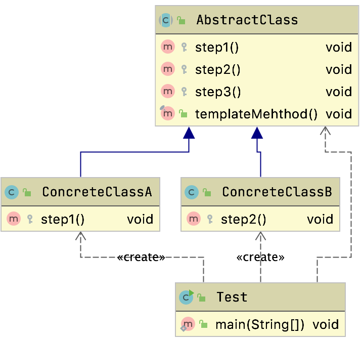
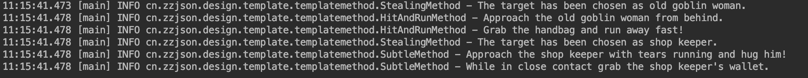
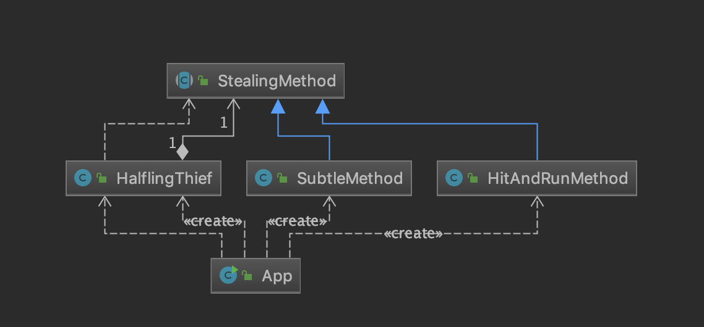
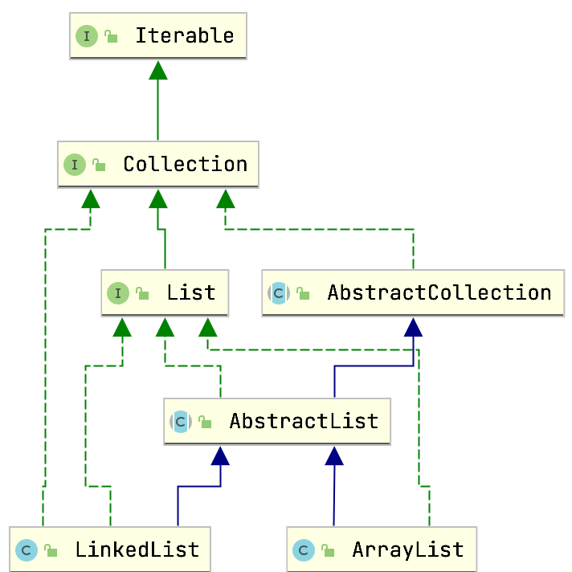
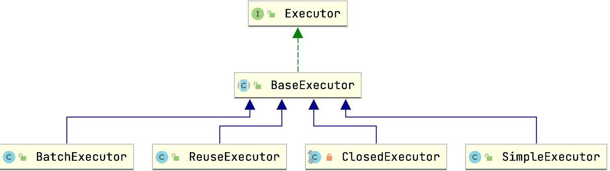

# 模板模式

## 简介

​	参考文档：<https://en.wikipedia.org/wiki/Template_method_pattern>

​	通常叫模板方法模式定义一个算法的骨架，并允许子类为一个或者多个步骤提供实现。

​	能够使得子类可以在不改变算法结构的情况下，重新定义算法的某些步骤。

​	属于行为性设计模式

## 通用的类图



```java
public abstract class AbstractClass {
    protected void step1() {
        System.out.println("AbstractClass:step1");
    }

    protected void step2() {
        System.out.println("AbstractClass:step2");
    }

    protected void step3() {
        System.out.println("AbstractClass:step3");
    }

    // 声明为final方法，避免子类覆写
    public final void templateMehthod() {
        this.step1();
        this.step2();
        this.step3();
    }
}
```

需要注意公共方法，流程方法一般都是final修饰的，避免被子类重写

## 生活中的场景

> 这种固定的步骤

- 把大象放进冰箱
  - 打开门
  - 大象放进冰箱
  - 关闭们

- 炒菜

固定的流程放在最顶部，具体实现类来实现细节

## 案例

案例代码来自https://github.com/iluwatar/java-design-patterns

一个小偷偷东西一般分成几个步骤：

- 寻找目标
- 迷惑目标
- 下手

所以我们先定义一个小偷

```java
public class HalflingThief {

  private StealingMethod method;

  public HalflingThief(StealingMethod method) {
    this.method = method;
  }

  public void steal() {
    method.steal();
  }

  public void changeMethod(StealingMethod method) {
    this.method = method;
  }
}
```

​	因为小偷偷东西都是几个固定步骤，所以我们使用模板方法，但是下手的过程有多种方式，所以开放钩子steal方法

```java
public abstract class StealingMethod {

  private static final Logger LOGGER = LoggerFactory.getLogger(StealingMethod.class);

  protected abstract String pickTarget();

  protected abstract void confuseTarget(String target);

  protected abstract void stealTheItem(String target);


  public void steal() {
    String target = pickTarget();
    LOGGER.info("The target has been chosen as {}.", target);
    confuseTarget(target);
    stealTheItem(target);
  }
}
```

### 撞击然后开溜

```java
public class HitAndRunMethod extends StealingMethod {
  
    private static final Logger LOGGER = LoggerFactory.getLogger(HitAndRunMethod.class);
  
    @Override
    protected String pickTarget() {
      return "old goblin woman";
    }
  
    @Override
    protected void confuseTarget(String target) {
      LOGGER.info("Approach the {} from behind.", target);
    }
  
    @Override
    protected void stealTheItem(String target) {
      LOGGER.info("Grab the handbag and run away fast!");
    }
  }
```

###   偷偷摸摸的干活

```java
  public class SubtleMethod extends StealingMethod {
  
    private static final Logger LOGGER = LoggerFactory.getLogger(SubtleMethod.class);
  
    @Override
    protected String pickTarget() {
      return "shop keeper";
    }
  
    @Override
    protected void confuseTarget(String target) {
      LOGGER.info("Approach the {} with tears running and hug him!", target);
    }
  
    @Override
    protected void stealTheItem(String target) {
      LOGGER.info("While in close contact grab the {}'s wallet.", target);
    }
  }
```

### 测试

```java

public class App {

  public static void main(String[] args) {
    HalflingThief thief = new HalflingThief(new HitAndRunMethod());
    thief.steal();
    thief.changeMethod(new SubtleMethod());
    thief.steal();
  }
}
```





## 源码中的体现

### JDBCTemplate

`JdbcTemplate#query()`

```java
	public <T> T query(
			PreparedStatementCreator psc, final PreparedStatementSetter pss, final ResultSetExtractor<T> rse)
			throws DataAccessException {

		Assert.notNull(rse, "ResultSetExtractor must not be null");
		logger.debug("Executing prepared SQL query");

		return execute(psc, new PreparedStatementCallback<T>() {
			@Override
			public T doInPreparedStatement(PreparedStatement ps) throws SQLException {
				ResultSet rs = null;
				try {
					if (pss != null) {
						pss.setValues(ps);
					}
					rs = ps.executeQuery();
					ResultSet rsToUse = rs;
					if (nativeJdbcExtractor != null) {
						rsToUse = nativeJdbcExtractor.getNativeResultSet(rs);
					}
					return rse.extractData(rsToUse);
				}
				finally {
					JdbcUtils.closeResultSet(rs);
					if (pss instanceof ParameterDisposer) {
						((ParameterDisposer) pss).cleanupParameters();
					}
				}
			}
		});
	}
```

```java
public List<T> extractData(ResultSet rs) throws SQLException {
  List<T> results = (this.rowsExpected > 0 ? new ArrayList<T>(this.rowsExpected) : new ArrayList<T>());
  int rowNum = 0;
  while (rs.next()) {
    results.add(this.rowMapper.mapRow(rs, rowNum++));
  }
  return results;
}
```

可以看到固定的代码都已经帮我们写好了，帮我们做了获取连接，获取驱动，获取statement，关闭连接等。

我们只需要自己来实现对应的RowMapper做结果集映射就行了。

### AbstractList



AbstractList中定义了很多抽象方法能够让子类不用重复写

例如add方法

```java
public boolean add(E e) {
  add(size(), e);
  return true;
}
public void add(int index, E element) {
  throw new UnsupportedOperationException();
}
```

子类可以重写来实现自己的逻辑

### HttpServlet

```java
protected void service(HttpServletRequest req, HttpServletResponse resp)
  throws ServletException, IOException {

  String method = req.getMethod();

  if (method.equals(METHOD_GET)) {
    long lastModified = getLastModified(req);
    if (lastModified == -1) {
      // servlet doesn't support if-modified-since, no reason
      // to go through further expensive logic
      doGet(req, resp);
    } else {
      long ifModifiedSince;
      try {
        ifModifiedSince = req.getDateHeader(HEADER_IFMODSINCE);
      } catch (IllegalArgumentException iae) {
        // Invalid date header - proceed as if none was set
        ifModifiedSince = -1;
      }
      if (ifModifiedSince < (lastModified / 1000 * 1000)) {
        // If the servlet mod time is later, call doGet()
        // Round down to the nearest second for a proper compare
        // A ifModifiedSince of -1 will always be less
        maybeSetLastModified(resp, lastModified);
        doGet(req, resp);
      } else {
        resp.setStatus(HttpServletResponse.SC_NOT_MODIFIED);
      }
    }

  } else if (method.equals(METHOD_HEAD)) {
    long lastModified = getLastModified(req);
    maybeSetLastModified(resp, lastModified);
    doHead(req, resp);

  } else if (method.equals(METHOD_POST)) {
    doPost(req, resp);

  } else if (method.equals(METHOD_PUT)) {
    doPut(req, resp);

  } else if (method.equals(METHOD_DELETE)) {
    doDelete(req, resp);

  } else if (method.equals(METHOD_OPTIONS)) {
    doOptions(req,resp);

  } else if (method.equals(METHOD_TRACE)) {
    doTrace(req,resp);

  } else {

    String errMsg = lStrings.getString("http.method_not_implemented");
    Object[] errArgs = new Object[1];
    errArgs[0] = method;
    errMsg = MessageFormat.format(errMsg, errArgs);

    resp.sendError(HttpServletResponse.SC_NOT_IMPLEMENTED, errMsg);
  }
}
```

可以看到service方法就是模板方法，具体的DoGet和DoPost等方法就交给子类来实现，子类不需要重写这段冗长的代码了。

### Mybatis BaseExecute



Executor是一个基础的SQL执行类，他实现了大部分的SQL执行逻辑，然后把几个方法交给子类定制化来完成。

例如

- doUpdate
- doFlushStatement
- doQuery
- doQueryCursor

#### 查询方法

看到`org.apache.ibatis.executor.BaseExecutor#commit`他的提交方法会调用刷新也就是提交到数据库去，但是具体的实现可能提交的时机是不一样的，例如SimpleExecutor是立即提交，但是BatchExecutor是存一堆然后一起提交。

```java
public void commit(boolean required) throws SQLException {
  if (closed) {
    throw new ExecutorException("Cannot commit, transaction is already closed");
  }
  clearLocalCache();
  flushStatements();
  if (required) {
    transaction.commit();
  }
}

public List<BatchResult> flushStatements(boolean isRollBack) throws SQLException {
  if (closed) {
    throw new ExecutorException("Executor was closed.");
  }
  return doFlushStatements(isRollBack);
}

protected abstract List<BatchResult> doFlushStatements(boolean isRollback)
  throws SQLException;
```

此时查看具体的类的`doFlushStatements`

##### ReuseExecutor

`org.apache.ibatis.executor.ReuseExecutor#doFlushStatements`

```java
  private final Map<String, Statement> statementMap = new HashMap<>();

public List<BatchResult> doFlushStatements(boolean isRollback) {
  for (Statement stmt : statementMap.values()) {
    closeStatement(stmt);
  }
  statementMap.clear();
  return Collections.emptyList();
}
```

ReuseExecutor因为需要重用相同语句的Statement所以在提交的时候需要把那些都清空

##### SimpleExecutor

`org.apache.ibatis.executor.SimpleExecutor#doQuery`

```java
  @Override
  public List<BatchResult> doFlushStatements(boolean isRollback) {
    return Collections.emptyList();
  }
```

SimpleExecutor则不需要做任何操作

##### BatchExecutor

`org.apache.ibatis.executor.BatchExecutor#doQuery`

```java
public List<BatchResult> doFlushStatements(boolean isRollback) throws SQLException {
    try {
      List<BatchResult> results = new ArrayList<>();
      if (isRollback) {
        return Collections.emptyList();
      }
      for (int i = 0, n = statementList.size(); i < n; i++) {
        Statement stmt = statementList.get(i);
        applyTransactionTimeout(stmt);
        BatchResult batchResult = batchResultList.get(i);
        try {
          batchResult.setUpdateCounts(stmt.executeBatch());
          MappedStatement ms = batchResult.getMappedStatement();
          List<Object> parameterObjects = batchResult.getParameterObjects();
          KeyGenerator keyGenerator = ms.getKeyGenerator();
          if (Jdbc3KeyGenerator.class.equals(keyGenerator.getClass())) {
            Jdbc3KeyGenerator jdbc3KeyGenerator = (Jdbc3KeyGenerator) keyGenerator;
            jdbc3KeyGenerator.processBatch(ms, stmt, parameterObjects);
          } else if (!NoKeyGenerator.class.equals(keyGenerator.getClass())) { //issue #141
            for (Object parameter : parameterObjects) {
              keyGenerator.processAfter(this, ms, stmt, parameter);
            }
          }
          // Close statement to close cursor #1109
          closeStatement(stmt);
        } catch (BatchUpdateException e) {
          StringBuilder message = new StringBuilder();
          message.append(batchResult.getMappedStatement().getId())
              .append(" (batch index #")
              .append(i + 1)
              .append(")")
              .append(" failed.");
          if (i > 0) {
            message.append(" ")
                .append(i)
                .append(" prior sub executor(s) completed successfully, but will be rolled back.");
          }
          throw new BatchExecutorException(message.toString(), e, results, batchResult);
        }
        results.add(batchResult);
      }
      return results;
    } finally {
      for (Statement stmt : statementList) {
        closeStatement(stmt);
      }
      currentSql = null;
      statementList.clear();
      batchResultList.clear();
    }
  }
```

BatchExecutor则需要一批一批的来提交

所以可以看到公共的方法在父类中实现了，具体的差异性的内容都交给子类来实现钩子方法了

## 总结

### 模板和策略模式的区别

​	模板子类能干预实现，但是基础流程已经定下来了

​	策略不能干预流程，实现方式只能去选择

### 优缺点

#### 优点

- 封装不变部分，扩展可变部分
  - 新增功能，只需要一个新的子类来实现对应的功能方法就行了
- 提取公共部分代码，便于维护
  - 不然维护人员为了 修正一个缺陷，需要到处查找类似的代码！
- 行为由父类控制，子类实现
  - 基本方法是由子类实现的，因此子类可以通过扩展的方式增加相应 的功能，符合开闭原则。

#### 缺点

1. 类数目的增加，每一个抽象类都需要一个子类来实现，这样导致类的个数增加。
2. 类数量的增加，间接地增加了系统实现的复杂度。
3. 继承关系自身缺点，如果父类添加新的抽象方法，所有子类都要改一遍	

### 适用场景

- 一多个子类有公有的方法，并且逻辑基本相同时。
- 重要、复杂的算法，可以把核心算法设计为模板方法，周边的相 关细节功能则由各个子类实现。
- 重构时，模板方法模式是一个经常使用的模式，把相同的代码抽 取到父类中，然后通过钩子函数来约束行为

### 其他的问题

#### 父类怎么调用子类的方法

- 把子类传递到父类的有参构造中，然后调用。
- 使用反射的方式调用，你使用了反射还有谁不能调用的
- 父类调用子类的静态方法。