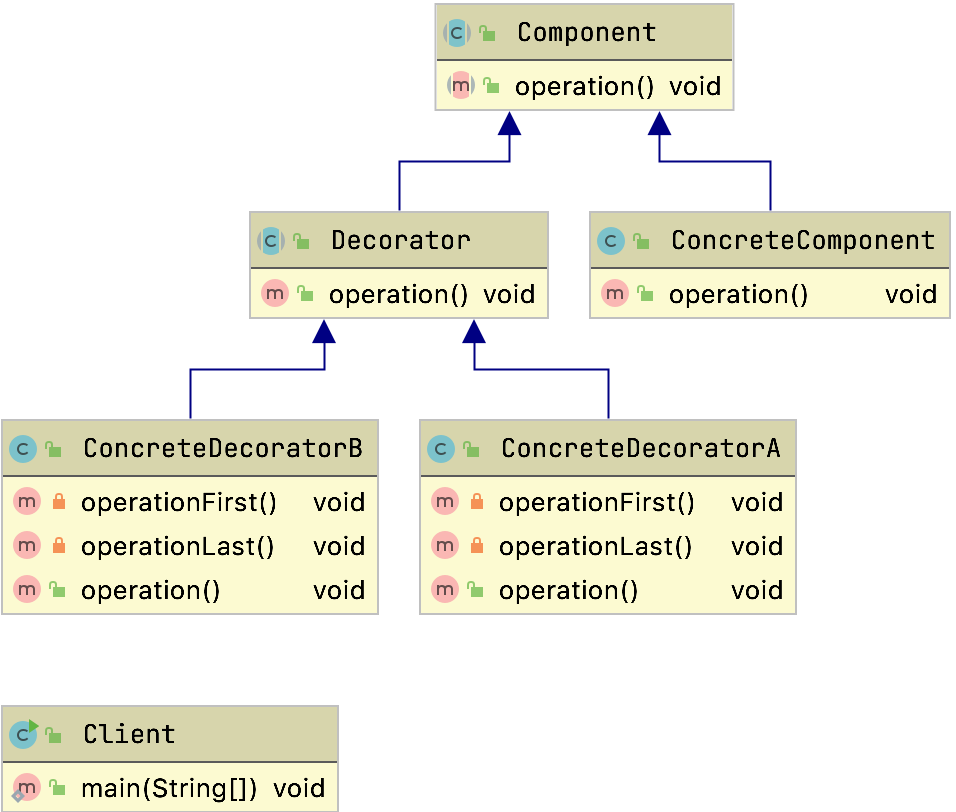
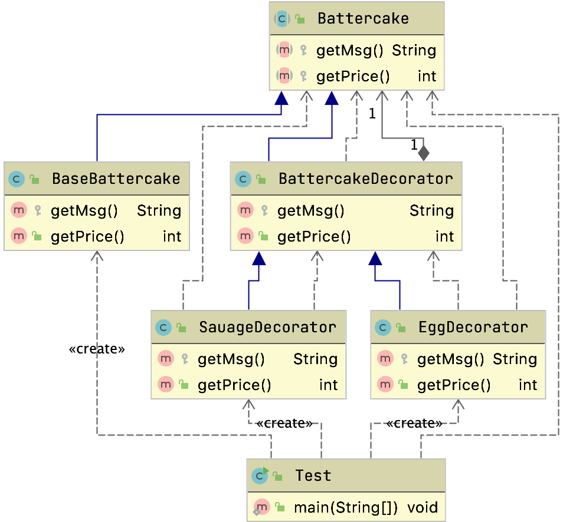
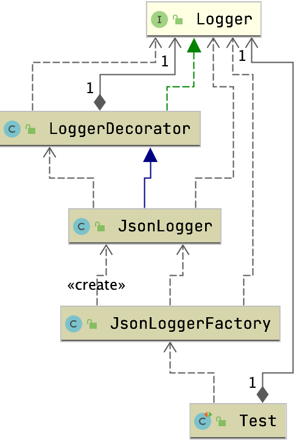
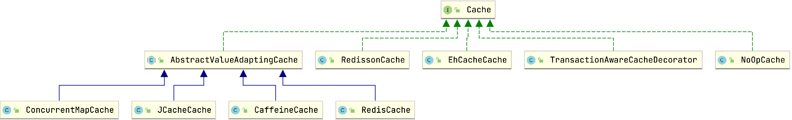
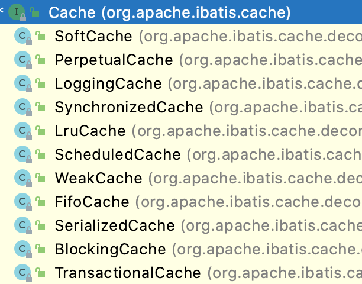
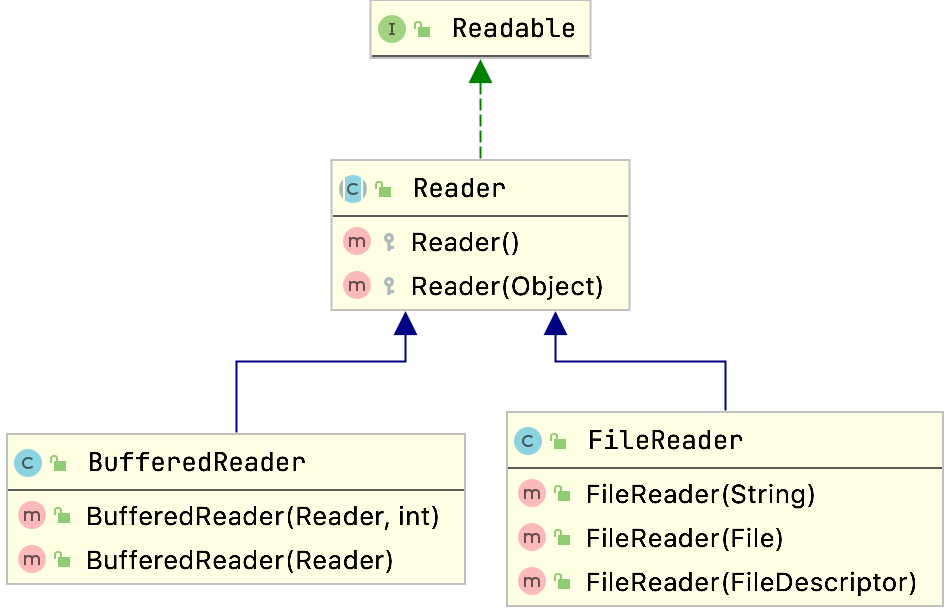

# 装饰器模式

## 定义

装饰器模式也叫包装模式

- 在不改变原有对象的基础上，把功能附加到对象上，提供了比继承更有弹性的替代方案
- 能够扩展原有对象的功能

> 属于结构型模式

## 生活中的例子

- 买煎饼
  - 我们煎饼可以加鸡蛋，加香肠
- 蛋糕
  - 可以加豆沙加各种各样的东西

## 通用结构



一般都是在构造方法当中来传入对应需要包装的对象

- Component
  - 是一个接口或者是抽象类，就是定义我们最核心的对象，也就是最原始的对象。
- ConcreteComponent 具体构件
  - ConcreteComponent是最核心、最原始、最基本的接口或抽象类的实现，你要装饰的就是它。
- Decorator装饰角色
  - 一般是一个抽象类，做什么用呢？
    - 实现接口或者抽象方法，它里面 可不一定有抽象的方法呀，在它的属性里必然有一个private变量指向 Component抽象构件。
- 具体装饰角色
  - ConcreteDecoratorA和ConcreteDecoratorB是两个具体的装饰类，要把你最核心的、最原始的、最基本的东西装饰成其他东西。

## 案例

### 煎饼

煎饼需要加香肠，鸡蛋，等



```java
public class SauageDecorator extends BattercakeDecorator{

  public SauageDecorator(Battercake battercake) {
    super(battercake);
  }

  protected String getMsg(){ return super.getMsg() + "1根香肠";}

  public int getPrice(){ return super.getPrice() + 2;}

}
```


```java
public class Test {
  public static void main(String[] args) {
    Battercake battercake;
    battercake = new BaseBattercake();

    battercake = new EggDecorator(battercake);

    battercake = new EggDecorator(battercake);

    battercake = new SauageDecorator(battercake);

    System.out.println(battercake.getMsg() + ",总价" + battercake.getPrice());

  }
}

```

> 可以利用装饰器模式快速的去选择需要增加的东西

### 包装日志



```java
public class JsonLogger extends LoggerDecorator {
  public JsonLogger(Logger logger) {
    super(logger);
  }

  @Override
  public void info(String s) {
    JSONObject result = newJsonObject();
    result.put("message",s);
    logger.info(result.toString());
  }

  @Override
  public void error(String s) {
    JSONObject result = newJsonObject();
    result.put("message",s);
    logger.info(result.toString());
  }

  public void error(Exception e){
    JSONObject result = newJsonObject();
    result.put("exception",e.getClass().getName());
    String trace = Arrays.toString(e.getStackTrace());
    result.put("starckTrace",trace);
    logger.info(result.toString());
  }

  private JSONObject newJsonObject(){
    return new JSONObject();
  }
}
```


```java
public class JsonLoggerFactory {

    public static JsonLogger getLogger(Class clazz){
        Logger logger = LoggerFactory.getLogger(clazz);
        return new JsonLogger(logger);
    }
}
```


- 我们可以直接对Loggerfactory的日志包装一层按照自己指定的格式来输出

## 源码中常见的装饰器

### InputStream

#### BufferedInputStream

```java
public BufferedInputStream(InputStream in) {
  this(in, DEFAULT_BUFFER_SIZE);
}
```

我们可以给流包装一层就可以直接在缓冲区去操作了，速度快很多

### Spring中的Cache



```java
public TransactionAwareCacheDecorator(Cache targetCache) {
		Assert.notNull(targetCache, "Target Cache must not be null");
		this.targetCache = targetCache;
	}
```

可以对缓存包装一层

可以在事物情况下保持缓存的一致性

### Dubbo中的Wrapper

#### ProtocolFilterWrapper

`org.apache.dubbo.rpc.protocol.ProtocolFilterWrapper`

```java
public ProtocolFilterWrapper(Protocol protocol) {
  if (protocol == null) {
    throw new IllegalArgumentException("protocol == null");
  }
  this.protocol = protocol;
}
```

#### QosProtocolWrapper

`org.apache.dubbo.qos.protocol.QosProtocolWrapper`

```java
public QosProtocolWrapper(Protocol protocol) {
  if (protocol == null) {
    throw new IllegalArgumentException("protocol == null");
  }
  this.protocol = protocol;
}

```


### Mybatis中的Cache



```java
public class LruCache implements Cache {

  private final Cache delegate;
  private Map<Object, Object> keyMap;
  private Object eldestKey;

  public LruCache(Cache delegate) {
    this.delegate = delegate;
    setSize(1024);
  }
  public void putObject(Object key, Object value) {
    delegate.putObject(key, value);
    cycleKeyList(key);
  }
  private void cycleKeyList(Object key) {
    keyMap.put(key, key);
    if (eldestKey != null) {
      delegate.removeObject(eldestKey);
      eldestKey = null;
    }
  }
  public void setSize(final int size) {
    keyMap = new LinkedHashMap<Object, Object>(size, .75F, true) {
      private static final long serialVersionUID = 4267176411845948333L;

      @Override
      protected boolean removeEldestEntry(Map.Entry<Object, Object> eldest) {
        boolean tooBig = size() > size;
        if (tooBig) {
          eldestKey = eldest.getKey();
        }
        return tooBig;
      }
    };
  }
}
```

在加入元素的周围包装了一层

可以看到每次加入元素的时候都会去比较元素数量，如果超过了最大的元素数量就会删除第一个节点

## 装饰器模式和代理模式对比

1. 是一种特殊的代理模式
2. 强调自身功能扩展，透明的扩展，可动态定制的扩展
3. 代理模式强调代理过程的控制

## 优缺点

### 优点

- 是继承的补充，比继承灵活
  - 不改变原有对象的情况下，能快速扩展功能
- 可以通过不同装饰器类和装饰器类的排列组合实现不同效果

### 缺点

- 会出现更多的代码，更多的类
- 嵌套调用代码变得复杂了

## 问题

> 仔细对比一下装饰者模式和代理模式结构图，想一想你怎么区分它们，从这里给你什么启发。

- 装饰器主要强调的是自己，扩展的是自己的能力，并且是对继承的扩展
- 代理模式则是为了实现对象的控制，提供一个代理对象出来，通过代理对象来控制原有对象的引用
- 装饰模式是为装饰的对象增强功能；而代理模式对代理的对象施加控制，但是并不象本身的功能进行增强；

> 分析一下java IO代码`new BufferedReader(new FileReader(""))` 为什么可以层层包装，画出类图或从代码层面描述怎么实现的



可以看到在BufferedReader构造方法中可以传入Reader那么在调用的时候就会给其包装一层

```java
private void fill() throws IOException {
  //这一段都是包装一层走的Buffer
  int dst;
  if (markedChar <= UNMARKED) {
    /* No mark */
    dst = 0;
  } else {
    /* Marked */
    int delta = nextChar - markedChar;
    if (delta >= readAheadLimit) {
      /* Gone past read-ahead limit: Invalidate mark */
      markedChar = INVALIDATED;
      readAheadLimit = 0;
      dst = 0;
    } else {
      if (readAheadLimit <= cb.length) {
        /* Shuffle in the current buffer */
        System.arraycopy(cb, markedChar, cb, 0, delta);
        markedChar = 0;
        dst = delta;
      } else {
        /* Reallocate buffer to accommodate read-ahead limit */
        char ncb[] = new char[readAheadLimit];
        System.arraycopy(cb, markedChar, ncb, 0, delta);
        cb = ncb;
        markedChar = 0;
        dst = delta;
      }
      nextChar = nChars = delta;
    }
  }

  int n;
  do {
    //FileReader#read
    n = in.read(cb, dst, cb.length - dst);
  } while (n == 0);
  if (n > 0) {
    nChars = dst + n;
    nextChar = dst;
  }
}
```

