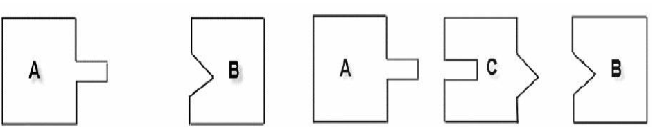
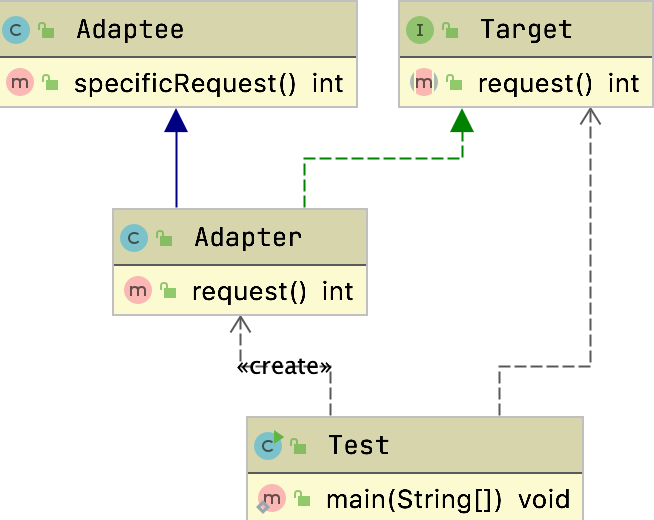
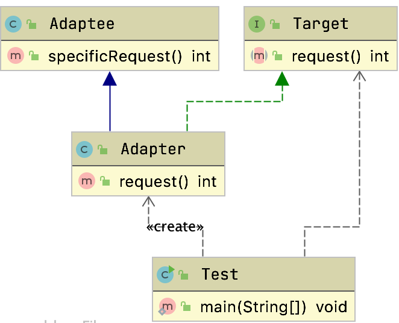
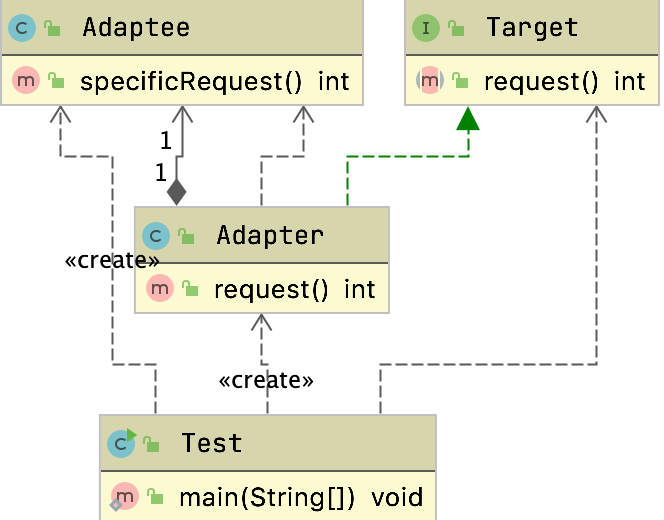
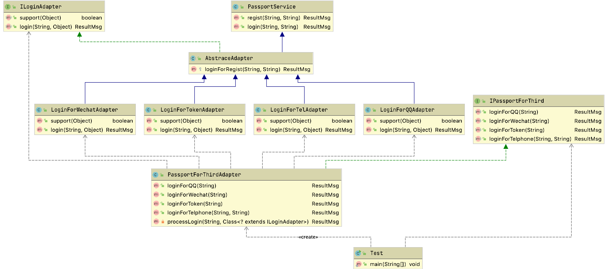

# 适配器模式

> 智者千虑必有一失，愚者千虑必有一得

在我们做设计的时候总是会出现一些`意外`，适配器模式就是帮我们来弥补这些意外的



## 定义

变压模式，也叫包装模式,但是包装模式可不止一个。装饰者也是。

功能是将 一个类的接口编程客户端所期望的另一个接口，从而使原本接口不匹配而无法在一起工作的两个类能够一起工作

> 属于结构型设计模式

## 例子

Switch的港版电压在国内是不适用的，需要两脚转三角插头

有点亡羊补牢的感觉

## 通用写法

### 类适配器



#### Target目标角色

​	该角色定义把其他类转换为何种接口，也就是我们的期望接口，例 子中的IUserInfo接口就是目标角色。

```java
public interface Target {
    int request();
}
```

​	目标角色是一个已经在正式运行的角色，你不可能去修改角色中的方法，你能做的就是如何去实现接口中的方法，而且通常情况下，目标角色是一个接口或者是抽象类，一般不会是实现类。

#### Adaptee源角色

​	你想把谁转换成目标角色，这个“谁”就是源角色，它是已经存在的、运行良好的类或对象，经过适配器角色的包装，它会成为一个崭新、靓丽的角色。

```java
public class Adaptee{

    public int specificRequest() {
        return 220;
    }
}
```

#### Adapter适配器角色

​	适配器模式的核心角色，其他两个角色都是已经存在的角色，而适配器角色是需要新建立的，它的职责非常简单：把源角色转换为目标角色，怎么转换？

#### 常用的三种方式

##### 1.通过继承源角色



```java
public class Adapter extends Adaptee implements Target {
    public int request() {
        return super.specificRequest() / 10;
    }
}
```

##### 2.通过组合源角色



```java
public class Adapter implements Target {
  private Adaptee adaptee;
  public Adapter(Adaptee adaptee){
    this.adaptee = adaptee;
  }
  public int request() {
    return adaptee.specificRequest() / 10;
  }
}
```

##### 3.接口适配，实现交给客户端

```java
public abstract class Adapter implements Target {

  protected Adaptee adaptee;
  public Adapter(Adaptee adaptee){
    this.adaptee = adaptee;
  }

  public int request1() {
    return 0;
  }

  public int request2() {
    return 0;
  }

  public int request3() {
    return 0;
  }

  public int request4() {
    return 0;
  }
}

```


```java
public class Test {
    public static void main(String[] args) {
        Target adapter = new Adapter(new Adaptee()) {
            @Override
            public int request1() {
                return adaptee.specificRequest() / 10;
            }
        };
        int result = adapter.request1();
        System.out.println(result);
    }
}
```


### 对象适配器

符合开闭原则

类似于装饰者模式

### 接口适配器

解决接口方法过多，有很多空的方法

违背接口隔离和单一职责

## 案例

### 电压的转化

#### 基于继承

```java
public interface DC5 {
    int output5V();
}
```


```java
public class AC220 {
  public int outputAC220V(){
    int output = 220;
    System.out.println("输出电压" + 220 + "V");
    return output;
  }
}
```


```java
public class PowerAdapter extends AC220 implements DC5 {
  public int output5V() {
    int adapterInput = super.outputAC220V();
    //具体转换就在这里只要这里可以转换就是适配器，至于继承AC220和实现DC5是java语法上面的写法，经验总结这些写法是比较好的<br>
    int adapterOutput = adapterInput / 44;
    System.out.println("使用Adapter输入AC" + adapterInput + "V,输出DC" + adapterOutput + "V");
    return adapterOutput;
  }
}
```


```java
public static void main(String[] args) {
  //输出DC5<br>
  DC5 adapter = new PowerAdapter();
  adapter.output5V();
  //
  //PowerAdapter 还可以输出220违背了最少知道原则
}
```

> 可以看到，基于继承的方式，违背了最少知道原则和合成复用原则

#### 基于组合

```java
public class PowerAdapter implements DC5 {
  private AC220 ac220;

  public PowerAdapter(AC220 ac220) {
    this.ac220 = ac220;
  }

  public int output5V() {
    int adapterInput = ac220.outputAC220V();
    int adapterOutput = adapterInput / 44;
    System.out.println("使用Adapter输入AC" + adapterInput + "V,输出DC" + adapterOutput + "V");
    return adapterOutput;
  }
}
```

```java
public class Test {
    public static void main(String[] args) {
        //使用组合来实现
        DC5 adapter = new PowerAdapter(new AC220());
        adapter.output5V();

        //对于外部只具备他应该知道的功能，比如DC5<br>
    }
}
```

> 这种方式是比较好的，符合最少知道原则

### 注册逻辑

我们的老系统都应该有登录接口，随着业务的发展单纯的依赖用户名和密码已经不能满足要求了。

现在有很多登录方式

- qq登录
- 微信登录
- 手机登录等

现在我们需要适配老系统的接口

- 注册逻辑固定
  - 我们需要适配qq
  - 微信
  - 手机号等

```java
public class PassportService {

  /**
     * 注册方法
     * @param username
     * @param password
     * @return
     */
  public ResultMsg regist(String username,String password){
    return  new ResultMsg(200,"注册成功",new Member());
  }

  /**
     * 登录的方法
     * @param username
     * @param password
     * @return
     */
  public ResultMsg login(String username,String password){
    return null;
  }

}
```

当前模拟以前的登录逻辑，注册方法需要传入用户名和密码，登录也是。

#### 定义三方登录接口

```java
public interface IPassportForThird {

  ResultMsg loginForQQ(String openId);

  ResultMsg loginForWechat(String openId);

  ResultMsg loginForToken(String token);

  ResultMsg loginForTelphone(String phone, String code);

}
```

#### 通过继承的方式实现适配

```java
public class PassportForThirdAdapter extends PassportService implements IPassportForThird {

  public ResultMsg loginForQQ(String openId) {
    return loginForRegist(openId,null);
  }

  public ResultMsg loginForWechat(String openId) {
    return loginForRegist(openId,null);
  }

  public ResultMsg loginForToken(String token) {
    return loginForRegist(token,null);
  }

  public ResultMsg loginForTelphone(String phone, String code) {
    return loginForRegist(phone,null);
  }

  private ResultMsg loginForRegist(String username,String password){
    if(null == password){
      password = "THIRD_EMPTY";
    }
    super.regist(username,password);
    return super.login(username,password);
  }
}
```

这种方式，以后一旦需要新增登录方式，那么我们适配器就需要修改，违背开闭原则，并且我们具体的登录逻辑都需要写在这个里面，代码会非常的长

#### 通过组合的方式实现适配

我们可以模拟Spring的，通过遍历来判断是否符合，如果符合就调用对应的适配器来适配

```java
public interface ILoginAdapter {
    boolean support(Object object);
    ResultMsg login(String id, Object adapter);
}
```

适配层

```java
public class PassportForThirdAdapter implements IPassportForThird {

    public ResultMsg loginForQQ(String openId) {
        return processLogin(openId, LoginForQQAdapter.class);
    }

    public ResultMsg loginForWechat(String openId) {

        return processLogin(openId, LoginForWechatAdapter.class);

    }

    public ResultMsg loginForToken(String token) {

        return processLogin(token, LoginForTokenAdapter.class);
    }

    public ResultMsg loginForTelphone(String phone, String code) {
        return processLogin(phone, LoginForTelAdapter.class);
    }

    /**
     * 不想把LoginForTelAdapter/LoginForTokenAdapter逻辑都写在一个类里所以区分开写<br>
     * @param id
     * @param clazz
     * @return
     */
    private ResultMsg processLogin(String id,Class<? extends ILoginAdapter> clazz){
        try {
            ILoginAdapter adapter = clazz.newInstance();//这个new出来的，我可以从池子里拿到<br>
            if (adapter.support(adapter)){
                return adapter.login(id,adapter);
            }
        } catch (Exception e) {
            e.printStackTrace();
        }
        return null;
    }

}
```

我们把对应的登录适配器放在这里面用来遍历适配器 是否匹配，如果匹配就调用具体的适配实现来登录。


```java
public abstract class AbstraceAdapter extends PassportService implements ILoginAdapter {
    protected ResultMsg loginForRegist(String username, String password){
        if(null == password){
            password = "THIRD_EMPTY";
        }
        super.regist(username,password);
        return super.login(username,password);
    }
}
```

登录逻辑是固定的，所以提供公共的抽象

```java
public class LoginForWechatAdapter extends AbstraceAdapter{
  public boolean support(Object adapter) {
    return adapter instanceof LoginForWechatAdapter;
  }

  public ResultMsg login(String id, Object adapter) {
    return super.loginForRegist(id,null);
  }
}
```

QQ适配同理

```java
public class LoginForQQAdapter extends AbstraceAdapter{
    public boolean support(Object adapter) {
        return adapter instanceof LoginForQQAdapter;
    }

    public ResultMsg login(String id, Object adapter) {
        if(!support(adapter)){return null;}
        //accesseToken  实际工作场景中你是要写很多代码的<br>
        //time
        return super.loginForRegist(id,null);

    }

}

```

具体类图



## 源码中的实现

### Spring中的`WebMvcConfigurerAdapter`

- 帮助我们做了接口的适配，这样实现类就可以不用都实现这些接口，只需要自己关心的接口了

```java
public abstract class WebMvcConfigurerAdapter implements WebMvcConfigurer {
    public WebMvcConfigurerAdapter() {
    }

    public void configurePathMatch(PathMatchConfigurer configurer) {
    }

    public void configureContentNegotiation(ContentNegotiationConfigurer configurer) {
    }

    public void configureAsyncSupport(AsyncSupportConfigurer configurer) {
    }

    public void configureDefaultServletHandling(DefaultServletHandlerConfigurer configurer) {
    }
  //胜率
}
```

在JAva8里面已经支持`Default`来解决这个问题了

```java
public interface WebMvcConfigurer {
  default void configurePathMatch(PathMatchConfigurer configurer) {
  }

  default void configureContentNegotiation(ContentNegotiationConfigurer configurer) {
  }
}
```

default方法我们接口的实现类就可以不用实现了

### SpringAOP

`org.springframework.aop.framework.adapter.AdvisorAdapter`

```java
public interface AdvisorAdapter {
	boolean supportsAdvice(Advice advice);
	MethodInterceptor getInterceptor(Advisor advisor);
}

```

上述是SpringAOP的通知适配器

`DefaultAdvisorChainFactory#getInterceptorsAndDynamicInterceptionAdvice`

这是用来构建通知链的方法

```java
MethodInterceptor[] interceptors = registry.getInterceptors(advisor);
if (mm.isRuntime()) {
  // Creating a new object instance in the getInterceptors() method
  // isn't a problem as we normally cache created chains.
  for (MethodInterceptor interceptor : interceptors) {
    interceptorList.add(new InterceptorAndDynamicMethodMatcher(interceptor, mm));
  }
}
else {
  interceptorList.addAll(Arrays.asList(interceptors));
}
```

上述是通过`AdvisorAdapterRegistry`这个通知注册器来找到对应的拦截器

```java
public MethodInterceptor[] getInterceptors(Advisor advisor) throws UnknownAdviceTypeException {
  List<MethodInterceptor> interceptors = new ArrayList<>(3);
  Advice advice = advisor.getAdvice();
  if (advice instanceof MethodInterceptor) {
    interceptors.add((MethodInterceptor) advice);
  }
  for (AdvisorAdapter adapter : this.adapters) {
    if (adapter.supportsAdvice(advice)) {
      interceptors.add(adapter.getInterceptor(advisor));
    }
  }
  if (interceptors.isEmpty()) {
    throw new UnknownAdviceTypeException(advisor.getAdvice());
  }
  return interceptors.toArray(new MethodInterceptor[0]);
}
```

通过判断AdvisorAdapter是否匹配，如果匹配就加入到通知链路里面

#### 前置通知适配器

```java
class MethodBeforeAdviceAdapter implements AdvisorAdapter, Serializable {

  @Override
  public boolean supportsAdvice(Advice advice) {
    return (advice instanceof MethodBeforeAdvice);
  }

  @Override
  public MethodInterceptor getInterceptor(Advisor advisor) {
    MethodBeforeAdvice advice = (MethodBeforeAdvice) advisor.getAdvice();
    return new MethodBeforeAdviceInterceptor(advice);
  }

}
```

前置通知适配器

#### 后置通知适配器

```java
class AfterReturningAdviceAdapter implements AdvisorAdapter, Serializable {

	@Override
	public boolean supportsAdvice(Advice advice) {
		return (advice instanceof AfterReturningAdvice);
	}

	@Override
	public MethodInterceptor getInterceptor(Advisor advisor) {
		AfterReturningAdvice advice = (AfterReturningAdvice) advisor.getAdvice();
		return new AfterReturningAdviceInterceptor(advice);
	}

}
```


#### 异常通知适配器

```java
class ThrowsAdviceAdapter implements AdvisorAdapter, Serializable {

  @Override
  public boolean supportsAdvice(Advice advice) {
    return (advice instanceof ThrowsAdvice);
  }

  @Override
  public MethodInterceptor getInterceptor(Advisor advisor) {
    return new ThrowsAdviceInterceptor(advisor.getAdvice());
  }

}
```


### HandlerAdapter

`org.springframework.web.servlet.HandlerAdapter`

`org.springframework.web.servlet.DispatcherServlet#getHandlerAdapter`

可以看到获取对应的适配器的地方

```java
protected HandlerAdapter getHandlerAdapter(Object handler) throws ServletException {
  if (this.handlerAdapters != null) {
    for (HandlerAdapter adapter : this.handlerAdapters) {
      if (adapter.supports(handler)) {
        return adapter;
      }
    }
  }
  throw new ServletException("No adapter for handler [" + handler +
                             "]: The DispatcherServlet configuration needs to include a HandlerAdapter that supports this handler");
}
```

`SimpleControllerHandlerAdapter`

```java
public class SimpleControllerHandlerAdapter implements HandlerAdapter {

   @Override
   public boolean supports(Object handler) {
      return (handler instanceof Controller);
   }

   @Override
   @Nullable
   public ModelAndView handle(HttpServletRequest request, HttpServletResponse response, Object handler)
         throws Exception {

      return ((Controller) handler).handleRequest(request, response);
   }

   @Override
   public long getLastModified(HttpServletRequest request, Object handler) {
      if (handler instanceof LastModified) {
         return ((LastModified) handler).getLastModified(request);
      }
      return -1L;
   }

}
```

可以看到如果是`Controler`的子类，就会使用他来帮我们来处理请求，适配器用来帮我们适配了不同的Handler处理请求的问题

> 说是适配，其实有点像委派模式

# 总结

## 适用场景

- 已经存在的类，他的方法和需求不匹配（方法结果相同或者相似）的情况
- 设备器模式不是软件设计阶段考虑的设计模式，是随着软件维护，由于不同产品不同厂家造成功能类似而接口不相同情况下的解决方案

## 优缺点

### 优点

- 能让两个没有任何关系的类在一起运行，只需要适配器这个角色就行了
- 提高类的透明和复用
  - Target目标角色，他的具体实现都委托给了源角色
- 现有的类能够复用，并且不需要改变逻辑
- 目标类和适配器类解耦，提高程序的扩展性
- 很多场景下符合开闭原则
  - 每次只需要新增类就行了

### 缺点

- 增加类
  - 提高了系统的复杂性
- 增加了代码阅读难度，降低了代码可读性，过多使用适配器会让系统代码变得凌乱

## 注意

- 适配器模式在详细设计阶段不要考虑，他不是为了解决开发中的问题
- 项目一定要遵守依赖导致原则和里氏替换原则
  - 否则即使用适配器也是`巧妇难为无米之炊`

## 问题

> 适配器一般是什么时候用到

​	适配器模式是一个补偿模式，或者说是一个“补救”模式，通常用来解决接口不相容的问题，在百分之百的完美设计中是不可能使用到的， 什么是百分之百的完美设计？

“千虑”而没有“一失”的设计，但是，再完美的设计也会遇到“需求”变更这个无法逃避的问题，，不管系统设计得多么完美，都无法逃避新业 务的发生，技术只是一个工具而已，是因为它推动了其他行业的进步和发展而具有了价值，通俗地说，技术是为业务服务的，因此业务在日新月异变化的同时，也对技术提出了同样的要求，在这种要求下，就需要 我们有一种或一些这样的补救模式诞生，使用这些补救模式可以保证我 们的系统在生命周期内能够稳定、可靠、健壮的运行，而适配器模式就 是这样的一个“救世主”，它在需求巨变、业务飞速而导致你极度郁闷、 烦躁、崩溃的时候横空出世，它通过把非本系统接口的对象包装成本系 统可以接受的对象，从而简化了系统大规模变更风险的存在。