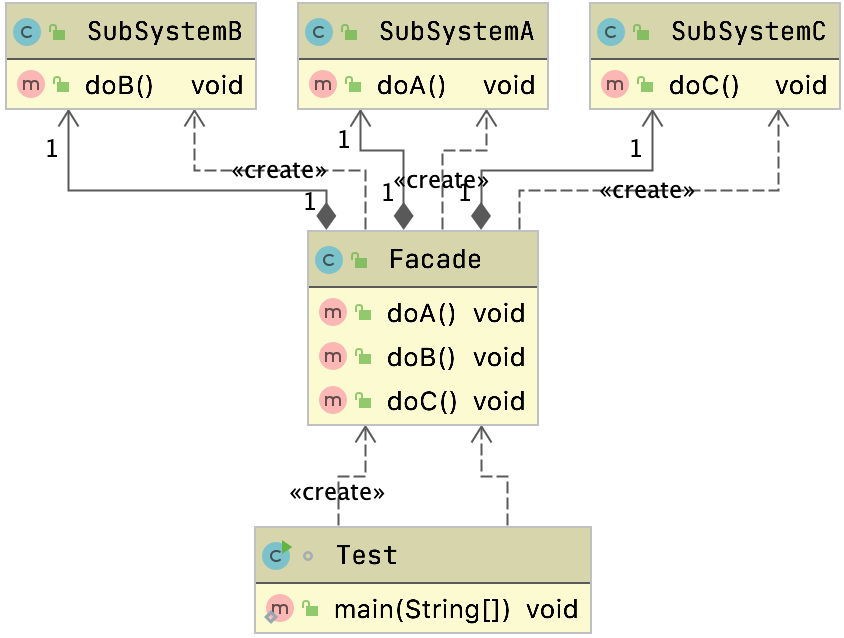
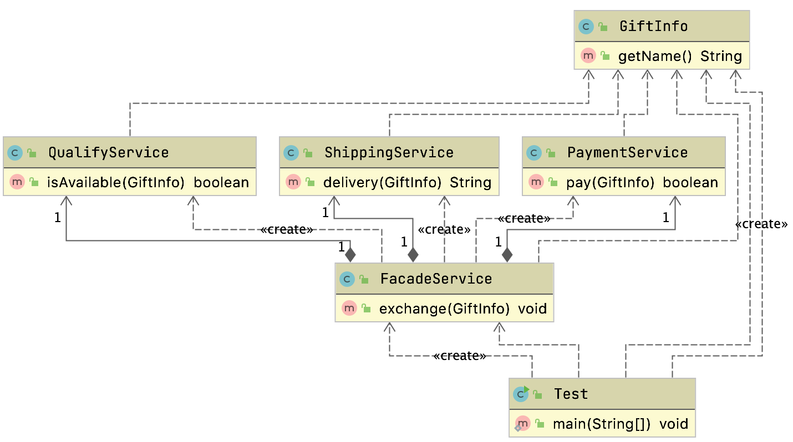

# 门面模式

## 参考资料

[图解设计模式](https://refactoringguru.cn/design-patterns)

大话设计模式

设计模式之禅

[github我见过最好的设计模式](https://github.com/iluwatar/java-design-patterns)

http://c.biancheng.net/view/1326.html

## 定义

也称为外观模式

**外观模式**是一种结构型设计模式， 能为程序库、 框架或其他复杂类提供一个简单的接口。

- 让子系统更加容易使用，属于结构型模式

## 例子

App订单接口

- 后台提供一个聚合接口
  - 在内部分别调用了订单，物流，用户系统
- 能够节省前端的请求

## 适用场景

- 子系统越来越复杂，增加门面模式来提供简单接口
- 构建多层系统结构，利用门面对象作为每层的入口，简化层间调用

### 生活中的例子

- 前台接待员
  - 用来做向导
- 包工头
  - 通过包工头来找粉刷匠，找泥工等


### 通用写法




### 物流系统案例




门面业务帮我们聚合扣款，监测，发货的功能，客户端只需要找门面就行了


## 源码中的案例

### Spring的JdbcUtils

```java
public static boolean supportsBatchUpdates(Connection con) {
  try {
    DatabaseMetaData dbmd = con.getMetaData();
    if (dbmd != null) {
      if (dbmd.supportsBatchUpdates()) {
        logger.debug("JDBC driver supports batch updates");
        return true;
      }
      else {
        logger.debug("JDBC driver does not support batch updates");
      }
    }
  }
  catch (SQLException ex) {
    logger.debug("JDBC driver 'supportsBatchUpdates' method threw exception", ex);
  }
  return false;
}
```

帮我们包装了对连接的操作，这样客户端只需要使用JdbcUtils就行了

### Mybatis的Configuration

```java
public MetaObject newMetaObject(Object object) {
  return MetaObject.forObject(object, objectFactory, objectWrapperFactory, reflectorFactory);
}

public ParameterHandler newParameterHandler(MappedStatement mappedStatement, Object parameterObject, BoundSql boundSql) {
  ParameterHandler parameterHandler = mappedStatement.getLang().createParameterHandler(mappedStatement, parameterObject, boundSql);
  parameterHandler = (ParameterHandler) interceptorChain.pluginAll(parameterHandler);
  return parameterHandler;
}

public ResultSetHandler newResultSetHandler(Executor executor, MappedStatement mappedStatement, RowBounds rowBounds, ParameterHandler parameterHandler,
                                            ResultHandler resultHandler, BoundSql boundSql) {
  ResultSetHandler resultSetHandler = new DefaultResultSetHandler(executor, mappedStatement, parameterHandler, resultHandler, boundSql, rowBounds);
  resultSetHandler = (ResultSetHandler) interceptorChain.pluginAll(resultSetHandler);
  return resultSetHandler;
}

public StatementHandler newStatementHandler(Executor executor, MappedStatement mappedStatement, Object parameterObject, RowBounds rowBounds, ResultHandler resultHandler, BoundSql boundSql) {
  StatementHandler statementHandler = new RoutingStatementHandler(executor, mappedStatement, parameterObject, rowBounds, resultHandler, boundSql);
  statementHandler = (StatementHandler) interceptorChain.pluginAll(statementHandler);
  return statementHandler;
}
```

帮我们创建对应的对象

## 和其他设计模式的区别

### 门面模式和代理的区别

- 门面模式就是一种特殊的静态代理
- 门面模式，重点在于封装
- 静态代理，重点是在增强

> 不做增强的静态代理就是门面模式

### 门面模式和单例模式的区别

经常把门面模式做成单例模式，`工具包`

## 优缺点

### 优点

- 简化了调用过程，无需深入了解子系统，防止给子系统带来风险
- 减少系统依赖，松散耦合
- 更好的划分访问层次，提高了安全性
- 迪米特法则，最少知道原则

### 缺点

- 增加子系统和扩展子系统行为的时候，容易带来未知风险
- 不符合开闭原则
- 某些情况下可能违背单一职责原则

## 问题

## 门面模式

> 想一想什么场景下考虑使用门面模式

- 一个子系统比较复杂时，比如算法或者业务比较复杂，就可以封装出一个或多个门面出来，项目的结构简单，而且扩展性非常好。
- 对于一个较大项目，为了避免人员带来的风险，也可以使用门面模式，技术水平比较差的成员，尽量安排独立的模块，然后把他写的程序封装到一个门面里，尽量让其他项目成员不用看到这些人的代码，看也看不懂，我也遇到过一个“高人”写的代 码，private方法、构造函数、常量基本都不用，你要一个public方法， 好，一个类里就一个public方法，所有代码都在里面，然后你就看吧， 一大坨程序，看着就能把人逼疯。使用门面模式后，对门面进行单元测试，约束项目成员的代码质量，对项目整体质量的提升也是一个比较好的帮助。

