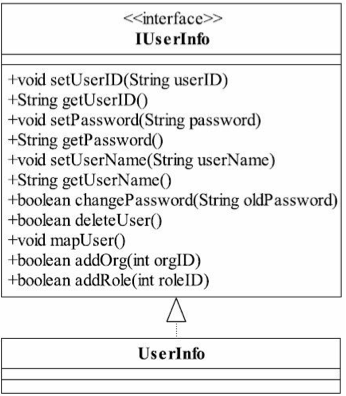
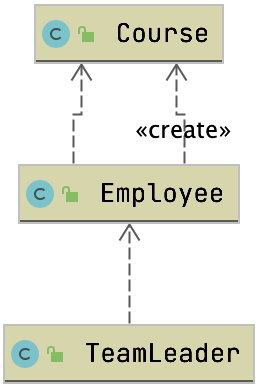

# 设计模式

# 参考资料

[图解设计模式](https://refactoringguru.cn/design-patterns)

大话设计模式

设计模式之禅

[github我见过最好的设计模式](https://github.com/iluwatar/java-design-patterns)

http://c.biancheng.net/view/1326.html

# 基本原则

## 开闭原则

> 在设计的时候尽可能的考虑，需求的变化，新需求来了尽可能少的改动代码，拥抱变化

定义:指的是软件中一个实体，如类、模块和函数应该对`扩展开放，对修改关闭`。

> 面向抽象编程
>
> 开闭是对扩展和修改的约束

强调：用抽象构建框架，用实现扩展细节。

优点：提高软件系统的可复用性及可维护性

- 面向对象最基础的设计原则
- 指导我们构建稳定的系统
  - 代码不是一次性的，更多时间在维护
  - 大多是代码版本的更新迭代
  - 我们最好对已有的源码很少修改 
    - 一般都是新增扩展，类来修改
    - 能够降低风险

### 关于变化

- 逻辑变化
  - 比如说算法从`a*b*c`变化成`a*b+c`其实是可以直接修改的，前提是所有依赖或者关联类都按照相同的逻辑来处理
- 子模块变化
  - 子模块变化可能直接引起整体也就是高层的变化
- 可见视图变化
  - 如果说需求上多了一些原有逻辑不存在的，可能这种变化是恐怖的，需要我们灵活的设计

### 例子

- 弹性工作时间，时间是固定的，上下班是可变的

顶层接口

> 接口是规范，抽象是实现


通过继承来解决

价格的含义已经变化了，所以不能够子类直接继承`getPrice()`,因为当前已经是折扣价格了，可能需要价格和折扣价格

### 问题

> 为什么要遵循开闭原则，从软件工程角度怎么理解这点。
>
> - 开闭原则对扩展开放对修改关闭，程序和需求一定是不断修改的，我们需要把共性和基础的东西抽出来，把常常修改的东西让他能够扩展出去，这样我们程序后期维护的风险就会小很多

### 为什么重要

- 对于测试的影响
  - 一处变更可能导致原有测试用例都不管用了
- 提高复用性
  - 高内聚，低耦合
- 提高可维护性
- 面向对象开发的要求

### 如何使用

- 抽象约束
- 参数抽到配置中
  - 例如sql的连接信息
  - 国际化信息
- 指定项目章程
  - 约定项目中Bean都是用自动注入，通过注解来做装配
  - 团队成员达成一致
  - 公共类走统一的入口，大家都是用统一的公共类
- 封装变化
- 提前预知变化

## 依赖倒置原则

### 定义

高层模块不应该依赖低层模块，二者都应该依赖其抽象。抽象不应该依赖细节，细节应该依赖抽象。

说白了就是`针对接口编程，不要针对实现编程`

### 什么是倒置

- 不可分割的原子逻辑是底层模块，原子逻辑在组装就是高层模块
- 抽象就是接口或者抽象类
  - 都不能被实例化的
- 细节
  - 细节就是具体实现类

### 优点

- 通过依赖倒置，能够减少类和类之间的耦合性，提高系统的稳定性，提高代码的可读性和稳定性。降低修改程序的风险

#### 例子


```java
public class DipTest {

  public static void main(String[] args) {
    //=====  V1  ========
    //        Tom tom = new Tom();
    //        tom.studyJavaCourse();
    //        tom.studyPythonCourse();
    //        tom.studyAICourse();


    //=====  V2  ========
    //        Tom tom = new Tom();
    //        tom.study(new JavaCourse());
    //        tom.study(new PythonCourse());


    //=====  V3  ========
    //        Tom tom = new Tom(new JavaCourse());
    //        tom.study();


    //=====  V4  ========
    Tom tom = new Tom();
    tom.setiCourse(new JavaCourse());
    tom.study();
  }
}
```

### 重点

- 先顶层后细节
- 自顶向下来思考全局不要一开始沉浸于细节
- 高层不依赖于低层，关系应该用抽象来维护
- 针对接口编程不要针对实现编程

> 以抽象为基准比以细节为基准搭建起来的架构要稳定得多，因此大家在拿到需求之后， 要面向接口编程，先顶层再细节来设计代码结构。

### 问题

> 为什么要依赖抽象，抽象表示我还可以扩展还没有具体实现，按照自己的话来解释一遍
>
> - 一般软件中抽象分成两种，接口和抽象类，接口是规范，抽象是模板，我们通过抽象的方式，也就是使用规范和模板这样我们能够使得上层，也就是调用层能够复用逻辑，而我们底层是能够快速更改实现的，例如Spring的依赖注入，Dubbo的SPI，SpringBoot的SPI都如此
>
> 

### 依赖的常见写法

- 构造传递依赖对象
- setter方法传递依赖对象
- 接口声明传递对象

### 最佳实践

- 每个类尽量都有接口或抽象类，或者抽象类和接口两者都具备这是依赖倒置的基本要求，接口和抽象类都是属于抽象的，有了抽 象才可能依赖倒置。
- 变量的表面类型尽量是接口或者是抽象类
  - 很多书上说变量的类型一定要是接口或者是抽象类，这个有点绝对 化了，比如一个工具类，xxxUtils一般是不需要接口或是抽象类的。还 有，如果你要使用类的clone方法，就必须使用实现类，这个是JDK提供 的一个规范。
- 任何类都不应该从具体类派生
  - 如果一个项目处于开发状态，确实不应该有从具体类派生出子类的 情况，但这也不是绝对的，因为人都是会犯错误的，有时设计缺陷是在 所难免的，因此只要不超过两层的继承都是可以忍受的。特别是负责项 目维护的同志，基本上可以不考虑这个规则，为什么？维护工作基本上 都是进行扩展开发，修复行为，通过一个继承关系，覆写一个方法就可 以修正一个很大的Bug，何必去继承最高的基类呢？（当然这种情况尽 量发生在不甚了解父类或者无法获得父类代码的情况下。）
- 尽量不要覆写基类的方法
  - 如果基类是一个抽象类，而且这个方法已经实现了，子类尽量不要 覆写。类间依赖的是抽象，覆写了抽象方法，对依赖的稳定性会产生一 定的影响。

## 单一职责原则

`不要存在多余一个导致类变更的原因`

- 类
- 接口
- 方法

只负责一项职责

如果不是这样设计，一个接口负责两个职责，一旦需求变更，修改其中一个职责的逻辑代码会导致另外一个职责的功能发生故障。

### 案例


#### 用户信息案例



上述图片用户的属性和用户的行为并没有分开

- 下图把
  - 用户信息抽成BO(Business Object,业务对象)
  - 用户行为抽成Biz(Business Logic 业务逻辑对象)

 

#### 电话


电话通话会发生下面四个过程

- 拨号
- 通话
- 回应
- 挂机

上图的接口做了两个事情

- 协议管理
  - dial 拨号接通
  - hangup 挂机
- 数据传送
  - chat

引起变化的点

1. 协议接通会引起会引起变化(连接导致不传输数据)
2. 可以有不同的通话方式`打电话`，`上网`

从上面可以看到包含了两个职责，应该考虑拆分成两个接口


### 优点

-  类的复杂性降低，实现什么职责都有清晰明确的定义；
-  可读性提高，复杂性降低，那当然可读性提高了；
-  可维护性提高，可读性提高，那当然更容易维护了；
-  变更引起的风险降低，变更是必不可少的，如果接口的单一职责 做得好，一个接口修改只对相应的实现类有影响，对其他的接口无影响，这对系统的扩展性、维护性都有非常大的帮助。

### 注意

> 单一职责原则提出了一个编写程序的标准，用“职责”或“变 化原因”来衡量接口或类设计得是否优良，但是“职责”和“变化原因”都 是不可度量的，因项目而异，因环境而异。
>
> `This is sometimes hard to see` ，单一职责确实收到很多因素制约
>
> - 工期
> - 成本
> - 技术水平
> - 硬件情况
> - 网络情况
> - 政府政策

## 接口隔离原则

- 两个类之间的依赖应该建立在最小的接口上
- 建立单一接口，`不要建立庞大臃肿的接口`
- 尽量细化接口，接口中的方法尽量少

高内聚低耦合

### 例子


### 问题

> 为什么要把IAnimal拆分成IFlyAnimal,ISwimAnimal，不拆分会有什么样的问题
>
> - 一个类所提供的功能应该是他所真正具有的，不拆分会导致他不提供的功能但是强行需要实现，而且会有臃肿的类出现
> - 可能适配器模式也是为了解决这个问题吧

### 最佳实践

- 一个接口只服务于一个子模块或者业务逻辑
- 通过业务逻辑压缩接口中的public方法，接口时常去回顾，尽量 让接口达到“满身筋骨肉”，而不是“肥嘟嘟”的一大堆方法；
- 已经被污染了的接口，尽量去修改，若变更的风险较大，则采用`适配器模式`进行转化处理；
- 了解环境，拒绝盲从。每个项目或产品都有特定的环境因素，别看到大师是这样做的你就照抄。千万别，环境不同，接口拆分的标准就不同。深入了解业务逻辑，最好的接口设计就出自你的手中！

## 迪米特法则

一个对象应该对其他对象保证最少的了解,也称`最少知道原则`,如果两个类不必彼此直接通信，那么这两个类就不应该发生直接的相互作用，如果其中一个类需要调用另外一个类的某个方法的话，可以`通过第三者转发这个调用`

能够降低类与类之间的耦合

> - 强调只和朋友交流
>
> - 出现在成员变量、方法的输入、输出参数中的类都可以称之为成员朋友类， 而出现在方法体内部的类不属于朋友类。

这里面感觉有点职责分开的感觉，不同的对象应该关注不同的内容，所做的事情也应该是自己所关心的

### 例子

teamLeader只关心结果，不关心Course




错误类图如下


### 问题

> 如果以后你要写代码和重构代码你怎么分析怎么重构？
>
> 1. 先分析相应代码的职责
> 2. 把不同的对象需要关心的内容抽离出来
> 3. 每个对象应该只创建和关心自己所关心的部分
> 4. 一定要使用的话可以通过三方来使用
> 5. 合适的使用作用域，不要暴露过多的公共方法和非静态的公共方法

### 注意

> 迪米特法则要求类“羞涩”一点，尽量不要对外公布太多的 public方法和非静态的public变量，尽量内敛，多使用private、packageprivate、protected等访问权限。
>
> 在实际的项目中，需要适度地考虑这个原则，别为了套用原则而做项目。原则只是供参考，如果 违背了这个原则，项目也未必会失败，这就需要大家在采用原则时反复 度量，不遵循是不对的，严格执行就是“过犹不及”。

### 序列化引起的坑

- 谨慎使用Serializable
  - 在一个项目中使用 RMI（Remote Method Invocation，远程方法调用）方式传递一个 VO（Value Object，值对象），这个对象就必须实现Serializable接口 （仅仅是一个标志性接口，不需要实现具体的方法），也就是把需要网 络传输的对象进行序列化，否则就会出现NotSerializableException异 常。突然有一天，客户端的VO修改了一个属性的访问权限，从private 变更为public，访问权限扩大了，如果服务器上没有做出相应的变更， 就会报序列化失败，就这么简单。但是这个问题的产生应该属于项目管 理范畴，一个类或接口在客户端已经变更了，而服务器端却没有同步更 新，难道不是项目管理的失职吗？

### 遵循的原则

​	如果 一个方法放在本类中，既不增加类间关系，也对本类不产生负面影响， 那就放置在本类中。


## 里氏替换原则

一个软件实体如果能够适用一个父亲的话，那么一定适用其子类，所有引用父亲的地方必须能透明的使用其子类的对象，子类能够替换父类对象

- 子类可以实现父类的抽象方法，但是不能覆盖父类的非抽象方法
- 子类中可以增加自己特有的方法
- 子类的方法重载父类的方法时，入参要比父类的方法输入参数更`宽松`
- 子类实现父类方法的时候（重写/重载或实现抽象方法），方法的后置条件（方法的输出，返回）要比父类更加`严格或者相等`

### 例子

#### 价格重写问题

价格不是直接重写，而是新写一个方法

```java
public class JavaDiscountCourse extends JavaCourse {
  public JavaDiscountCourse(Integer id, String name, Double price) {
    super(id, name, price);
  }
  public Double getDiscountPrice(){
    return super.getPrice() * 0.61;
  }
}
```

#### 长方形和正方形问题


```java
public static void resize(Rectangle rectangle){
  while (rectangle.getWidth() >= rectangle.getHeight()){
    rectangle.setHeight(rectangle.getHeight() + 1);
    System.out.println("Width:" +rectangle.getWidth() +",Height:" + rectangle.getHeight());
  }
  System.out.println("Resize End,Width:" +rectangle.getWidth() +",Height:" + rectangle.getHeight());
}
```


```java
public class Square extends Rectangle {
  private long length;

  //胜率

  @Override
  public void setHeight(long height) {
    setLength(height);
  }
}
```

当前设计会出现死循环

##### 解决办法

抽象接口

```java
public interface QuadRangle {
    long getWidth();
    long getHeight();
}
```

`返回共同的length`

```java
public class Square implements QuadRangle {
  private long length;

  public long getLength() {
    return length;
  }

  public void setLength(long length) {
    this.length = length;
  }

  public long getWidth() {
    return length;
  }

  public long getHeight() {
    return length;
  }
}
```

> 当前方式子类就能够随时替换父类了


### 问题

> 1. 你怎么理解里氏替换原则，为什么要保证使用父类的地方可以透明地使用子类
>    - 子类必须实现父类中没有实现的方法
>    - is-a的问题
>    - 如果父类的地方替换成子类不行的话程序复杂性增加，继承反而带来了程序的复杂度
>    - 子类只能在父类的基础上增加新的方法
> 2. 在具体场景中怎么保证使用父类的地方可以透明地使用子类
>    - 父类返回多使用具体实现，入参多使用抽象或者说顶层接口
>    - 子类可以新增一些自己特有的方法


### 注意

> 如果子类不能完整地实现父类的方法，或者父类的某些方法 在子类中已经发生“畸变”，则建议断开父子继承关系，采用依赖、聚 集、组合等关系代替继承。
>
> 尽量避免子类的“个性”，一旦子 类有“个性”，这个子类和父类之间的关系就很难调和了，把子类当做父 类使用，子类的“个性”被抹杀——委屈了点；把子类单独作为一个业务 来使用，则会让代码间的耦合关系变得扑朔迷离——缺乏类替换的标 准。

## 合成复用原则

尽可能使用对象组合 has-a组合 或者是 contains-a聚合而不是通过继承来达到软件复用的目的。

- 继承是白箱复用
  - 所有细节都暴露给了子类
- 组合和聚合是黑箱复用
  - 对象外的对象获取不到细节

### 优点


### 问题

> 为什么要多用组合和聚合少用继承
>
> - 继承是侵入性的
> - Java只支持单继承
> - 降低了代码的灵活性，子类多了很多约束
> - 增强了耦合性，父类修改的时候需要考虑子类的修改
>   - 会导致关键代码被修改


# 总结

> 如果你只有一把铁锤， 那么任何东西看上去都像是钉子。

- 适当的场景使用适当的设计原则
- 需要考虑，人力，成本，时间，质量，不要刻意追求完美
- 需要多思考才能用好工具