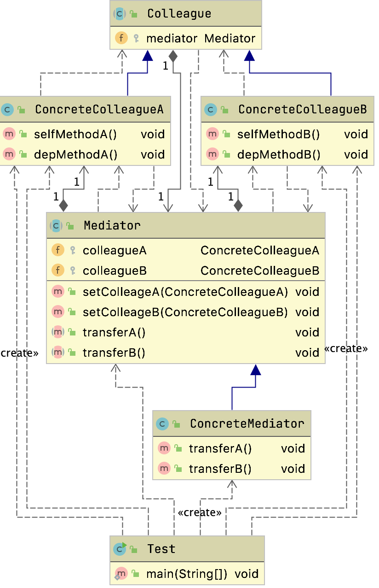

1. # 中介者模式

   ## 定义

   - 中介者模式( Mediator Pattern)又称为调解者模式或调停者模式。用一个中介对象封装一系列的对象交互,中介者使各对象不需要显示地相互作用,从而使其耦合松散,而且可以独立地改变它们之间的交互。
   - 属于行为型模式

   ## 生活中的应用

   - 朋友圈
   - 数据整合中心
     - 注册中心
       - zookeeper
       - nacos
       - spring cloud config

   通过一个平台获取所有的信息，中介者不做信息的任何处理

   > 是桥接和委派的组合体

   ## 适用场景

   - 系统中对象之间存在复杂的引用关系,产生的相互依赖关系结构混乱且难以理解
   - 交互的公共行为,如果需要改变行为则可以增加新的中介者类。

   ## 通用类图

   

   - 抽象中介者( Mediator):定义统一的接口,用于各同事角色之间的通信

   - 具体中介者( Concretemediator):从具体的同事对象接收消息,向具体同事对象发出命令,协调各同事间的协作
   - 抽象同事类( Colleague):每一个同事对象均需要依赖中介者角色,与其他同事间通信时, 交由中介者进行转发协作
   - 具体同事类( Concrete Colleague):负责实现自发行为(Self- Method),转发依赖方法(Dep- Method)交由中介者进行协调。

   ## 中介者和代理模式的区别

   - 中间角色
     - 牵线搭桥
   - 为什么要代理
     - 因为你做不到，又必须要做
   - 中介者
     - 只要他帮你联系上了，就不管了，后面的事情全权自己来完成

   ## 源码的体现

   ### Timer

   ```java
   private void sched(TimerTask task, long time, long period) {
     if (time < 0)
       throw new IllegalArgumentException("Illegal execution time.");
   
     // Constrain value of period sufficiently to prevent numeric
     // overflow while still being effectively infinitely large.
     if (Math.abs(period) > (Long.MAX_VALUE >> 1))
       period >>= 1;
   
     synchronized(queue) {
       if (!thread.newTasksMayBeScheduled)
         throw new IllegalStateException("Timer already cancelled.");
   
       synchronized(task.lock) {
         if (task.state != TimerTask.VIRGIN)
           throw new IllegalStateException(
           "Task already scheduled or cancelled");
         task.nextExecutionTime = time;
         task.period = period;
         task.state = TimerTask.SCHEDULED;
       }
   
       queue.add(task);
       if (queue.getMin() == task)
         queue.notify();
     }
   }
   ```

   不管是什么样的任务都被加入到一个队列中顺序执行。我们把这个队列中的所有对象称之为“同事”。同事之间通信都是通过 Timer来协调完成的, Timer就承担了中介者的角色。

   ## 优缺点

   ### 优点

   - 减少类间依赖,将多对多依赖转化成了ー对多,降低了类间耦合
   - 类间各司其职,符合迪米特法则。

   ### 缺点

   - 中介者模式中将原本多个对象直接的相互依赖变成了中介者和多个同事类的依赖关系。

   - 当同事类越多时,中介者就会越臃肿,变得复杂且难以维护。