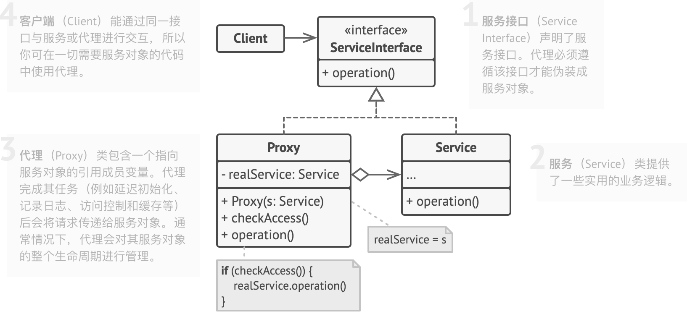
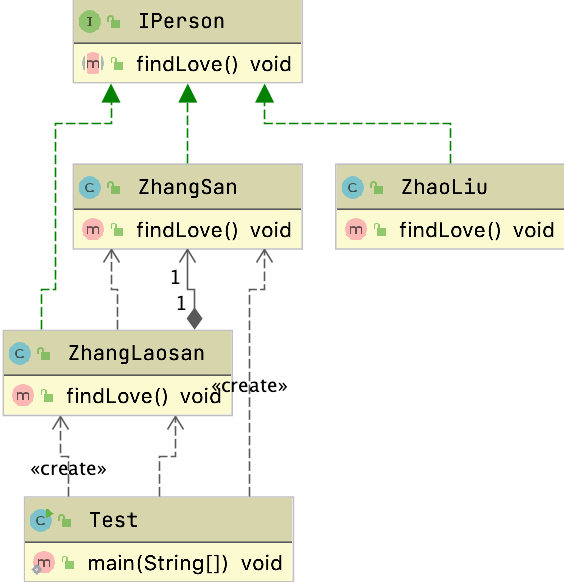
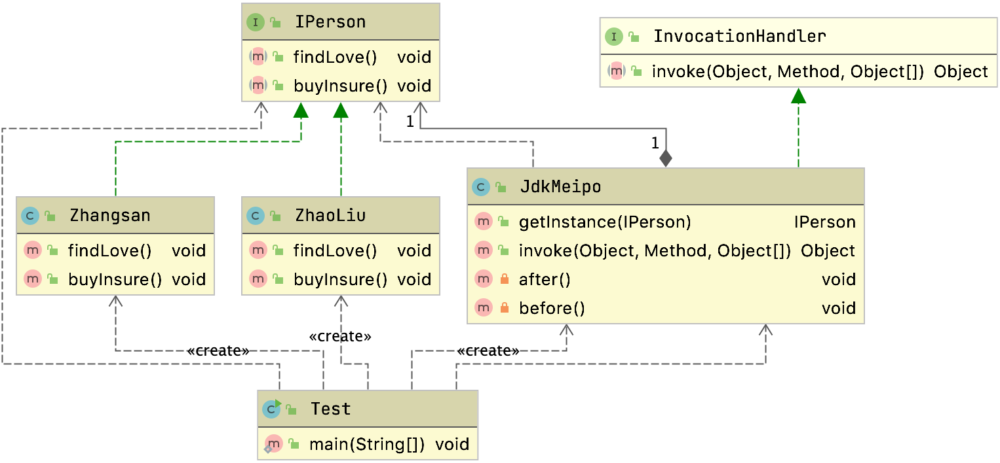

- # 代理模式

  ## 参考资料

  [图解设计模式](https://refactoringguru.cn/design-patterns)

  大话设计模式

  设计模式之禅

  [github我见过最好的设计模式](https://github.com/iluwatar/java-design-patterns)

  http://c.biancheng.net/view/1326.html

  ## 定义

  - 代理模式为其他对象提供一种代理，用来控制对于这个对象的访问
  - 在客户类和目标类之间起到中介作用
  - 结构型设计模式

  ## 类图

  

  

  # 生活中的代理模式

  - 房产中介
  - 快递小哥
  - 黄牛党

  ## 使用场景

  - 保护目标对象
  - 增强目标对象的功能

  # 案例

  ## 静态代理

  显示声明被代理的对象

  

  ```java
  public class ZhangLaosan implements IPerson {
  
    private IPerson zhangsan;
  
    public ZhangLaosan(IPerson person) {
      this.zhangsan = person;
    }
  
    public void findLove() {
      System.out.println("张老三开始物色");
      person.findLove();
      System.out.println("开始交往");
    }
  
  }
  ```

  编译期就清楚了

  > 有点类似于装饰者模式

  ## 动态代理

  ### JDK

  - Proxy#newProxyInstance
  - InvocationHandler

  

  ```java
  public class JdkMeipo implements InvocationHandler {
    private IPerson target;
    public IPerson getInstance(IPerson target){
      this.target = target;
      Class<?> clazz =  target.getClass();
      return (IPerson) Proxy.newProxyInstance(clazz.getClassLoader(),clazz.getInterfaces(),this);
    }
  
    public Object invoke(Object proxy, Method method, Object[] args) throws Throwable {
      before();
      Object result = method.invoke(this.target,args);
      after();
      return result;
    }
  
    private void after() {
      System.out.println("双方同意，开始交往");
    }
  
    private void before() {
      System.out.println("我是媒婆，已经收集到你的需求，开始物色");
    }
  }
  ```

  > 问题
  >
  > 好像动态代理和静态代理没有区别
  >
  > - 动态代理编译期确认的，没有硬编码

  ### cglibProxy

  #### 导入依赖

  ```xml
  <dependency>
    <groupId>cglib</groupId>
    <artifactId>cglib-nodep</artifactId>
    <version>2.2</version>
  </dependency>
  ```

  - 实现`net.sf.cglib.proxy.MethodInterceptor`

  ```java
  public class CGlibMeipo implements MethodInterceptor {
  
    public Object getInstance(Class<?> clazz) throws Exception{
      //相当于Proxy，代理的工具类
      Enhancer enhancer = new Enhancer();
      enhancer.setSuperclass(clazz);
      enhancer.setCallback(this);
      return enhancer.create();
    }
  
    public Object intercept(Object o, Method method, Object[] objects, MethodProxy methodProxy) throws Throwable {
      before();
      Object obj = methodProxy.invokeSuper(o,objects);
      after();
      return obj;
    }
  
    private void before(){
      System.out.println("我是媒婆，我要给你找对象，现在已经确认你的需求");
      System.out.println("开始物色");
    }
  
    private void after(){
      System.out.println("OK的话，准备办事");
    }
  }
  ```

  > 一般$开头的类都是动态代理的类

  # 深入了解代理模式

  ## JDK的动态代理

  通过反编译来查看字节码文件

  ```java
  	public static void generator() {
  		byte[] bytes = ProxyGenerator.generateProxyClass("$proxy0", new Class[]{IPerson.class});
  		FileOutputStream os = null;
  		try {
  			os = new FileOutputStream("/Users/zzy/Downloads/$proxy0.class");
  			os.write(bytes);
  			os.close();
  			System.out.println("print success");
  
  		} catch (Exception e) {
  			e.printStackTrace();
  		} finally {
  			if (os != null) {
  				try {
  					os.close();
  				} catch (IOException e) {
  					e.printStackTrace();
  				}
  			}
  		}
  	}
  ```

  反编译对应文件

  ```shell
  jad $Proxy0.class
  ```

  jad安装步骤可以参考https://blog.csdn.net/qing_gee/article/details/86510704

  也可以直接放到idea中查看

  编译后的内容如下

  ```java
  //
  // Source code recreated from a .class file by IntelliJ IDEA
  // (powered by FernFlower decompiler)
  //
  
  import com.zzjson.pattern.proxy.dynamicproxy.jdkproxy.IPerson;
  import java.lang.reflect.InvocationHandler;
  import java.lang.reflect.Method;
  import java.lang.reflect.Proxy;
  import java.lang.reflect.UndeclaredThrowableException;
  
  public final class $proxy0 extends Proxy implements IPerson {
    private static Method m1;
    private static Method m4;
    private static Method m2;
    private static Method m3;
    private static Method m0;
  
    public $proxy0(InvocationHandler var1) throws  {
      super(var1);
    }
  
    public final boolean equals(Object var1) throws  {
      try {
        return (Boolean)super.h.invoke(this, m1, new Object[]{var1});
      } catch (RuntimeException | Error var3) {
        throw var3;
      } catch (Throwable var4) {
        throw new UndeclaredThrowableException(var4);
      }
    }
  
    public final void findLove() throws  {
      try {
        super.h.invoke(this, m4, (Object[])null);
      } catch (RuntimeException | Error var2) {
        throw var2;
      } catch (Throwable var3) {
        throw new UndeclaredThrowableException(var3);
      }
    }
  
    public final String toString() throws  {
      try {
        return (String)super.h.invoke(this, m2, (Object[])null);
      } catch (RuntimeException | Error var2) {
        throw var2;
      } catch (Throwable var3) {
        throw new UndeclaredThrowableException(var3);
      }
    }
  
    public final void buyInsure() throws  {
      try {
        super.h.invoke(this, m3, (Object[])null);
      } catch (RuntimeException | Error var2) {
        throw var2;
      } catch (Throwable var3) {
        throw new UndeclaredThrowableException(var3);
      }
    }
  
    public final int hashCode() throws  {
      try {
        return (Integer)super.h.invoke(this, m0, (Object[])null);
      } catch (RuntimeException | Error var2) {
        throw var2;
      } catch (Throwable var3) {
        throw new UndeclaredThrowableException(var3);
      }
    }
  
    static {
      try {
        m1 = Class.forName("java.lang.Object").getMethod("equals", Class.forName("java.lang.Object"));
        m4 = Class.forName(" com.zzjson.pattern.proxy.dynamicproxy.jdkproxy.IPerson").getMethod("findLove");
        m2 = Class.forName("java.lang.Object").getMethod("toString");
        m3 = Class.forName(" com.zzjson.pattern.proxy.dynamicproxy.jdkproxy.IPerson").getMethod("buyInsure");
        m0 = Class.forName("java.lang.Object").getMethod("hashCode");
      } catch (NoSuchMethodException var2) {
        throw new NoSuchMethodError(var2.getMessage());
      } catch (ClassNotFoundException var3) {
        throw new NoClassDefFoundError(var3.getMessage());
      }
    }
  }
  
  ```

  关键代码

  ```java
  public final void findLove() throws  {
    try {
      super.h.invoke(this, m4, (Object[])null);
    } catch (RuntimeException | Error var2) {
      throw var2;
    } catch (Throwable var3) {
      throw new UndeclaredThrowableException(var3);
    }
  }
  ```

  `h`实际上就是代理对象

  所以说实际上就是调用的

  ```java
  public Object invoke(Object proxy, Method method, Object[] args) throws Throwable {
    before();
    Object result = method.invoke(this.target,args);
    after();
    return result;
  }
  ```

  ### 手写

  1. 动态生成源码.java文件

     1. 自己手动拼代码

  2. Java文件输出到磁盘，保存为文件`$Proxy0.java`

     ```java
     String filePath = MyProxy.class.getResource("").getPath();
     //           System.out.println(filePath);
     File f = new File(filePath + "$Proxy0.java");
     FileWriter fw = new FileWriter(f);
     fw.write(src);
     fw.flush();
     fw.close();
     ```

     

  3. 把.java文件编译成`$proxy0.class`文件

     ```java
     JavaCompiler compiler = ToolProvider.getSystemJavaCompiler();
     StandardJavaFileManager manage = compiler.getStandardFileManager(null,null,null);
     Iterable iterable = manage.getJavaFileObjects(f);
     
     JavaCompiler.CompilationTask task = compiler.getTask(null,manage,null,null,null,iterable);
     task.call();
     manage.close();
     ```

  4. 把生成的.class文件加载到JVM中

     ```java
     Class proxyClass =  classLoader.findClass("$Proxy0");
     Constructor c = proxyClass.getConstructor(MyInvocationHandler.class);
     f.delete();
     ```

  5. 返回新的代理对象

     ```java
      return c.newInstance(h);
     ```

     

  #### 自己的类加载器

  ```java
  public class MyClassLoader extends ClassLoader {
  
    private File classPathFile;
    public MyClassLoader(){
      String classPath = MyClassLoader.class.getResource("").getPath();
      this.classPathFile = new File(classPath);
    }
  
    @Override
    protected Class<?> findClass(String name) throws ClassNotFoundException {
  
      String className = MyClassLoader.class.getPackage().getName() + "." + name;
      if(classPathFile  != null){
        File classFile = new File(classPathFile,name.replaceAll("\\.","/") + ".class");
        if(classFile.exists()){
          FileInputStream in = null;
          ByteArrayOutputStream out = null;
          try{
            in = new FileInputStream(classFile);
            out = new ByteArrayOutputStream();
            byte [] buff = new byte[1024];
            int len;
            while ((len = in.read(buff)) != -1){
              out.write(buff,0,len);
            }
            return defineClass(className,out.toByteArray(),0,out.size());
          }catch (Exception e){
            e.printStackTrace();
          }
        }
      }
      return null;
    }
  }
  ```

  ## CGLIb和DJK的区别

  - CGLIB采用继承的方式，重写父类的方法
  - JDK采用的方式，要求代理的目标对象一定要实现一个接口

  > 思想：都是通过生成字节码，重组成一个新的类

  - JDK Proxy对于用户而言，依赖性更强，调用也更加安全
  - CGLIB要求目标类不能有final的方法，final方法不能被代理
  - CGLIB更快
    - 效率更高，性能也更高，底层没有用到反射
  - JDK的生成逻辑较为简单，执行效率姚笛，每次都要用反射

  # 常见的动态代理

  ## Spring

  ### AOP

  BeanPostProcessor核心还是在对象后置处理器

  #### AbstractAdvisingBeanPostProcessor#postProcessAfterInitialization`

  `org.springframework.aop.framework.AbstractAdvisingBeanPostProcessor#postProcessAfterInitialization`

  ```java
  public Object postProcessAfterInitialization(Object bean, String beanName) {
    if (this.advisor == null || bean instanceof AopInfrastructureBean) {
      // Ignore AOP infrastructure such as scoped proxies.
      return bean;
    }
  
    if (bean instanceof Advised) {
      Advised advised = (Advised) bean;
      if (!advised.isFrozen() && isEligible(AopUtils.getTargetClass(bean))) {
        // Add our local Advisor to the existing proxy's Advisor chain...
        if (this.beforeExistingAdvisors) {
          advised.addAdvisor(0, this.advisor);
        }
        else {
          advised.addAdvisor(this.advisor);
        }
        return bean;
      }
    }
  
    if (isEligible(bean, beanName)) {
      ProxyFactory proxyFactory = prepareProxyFactory(bean, beanName);
      if (!proxyFactory.isProxyTargetClass()) {
        evaluateProxyInterfaces(bean.getClass(), proxyFactory);
      }
      proxyFactory.addAdvisor(this.advisor);
      customizeProxyFactory(proxyFactory);
      return proxyFactory.getProxy(getProxyClassLoader());
    }
  
    // No proxy needed.
    return bean;
  }
  ```

  最终会执行到

  #### DefaultAopProxyFactory#createAopProxy

  `org.springframework.aop.framework.DefaultAopProxyFactory#createAopProxy`

  ```java
  	public AopProxy createAopProxy(AdvisedSupport config) throws AopConfigException {
  		if (config.isOptimize() || config.isProxyTargetClass() || hasNoUserSuppliedProxyInterfaces(config)) {
  			Class<?> targetClass = config.getTargetClass();
  			if (targetClass == null) {
  				throw new AopConfigException("TargetSource cannot determine target class: " +
  						"Either an interface or a target is required for proxy creation.");
  			}
  			if (targetClass.isInterface() || Proxy.isProxyClass(targetClass)) {
  				return new JdkDynamicAopProxy(config);
  			}
  			return new ObjenesisCglibAopProxy(config);
  		}
  		else {
  			return new JdkDynamicAopProxy(config);
  		}
  	}
  ```

  #### JDK动态代理

  ```java
  public Object getProxy(@Nullable ClassLoader classLoader) {
    if (logger.isTraceEnabled()) {
      logger.trace("Creating JDK dynamic proxy: " + this.advised.getTargetSource());
    }
    Class<?>[] proxiedInterfaces = AopProxyUtils.completeProxiedInterfaces(this.advised, true);
    findDefinedEqualsAndHashCodeMethods(proxiedInterfaces);
    return Proxy.newProxyInstance(classLoader, proxiedInterfaces, this);
  }
  ```

  ##### 对应的InvocationHandler

  `org.springframework.aop.framework.JdkDynamicAopProxy#invoke`

  ```java
  public Object invoke(Object proxy, Method method, Object[] args) throws Throwable {
    Object oldProxy = null;
    boolean setProxyContext = false;
  
    TargetSource targetSource = this.advised.targetSource;
    Object target = null;
  
    try {
      if (!this.equalsDefined && AopUtils.isEqualsMethod(method)) {
        // The target does not implement the equals(Object) method itself.
        return equals(args[0]);
      }
      else if (!this.hashCodeDefined && AopUtils.isHashCodeMethod(method)) {
        // The target does not implement the hashCode() method itself.
        return hashCode();
      }
      else if (method.getDeclaringClass() == DecoratingProxy.class) {
        // There is only getDecoratedClass() declared -> dispatch to proxy config.
        return AopProxyUtils.ultimateTargetClass(this.advised);
      }
      else if (!this.advised.opaque && method.getDeclaringClass().isInterface() &&
               method.getDeclaringClass().isAssignableFrom(Advised.class)) {
        // Service invocations on ProxyConfig with the proxy config...
        return AopUtils.invokeJoinpointUsingReflection(this.advised, method, args);
      }
  
      Object retVal;
  
      if (this.advised.exposeProxy) {
        // Make invocation available if necessary.
        oldProxy = AopContext.setCurrentProxy(proxy);
        setProxyContext = true;
      }
  
      // Get as late as possible to minimize the time we "own" the target,
      // in case it comes from a pool.
      target = targetSource.getTarget();
      Class<?> targetClass = (target != null ? target.getClass() : null);
  
      // Get the interception chain for this method.
      List<Object> chain = this.advised.getInterceptorsAndDynamicInterceptionAdvice(method, targetClass);
  
      // Check whether we have any advice. If we don't, we can fallback on direct
      // reflective invocation of the target, and avoid creating a MethodInvocation.
      if (chain.isEmpty()) {
        // We can skip creating a MethodInvocation: just invoke the target directly
        // Note that the final invoker must be an InvokerInterceptor so we know it does
        // nothing but a reflective operation on the target, and no hot swapping or fancy proxying.
        Object[] argsToUse = AopProxyUtils.adaptArgumentsIfNecessary(method, args);
        retVal = AopUtils.invokeJoinpointUsingReflection(target, method, argsToUse);
      }
      else {
        // We need to create a method invocation...
        MethodInvocation invocation =
          new ReflectiveMethodInvocation(proxy, target, method, args, targetClass, chain);
        // Proceed to the joinpoint through the interceptor chain.
        retVal = invocation.proceed();
      }
  
      // Massage return value if necessary.
      Class<?> returnType = method.getReturnType();
      if (retVal != null && retVal == target &&
          returnType != Object.class && returnType.isInstance(proxy) &&
          !RawTargetAccess.class.isAssignableFrom(method.getDeclaringClass())) {
        // Special case: it returned "this" and the return type of the method
        // is type-compatible. Note that we can't help if the target sets
        // a reference to itself in another returned object.
        retVal = proxy;
      }
      else if (retVal == null && returnType != Void.TYPE && returnType.isPrimitive()) {
        throw new AopInvocationException(
          "Null return value from advice does not match primitive return type for: " + method);
      }
      return retVal;
    }
    finally {
      if (target != null && !targetSource.isStatic()) {
        // Must have come from TargetSource.
        targetSource.releaseTarget(target);
      }
      if (setProxyContext) {
        // Restore old proxy.
        AopContext.setCurrentProxy(oldProxy);
      }
    }
  }
  ```

  #### CGLIB动态代理

  ```java
  public Object getProxy(@Nullable ClassLoader classLoader) {
    if (logger.isTraceEnabled()) {
      logger.trace("Creating CGLIB proxy: " + this.advised.getTargetSource());
    }
  
    try {
      Class<?> rootClass = this.advised.getTargetClass();
      Assert.state(rootClass != null, "Target class must be available for creating a CGLIB proxy");
  
      Class<?> proxySuperClass = rootClass;
      if (rootClass.getName().contains(ClassUtils.CGLIB_CLASS_SEPARATOR)) {
        proxySuperClass = rootClass.getSuperclass();
        Class<?>[] additionalInterfaces = rootClass.getInterfaces();
        for (Class<?> additionalInterface : additionalInterfaces) {
          this.advised.addInterface(additionalInterface);
        }
      }
  
      // Validate the class, writing log messages as necessary.
      validateClassIfNecessary(proxySuperClass, classLoader);
  
      // Configure CGLIB Enhancer...
      Enhancer enhancer = createEnhancer();
      if (classLoader != null) {
        enhancer.setClassLoader(classLoader);
        if (classLoader instanceof SmartClassLoader &&
            ((SmartClassLoader) classLoader).isClassReloadable(proxySuperClass)) {
          enhancer.setUseCache(false);
        }
      }
      enhancer.setSuperclass(proxySuperClass);
      enhancer.setInterfaces(AopProxyUtils.completeProxiedInterfaces(this.advised));
      enhancer.setNamingPolicy(SpringNamingPolicy.INSTANCE);
      enhancer.setStrategy(new ClassLoaderAwareGeneratorStrategy(classLoader));
  
      Callback[] callbacks = getCallbacks(rootClass);
      Class<?>[] types = new Class<?>[callbacks.length];
      for (int x = 0; x < types.length; x++) {
        types[x] = callbacks[x].getClass();
      }
      // fixedInterceptorMap only populated at this point, after getCallbacks call above
      enhancer.setCallbackFilter(new ProxyCallbackFilter(
        this.advised.getConfigurationOnlyCopy(), this.fixedInterceptorMap, this.fixedInterceptorOffset));
      enhancer.setCallbackTypes(types);
  
      // Generate the proxy class and create a proxy instance.
      return createProxyClassAndInstance(enhancer, callbacks);
    }
    catch (CodeGenerationException | IllegalArgumentException ex) {
      throw new AopConfigException("Could not generate CGLIB subclass of " + this.advised.getTargetClass() +
                                   ": Common causes of this problem include using a final class or a non-visible class",
                                   ex);
    }
    catch (Throwable ex) {
      // TargetSource.getTarget() failed
      throw new AopConfigException("Unexpected AOP exception", ex);
    }
  }
  ```

  #### 对应的Interceptor

  `org.springframework.aop.framework.CglibAopProxy.DynamicAdvisedInterceptor#intercept`

  ```java
  public Object intercept(Object proxy, Method method, Object[] args, MethodProxy methodProxy) throws Throwable {
    Object oldProxy = null;
    boolean setProxyContext = false;
    Object target = null;
    TargetSource targetSource = this.advised.getTargetSource();
    try {
      if (this.advised.exposeProxy) {
        // Make invocation available if necessary.
        oldProxy = AopContext.setCurrentProxy(proxy);
        setProxyContext = true;
      }
      // Get as late as possible to minimize the time we "own" the target, in case it comes from a pool...
      target = targetSource.getTarget();
      Class<?> targetClass = (target != null ? target.getClass() : null);
      List<Object> chain = this.advised.getInterceptorsAndDynamicInterceptionAdvice(method, targetClass);
      Object retVal;
      // Check whether we only have one InvokerInterceptor: that is,
      // no real advice, but just reflective invocation of the target.
      if (chain.isEmpty() && Modifier.isPublic(method.getModifiers())) {
        // We can skip creating a MethodInvocation: just invoke the target directly.
        // Note that the final invoker must be an InvokerInterceptor, so we know
        // it does nothing but a reflective operation on the target, and no hot
        // swapping or fancy proxying.
        Object[] argsToUse = AopProxyUtils.adaptArgumentsIfNecessary(method, args);
        retVal = methodProxy.invoke(target, argsToUse);
      }
      else {
        // We need to create a method invocation...
        retVal = new CglibMethodInvocation(proxy, target, method, args, targetClass, chain, methodProxy).proceed();
      }
      retVal = processReturnType(proxy, target, method, retVal);
      return retVal;
    }
    finally {
      if (target != null && !targetSource.isStatic()) {
        targetSource.releaseTarget(target);
      }
      if (setProxyContext) {
        // Restore old proxy.
        AopContext.setCurrentProxy(oldProxy);
      }
    }
  }
  ```

  ### 

  ### 事物

  `org.springframework.transaction.interceptor.TransactionInterceptor#invoke`

  `org.springframework.transaction.interceptor.TransactionAspectSupport#invokeWithinTransaction`

  我们在Spring中可以使用声明式事物和编程式事物

  - `@Transactional`
  - 和编程式事物

  #### 多数据源的切换

  `org.springframework.jdbc.datasource.lookup.AbstractRoutingDataSource`

  ### 缓存

  `org.springframework.cache.interceptor.CacheInterceptor#invoke`

  

  - `Cacheable`
  - ``CacheConfig`
  - `CacheEvict`
  - `CachePut`
  - `Caching`
  - `EnableCaching`

  ## Mybatis

  > 为什么通过Mapper接口就能够调用，不需要写实现类

  ### Mapper接口

  #### 创建MapperProxyFactory

  `org.apache.ibatis.binding.MapperRegistry#addMapper`

  ```java
    public <T> void addMapper(Class<T> type) {
      if (type.isInterface()) {
        if (hasMapper(type)) {
          throw new BindingException("Type " + type + " is already known to the MapperRegistry.");
        }
        boolean loadCompleted = false;
        try {
          knownMappers.put(type, new MapperProxyFactory<T>(type));
          // It's important that the type is added before the parser is run
          // otherwise the binding may automatically be attempted by the
          // mapper parser. If the type is already known, it won't try.
          MapperAnnotationBuilder parser = new MapperAnnotationBuilder(config, type);
          parser.parse();
          loadCompleted = true;
        } finally {
          if (!loadCompleted) {
            knownMappers.remove(type);
          }
        }
      }
    }
  ```

  这一段先初始化MapperProxyFactory，并且解析mapper接口上的注解

  #### 获取Mapper

  `org.apache.ibatis.binding.MapperRegistry#getMapper`

  ```java
  public <T> T getMapper(Class<T> type, SqlSession sqlSession) {
    final MapperProxyFactory<T> mapperProxyFactory = (MapperProxyFactory<T>) knownMappers.get(type);
    if (mapperProxyFactory == null) {
      throw new BindingException("Type " + type + " is not known to the MapperRegistry.");
    }
    try {
      return mapperProxyFactory.newInstance(sqlSession);
    } catch (Exception e) {
      throw new BindingException("Error getting mapper instance. Cause: " + e, e);
    }
  }
  ```

  当前获取代理对象通过MapperProxyFactory来生成的

  #### 代理

  `org.apache.ibatis.binding.MapperProxyFactory#newInstance(org.apache.ibatis.binding.MapperProxy<T>)`

  ```java
  @SuppressWarnings("unchecked")
  protected T newInstance(MapperProxy<T> mapperProxy) {
    return (T) Proxy.newProxyInstance(mapperInterface.getClassLoader(), new Class[] { mapperInterface }, mapperProxy);
  }
  
  public T newInstance(SqlSession sqlSession) {
    final MapperProxy<T> mapperProxy = new MapperProxy<T>(sqlSession, mapperInterface, methodCache);
    return newInstance(mapperProxy);
  }
  ```

  查看对应的代理，可以看到通过`Proxy#newProxyInstance`来生成的代理对象，也就是走的JDK的动态代理

  #### 具体的Invocationhandler

  ```java
  public class MapperProxy<T> implements InvocationHandler, Serializable {
  
    private static final long serialVersionUID = -6424540398559729838L;
    private final SqlSession sqlSession;
    private final Class<T> mapperInterface;
    private final Map<Method, MapperMethod> methodCache;
  
    public MapperProxy(SqlSession sqlSession, Class<T> mapperInterface, Map<Method, MapperMethod> methodCache) {
      this.sqlSession = sqlSession;
      this.mapperInterface = mapperInterface;
      this.methodCache = methodCache;
    }
  
    @Override
    public Object invoke(Object proxy, Method method, Object[] args) throws Throwable {
      if (Object.class.equals(method.getDeclaringClass())) {
        try {
          return method.invoke(this, args);
        } catch (Throwable t) {
          throw ExceptionUtil.unwrapThrowable(t);
        }
      }
      final MapperMethod mapperMethod = cachedMapperMethod(method);
      return mapperMethod.execute(sqlSession, args);
    }
  
    private MapperMethod cachedMapperMethod(Method method) {
      MapperMethod mapperMethod = methodCache.get(method);
      if (mapperMethod == null) {
        mapperMethod = new MapperMethod(mapperInterface, method, sqlSession.getConfiguration());
        methodCache.put(method, mapperMethod);
      }
      return mapperMethod;
    }
  
  }
  ```

  具体的执行是执行的`MapperProxy#invoke`方法

  所以Mapper接口有要求，不能是final类并且方法不能是final的，并且方法不能重载

  ## Spring Cloud Feign

  如果了解过Spring Cloud Feign应该可以知道可以在对应的接口上面加`FeignClient`那么在调用的时候就会帮我们自动负载均衡

  ```java
  @FeignClient(
  	value = AppConstant.APPLICATION_USER_NAME
  )
  public interface IUserClient {
  	/**
  	 * 获取用户信息
  	 *
  	 * @param userId 用户id
  	 * @return
  	 */
  	@GetMapping(USER_INFO_BY_ID)
  	R<User> userInfoById(@RequestParam("userId") Long userId);
  ```

  肯定是做了代理，那么我们查看代码探究一下Spring Cloud Feign是如何做的

  ### 创建FeignClientFactoryBean

  `org.springframework.cloud.openfeign.FeignClientsRegistrar#registerFeignClient`

  可以看到

  ```java
  BeanDefinitionBuilder definition = BeanDefinitionBuilder
    .genericBeanDefinition(FeignClientFactoryBean.class);
  ```

  创建了一个`FeignClientFactoryBean`所以会调用他的

  ### 初始化生成代理对象

  `org.springframework.cloud.openfeign.FeignClientFactoryBean#getObject`

  ```java
  	public Object getObject() throws Exception {
  		return getTarget();
  	}
  ```

  可以看到`getTarget`

  ```java
  <T> T getTarget() {
    FeignContext context = applicationContext.getBean(FeignContext.class);
    Feign.Builder builder = feign(context);
  //省略
    String url = this.url + cleanPath();
    Client client = getOptional(context, Client.class);
    if (client != null) {
      if (client instanceof LoadBalancerFeignClient) {
        // not load balancing because we have a url,
        // but ribbon is on the classpath, so unwrap
        client = ((LoadBalancerFeignClient) client).getDelegate();
      }
      if (client instanceof FeignBlockingLoadBalancerClient) {
        // not load balancing because we have a url,
        // but Spring Cloud LoadBalancer is on the classpath, so unwrap
        client = ((FeignBlockingLoadBalancerClient) client).getDelegate();
      }
      builder.client(client);
    }
    Targeter targeter = get(context, Targeter.class);
    return (T) targeter.target(this, builder, context,
                               new HardCodedTarget<>(type, name, url));
  }
  
  ```

  调用了`targeter#target`来生成代理对象

  ```java
  public <T> T target(Target<T> target) {
  return build().newInstance(target);
  }
  ```

  ### 生成代理

  `feign.ReflectiveFeign#newInstance`

  ```java
  public <T> T newInstance(Target<T> target) {
    Map<String, MethodHandler> nameToHandler = targetToHandlersByName.apply(target);
    Map<Method, MethodHandler> methodToHandler = new LinkedHashMap<Method, MethodHandler>();
    List<DefaultMethodHandler> defaultMethodHandlers = new LinkedList<DefaultMethodHandler>();
  
    for (Method method : target.type().getMethods()) {
      if (method.getDeclaringClass() == Object.class) {
        continue;
      } else if (Util.isDefault(method)) {
        DefaultMethodHandler handler = new DefaultMethodHandler(method);
        defaultMethodHandlers.add(handler);
        methodToHandler.put(method, handler);
      } else {
        methodToHandler.put(method, nameToHandler.get(Feign.configKey(target.type(), method)));
      }
    }
    InvocationHandler handler = factory.create(target, methodToHandler);
    T proxy = (T) Proxy.newProxyInstance(target.type().getClassLoader(),
                                         new Class<?>[] {target.type()}, handler);
  
    for (DefaultMethodHandler defaultMethodHandler : defaultMethodHandlers) {
      defaultMethodHandler.bindTo(proxy);
    }
    return proxy;
  }
  ```

  可以看到也是通过JDK的动态代理来生成代理对象的

  InvocationHandler如下

  ```java
  @Override
  public Object invoke(Object proxy, Method method, Object[] args) throws Throwable {
    if ("equals".equals(method.getName())) {
      try {
        Object otherHandler =
          args.length > 0 && args[0] != null ? Proxy.getInvocationHandler(args[0]) : null;
        return equals(otherHandler);
      } catch (IllegalArgumentException e) {
        return false;
      }
    } else if ("hashCode".equals(method.getName())) {
      return hashCode();
    } else if ("toString".equals(method.getName())) {
      return toString();
    }
  
    return dispatch.get(method).invoke(args);
  }
  ```

  会通过方法来分发做负载均衡

  # 总结

  ## 优点

  - 能把代理对象和真实被调用的目标对象分离
  - 降低了系统的耦合度，易于扩展
  - 能够保护目标对象
  - 增强目标对象的功能

  ## 缺点

  - 系统类数目增加
  - 客户端和目标对象之间增加了代理对象，请求处理速度会变慢，增加了系统的复杂度

  ## Spring中的代理选择原则

  1. Bean中有实现接口的时候，Spring会使用`JDK`的动态代理
  2. Bean没有实现接口的时候，Spring会选择`CGLIB`
  3. Spring可以通过配置强制使用CGLIB,只需在Spring的配置文件中加入这个代码

  ```xml
  <aop:aspectj-autoproxy proxy-target-class="true">
  ```

  ## 问题

  ## 代理模式

  > 为什么有静态代理？他解决什么问题？为什么又要使用动态代理，说说具体使用场景体会他的好处。

  - 代理主要还是想在类不被修改代码的情况下做一些增强。
  - 静态代理运行在编译期，也就是在程序运行前就已经存在代理类的字节码文件，代理类和委托类的关系在运行前就确定了
  - 静态代理主要有几个缺点
    - 一个接口只能服务于一种类型的类，如果要代理的方法很多，势必要为每一种方法都进行代理，在程序规模稍大时静态代理代理类就会过多会造成代码混乱
    - 如果接口增加一个方法，除了所有实现类需要实现这个方法外，所有代理类也需要实现此方法，增加了代码维护的复杂度。 基于上述两个问题，动态代理诞生了

  > 明白了动态代理使用场景，再说说具体动态代理怎么实现的？有哪些实现方式？

  - 动态代理是在程序运行时，通过反射获取被代理类的字节码内容用来创建代理类
  - 一种是通过JDK的动态代理(基于实现接口)
    - `$Proxy0`
    - 类似于装饰器模式
  - 一种是通过CGLIB的动态代理(基于继承)
    - `Enhance`
    - 需要注意final的方法和类没法被CGLIB代理

  > JDK动态代理跟CGLIB动态代理的区别。

  - JDK动态代理是基于实现接口的的
  - CGLIb是基于继承的
    - final的方法和类无法被代理

  > 由课中动态数据源的例子有没有更深刻体会到动态代理的好处？

  - 动态代理能够帮助我们动态的给类增强一些功能，而不需要修改类，这是一系列横切的操作。
  - 能够服务于各种类型的类