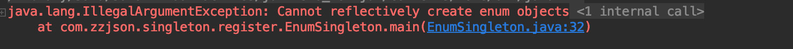

1. # 单例模式

   ## 优点

   - 由于单例模式在内存中只有一个实例，减少了内存开支，特别是 一个对象需要频繁地创建、销毁时，而且创建或销毁时性能又无法优 化，单例模式的优势就非常明显。
   - 由于单例模式只生成一个实例，所以减少了系统的性能开销，当 一个对象的产生需要比较多的资源时，如读取配置、产生其他依赖对象 时，则可以通过在应用启动时直接产生一个单例对象，然后用永久驻留 内存的方式来解决（在Java EE中采用单例模式时需要注意JVM垃圾回 收机制）
   - 单例模式可以避免对资源的多重占用，例如一个写文件动作，由 于只有一个实例存在内存中，避免对同一个资源文件的同时写操作。
   - 单例模式可以在系统设置全局的访问点，优化和共享资源访问， 例如可以设计一个单例类，负责所有数据表的映射处理。

   ## 缺点

   ● 单例模式一般没有接口，扩展很困难，若要扩展，除了修改代码 基本上没有第二种途径可以实现。单例模式为什么不能增加接口呢？因 为接口对单例模式是没有任何意义的，它要求“自行实例化”，并且提供 单一实例、接口或抽象类是不可能被实例化的。当然，在特殊情况下， 单例模式可以实现接口、被继承等，需要在系统开发中根据环境判断。

   ● 单例模式对测试是不利的。在并行开发环境中，如果单例模式没 有完成，是不能进行测试的，没有接口也不能使用mock的方式虚拟一 个对象。

   ● 单例模式与单一职责原则有冲突。一个类应该只实现一个逻辑， 而不关心它是否是单例的，是不是要单例取决于环境，单例模式把“要 单例”和业务逻辑融合在一个类中。

   ## 通用类图

   

   [图解设计模式](https://refactoringguru.cn/design-patterns)

   ## 定义

   ​	保证一个类在任何情况下都绝对只有一个实例，并且提供一个全局访问点`getInstance`

   ​	需要`隐藏其所有构造方法`

   ​	优点：

   ​		在内存中只有一个实例，减少了内存开销

   ​		可以避免对资源的多重占用

   ​		设置全局访问点，严格控制访问

   ​	缺点：

   ​		没有接口，扩展困难

   ​		如果要扩展单例对象，只有修改代码，没有别的途径

   ## 应用场景

   ​	ServletContext

   ​	ServletConfig

   ​	ApplicationContext

   ​	DBPool

   - 要求生成唯一序列号的场景
   - 在整个项目中需要一个共享访问点或共享数据，例如一个Web页 面上的计数器，可以不用把每次刷新都记录到数据库中，使用单例模式 保持计数器的值，并确保是线程安全的；
   - 创建一个对象需要消耗的资源过多，如要访问IO和数据库等资源；
   - 需要定义大量的静态常量和静态方法（如工具类）的环境，可以 采用单例模式（当然，也可以直接声明为static的方式）。

   ## 常见的单例模式写法

   ### 饿汉式单例

   ​	饿汉式就是在初始化的时候就初始化实例

   ​	两种代码写法如下：

   ```java
   public class HungrySingleton {
       private static final HungrySingleton HUNGRY_SINGLETON = new HungrySingleton();
   
       private HungrySingleton() {
   
       }
   
       private static HungrySingleton getInstance() {
           return HUNGRY_SINGLETON;
       }
   }
   ```

   ```java
   public class HungryStaticSingleton {
       private static final HungryStaticSingleton HUNGRY_SINGLETON;
   
       static {
           HUNGRY_SINGLETON = new HungryStaticSingleton();
       }
   
       private HungryStaticSingleton() {
   
       }
   
       private static HungryStaticSingleton getInstance() {
           return HUNGRY_SINGLETON;
       }
   }
   ```

   ​	如果没有使用到这个对象，因为一开始就会初始化实例，这种方式会浪费内存空间

   #### 优点

   - 无锁
   - 效率高，一开始就初始化了

   #### 缺点

   - 内存的浪费
   - 在大量的出现的时候不适合

   ### 懒汉式单例

   ​	懒汉式单例为了解决上述问题，则是在用户使用的时候才初始化单例

   ```java
   public class LazySimpleSingleton {
       private static LazySimpleSingleton lazySimpleSingleton = null;
   
       private LazySimpleSingleton() {
       }
   
       public static LazySimpleSingleton getInstance() {
           //加上空判断保证初只会初始化一次
           if (lazySimpleSingleton == null) {
               lazySimpleSingleton = new LazySimpleSingleton();//11行
           }
           return lazySimpleSingleton;
       }
   }
   ```

   ​	上述方式，线程不安全,如果两个线程同时进入11行，那么会创建两个对象，需要如下，给方法加锁

   > 可以使用Idea的线程模式debug来查看

   ```java
   public class LazySimpleSingleton {
       private static LazySimpleSingleton lazySimpleSingleton = null;
   
       private LazySimpleSingleton() {
   
       }
   
       public synchronized static LazySimpleSingleton getInstance() {
           //加上空判断保证初只会初始化一次
           if (lazySimpleSingleton == null) {
               lazySimpleSingleton = new LazySimpleSingleton();
           }
           return lazySimpleSingleton;
       }
   }
   ```

   ​	上述方式虽然解决了线程安全问题，但是整个方法都是锁定的，CPU线程都阻塞在这里，导致程序整体的处理性能大幅降低，所以我们使用方法内加锁的方式解决提高性能

   #### Double checked

   ```java
   public class LazySimpleSingleton {
       private static LazySimpleSingleton lazySimpleSingleton = null;
   
       private LazySimpleSingleton() {
   
       }
   
       public static LazySimpleSingleton getInstance() {
           //加上空判断保证初只会初始化一次
           if (lazySimpleSingleton == null) {
               synchronized (LazySimpleSingleton.class) {//11行
                   lazySimpleSingleton = new LazySimpleSingleton();
               }
           }
           return lazySimpleSingleton;
       }
   }
   ```

   ​	上述方式如果两个线程同时进入了11行，一个线程a持有锁，一个线程b等待，当持有锁的a线程释放锁之后到return的时候，第二个线程b进入了11行内部，创建了一个新的对象，那么这时候创建了两个线程，对象也并不是单例的。所以我们需要在12行位置增加一个对象判空的操作。

   ```java
   public class LazySimpleSingleton {
       private static LazySimpleSingleton lazySimpleSingleton = null;
   
       private LazySimpleSingleton() {
   
       }
   
       public static LazySimpleSingleton getInstance() {
           //加上空判断保证初只会初始化一次
           if (lazySimpleSingleton == null) {
               synchronized (LazySimpleSingleton.class) {
                   if (lazySimpleSingleton != null) {
                       lazySimpleSingleton = new LazySimpleSingleton();
                   }
               }
           }
           return lazySimpleSingleton;
       }
   }
   ```

   #### 指令重排序的问题

   ​	上述方式还是有风险的，因为CPU执行时候会转化成JVM指令执行：

   ​		1.分配内存给对象

   ​		2.初始化对象

   ​		3.将初始化好的对象和内存地址建立关联，赋值

   ​		4.用户初次访问

   ​	这种方式，在cpu中3步和4步有可能进行指令重排序。有可能用户获取的对象是空的。那么我们可以使用volatile关键字，作为内存屏障，保证对象的可见性来保证我们对象的单一。

   ```java
   public class LazySimpleSingleton {
       private static volatile LazySimpleSingleton lazySimpleSingleton = null;
   
       private LazySimpleSingleton() {
   
       }
   
       public static LazySimpleSingleton getInstance() {
           //加上空判断保证初只会初始化一次
           if (lazySimpleSingleton == null) {
               synchronized (LazySimpleSingleton.class) {
                   if (lazySimpleSingleton != null) {
                       lazySimpleSingleton = new LazySimpleSingleton();
                   }
               }
           }
           return lazySimpleSingleton;
       }
   }
   ```

   ### 静态内部类单例

   ​	还有一种懒汉式单例，利用静态内部类`在调用的时候等到外部方法调用时才执行`，巧妙的利用了内部类的特性，jvm底层逻辑来完美的避免了线程安全问题

   ```java
   public class LazyInnerClassSingleton {
       private LazyInnerClassSingleton() {
   
       }
   
       public static final LazyInnerClassSingleton getInstance() {
           return LazyHolder.LAZY;
       }
   
       private static class LazyHolder {
           private static final LazyInnerClassSingleton LAZY = new LazyInnerClassSingleton();
       }
   }
   ```

   #### JackSon初始化案例

   ```java
   public static ObjectMapper getInstance() {
     return JacksonHolder.INSTANCE;
   }
   
   private static class JacksonHolder {
     private static final ObjectMapper INSTANCE = new JacksonObjectMapper();
   }
   private static class JacksonObjectMapper extends ObjectMapper {
     private static final long serialVersionUID = 4288193147502386170L;
   
     private static final Locale CHINA = Locale.CHINA;
   
     public JacksonObjectMapper(ObjectMapper src) {
       super(src);
     }
   
     public JacksonObjectMapper() {
       super();
       //设置地点为中国
       super.setLocale(CHINA);
       //去掉默认的时间戳格式
       super.configure(SerializationFeature.WRITE_DATES_AS_TIMESTAMPS, false);
       //设置为中国上海时区
       super.setTimeZone(TimeZone.getTimeZone(ZoneId.systemDefault()));
       //序列化时，日期的统一格式
       super.setDateFormat(new SimpleDateFormat(DateUtil.PATTERN_DATETIME, Locale.CHINA));
       // 单引号
       super.configure(JsonParser.Feature.ALLOW_SINGLE_QUOTES, true);
       // 允许JSON字符串包含非引号控制字符（值小于32的ASCII字符，包含制表符和换行符）
       super.configure(JsonReadFeature.ALLOW_UNESCAPED_CONTROL_CHARS.mappedFeature(), true);
       super.configure(JsonReadFeature.ALLOW_BACKSLASH_ESCAPING_ANY_CHARACTER.mappedFeature(), true);
       super.findAndRegisterModules();
       //失败处理
       super.configure(SerializationFeature.FAIL_ON_EMPTY_BEANS, false);
       super.configure(DeserializationFeature.FAIL_ON_UNKNOWN_PROPERTIES, false);
       //单引号处理
       super.configure(JsonReadFeature.ALLOW_SINGLE_QUOTES.mappedFeature(), true);
       //反序列化时，属性不存在的兼容处理s
       super.getDeserializationConfig().withoutFeatures(DeserializationFeature.FAIL_ON_UNKNOWN_PROPERTIES);
       //日期格式化
       super.registerModule(new BladeJavaTimeModule());
       super.findAndRegisterModules();
     }
   
     @Override
     public ObjectMapper copy() {
       return new JacksonObjectMapper(this);
     }
   }
   ```

   ### 反射破坏单例

   ​	这种方式虽然能够完美单例，但是我们如果使用反射的方式如下所示，则会破坏单例

   ```java
   public class LazyInnerClassTest {
       public static void main(String[] args) throws NoSuchMethodException, IllegalAccessException, InvocationTargetException, InstantiationException {
           Class<?> clazz = LazyInnerClassSingleton.class;
           Constructor c = clazz.getDeclaredConstructor(null);
           c.setAccessible(true);
           Object o1 = c.newInstance();
           Object o2 = LazyInnerClassSingleton.getInstance();
           System.out.println(o1 == o2);
       }
   }
   ```

   #### 构造方法中增加异常信息避免反射

   ​	怎么办呢，我们需要一种方式控制访问者的行为，通过异常的方式去限制使用者的行为,如下所示

   ```java
   public class LazyInnerClassSingleton {
       private LazyInnerClassSingleton() {
           throw new RuntimeException("不允许构建多个实例");
       }
   
       public static final LazyInnerClassSingleton getInstance() {
           return LazyHolder.LAZY;
       }
   
       private static class LazyHolder {
           private static final LazyInnerClassSingleton LAZY = new LazyInnerClassSingleton();
       }
   }
   ```

   ​	还有一种方式会破坏单例，那就是序列化破坏我们的单例，如下所示

   ### 序列化破坏单例

   ​	我们写一个序列化的方法来尝试一下上述写法是否是满足序列化的。

   ```java
   public class SeriableSingletonTest {
       public static void main(String[] args) {
           SeriableSingleton seriableSingleton = SeriableSingleton.getInstance();
           SeriableSingleton s2;
           FileOutputStream fos = null;
           FileInputStream fis = null;
   
           try {
               fos = new FileOutputStream("d.o");
               ObjectOutputStream oos = new ObjectOutputStream(fos);
               oos.writeObject(seriableSingleton);
               oos.flush();
               oos.close();
               fis = new FileInputStream("d.o");
               ObjectInputStream ois = new ObjectInputStream(fis);
               s2 = (SeriableSingleton) ois.readObject();
               ois.close();
               System.out.println(seriableSingleton);
               System.out.println(s2);
               System.out.println(s2 == seriableSingleton);
           } catch (Exception e) {
               e.printStackTrace();
           } finally {
               try {
                   if (fos != null) {
                       fos.close();
                   }
               } catch (IOException e) {
                   e.printStackTrace();
               }
               if (fis != null) {
                   try {
                       fis.close();
                   } catch (IOException e) {
                       e.printStackTrace();
                   }
               }
           }
       }
   }
   ```

   为什么序列化会破坏单例呢，我们查看ObjectInputStream的源码

   首先，我们查看`ObjectInputStream`的`readObject`方法

   

   查看readObject0方法

   

   查看`checkResolve(readOrdinaryObject(unshared)`方法可以看到

   

   ​	红框内三目运算符内如果`desc.isInstantiable()`为真就创建新对象，不为空就返回空，此时我们查看`desc.isInstantiable()`方法

   

   此处cons是

   如果有构造方法就会返回true,当然我们一个类必然会有构造方法的，所以这就是为什么序列化会破坏我们的单例

   #### 解决

   `桥接模式`

   那么怎么办呢，我们只需要重写`readResolve`方法就行了

   ```java
   public class SeriableSingleton implements Serializable {
       private SeriableSingleton() {
           throw new RuntimeException("不允许构建多个实例");
       }
   
       public static final SeriableSingleton getInstance() {
           return LazyHolder.LAZY;
       }
   
       private static class LazyHolder {
           private static final SeriableSingleton LAZY = new SeriableSingleton();
       }
   
       private Object readResolve() {
           return getInstance();
       }
   }
   ```

   为什么重写这个`readResolve` 的方法就能够避免序列化破坏单例呢

   回到上述`readOrdinaryObject`方法，可以看到有一个`hasReadResolveMethod`方法

   

   点进去

   

   

   可以看到 readResolveMethod在此处赋值

   

   也就是我们如果类当中有此方法则在hasReadResolveMethod当中返回的是true

   那么会进入`readOrdinaryObject`的如下部分

   

   并且如下所示，调用我们的`readResolve`方法获取对象，来保证我们对象是单例的

   

   ​	但是重写readResolve方法，只不过是覆盖了反序列化出来的对象，但是还是创建了两次，发生在JVM层面，相对来说比较安全，之前反序列化出来的对象会被GC回收

   ## 注册式单例

   ### 枚举单例

   ​	枚举式单例属于注册式单例，他把每一个实例都缓存到统一的容器中，使用唯一标识获取实例。也是比较推荐的一种写法，如下所示：

   ```java
   public enum EnumSingleton {
       INSTANCE;
       private Object data;
   
       public static EnumSingleton getInstance() {
           return INSTANCE;
       }
   }
   ```

   ​	反编译上述文件，可以看到

   

   #### 反射尝试创建新对象

   #### 关于枚举的构造方法

   

   只有一个有参构造，name代表枚举key，  ordinal代表对应的下标且从零开始的

   尝试使用反射来模拟创建单例对象

   ```java
   public class EnumSingletonTest {
     public static void main(String[] args) {
       //        EnumSingleton instance = EnumSingleton.getInstance();
       //        instance.setData(new Object());
   
       try {
         Class clazz = EnumSingleton.class;
   
         Constructor c = clazz.getDeclaredConstructor(String.class,int.class);
         c.setAccessible(true);
         //            System.out.println(c);
         Object o = c.newInstance();
         //            System.out.println(o);
       }catch (Exception e){
         e.printStackTrace();
       }
     }
   }
   ```

   发现抛出异常

   ```
   Cannot reflectively create enum objects
   ```

   查看代码`java.lang.reflect.Constructor#newInstance`

   ```java
   public T newInstance(Object ... initargs)
     throws InstantiationException, IllegalAccessException,
   IllegalArgumentException, InvocationTargetException
   {
     if (!override) {
       if (!Reflection.quickCheckMemberAccess(clazz, modifiers)) {
         Class<?> caller = Reflection.getCallerClass();
         checkAccess(caller, clazz, null, modifiers);
       }
     }
     if ((clazz.getModifiers() & Modifier.ENUM) != 0)
       throw new IllegalArgumentException("Cannot reflectively create enum objects");
     ConstructorAccessor ca = constructorAccessor;   // read volatile
     if (ca == null) {
       ca = acquireConstructorAccessor();
     }
     @SuppressWarnings("unchecked")
     T inst = (T) ca.newInstance(initargs);
     return inst;
   }
   ```

   发现

   在代码中会判断如果是枚举，那么就会抛出对应的异常。所以枚举式单例能够避免构造方法被反射调用。

   #### 序列化能不能破坏枚举

   ​	在ObjectInputStream的readObject方法中有针对枚举的判断

   

   

   上述通过一个类名和枚举名字值来确定一个枚举值。从而枚举在序列化上是不会破坏单例的。

   我们尝试使用反射来创建一个枚举对象

   ```java
   public enum EnumSingleton {
       INSTANCE;
       private Object data;
   
       EnumSingleton() {
   
       }
   
       public static EnumSingleton getInstance() {
           return INSTANCE;
       }
   
       public static void main(String[] args) {
           Class clazz = EnumSingleton.class;
           try {
               Constructor c = clazz.getDeclaredConstructor(String.class, int.class);
               c.newInstance("dd", 1);
           } catch (Exception e) {
               e.printStackTrace();
           }
       }
   }
   ```

   抛出异常

   

   查看Constructor源码可以看到

   

   可以看到jdk层面如果判断是枚举会抛出异常，所以枚举式单例是一种比较推荐的单例的写法。

   #### 枚举式单例的缺点

   查看源代码`java.lang.Enum#valueOf`

   ```java
   public static <T extends Enum<T>> T valueOf(Class<T> enumType,
                                               String name) {
     T result = enumType.enumConstantDirectory().get(name);
     if (result != null)
       return result;
     if (name == null)
       throw new NullPointerException("Name is null");
     throw new IllegalArgumentException(
       "No enum constant " + enumType.getCanonicalName() + "." + name);
   }
   ```

   `java.lang.Class#enumConstantDirectory`

   ```java
       private volatile transient Map<String, T> enumConstantDirectory = null;
   
   Map<String, T> enumConstantDirectory() {
     if (enumConstantDirectory == null) {
       T[] universe = getEnumConstantsShared();
       if (universe == null)
         throw new IllegalArgumentException(
         getName() + " is not an enum type");
       Map<String, T> m = new HashMap<>(2 * universe.length);
       for (T constant : universe)
         m.put(((Enum<?>)constant).name(), constant);
       enumConstantDirectory = m;
     }
     return enumConstantDirectory;
   }
   ```

   一开始需要初始化，并且需要浪费一定的内存来存储

   ### 容器式单例

   这种方式是通过容器的方式来保证我们对象的单例，常见于Spring的IOC容器

   ```java
   public class ContainerSingleton {
       private ContainerSingleton() {
   
       }
   
       private static Map<String, Object> ioc = new ConcurrentHashMap<>();
   
       public static Object getBean(String className) {
           if (!ioc.containsKey(className)) {
               Object obj = null;
               try {
                   obj = Class.forName(className).newInstance();//12
                   ioc.put(className, obj);
               } catch (Exception e) {
                   e.printStackTrace();
               }
               return obj;
           }
           return ioc.get(className);
       }
   
       public static void main(String[] args) throws InterruptedException {
           ExecutorService executorService = Executors.newFixedThreadPool(100);
           final CountDownLatch countDownLatch = new CountDownLatch(1000);
           for (int i = 0; i < 1000; i++) {
               executorService.submit(new Runnable() {
                   @Override
                   public void run() {
                       Object o = ContainerSingleton.getBean("com.zzjson.singleton.register.ContainerSingleton");
                       System.out.println(o + "");
                       countDownLatch.countDown();
                   }
               });
           }
           countDownLatch.await();
           executorService.shutdown();
   
       }
   
   }
   ```

   这种方式测试可见

   

   

   出现了几次不同对象的情况因为我们线程在12行可能同时进入，这时候我们需要加一个同步锁如下，这样创建对象才是只会创建一个的

   ```java
   public class ContainerSingleton {
       private ContainerSingleton() {
   
       }
   
       private static Map<String, Object> ioc = new ConcurrentHashMap<>();
   
       public static Object getBean(String className) {
           synchronized (ioc) {
               if (!ioc.containsKey(className)) {
                   Object obj = null;
                   try {
                       obj = Class.forName(className).newInstance();
                       ioc.put(className, obj);
                   } catch (Exception e) {
                       e.printStackTrace();
                   }
                   return obj;
               }
           }
           return ioc.get(className);
       }
   
       public static void main(String[] args) throws InterruptedException {
           ExecutorService executorService = Executors.newFixedThreadPool(100);
           final CountDownLatch countDownLatch = new CountDownLatch(1000);
           for (int i = 0; i < 1000; i++) {
               executorService.submit(new Runnable() {
                   @Override
                   public void run() {
                       Object o = ContainerSingleton.getBean("com.zzjson.singleton.register.ContainerSingleton");
                       System.out.println(o + "");
                       countDownLatch.countDown();
                   }
               });
           }
           countDownLatch.await();
           executorService.shutdown();
   
       }
   
   }
   ```

   - 当然我们也可以使用`putIfAbsent`

   - 利用ConcurrenthashMap的特性也是通过加锁来解决的

     

   ## ThreadLocal单例

   这种方式只能够保证在当前线程内的对象是单一的

   ```java
   public class ThreadLocalSingleton {
       private ThreadLocalSingleton() {
       }
   
       private static final ThreadLocal<ThreadLocalSingleton> threadLocalInstance = new ThreadLocal<ThreadLocalSingleton>() {
           @Override
           protected ThreadLocalSingleton initialValue() {
               return new ThreadLocalSingleton();
           }
   
       };
   
       private static ThreadLocalSingleton getInstance() {
           return threadLocalInstance.get();
       }
      }
   ```

   

   > 需要注意在tomcat中线程池线程是复用的所以需要记得销毁

   

   ## 单例模式在Spring中的应用场景

   ### Spring的AbstractFactoryBean

   `org.springframework.beans.factory.config.AbstractFactoryBean#getObject`

   ```java
   public final T getObject() throws Exception {
     if (isSingleton()) {
       return (this.initialized ? this.singletonInstance : getEarlySingletonInstance());
     }
     else {
       return createInstance();
     }
   }
   ```

   ### Mybatis的ErrorContext

   ```java
   public class ErrorContext {
   
     private static final ThreadLocal<ErrorContext> LOCAL = ThreadLocal.withInitial(ErrorContext::new);
   
   
     private ErrorContext() {
     }
   
     public static ErrorContext instance() {
       return LOCAL.get();
     }
   }
   ```

   # 总结

   1. 私有化构造器
   2. 保证线程安全
   3. 延迟加载
   4. 防止序列化和反序列化破坏单例
   5. 防御反射攻击单例