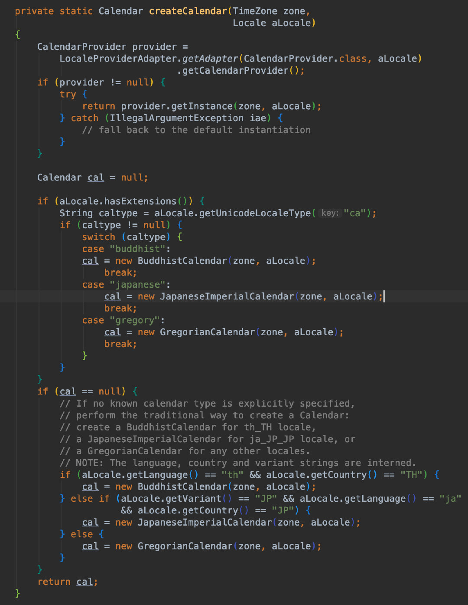
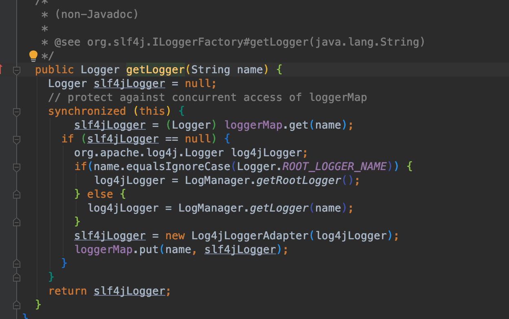
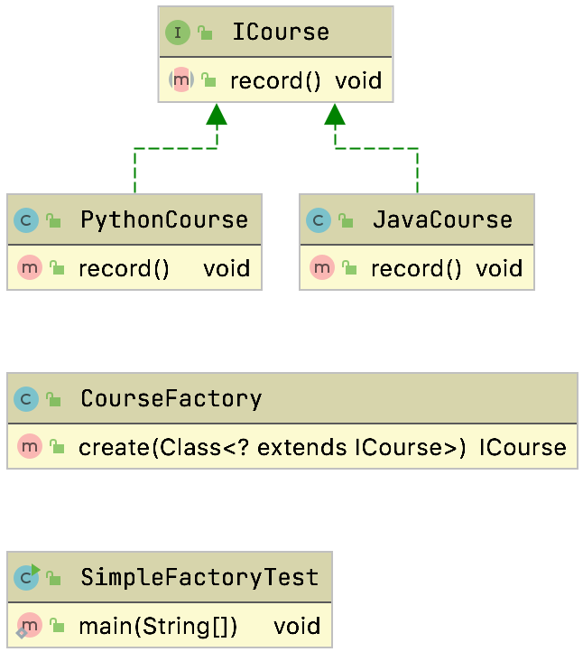
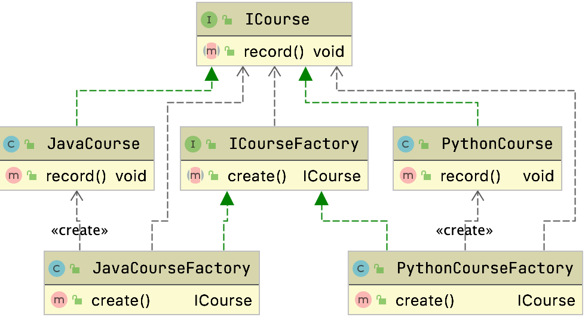
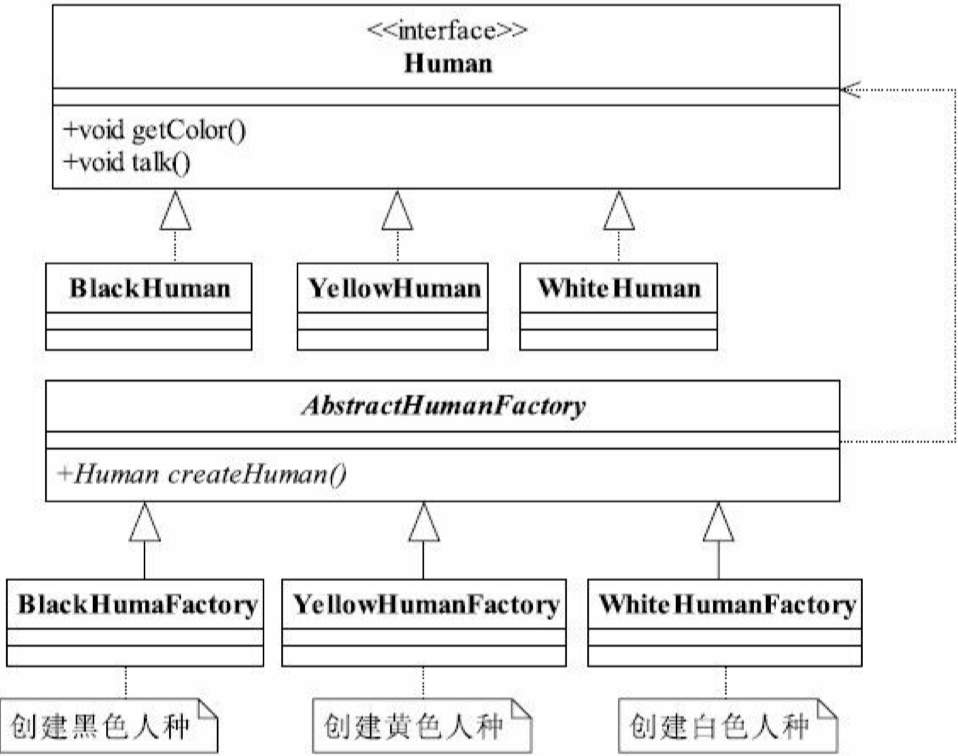
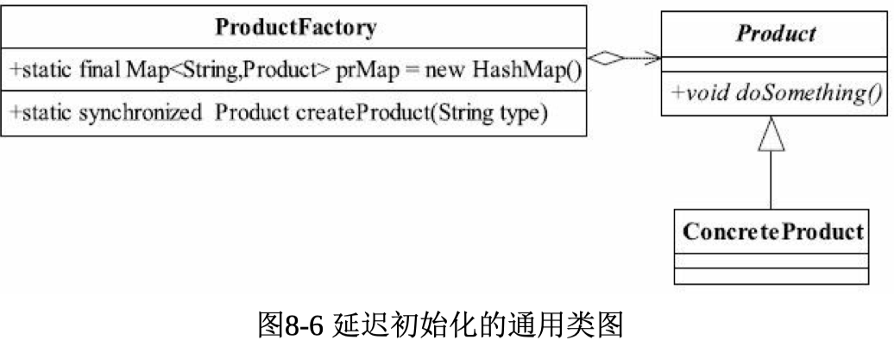
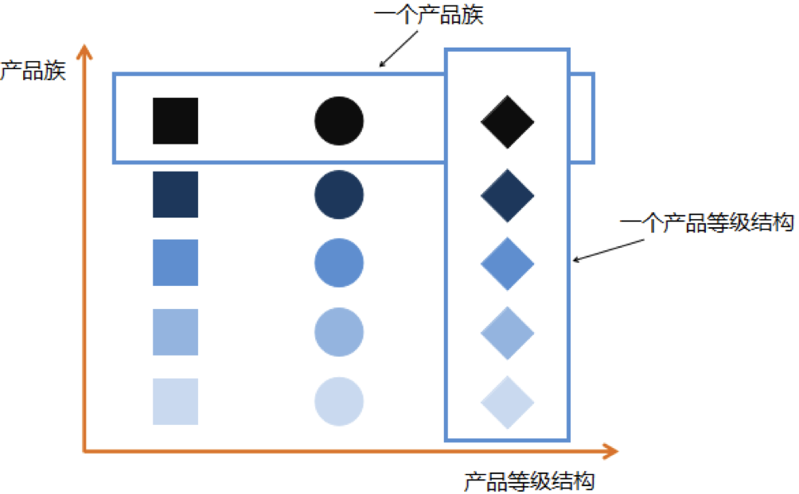
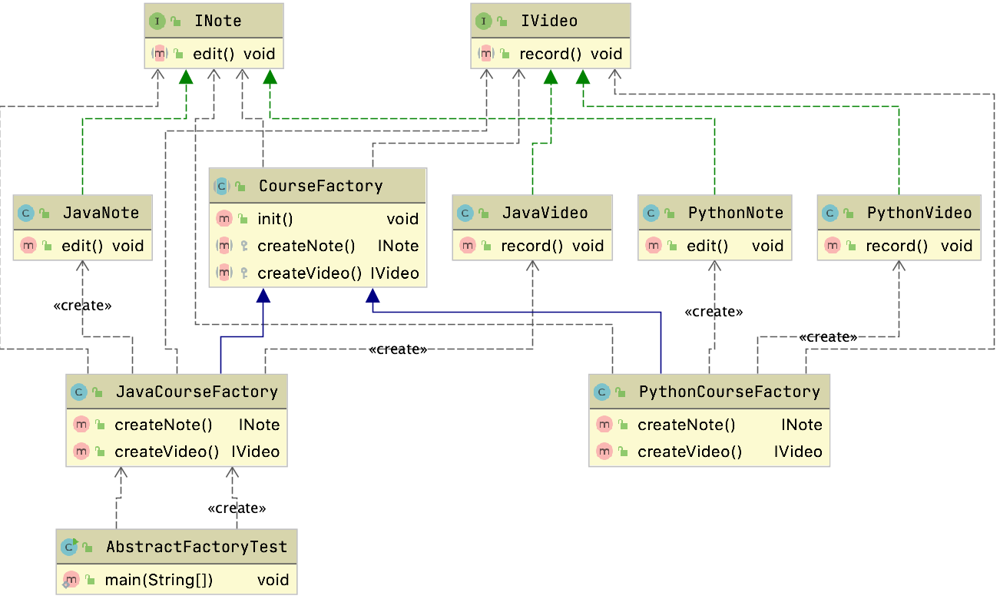
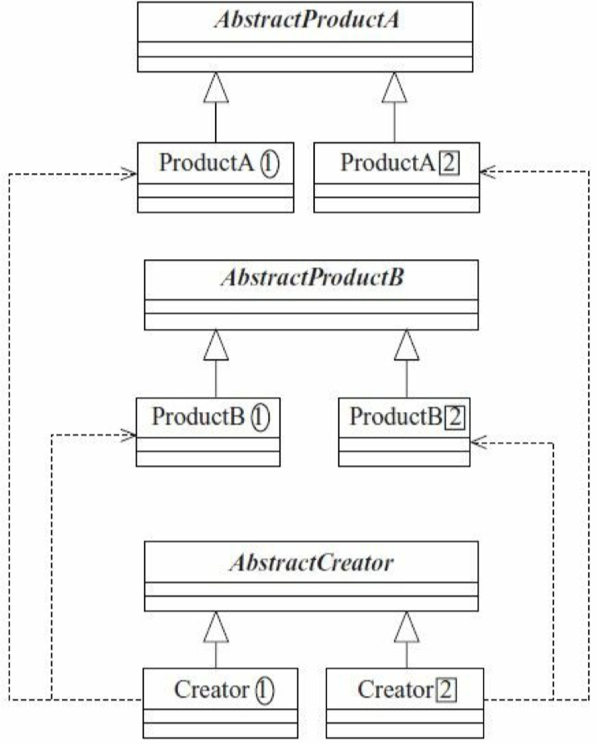
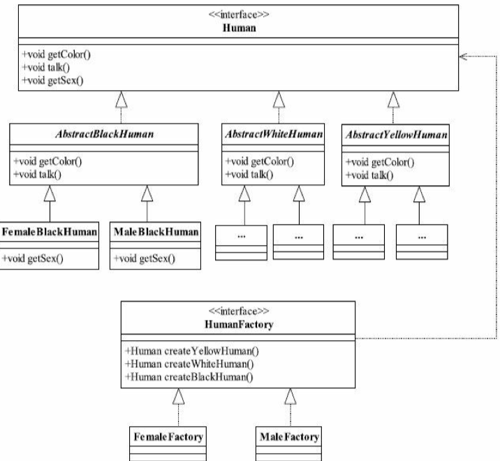

# 参考资料

[图解设计模式](https://refactoringguru.cn/design-patterns)

大话设计模式

设计模式之禅

[github我见过最好的设计模式](https://github.com/iluwatar/java-design-patterns)

# 设计原则回顾

| 设计原则     | 解释                                                         |
| ------------ | ------------------------------------------------------------ |
| 开闭原则     | 对扩展开放，对修改关闭                                       |
| 依赖倒置原则 | 通过抽象让各个模块互不影响，松耦合，面向接口编程             |
| 单一职责原则 | 一个接口，类，方法只做一件事                                 |
| 接口隔离原则 | 保证纯洁性，不应该依赖于自己不需要的接口，有时候没办法可以通过适配器来解决 |
| 迪米特法则   | 最少知道原则，一个类对其所依赖的类知道的越少越好             |
| 里氏替换原则 | 子类可以扩展父类的功能但是不能改变父类原有的功能             |
| 合成复用原则 | 尽量使用聚合和组合，少用继承                                 |


- 巧用Json工具类来做json转化
- JDBC这一块是固定的，可以使用模板方法


# 工厂模式

## 简单工厂

### 案例

#### 日历类

比如说日历类中获取对应日历的方法，通过传入参数来进行对应的对象的生成



#### 日志

又或者说 logfactory中的log






```java
public class CourseFactory {
  //    public ICourse create(String name){
  //        if("java".equals(name)){
  //            return new JavaCourse();
  //        }else if("python".equals(name)){
  //            return new PythonCourse();
  //        }else {
  //            return null;
  //        }
  //    }

  //    public ICourse create(String className){
  //        try {
  //            if (!(null == className || "".equals(className))) {
  //                return (ICourse) Class.forName(className).newInstance();
  //            }
  //
  //        }catch (Exception e){
  //            e.printStackTrace();
  //        }
  //        return null;
  //    }
	//泛型约束
  public ICourse create(Class<? extends ICourse> clazz){
    try {
      if (null != clazz) {
        return clazz.newInstance();
      }
    }catch (Exception e){
      e.printStackTrace();
    }
    return null;
  }

}
```

#### Mybatis SqlsesssionFactory创建Executor

`org.apache.ibatis.session.Configuration#newExecutor(Transaction, ExecutorType)`

```java
  public Executor newExecutor(Transaction transaction, ExecutorType executorType) {
    executorType = executorType == null ? defaultExecutorType : executorType;
    executorType = executorType == null ? ExecutorType.SIMPLE : executorType;
    Executor executor;
    if (ExecutorType.BATCH == executorType) {
      executor = new BatchExecutor(this, transaction);
    } else if (ExecutorType.REUSE == executorType) {
      executor = new ReuseExecutor(this, transaction);
    } else {
      executor = new SimpleExecutor(this, transaction);
    }
    if (cacheEnabled) {
      executor = new CachingExecutor(executor);
    }
    executor = (Executor) interceptorChain.pluginAll(executor);
    return executor;
  }
```

- 通过不同的ExecurtorType来创建Executor

### 优点

	只需要传入一个正确的参数，就可以获取我们所需要的对象，无需知道其创建的细节

### 缺点

	工厂类的职责相对过重，增加新的产品时需要修改工厂类的判断逻辑，不符合开闭原则

### 问题

> 为什么一定要用工厂模式，为什么工厂模式比直接`new Object()`好呢?
>
> - new Object可能还得去配置和组装对象的很多额外信息
>   - 但是当前可能并不需要知道这么多额外信息，且不希望自己来组装，所以通过工厂来获取
>   - 例如用户只想要一辆车，可能并不想知道车门的材料是什么厂商的，车轮是从哪里进口的
> - 其次如果说工厂里面生产的东西发生一些小的变更，只需要直接在工厂的地方修改就行了，如果用户自己来new的，那么所有用户自己创建的地方都需要修改，其实主要还是`高内聚低耦合`

## 工厂方法

	定义一个创建对象的接口，但让实现这个接口的类来决定实例化哪个类，工厂方法让类的实例化推迟到子类中进行。

- 缺点
  - 类的个数容易过多，增加了代码结构的复杂度
  - 增加了系统的抽象性和理解难度

### 例子

如果是简单当前可能创建不同的工厂产品可能需要组装各种属性，可能从java上来说就是需要set各种各样的东西，就会导致代码很长，而且一旦后期需要维护和变更其中一个工厂，可能会改和影响到其他工厂，所以这时候为了开闭原则，我们可以把工厂抽象出来，对应的工厂实现自己的工厂创建。

#### 关于课程的例子



工厂抽象

```java
public interface ICourseFactory {
  ICourse create();
}
```

课程抽象

```java
public interface ICourse {
  /**
       * 录制视频
       * @return
       */
  void record();
}
```

#### 关于女娲造人的例子




> 抽象方法中已经不再需要传递相关参数了，因为每一个具体的工厂都已经非常明确自己的职责：创建自己负责的产品类对象。

### 工厂方法+单例模式

#### 单例模式代码

```java
public class Singleton {
  //不允许通过new产生一个对象
  private Singleton(){ }
  public void doSomething(){
    //业务处理
  }
}
```

#### 工厂方法+反射破坏构造私有化来创建

我们可以通过工厂来构建单例对象

```java
public class SingletonFactory {

  private static Singleton singleton;

  static {
    try {
      Class cl = Class.forName(Singleton.class.getName());
      //获得无参构造、
      java.lang.reflect.Constructor constructor =cl.getDeclaredConstructor();
      //设置无参构造是可访问的
      constructor.setAccessible(true);
      //产生一个实例对象
      singleton = (Singleton)constructor.newInstance();
    } catch (Exception e) {
      //异常处理
    }

  }
  public static Singleton getSingleton(){ return singleton; }

}
```

> 通过获得类构造器，然后设置访问权限，生成一个对象，然后提供外部访问，保证内存中的对象唯一。
>
> 当然，其他类也可以通过反射的方式建立一个单例对象，确实如此，
>
> 但是一个项目或团队是有章程和规范的，何况已经提供了一个获得单例对象的方法，为什么还要重新创建一 个新对象呢？
>
> 除非是有人作恶。

#### Spring中使用工厂方法+反射破坏构造私有化

`org.springframework.core.io.support.SpringFactoriesLoader#instantiateFactory`

```java
private static <T> T instantiateFactory(String instanceClassName, Class<T> factoryClass, ClassLoader classLoader) {
  try {
    Class<?> instanceClass = ClassUtils.forName(instanceClassName, classLoader);
    if (!factoryClass.isAssignableFrom(instanceClass)) {
      throw new IllegalArgumentException(
        "Class [" + instanceClassName + "] is not assignable to [" + factoryClass.getName() + "]");
    }
    Constructor<?> constructor = instanceClass.getDeclaredConstructor();
    ReflectionUtils.makeAccessible(constructor);
    return (T) constructor.newInstance();
  }
  catch (Throwable ex) {
    throw new IllegalArgumentException("Unable to instantiate factory class: " + factoryClass.getName(), ex);
  }
}
```


### 工厂方法+单例`延迟初始化`




```java
public class ProductFactory {

  private static final Map<String,Product> prMap = new HashMap(); 
  public static synchronized Product createProduct(String type) {

    Product product =null;

    //如果Map中已经有这个对象 
    if(prMap.containsKey(type)){ 
      product = prMap.get(type);
    }else{
      if(type.equals("Product1")){
        product = new ConcreteProduct1(); 
      }else{ 
        product = new ConcreteProduct2();
      } 
      //同时把对象放到缓存容器中 
      prMap.put(type,product);

    } return product;

  }

}
```

#### Dubbo中SPI工厂方法+单例

```java
private static final ConcurrentMap<Class<?>, ExtensionLoader<?>> EXTENSION_LOADERS = new ConcurrentHashMap<>(64);

public static <T> ExtensionLoader<T> getExtensionLoader(Class<T> type) {
  if (type == null) {
    throw new IllegalArgumentException("Extension type == null");
  }
  if (!type.isInterface()) {
    throw new IllegalArgumentException("Extension type (" + type + ") is not an interface!");
  }
  if (!withExtensionAnnotation(type)) {
    throw new IllegalArgumentException("Extension type (" + type +
                                       ") is not an extension, because it is NOT annotated with @" + SPI.class.getSimpleName() + "!");
  }

  ExtensionLoader<T> loader = (ExtensionLoader<T>) EXTENSION_LOADERS.get(type);
  if (loader == null) {
    EXTENSION_LOADERS.putIfAbsent(type, new ExtensionLoader<T>(type));
    loader = (ExtensionLoader<T>) EXTENSION_LOADERS.get(type);
  }
  return loader;
}
```


> 代码还比较简单，通过定义一个Map容器，容纳所有产生的对象， 如果在Map容器中已经有的对象，则直接取出返回；如果没有，则根据 需要的类型产生一个对象并放入到Map容器中，以方便下次调用。
>
> 延迟加载框架是可以扩展的，例如限制某一个产品类的最大实例化 数量，可以通过判断Map中已有的对象数量来实现，这样的处理是非常 有意义的，例如JDBC连接数据库，都会要求设置一个MaxConnections 最大连接数量，该数量就是内存中最大实例化的数量。
>
> 延迟加载还可以用在对象初始化比较复杂的情况下，例如硬件访 问，涉及多方面的交互，则可以通过延迟加载降低对象的产生和销毁带 来的复杂性。

	创建对象需要大量重复的代码
	
	客户端不依赖于产品类实例如何被创建，实现等细节。一个类通过其子类来指定创建哪个对象

### 最佳实践

> 工厂方法模式在项目中使用得非常频繁，以至于很多代码中都包含工厂方法模式。该模式几乎尽人皆知，但不是每个人都能用得好。熟能生巧，熟练掌握该模式，多思考工厂方法如何应用，而且工厂方法模式还可以与其他模式混合使用（例如模板方法模式、单例模式、原型模式等），变化出无穷的优秀设计，这也正是软件设计和开发的乐趣所在。

### 缺点

1. 类的个数容易过多，增加复杂度
2. 增加了系统的抽象性和理解难度

### 问题

> 工厂方法它解决了简单工厂的哪个问题？
>
> - 解决了不同工厂生成不同产品需要装配过多的代码在同一个类里面，违背了开闭原则，通过工厂方法来解决快速扩展的问题

## 抽象工厂

> 客户端无需了解其所调用工厂的具体类信息。

[图解抽象工厂](https://refactoringguru.cn/design-patterns/abstract-factory)

提供一个创建一系列相关或相互依赖对象的接口，无须指定他们具体的类
客户端不依赖于产品类实例如何被创建、实现等细节
强调一系列相关的产品对象（属于同一产品族）一起使用创建对象需要大量重复的代码



- 产品族
  - 代表同一个品牌，不同产品
- 产品等级结构
  - 同一产品不同品牌

### 例子



```java
public class AbstractFactoryTest {

  public static void main(String[] args) {
    JavaCourseFactory factory = new JavaCourseFactory();
    factory.createNote().edit();
    factory.createVideo().record();
  }
}
```

### 通用设计



我们可以通过指定不同的抽象工厂来创建对应的产品

### 适用场景

-  如果代码需要与多个不同系列的相关产品交互， 但是由于无法提前获取相关信息， 或者出于对未来扩展性的考虑， 你不希望代码基于产品的具体类进行构建， 在这种情况下， 你可以使用抽象工厂。
-  抽象工厂为你提供了一个接口， 可用于创建每个系列产品的对象。 只要代码通过该接口创建对象， 那么你就不会生成与应用程序已生成的产品类型不一致的产品。
-  如果你有一个基于一组抽象方法的类， 且其主要功能因此变得不明确， 那么在这种情况下可以考虑使用抽象工厂模式。
-  在设计良好的程序中， *每个类仅负责一件事*。 如果一个类与多种类型产品交互， 就可以考虑将工厂方法抽取到独立的工厂类或具备完整功能的抽象工厂类中。

### 优缺点

| 优点                                                         | 缺点                                                         |
| ------------------------------------------------------------ | ------------------------------------------------------------ |
| 你可以确保同一工厂生成的产品相互匹配。                       | 由于采用该模式需要向应用中引入众多接口和类， 代码可能会比之前更加复杂。 |
| 你可以避免客户端和具体产品代码的耦合。                       |                                                              |
| *单一职责原则*。 你可以将产品生成代码抽取到同一位置， 使得代码易于维护。 |                                                              |
| *开闭原则*。 向应用程序中引入新产品变体时， 你无需修改客户端代码。 |                                                              |


- 不符合开闭原则
  - 如果在对应的工厂上面新增一个功能，所有实现的地方都需要去修改`慎用`
- 不依赖于产品实例如何被创建，实现的细节
- 强调一系列相关的产品(统一产品族)一起使用穿件对象需要大量重复的的重复代码的场景
- 扩展性很强

### 问题

> 举例说出抽象工厂的应用场景，我如果要增加一个答疑的产品应该怎么修改代码
>
> - 比如说女娲造人，需要有男人和女人，也需要有白种人，黑种人，黄种人，那么我们可以定义一个顶层接口`Humanfactory`然后`FemaleFactory`和`MaleFactory`都实现对应的`HumanFactory`的接口，然后对应的工厂创建对应的产品
> - 
> - 增加答疑的产品的话需要新增一个答疑的接口，所有工厂都需要去修改补充对应的实现，所以改动会非常大