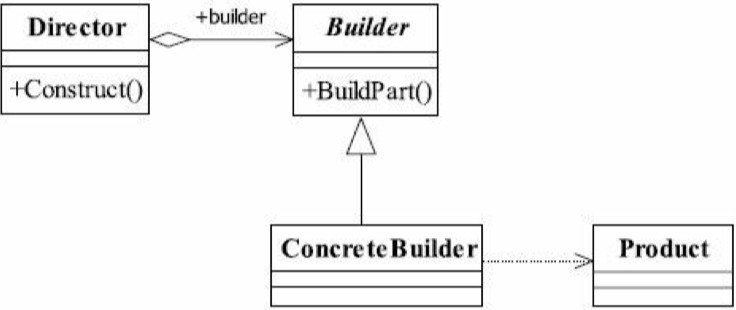
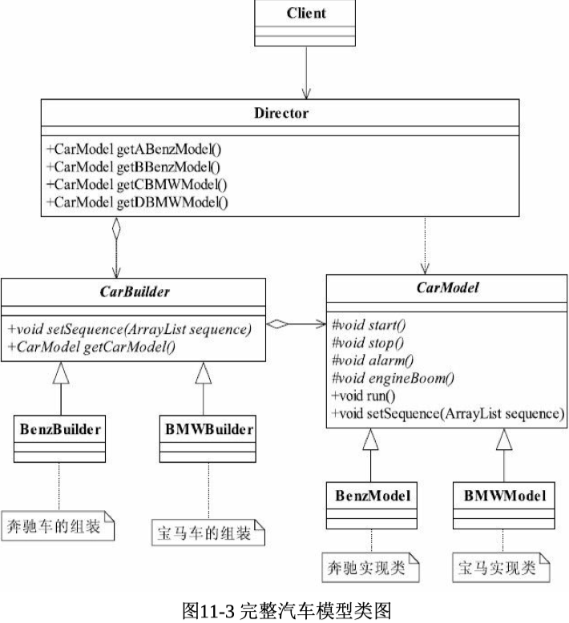

# 建造者模式

> 也叫生成器模式，他是一个创建型模式

## 通用类图



###  Product产品类

​	通常是实现了模板方法模式，也就是有模板方法和基本方法.

```java
public class Product { 
  public void doSomething(){ 
    //独立业务处理
  }
}
```


###  Builder抽象建造者

​	规范产品的组建，一般是由子类实现。例子中的CarBuilder就属于 抽象建造者。

```java
public abstract class Builder { 
  //设置产品的不同部分，以获得不同的产品
  public abstract void setPart(); 
  //建造产品 
  public abstract Product buildProduct();
}
```

###  ConcreteBuilder具体建造者 

​	实现抽象类定义的所有方法，并且返回一个组建好的对象。例子中 的BenzBuilder和BMWBuilder就属于具体建造者。

```java
public class ConcreteProduct extends Builder { 
  private Product product = new Product(); 
  //设置产品零件
  public void setPart(){

    /* * 产品类内的逻辑处理 */ 
  } 
  //组建一个产品 
  public Product buildProduct() {

    return product; 
  }

}
```


### Director导演类

​	负责安排已有模块的顺序，然后告诉Builder开始建造，在上面的例 子中就是我们的老大，××公司找到老大，说我要这个或那个类型的车辆 模型，然后老大就把命令传递给我，我和我的团队就开始拼命地建造， 于是一个项目建设完毕了。

```java
public class Director {
  private Builder builder = new ConcreteProduct();
  //构建不同的产品 
  public Product getAProduct(){
    builder.setPart();
    /* * 设置不同的零件，产生不同的产品 */
    return builder.buildProduct();
  }
}
```


## 定义

将一个复杂对象的构建和他的表示分离，使得同样的构建过程可以创建不同的表示。

### 特征

用户只需要指定需要建造的类型就可以获得对象，建造过程及细节不需要了解

## 适用场景

一个对象有非常复杂的内部结构（很多属性）

我们可以把复杂对象的创建和使用分离

> 可以不用关心谁先谁后了

-  相同的方法，不同的执行顺序，产生不同的事件结果时，可以采用建造者模式。
-  多个部件或零件，都可以装配到一个对象中，但是产生的运行结果又不相同时，则可以使用该模式。
-  产品类非常复杂，或者产品类中的调用顺序不同产生了不同的效 能，这个时候使用建造者模式非常合适。
-  在对象创建过程中会使用到系统中的一些其他对象，这些对象在产品对象的创建过程中不易得到时，也可以采用建造者模式封装该对象的创建过程。该种场景只能是一个补偿方法，因为一个对象不容易获得，而在设计阶段竟然没有发觉，而要通过创建者模式柔化创建过程， 本身已经违反设计的最初目标。

## 案例

- JPA
- mybatis example 

### 案例类图




当前执行的顺序由具体的构建者来决定，用户只需要关心需要的内容

> - 如果你要调用类中的成员变量或方法，需要在前面加上this关键字，不加也能正常地跑起来，但是不清晰，加上this关键 字，我就是要调用本类中的成员变量或方法，而不是本方法中的一个变 量。
> - 还有super方法也是一样，是调用父类的成员变量或者方法，那就加上这个关键字，不要省略，这要靠约束，还有就是程序员的自觉性，他要是死不悔改，那咱也没招。

## 源码中的提现

### StringBuilder

```java
public AbstractStringBuilder append(String str) {
  if (str == null)
    return appendNull();
  int len = str.length();
  ensureCapacityInternal(count + len);
  str.getChars(0, len, value, count);
  count += len;
  return this;
}

@Override
public StringBuilder append(char c) {
  super.append(c);
  return this;
}
```

- 过程开放给用户
- 结果程序来帮我们控制顺序

### Mybatis CacheBuilder

```java
public CacheBuilder addDecorator(Class<? extends Cache> decorator) {
  if (decorator != null) {
    this.decorators.add(decorator);
  }
  return this;
}
public Cache build() {
  setDefaultImplementations();
  Cache cache = newBaseCacheInstance(implementation, id);
  setCacheProperties(cache);
  // issue #352, do not apply decorators to custom caches
  if (PerpetualCache.class.equals(cache.getClass())) {
    for (Class<? extends Cache> decorator : decorators) {
      cache = newCacheDecoratorInstance(decorator, cache);
      setCacheProperties(cache);
    }
    cache = setStandardDecorators(cache);
  } else if (!LoggingCache.class.isAssignableFrom(cache.getClass())) {
    cache = new LoggingCache(cache);
  }
  return cache;
}
```

### Mybatis SqlsessionFactoryBuilder

```java
public SqlSessionFactory build(Reader reader, String environment) {
  return build(reader, environment, null);
}

public SqlSessionFactory build(Reader reader, Properties properties) {
  return build(reader, null, properties);
}

public SqlSessionFactory build(Reader reader, String environment, Properties properties) {
  try {
    XMLConfigBuilder parser = new XMLConfigBuilder(reader, environment, properties);
    return build(parser.parse());
  } catch (Exception e) {
    throw ExceptionFactory.wrapException("Error building SqlSession.", e);
  } finally {
    ErrorContext.instance().reset();
    try {
      reader.close();
    } catch (IOException e) {
      // Intentionally ignore. Prefer previous error.
    }
  }
}

```

### Spring beanDefinitionBuilder


```java
public AbstractBeanDefinition getBeanDefinition() {
  this.beanDefinition.validate();
  return this.beanDefinition;
}
public static BeanDefinitionBuilder genericBeanDefinition(String beanClassName) {
  BeanDefinitionBuilder builder = new BeanDefinitionBuilder(new GenericBeanDefinition());
  builder.beanDefinition.setBeanClassName(beanClassName);
  return builder;
}


public static BeanDefinitionBuilder genericBeanDefinition(Class<?> beanClass) {
  BeanDefinitionBuilder builder = new BeanDefinitionBuilder(new GenericBeanDefinition());
  builder.beanDefinition.setBeanClass(beanClass);
  return builder;
}

```


# 总结

## 优点

- 封装性好，创建和使用分离
- 扩展性好，建造类之间相互独立,容易扩展
- 便于控制细节风险
  - 由于具体的建造者是独立的，因此可以对建造过程逐步细化，而不对其他模块产生任何影响

## 缺点

- 产生多余的Builder对象
- 产品内部发生变化，建造者都要修改，成本较大

## 和别的设计模式的区别

### 和工厂模式的区别

- 建造者更加关心方法的调用顺序，工厂模式注重于创建对象
  - 建造者模式关注的是零件类型和装配工艺(顺序)，这是它与工厂方法模式最大不同的地方，虽然同为创建类模式，但是注重点不同。
- 创建对象的力度不同，建造者模式创建复杂的对象，由各种复杂的部件组成，工厂模式创建出来的都一样
- 关注点不一样
  - 工厂模式只要把对象创建出来就行了
  - 建造者不但需要创建，还需要了解这个对象由什么部件组成
- 建造者模式根据建造过程的顺序不一样，最终的对象部件组成也不一样

# 问题

> 什么情况下应该考虑到使用建造模式？

- 相同的方法，不同的执行顺序会产生不同的结果的时候需要用到
- 产品类非常复杂，或者产品类的调用顺序不同产生了不同的效能
- 对象穿件的过程会用到一些其他对象，对象在创建的过程中不容易得到