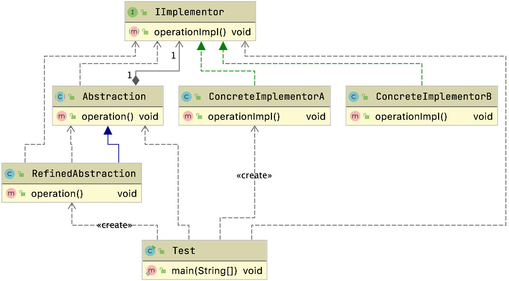

# 桥接模式

## 定义

抽象部分和具体实现部分分离

- 让他们可以独立的变化
- 通过组合的方式建立两个类之间的关系而不是继承

> 结构型模式

## 生活中的场景

### 桥

连接了两个维度的东西

### 网络连接

桥接模式

虚拟网卡和物理网卡连在一起

## 通用的写法



里面有几个关键角色

### Abstraction——抽象化角色

​	它的主要职责是定义出该角色的行为，同时保存一个对实现化角色的引用，该角色一般是抽象类。

### Implementor——实现化角色

它是接口或者抽象类，定义角色必需的行为和属性。

### RefinedAbstraction——修正抽象化角色

它引用实现化角色对抽象化角色进行修正。

### ConcreteImplementor——具体实现化角色

它实现接口或抽象类定义的方法和属性。


```java
public class RefinedAbstraction extends Abstraction {
  public RefinedAbstraction(IImplementor implementor) {
    super(implementor);
  }

  @Override
  public void operation() {
    super.operation();
    System.out.println("refined operation");
  }
}
public class Test {

  public static void main(String[] args) { 
    //定义一个实现化角色
    Implementor imp = new ConcreteImplementor1();
    //定义一个抽象化角色
    Abstraction abs = new RefinedAbstraction(imp); 
    //执行行文
    abs.request(); 
  }

}
}
```

### 测试用例

```java
public class Test {
  public static void main(String[] args) {
    // 来一个实现化角色
    IImplementor imp = new ConcreteImplementorA();
    // 来一个抽象化角色，聚合实现
    Abstraction abs = new RefinedAbstraction(imp);
    // 执行操作
    abs.operation();
  }
}
```

​	各位可能要问，为什么要增加一个构造函数？答案是为了提醒子类，你必须做这项工作，指定实现者，特别是已经明确了实现者，则尽量清晰明确地定义出来。

## 案例

### 抽象工厂的问题

以前我们在写抽象工厂模式的时候是这样来做的


从上图可以看到，抽象工厂是用来帮我们创建不同的课程有相同的共性的问题

例如Java课程和python课程都需要记笔记和录制视频，所以我们可以通过抽象工厂`CourseFactory`来创建，但是这种方式是通过继承来做的，并且我们的产品和工厂都绑的太死了，所以我们可以通过桥梁模式来帮我们解绑，用组合和聚合来代理继承。

### 桥接模式来松绑


可以看到通过`AbstractCourse`给笔记和视频搭建了一个桥梁

```java
public class AbstractCourse implements ICourse {
  private INote note;
  private IVideo video;

  public void setNote(INote note) {
    this.note = note;
  }

  public void setVideo(IVideo video) {
    this.video = video;
  }

  @Override
  public String toString() {
    return "AbstractCourse{" +
      "note=" + note +
      ", video=" + video +
      '}';
  }
}
```

这样我们就通过桥梁`AbstractCourse`来帮我们建立起了笔记和视频的联系

### 消息


我们可以通过桥接模式来构建消息类型和发送消息的关系


```java
public abstract class AbastractMessage {
  private IMessage message;

  public AbastractMessage(IMessage message) {
    this.message = message;
  }

  void sendMessage(String message, String toUser) {
    this.message.send(message, toUser);
  }
}
```

使用如下

```java
public class Test {
  public static void main(String[] args) {
    IMessage message = new SmsMessage();
    AbastractMessage abastractMessage = new NomalMessage(message);
    abastractMessage.sendMessage("加班申请","王总");

    message = new EmailMessage();
    abastractMessage = new UrgencyMessage(message);
    abastractMessage.sendMessage("加班申请","王总");
  }
}
```


> 感觉桥接模式和装饰者有点像

## 源码中的桥接模式

### JDBC


#### 初始化

当我们执行如下代码的时候

```java
/**
  * JDBC规定了这些步骤，但是没有具体实现。<br>
  * 这些具体实现跟抽象步骤怎么衔接起来呢？通过DriverManager来桥接<br/>
  */
try {
  //1.加载驱动  ---> 建立桥
  Class.forName("com.mysql.jdbc.Driver");  //反射机制加载驱动类，执行静态块代码，调用Driver的构造方法<br>
  // 2.获取连接Connection
  //主机:端口号/数据库名  --> 前面建立桥了 这里就用
Connection conn= DriverManager.getConnection("jdbc:mysql://localhost:3306/ds0", "admin", "admin");
  // 3.得到执行sql语句的对象Statement
  Statement stmt = conn.createStatement();
  // 4.执行sql语句，并返回结果
  ResultSet rs = stmt.executeQuery("select *from table");
}catch (Exception e){
  e.printStackTrace();
}
}
```

会执行对应的静态代码块

```java
public class Driver extends NonRegisteringDriver implements java.sql.Driver {
    public Driver() throws SQLException {
    }

    static {
        try {
            DriverManager.registerDriver(new Driver());
        } catch (SQLException var1) {
            throw new RuntimeException("Can't register driver!");
        }
    }
}

```

`java.sql.DriverManager#registerDriver(java.sql.Driver, java.sql.DriverAction)`

```java
private final static CopyOnWriteArrayList<DriverInfo> registeredDrivers = new CopyOnWriteArrayList<>();

public static synchronized void registerDriver(java.sql.Driver driver,
                                               DriverAction da)
  throws SQLException {

  /* Register the driver if it has not already been added to our list */
  if(driver != null) {
    registeredDrivers.addIfAbsent(new DriverInfo(driver, da));
  } else {
    // This is for compatibility with the original DriverManager
    throw new NullPointerException();
  }

  println("registerDriver: " + driver);

}
```

可以看到帮我们把对应的驱动对象包装了一层变成了DriverInfo，并且存放起来了

#### 获取连接

`java.sql.DriverManager#getConnection(java.lang.String, java.util.Properties, java.lang.Class<?>)`

```java
for(DriverInfo aDriver : registeredDrivers) {
  // If the caller does not have permission to load the driver then
  // skip it.
  if(isDriverAllowed(aDriver.driver, callerCL)) {
    try {
      println("    trying " + aDriver.driver.getClass().getName());
      Connection con = aDriver.driver.connect(url, info);
      if (con != null) {
        // Success!
        println("getConnection returning " + aDriver.driver.getClass().getName());
        return (con);
      }
    } catch (SQLException ex) {
      if (reason == null) {
        reason = ex;
      }
    }

  } else {
    println("    skipping: " + aDriver.getClass().getName());
  }
}
```

可以看到获取连接的时候，从之前已经存起来的驱动里面来获取连接，并且返回出去

通过一个集合帮我们构建了一个桥梁

## 总结

### 适用场景

- 抽象和实现分离
  - 能够帮我们解决继承的问题
    - 单继承
    - 暴露过多属性给子类
    - 或者因为多继承导致类的个数剧增
    - 无法喜更细化场景
- 优秀的扩展能力
  - 我们桥梁都是面向抽象的
  - 增加桥也是能够快速增加的
- 一个类存在两个或者多个独立变化的维度
  - 这两个维度都需要独立进行扩展
- 接口或者抽象类不稳定的场景
  - 如果通过继承，修改的会非常多
- 重用性要求高的场景
  - 继承会导致受到父类的限制，粒度不会太细

### 优点

- 分离了抽象部分和具体实现部分
  - 我们通过桥梁可以解决继承的缺点
- 提高了系统的扩展
- 符合开闭原则
- 符合合成复用原则

### 缺点

- 增加了系统的理解和设计难度
- 需要正确的识别系统中两个独立变化的维度

### 和其他设计模式的关联

桥接模式更加注重形式

桥接模式更加注重连接，适配器模式更加注重适配

# 注意

> ​	不能说继承不好，它非常好，但是有缺点，我们可以扬长避短，对 于比较明确不发生变化的，则通过继承来完成；若不能确定是否会发生 变化的，那就认为是会发生变化，则通过桥梁模式来解决，这才是一个完美的世界。

# 问题

> 想一下桥接模式怎么不使用继承的情况下怎么把两个维度结合起来的呢，可以举个例子或者对于上述案例加以说明也行

- 在java当中除了继承就是组合和聚合了

  - 如果通过继承

    - 那么子类会持有很多父类的东西，并且很容易重写父类的方法，违背里氏替换原则

  - 如果通过组合和聚合

    - 子类想要拥有方法很简单，桥梁打过去，获得这个方法就行了
    - 例如

    

    

    我们集团组要功能是赚钱，赚钱需要先生产然后销售`crop`当前是抽象类具体的生产产品，和销售交给旗下的子公司`HouseCrop`卖房子的和`IpodCorp`卖Ipod的来卖钱

  - ```java
    public class Client {
      public static void main(String[] args) {
        System.out.println("-------房地产公司是这样运行的------");
        //先找到我的公司
        HouseCorp houseCorp = new HouseCorp();
        //看我怎么挣钱
        houseCorp.makeMoney();
        System.out.println("\n");
        System.out.println("-------服装公司是这样运行的-------");
    
        ClothesCorp clothesCorp = new ClothesCorp();
        clothesCorp.makeMoney();
    
      }
    }
    ```

    很明显现在有一个问题，我们的工厂和具体的产品绑的太死了，比如说但是我们不想用抽象工厂那么可以通过桥接模式来解决，用组合来把他们构建起来

    

    可以让山寨的工厂也能生产房子和ipod其实就是通过桥梁模式让我们的具体公司能够和产品关联起来

> 我们平常写JDBC代码的时候有没有去琢磨一下这句代码`DriverManager.getConnection("jdbc:mysql://localhost:3306/ds0", "admin", "admin");`是怎么拿到mysqlConnection。


