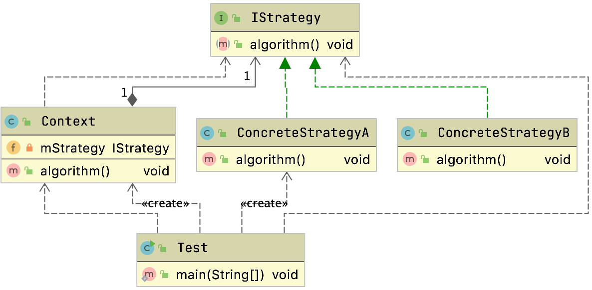
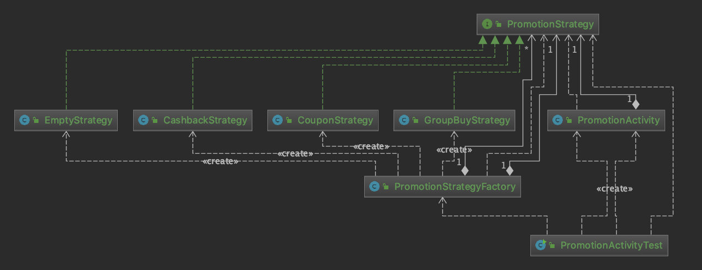
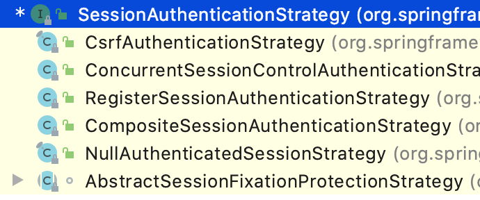

# 策略模式

​	能够帮助我们消除程序中大量的if else 和switch语句

​	能够消除程序中大量冗余代码和多重条件转移语句

​	是指定义了算法家族，分别封装起来，让他们之间可以相互替换，此模式让算法的变化不会影响到使用算法的用户。

## 通用类图



- Context上下文角色
  - 用来操作策略的上下文环境，屏蔽高层模块对策略，算法的直接访问，封装可能存在的变化
- 抽象策略角色Strategy
  - 规定策略或者算法的行为
- 具体策略角色ConcreteStrategy
  - 具体的策略或者算法实现

```java
public class Context {
  private IStrategy mStrategy;

  public Context(IStrategy strategy) {
    this.mStrategy = strategy;
  }

  public void algorithm() {
    this.mStrategy.algorithm();
  }
}
```

## 案例

​	购买商品有多种优惠：

- 无优惠
- 现金优惠
- 拼团优惠

### 首先定义接口

```java
public interface PromotionStrategy {
    void doPromotion();
}
```

### 团购优惠

```java
public class GroupBuyStrategy implements PromotionStrategy {

    public void doPromotion() {
        System.out.println("组团，满20人成团");
    }
}
```

### 无优惠

```java
public class EmptyStrategy implements PromotionStrategy {

    public void doPromotion() {
        System.out.println("无优惠");
    }
}
```

### 购物券优惠

```java
public class CouponStrategy implements PromotionStrategy {
    public void doPromotion() {
        System.out.println("优惠券");
    }
}
```

### 优惠活动

```java
public class PromotionActivity {
    PromotionStrategy promotionStrategy;

    public PromotionActivity(PromotionStrategy promotionStrategy) {
        this.promotionStrategy = promotionStrategy;
    }

    public void execute() {
        promotionStrategy.doPromotion();
    }
}
```

### 测试

```java
public class PromotionActivityTest {
    public static void main(String[] args) {
        PromotionActivity promotionActivity = null;
        String promotionKey = "COUPON";
        if (StringUtils.equals(promotionKey, "COUPON")) {
            promotionActivity = new PromotionActivity(new CouponStrategy());
        } else if (StringUtils.equals(promotionKey, "CASH")) {
            promotionActivity = new PromotionActivity(new CashbackStrategy());
        }
        promotionActivity.execute();
    }

}
```

可以看到这种方式只能使用一次，因为我们往往需要根据不同的需求对促销策略进行动态选择，并不会一次性执行多种优惠

#### 上述方式封装改为工厂方法

```java
public class PromotionStrategyFactory {

    private static Map<String, PromotionStrategy> PROMOTION_STRATEGY_MAP = new HashMap<>();

    static {
        PROMOTION_STRATEGY_MAP.put(PromotionKey.COUPON, new CouponStrategy());
        PROMOTION_STRATEGY_MAP.put(PromotionKey.CASHBACK, new CashbackStrategy());
        PROMOTION_STRATEGY_MAP.put(PromotionKey.GROUPBUY, new GroupBuyStrategy());
    }

    private static final PromotionStrategy NON_PROMOTIO = new EmptyStrategy();

    public static PromotionStrategy getPromotionStrategy(String promotionKey) {
        PromotionStrategy promotionStrategy = PROMOTION_STRATEGY_MAP.get(promotionKey);

        return promotionStrategy == null ? NON_PROMOTIO : promotionStrategy;

    }

    private interface PromotionKey {
        String COUPON = "COUPON";
        String CASHBACK = "CASHBACK";
        String GROUPBUY = "GROUPBUY";
    }
}
```

测试类使用

```java
public static void main(String[] args) {
    PromotionStrategy promotionStrategy = PromotionStrategyFactory.getPromotionStrategy("COUPON");
    PromotionActivity promotionActivity = new PromotionActivity(promotionStrategy);
    promotionActivity.execute();

}
```

## 类图



## 源码中的体现

### Comparator接口

​	

Comparator抽象下面有很多的实现类，我们经常把他作为参数作为排序策略例如

#### Arrays#parallelSort

`java.util.Arrays#parallelSort(T[], java.util.Comparator<? super T>)`

```java
public static <T> void parallelSort(T[] a, Comparator<? super T> cmp) {
  if (cmp == null)
    cmp = NaturalOrder.INSTANCE;
  int n = a.length, p, g;
  if (n <= MIN_ARRAY_SORT_GRAN ||
      (p = ForkJoinPool.getCommonPoolParallelism()) == 1)
    TimSort.sort(a, 0, n, cmp, null, 0, 0);
  else
    new ArraysParallelSortHelpers.FJObject.Sorter<T>
    (null, a,
     (T[])Array.newInstance(a.getClass().getComponentType(), n),
     0, n, 0, ((g = n / (p << 2)) <= MIN_ARRAY_SORT_GRAN) ?
     MIN_ARRAY_SORT_GRAN : g, cmp).invoke();
}
```

#### TreeMap的构造方法

```java
public TreeMap(Comparator<? super K> comparator) {
  this.comparator = comparator;
}
```

## Spring 的Resources接口

-  WritableResource,
-  ContextResource
-  UrlResource
-  ClassPathResource
-  FileSystemResource
-  PathResource
-  ByteArrayResource
-  InputStreamResource

我们常常使用它的子类来做对应的资源处理

## Spring Security 会话校验策略

在Spring Security 对于Session校验逻辑在这里

`org.springframework.security.web.session.SessionManagementFilter#doFilter`

过滤器中会通过会话校验策略来做鉴权

```java
		if (!securityContextRepository.containsContext(request)) {
			Authentication authentication = SecurityContextHolder.getContext()
					.getAuthentication();

			if (authentication != null && !trustResolver.isAnonymous(authentication)) {
				// The user has been authenticated during the current request, so call the
				// session strategy
				try {
					sessionAuthenticationStrategy.onAuthentication(authentication,
							request, response);
				}
				catch (SessionAuthenticationException e) {
					// The session strategy can reject the authentication
					logger.debug(
							"SessionAuthenticationStrategy rejected the authentication object",
							e);
					SecurityContextHolder.clearContext();
					failureHandler.onAuthenticationFailure(request, response, e);

					return;
				}
				// Eagerly save the security context to make it available for any possible
				// re-entrant
				// requests which may occur before the current request completes.
				// SEC-1396.
				securityContextRepository.saveContext(SecurityContextHolder.getContext(),
						request, response);
			}
```

可以看到`sessionAuthenticationStrategy`的实现有多种



我们可以选择对应的会话校验逻辑来做会话的校验

> 策略最终都只能选择一个策略来执行
>
> 他是特殊的委派模式


## 总结

### 适用场景

- 如果系统中有有很多类，他们的区别仅仅在于他们的行为不同。

- 一个系统需要动态的在几种算法中选择一种
- 需要屏蔽算法规则的场景


### 优点

- 能够避免使用多重条件转移语句
  - 如if else switch语句
- 使用策略模式可以提高算法的保密性和安全性
- 算法可以自由替换
- 扩展性良好
  - 符合开闭原则

### 缺点

- `客户端必须知道所有策略`，并自行决定使用哪一个策略类
- 代码中会产生很多策略类，增加维护难度

## 问题

> 为什么还需要封装一个工厂来使用策略模式

- 通过工厂来获取具体的策略这样我们就能够多次去选择和使用策略
  - 我们通过工厂来记录当前有哪一些策略模式
  - 通过工厂我们每次创建新的策略不需要来改动过多的代码，并且能够让我们对扩展开发对修改关闭
- 策略模式有弊端，客户端必须知道所有策略，并且需要自己来决定使用哪一个策略


> 策略模式使用前提是什么？即满足什么条件你才能去选策略？真正用的时候需要告诉客户端什么

- 使用前提
  - 不同的类行为是不一样的
  - 客户端使用只会使用到其中一种策略
  - 需要屏蔽不同算法和算法之间的关系
- 客户端需要知道
  - 需要知道所有策略，并且需要自行选择其中一个