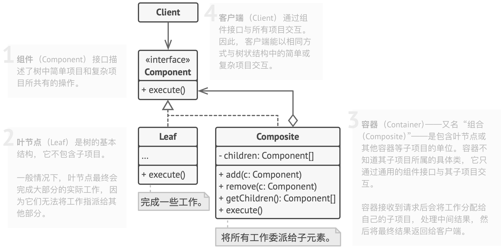
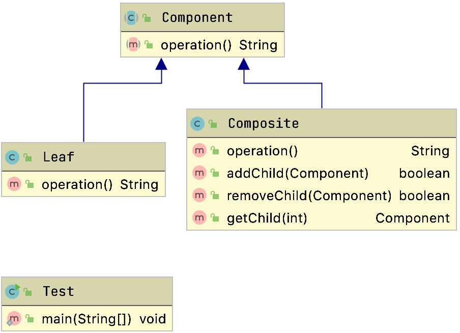
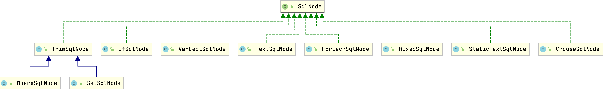

# 组合模式

## 定义

- 也称为
  - 整体部分模式
  - 也叫合成模式

宗旨是通过单个对象(叶子节点)和组合对象(树枝节点)用相同的接口进行表示

- 作用
  - 让客户端对单个对象和组合对象保持一致的方式处理

> 属于结构型模式

### 组合和聚合的区别

如果是心在一起就是一个团队，人在一起只是团伙

头和身体就是组合

- 学生和老师就是聚合
  - 没有相互的生命周期

## 生活中的案例

- 公司组织架构
- 电脑的文件管理

## 适用场景

- 如果我们希望客户端代码以相同方式处理简单和复杂元素，可以使用该模式
- 对象层次具备整体和部分，呈树形结构
  - 树形菜单
  - 操作系统目录结构
  - 公司组织架构

## 通用结构



### 透明写法

```java
public abstract class Component {
  protected String name;

  public Component(String name) {
    this.name = name;
  }

  public abstract String operation();

  public boolean addChild(Component component) {
    throw new UnsupportedOperationException("addChild not supported!");
  }

  public boolean removeChild(Component component) {
    throw new UnsupportedOperationException("removeChild not supported!");
  }

  public Component getChild(int index) {
    throw new UnsupportedOperationException("getChild not supported!");
  }
}
```

在抽象方法中属于根的方法都抛出异常，然后具体的根重写这个方法

```java
public class Composite extends Component {
    private List<Component> mComponents;

    public Composite(String name) {
        super(name);
        this.mComponents = new ArrayList<Component>();
    }

    @Override
    public String operation() {
        StringBuilder builder = new StringBuilder(this.name);
        for (Component component : this.mComponents) {
            builder.append("\n");
            builder.append(component.operation());
        }
        return builder.toString();
    }

    @Override
    public boolean addChild(Component component) {
        return this.mComponents.add(component);
    }

    @Override
    public boolean removeChild(Component component) {
        return this.mComponents.remove(component);
    }

    @Override
    public Component getChild(int index) {
        return this.mComponents.get(index);
    }
}
```

子节点不需要重写这个方法

```java
public class Leaf extends Component {

  public Leaf(String name) {
    super(name);
  }

  @Override
  public String operation() {
    return this.name;
  }
}
```

测试

```java
public class Test {
  public static void main(String[] args) {
    // 来一个根节点
    Component root = new Composite("root");
    // 来一个树枝节点
    Component branchA = new Composite("---branchA");
    Component branchB = new Composite("------branchB");
    // 来一个叶子节点
    Component leafA = new Leaf("------leafA");
    Component leafB = new Leaf("---------leafB");
    Component leafC = new Leaf("---leafC");

    root.addChild(branchA);
    root.addChild(leafC);
    branchA.addChild(leafA);
    branchA.addChild(branchB);
    branchB.addChild(leafB);

    String result = root.operation();
    System.out.println(result);

  }
}
```

#### 弊端

​	这种方式有个弊端，子节点拥有了自己并不需要关心的方法，并且一旦调用就会抛出异常，这个违背接口隔离原则和历史替换原则

#### 优点

客户端无需要判断是根节点还是数值节点，他们具备完全一致的接口

### 安全组合模式的写法



```java
public class Composite extends Component {
    private List<Component> mComponents;

    public Composite(String name) {
        super(name);
        this.mComponents = new ArrayList<Component>();
    }

    @Override
    public String operation() {
        StringBuilder builder = new StringBuilder(this.name);
        for (Component component : this.mComponents) {
            builder.append("\n");
            builder.append(component.operation());
        }
        return builder.toString();
    }


    public boolean addChild(Component component) {
        return this.mComponents.add(component);
    }


    public boolean removeChild(Component component) {
        return this.mComponents.remove(component);
    }


    public Component getChild(int index) {
        return this.mComponents.get(index);
    }

}
```

可以看到通过依赖的方式，来获取根节点和页节点,但是要求我们区分根节点和叶子节点

#### 安全写法的案例

在我们的电脑文件系统中有文件和文件夹所以我们可以使用安全组合模式来实现目录提供。

我们可以先定义顶层抽象类

```java
public abstract class Directory {

  protected String name;

  public Directory(String name) {
    this.name = name;
  }

  public abstract void show();

}
```

分别创建文件和目录

```java
public class File extends Directory {

  public File(String name) {
    super(name);
  }

  @Override
  public void show() {
    System.out.println(this.name);
  }

}
```


```java
public class Folder extends Directory {
  private List<Directory> dirs;

  private Integer level;

  public Folder(String name,Integer level) {
    super(name);
    this.level = level;
    this.dirs = new ArrayList<Directory>();
  }

  @Override
  public void show() {
    System.out.println(this.name);
    for (Directory dir : this.dirs) {
      //控制显示格式
      if(this.level != null){
        for(int  i = 0; i < this.level; i ++){
          //打印空格控制格式
          System.out.print("  ");
        }
        for(int  i = 0; i < this.level; i ++){
          //每一行开始打印一个+号
          if(i == 0){ System.out.print("+"); }
          System.out.print("-");
        }
      }
      //打印名称
      dir.show();
    }
  }

  public boolean add(Directory dir) {
    return this.dirs.add(dir);
  }

  public boolean remove(Directory dir) {
    return this.dirs.remove(dir);
  }

  public Directory get(int index) {
    return this.dirs.get(index);
  }

  public void list(){
    for (Directory dir : this.dirs) {
      System.out.println(dir.name);
    }
  }

}
```

目录还增加了list方法，并且实现了对应的show方法

##### 测试

```java
class Test {
  public static void main(String[] args) {

    System.out.println("============安全组合模式===========");

    File qq = new File("抖音.exe");
    File wx = new File("QQ.exe");

    Folder office = new Folder("办公软件",2);

    File word = new File("Word.exe");
    File ppt = new File("PowerPoint.exe");
    File excel = new File("Excel.exe");

    office.add(word);
    office.add(ppt);
    office.add(excel);

    Folder wps = new Folder("金山软件",3);
    wps.add(new File("WPS.exe"));
    office.add(wps);

    Folder root = new Folder("根目录",1);
    root.add(qq);
    root.add(wx);
    root.add(office);

    System.out.println("----------show()方法效果-----------");
    root.show();

    System.out.println("----------list()方法效果-----------");
    root.list();
    /**
      * Folder是集合，添加了集合独特的方法，而这个File就不具备这个方法<br>
      */
  }
}
```

可以看到安全模式的好处就是借口定义职责清晰。

符合单一职责原则，借口隔离原则

但是客户需要区分根节点和叶子节点。

但是客户端无法依赖抽象，违背了依赖导致原则

## 源码中的使用

### HashMap

```java
public void putAll(Map<? extends K, ? extends V> m) {
  for (Map.Entry<? extends K, ? extends V> e : m.entrySet())
    put(e.getKey(), e.getValue());
}
```

putAll中传入的是Map对象，Map就是一个抽象组件，HashMap中的Node节点就是对应的叶子节点

### ArrayList

```java
public boolean addAll(Collection<? extends E> c) {
  boolean modified = false;
  for (E e : c)
    if (add(e))
      modified = true;
  return modified;
}
```

ArrayList中也符合部分和整体的关系。

### Mybatis

SqlNode



`org.apache.ibatis.scripting.xmltags.XMLScriptBuilder#parseScriptNode`

可以看到

```java
public SqlSource parseScriptNode() {
  List<SqlNode> contents = parseDynamicTags(context);
  MixedSqlNode rootSqlNode = new MixedSqlNode(contents);
  SqlSource sqlSource = null;
  if (isDynamic) {
    sqlSource = new DynamicSqlSource(configuration, rootSqlNode);
  } else {
    sqlSource = new RawSqlSource(configuration, rootSqlNode, parameterType);
  }
  return sqlSource;
}
```

在解析

节点的时候

```java
List<SqlNode> parseDynamicTags(XNode node) {
  List<SqlNode> contents = new ArrayList<SqlNode>();
  NodeList children = node.getNode().getChildNodes();
  for (int i = 0; i < children.getLength(); i++) {
    XNode child = node.newXNode(children.item(i));
    if (child.getNode().getNodeType() == Node.CDATA_SECTION_NODE || child.getNode().getNodeType() == Node.TEXT_NODE) {
      String data = child.getStringBody("");
      TextSqlNode textSqlNode = new TextSqlNode(data);
      if (textSqlNode.isDynamic()) {
        contents.add(textSqlNode);
        isDynamic = true;
      } else {
        contents.add(new StaticTextSqlNode(data));
      }
    } else if (child.getNode().getNodeType() == Node.ELEMENT_NODE) { // issue #628
      String nodeName = child.getNode().getNodeName();
      NodeHandler handler = nodeHandlers(nodeName);
      if (handler == null) {
        throw new BuilderException("Unknown element <" + nodeName + "> in SQL statement.");
      }
      handler.handleNode(child, contents);
      isDynamic = true;
    }
  }
  return contents;
}
```


```java
public class MixedSqlNode implements SqlNode {
  private List<SqlNode> contents;

  public MixedSqlNode(List<SqlNode> contents) {
    this.contents = contents;
  }

  @Override
  public boolean apply(DynamicContext context) {
    for (SqlNode sqlNode : contents) {
      sqlNode.apply(context);
    }
    return true;
  }
}
```

可以看到MixedSqlNode就是对应的树枝构建，SqlNode就是抽象构建角色

# 总结

## 优点

- 清楚的定义分层次的复杂对象，表示对象的整体或者部分
- 让客户端忽略了层次的差异，方便对整个结构层次进行控制
  - 一棵树中的所有节点都是`Component`，局部和整体对调用者来说没有任何区别
  - 高层不需要关心自己处理的是单个对象还是整个组合结构
- 简化客户端代码
- 节点能够自由增加
- 符合开闭原则

## 缺点

- 限制类型时会较为复杂
- 让设计变得更加抽象
- 直接使用了实现类
  - 违背了依赖导致原则

## 问题

> 怎么理解客户端对单个对象和组合对象保持一致的方式处理

- 都是面向抽象编程，所有的根节点和子节点都有共同的抽象角色构建
  - 所以操作方式都是相同的方式

> 组合模式透明方式是怎么违背最少知道原则的

组合模式透明方式因为是通过继承，所以子类其实也获得了很多本来自己所不需要关心的属性。