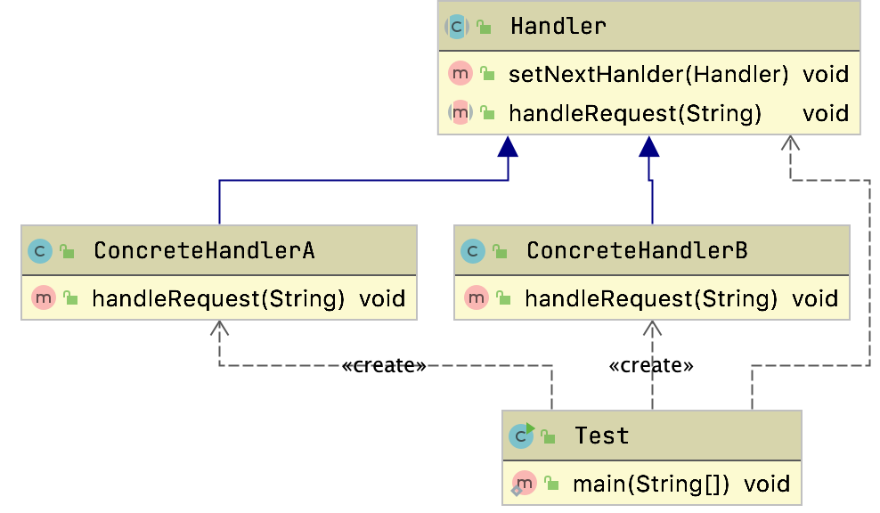

# 责任链模式

## 定义

把链中每一个节点看做一个对象，每个节点处理的请求都不一样。

内部自动维护一个下一个节点对象。

当一个请求从链的请求首段发出的时候，会沿着链的路径一次传递给每一个节点对象，直到某个对象就结束。

行为模式

## 生活中的场景

- 生活中的审批流程
- 部门的申请

## 适用场景

- 多个对象可以处理同一个请求，单具体由那个对象处理则在运动时动态决定
- 在不明白知道你个接受者的情况下，向多个对象中的一个提交一个请求
- 可以动态指定一组对象处理请求

## 通用类图



可以看到责任链主要包含两种角色：

- Handler
  - 抽象处理者
    - 定义一个请求处理的方法，并且维护一个下一个处理节点Handler的引用
- ConcreteHandler
  - 具体处理者
    - 对请求进行处理，如果不感兴趣，则进行转发

```java
public class Test {
  public static void main(String[] args) {
    Handler handlerA = new ConcreteHandlerA();
    Handler handlerB = new ConcreteHandlerB();
    handlerA.setNextHanlder(handlerB);
    handlerA.handleRequest("requestB");
  }
}
```


### 责任链模式和建造者模式一起使用

可以看到上述每次需要自己来new对应的Handler链路较长的时候，我们使用会非常繁琐，可以通过建造者模式，自动链式组装

> 参考AQS
>
> ```java
> private Node enq(final Node node) {
> for (;;) {
>  Node t = tail;
>  if (t == null) { // Must initialize
>    if (compareAndSetHead(new Node()))
>      tail = head;
>  } else {
>    node.prev = t;
>    if (compareAndSetTail(t, node)) {
>      t.next = node;
>      return t;
>    }
>  }
> }
> }
> ```
>
> 

```java
public abstract class Handler<T> {
  protected Handler next;
  public void next(Handler next){ this.next = next;}

  public abstract void doHandler(Member member);

  public static class Builder<T>{
    private Handler<T> head;
    private Handler<T> tail;

    public Builder<T> addHandler(Handler handler){
      //            do {
      if (this.head == null) {
        this.head = this.tail = handler;
        return this;
      }
      this.tail.next(handler);
      this.tail = handler;
      //            }while (false);//真正框架中，如果是双向链表，会判断是否已经到了尾部
      return this;
    }

    public Handler<T> build(){
      return this.head;
    }

  }
}
```

修改上述代码变成了这样

```java
public class Test {
  public static void main(String[] args) {
    Handler handler=  new Handler.
      Builder().
      addHandler(new ConcreteHandlerA()).
      addHandler(new ConcreteHandlerB()).build();

    handler.handleRequest("requestB");
  }
}
```

Netty pipline

## 源码中的体现

### FilterChain

```java
public interface FilterChain {

  public void doFilter(ServletRequest request, ServletResponse response) throws IOException, ServletException;
}
```

我们可以通过FilterChain来对请求做过滤

```java
public class MockFilterChain implements FilterChain {

  public void doFilter(ServletRequest request, ServletResponse response) throws IOException, ServletException {
    Assert.notNull(request, "Request must not be null");
    Assert.notNull(response, "Response must not be null");
    Assert.state(this.request == null, "This FilterChain has already been called!");

    if (this.iterator == null) {
      this.iterator = this.filters.iterator();
    }

    if (this.iterator.hasNext()) {
      Filter nextFilter = this.iterator.next();
      nextFilter.doFilter(request, response, this);
    }

    this.request = request;
    this.response = response;
  }
}
```

例如MockFilterChain,请求一个一个来执行

> 通过线程分发，processor这样能够快速处理，见并发编程

### Netty Pipline

可以看到Dubbo对于netty的使用

`org.apache.dubbo.remoting.transport.netty4.NettyServer#doOpen`

```java
protected void doOpen() throws Throwable {
  bootstrap = new ServerBootstrap();

  bossGroup = NettyEventLoopFactory.eventLoopGroup(1, "NettyServerBoss");
  workerGroup = NettyEventLoopFactory.eventLoopGroup(
    getUrl().getPositiveParameter(IO_THREADS_KEY, Constants.DEFAULT_IO_THREADS),
    "NettyServerWorker");

  final NettyServerHandler nettyServerHandler = new NettyServerHandler(getUrl(), this);
  channels = nettyServerHandler.getChannels();

  bootstrap.group(bossGroup, workerGroup)
    .channel(NettyEventLoopFactory.serverSocketChannelClass())
    .option(ChannelOption.SO_REUSEADDR, Boolean.TRUE)
    .childOption(ChannelOption.TCP_NODELAY, Boolean.TRUE)
    .childOption(ChannelOption.ALLOCATOR, PooledByteBufAllocator.DEFAULT)
    .childHandler(new ChannelInitializer<SocketChannel>() {
      @Override
      protected void initChannel(SocketChannel ch) throws Exception {
        // FIXME: should we use getTimeout()?
        int idleTimeout = UrlUtils.getIdleTimeout(getUrl());
        NettyCodecAdapter adapter = new NettyCodecAdapter(getCodec(), getUrl(), NettyServer.this);
        if (getUrl().getParameter(SSL_ENABLED_KEY, false)) {
          ch.pipeline().addLast("negotiation",
                                SslHandlerInitializer.sslServerHandler(getUrl(), nettyServerHandler));
        }
        ch.pipeline()
          .addLast("decoder", adapter.getDecoder())
          .addLast("encoder", adapter.getEncoder())
          .addLast("server-idle-handler", new IdleStateHandler(0, 0, idleTimeout, MILLISECONDS))
          .addLast("handler", nettyServerHandler);
      }
    });
  // bind
  ChannelFuture channelFuture = bootstrap.bind(getBindAddress());
  channelFuture.syncUninterruptibly();
  channel = channelFuture.channel();

}
```

我们可以通过`pipeline().addLast()`一直调用追加对应的Handler，查看他的设计

`io.netty.channel.DefaultChannelPipeline#addLast(io.netty.util.concurrent.EventExecutorGroup, java.lang.String, io.netty.channel.ChannelHandler)`

```java
private void addLast0(AbstractChannelHandlerContext newCtx) {
  AbstractChannelHandlerContext prev = tail.prev;
  newCtx.prev = prev;
  newCtx.next = tail;
  prev.next = newCtx;
  tail.prev = newCtx;
}
```

实际上在内部维护了一个双向链表，在处理的时候也会严重这个链表一直往下传递

## 优缺点

### 优点

- 请求和处理解耦
- 请求矗立着只需要关注自己感兴趣的请求进行处理就行了，对于不感兴趣的请求，直接转发给下一级节点对象
- 具备链式传递处理请求功能，请求发送者不需要知道链路结构，只需要等待请求处理结果
- 链路结构灵活，可以通过改变链路结构动态的新增或者删减责任链
- 易于扩展新的请求处理类，符合开闭原则

### 缺点

- 责任链过长，影响整体性能
  - 每个请求都是从链头到链尾，特别是在链路非常长的时候，性能是一个很大的问题
- 调试非常不方便，尤其是链路比较长的时候，环节比较多的时候，因为采用了类似于递归的方式
  - 调试的时候逻辑比较复杂
- 如果节点存在循环引用，容易造成死循环，系统崩溃

> 权限校验中，大量使用责任链
>
> Spring Security ,Shiro

## 注意事项

- 链路中的节点数量需要控制，要避免出现超长链的情况
  - 一般是在Handler中设置一个最大节点数量，在`setNext`的时候判断是否超过阈值，超过则不允许建立，避免无意识破坏系统性能