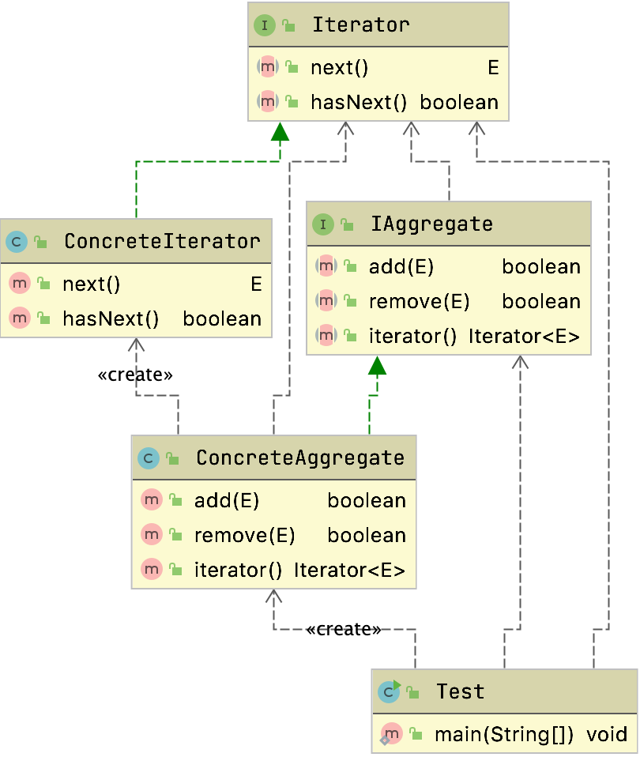
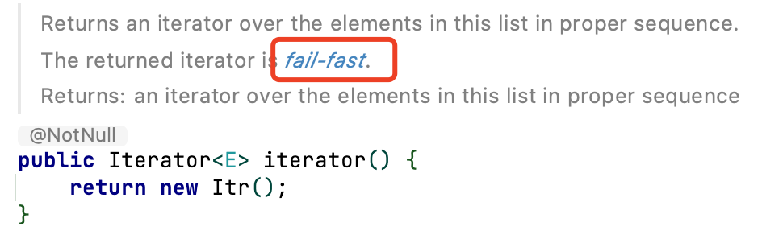

# 迭代器模式

## 定义

- 迭代器模式又称为游标模式
- 它提供一种方法访问一个容器对象中各个元素,而又不需暴露该对象的内部细节本质
  - 什么是容器，能够容纳对象的所有类型的都可以称为容器
    - Collection集合类型
    - Set类型
    - 等
- 抽离集合对象迭代行为到迭代器中，提供一致的访问接口

> 组合模式也是为了提供一致的访问接口，关心整体和个体一致

属于行为型模式

## 生活中的例子

- 快递迭代分发
- 刷脸刷票进展

## 适用场景

1. 访问一个集合对象的内容不需要暴露他的内部表示
2. 为遍历不同的集合结构提供统一的方式


## 通用结构



### 角色说明

#### Iterator抽象迭代器

​	抽象迭代器负责定义访问和遍历元素的接口,而且基本上是有固定的两个方法

- next
- hasNext(判断是否已经访问到底部

```java
public interface Iterator<E> {

    E next();

    boolean hasNext();
}
```


#### ConcreteIterator具体迭代器

迭代器的实现，主要用来完成容器元素的遍历

```java
public class ConcreteIterator<E> implements Iterator<E> {
  private List<E> list;
  private int cursor = 0;

  public ConcreteIterator(List<E> list) {
    this.list = list;
  }


  public E next() {
    return this.list.get(this.cursor ++);
  }


  public boolean hasNext() {
    return this.cursor < this.list.size();
  }
}
```


#### Aggregate抽象容器

​	容器角色负责提供创建具体迭代器角色的接口

`iterator`

```java
public interface IAggregate<E> {
  boolean add(E element);

  boolean remove(E element);

  Iterator<E> iterator();
}
```


#### Concrete Aggregate具体容器

​	具体容器实现容器接口定义的方法,创建出容纳迭代器的对象。

```java
public class ConcreteAggregate<E> implements IAggregate<E> {
  private List<E> list = new ArrayList<E>();

  public boolean add(E element) {
    return this.list.add(element);
  }

  public boolean remove(E element) {
    return this.list.remove(element);
  }

  public E get(int index)
  {
    return this.list.get(index);
  }

  public Iterator<E> iterator() {
    return new ConcreteIterator<E>(this.list);
  }

  public int size()
  {
    return list.size();
  }
}
```

测试

```java
public class Test {
    public static void main(String[] args) {
        //来一个容器对象
        IAggregate<String> aggregate = new ConcreteAggregate<String>();
        //添加元素
        aggregate.add("one");
        aggregate.add("two");
        aggregate.add("three");
        //获取容器对象迭代器
        Iterator<String> iterator = aggregate.iterator();
        //遍历
        while (iterator.hasNext()) {
            String element = iterator.next();
            System.out.println(element);
        }

    }
}
```


> 注意：开发系统时,迭代器的删除方法应该完成两个逻辑
>
> - 一是删除当前元素
> - 二是当前游标指向下一个元素

### 关于泛型的说明

上面看到了E大家肯定都有疑问

我们对大部分用到的泛型都列一下

- E
  - Element
  - 代表一个类型，具体是什么类型是在实现或者运行的时候觉得
- T
  - Type
  - 类的操作类型
- K
  - Key
- V
  - Value
- ?
  - 啥都行
  - <? extends IMember>

都是一样的，占位，不要做强制=转型

## 源码中的实现

### JDK中的Iterator

```java
public interface Iterator<E> {

  boolean hasNext();


  E next();

  default void remove() {
    throw new UnsupportedOperationException("remove");
  }

  default void forEachRemaining(Consumer<? super E> action) {
    Objects.requireNonNull(action);
    while (hasNext())
      action.accept(next());
  }
}
```


### ArrayList的迭代器

```java
private class Itr implements Iterator<E> {
  int cursor;       // index of next element to return
  int lastRet = -1; // index of last element returned; -1 if no such
  int expectedModCount = modCount;

  Itr() {}

  public boolean hasNext() {
    return cursor != size;
  }

  @SuppressWarnings("unchecked")
  public E next() {
    checkForComodification();
    int i = cursor;
    if (i >= size)
      throw new NoSuchElementException();
    Object[] elementData = ArrayList.this.elementData;
    if (i >= elementData.length)
      throw new ConcurrentModificationException();
    cursor = i + 1;
    return (E) elementData[lastRet = i];
  }

  public void remove() {
    if (lastRet < 0)
      throw new IllegalStateException();
    checkForComodification();

    try {
      ArrayList.this.remove(lastRet);
      cursor = lastRet;
      lastRet = -1;
      expectedModCount = modCount;
    } catch (IndexOutOfBoundsException ex) {
      throw new ConcurrentModificationException();
    }
  }
```

可以看到对应的迭代器实现了HasNext,next,remove方法

#### FailFast

看到ArrayList的iterator可以看到返回了迭代器`Itr`

```java
public Iterator<E> iterator() {
  return new Itr();
}
```



可以看到`java.util.ArrayList.Itr#next`，当i的长度大于当前ArrayList内部的数组的长度的时候就会抛出`ConcurrentModificationException`，那么什么情况才会这样呢，当我们在使用迭代器遍历的时候，容器的数据结构变更了，此时我们如果继续遍历很有可能出现问题，所以通过FailFast抛出异常来避免我们使用错误的数据结果

```java
public E next() {
  checkForComodification();
  int i = cursor;
  if (i >= size)
    throw new NoSuchElementException();
  Object[] elementData = ArrayList.this.elementData;
  if (i >= elementData.length)
    throw new ConcurrentModificationException();
  cursor = i + 1;
  return (E) elementData[lastRet = i];
}
```

测试代码如下

```java
public class FailFastTest {
  public static void main(String[] args) {
    ArrayList<Integer> lists = initList(10);

    Iterator<Integer> iterator = lists.iterator();
    int count = 0;
    while (iterator.hasNext()) {
      lists.remove(0);
      if (count == 3) {
      }
      System.out.println(iterator.next());
      count++;
    }
  }

  private static ArrayList<Integer> initList(int count) {
    ArrayList<Integer> list = new ArrayList<>();
    for (int i = 1; i < count; i++) {
      list.add(i);
    }
    return list;

  }
}
```

抛出异常

```log
Exception in thread "main" java.util.ConcurrentModificationException
at java.util.ArrayList$Itr.checkForComodification(ArrayList.java:909)
at java.util.ArrayList$Itr.next(ArrayList.java:859)
at com.zzjson.design.pattern.iterator.failfast.FailFastTest.main(FailFastTest.java:27)
```


### HashMap中的迭代器

```java
    final class KeyIterator extends HashIterator
        implements Iterator<K> {
        public final K next() { return nextNode().key; }
    }

    final class ValueIterator extends HashIterator
        implements Iterator<V> {
        public final V next() { return nextNode().value; }
    }

    final class EntryIterator extends HashIterator
        implements Iterator<Map.Entry<K,V>> {
        public final Map.Entry<K,V> next() { return nextNode(); }
    }
```


```java
abstract class HashIterator {
  public final boolean hasNext() {
    return next != null;
  }

  public final void remove() {
    Node<K,V> p = current;
    if (p == null)
      throw new IllegalStateException();
    if (modCount != expectedModCount)
      throw new ConcurrentModificationException();
    current = null;
    K key = p.key;
    removeNode(hash(key), key, null, false, false);
    expectedModCount = modCount;
  }
}
```


可以看到提供了三种迭代器都提供了next方法，`hasNext`和`remove`都是从父类中继承的

- 可以看到这也是模板方式的使用，设计模式不是固定用什么设计模式，而是取决于什么场景适用什么设计模式

### Mybatis DefaultCursor

可以看到Mybatis的内部类也提供了对应的迭代器

```java
private class CursorIterator implements Iterator<T> {


  T object;


  int iteratorIndex = -1;

  @Override
  public boolean hasNext() {
    if (object == null) {
      object = fetchNextUsingRowBound();
    }
    return object != null;
  }

  @Override
  public T next() {
    T next = object;

    if (next == null) {
      next = fetchNextUsingRowBound();
    }

    if (next != null) {
      object = null;
      iteratorIndex++;
      return next;
    }
    throw new NoSuchElementException();
  }

  @Override
  public void remove() {
    throw new UnsupportedOperationException("Cannot remove element from Cursor");
  }
}
```


## 优缺点

### 优点

- 多态迭代
- 简化集合对象接口
- 元素迭代功能多样化
- 解耦迭代和计划

### 缺点

数组，有序列表，使用迭代器方式遍历较为繁琐


> 日出开发中，我们几乎不会自己写迭代器，除非我们需要定制一个自己的数据结构对应的迭代器，否则，开源框架提供给我们的API完全够用