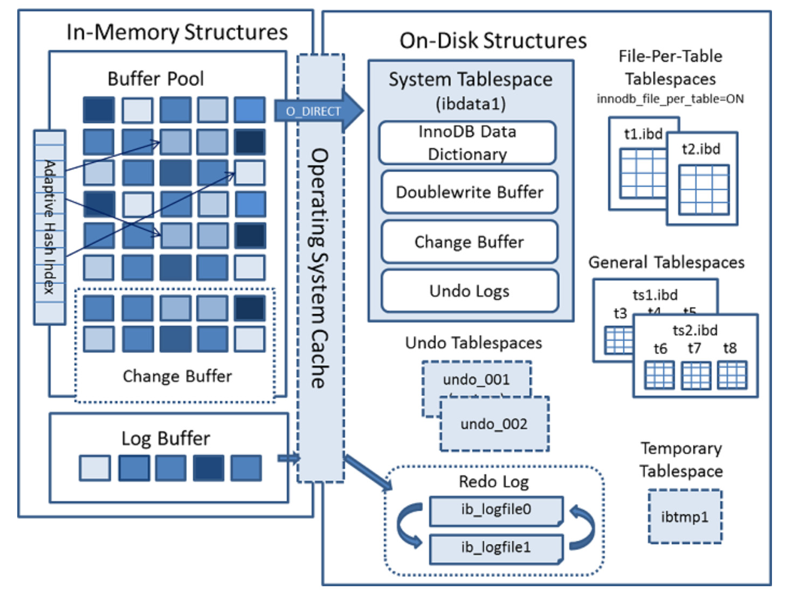
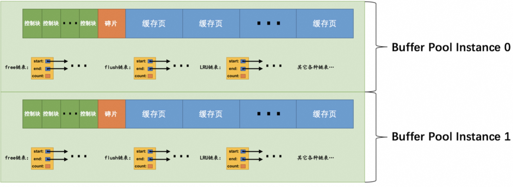
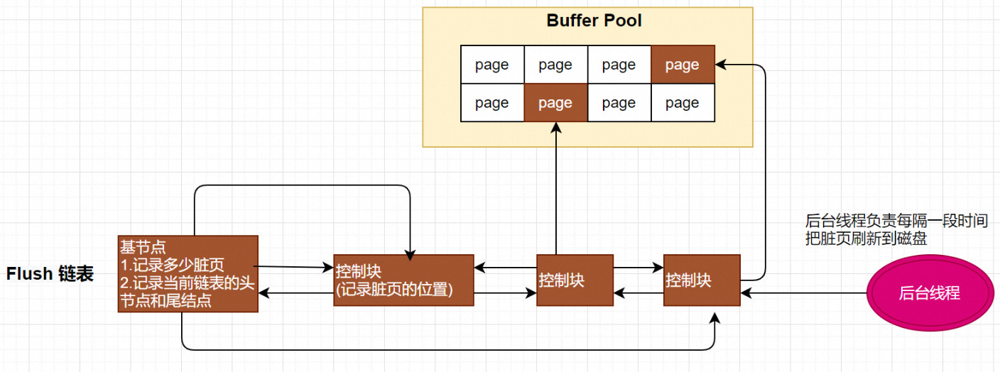
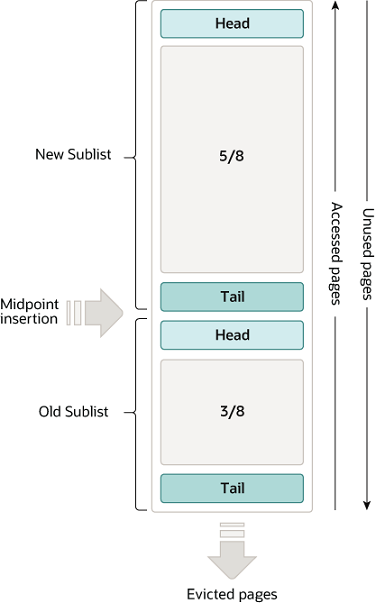
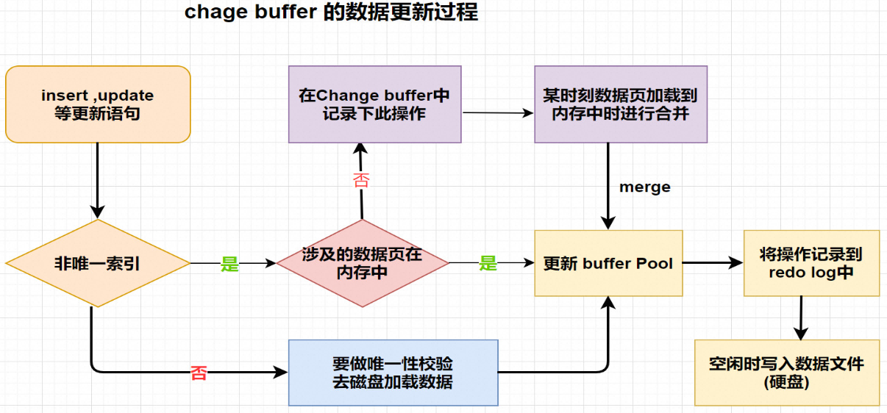
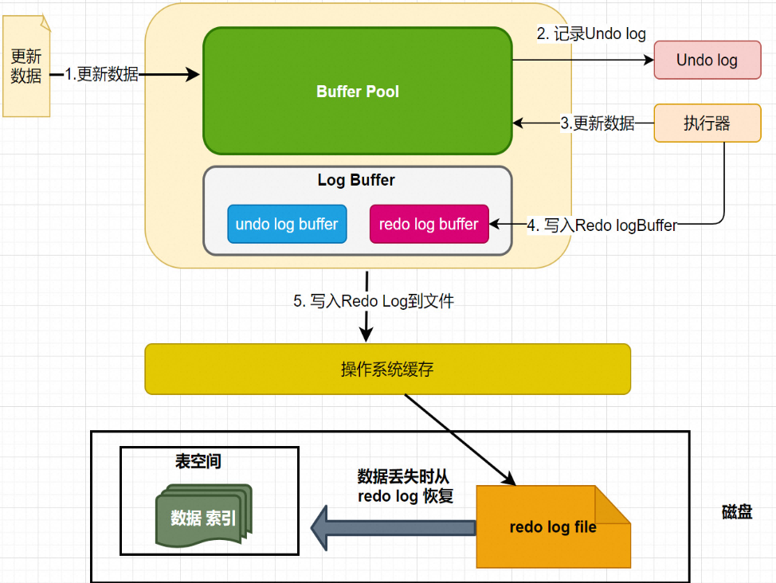
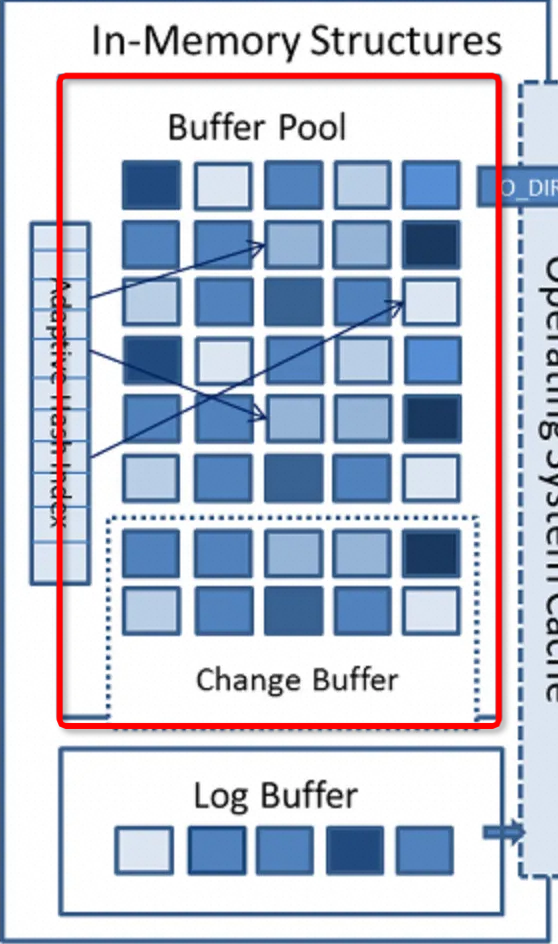

# 一、InnoDB 存储引擎原理&优化

从MySQL 5.5版本开始默认   使用InnoDB作为引擎，它擅长处理事务，具有自动崩溃恢复的特性，在日常开发中使用非常广泛。

下面是官方的InnoDB引擎架构图，主要分为 **内存结构** 和 **磁盘结构** 两大部分。



## 1.1 内存结构

-  **存储引擎选择：** InnoDB 是 MySQL 数据库的一种存储引擎，它采用了一系列优化策略来提高数据访问速度和性能。 
-  **磁盘访问速度慢：** 由于磁盘的读写速度相对较慢，直接从磁盘读取数据会导致较高的延迟。 
-  **页级缓存：** InnoDB 存储引擎使用了页级缓存（Buffer Pool）来缓存数据页，减少对磁盘的频繁访问。 
-  **完整页加载：** 当需要访问某个页的数据时，InnoDB 将整个页的数据加载到内存中。即使只需要访问页中的一条记录，也需要将整个页加载到内存中。 
-  **缓存机制：** 加载到内存中的页被缓存起来，以便将来再次访问时可以避免磁盘 IO 开销。 
-  **延迟释放：** InnoDB 不会立即释放页对应的内存空间，而是将其缓存起来。这样，当有请求再次访问该页面时，可以直接从内存中获取数据，避免了再次进行磁盘 IO 操作。 

### 1.1.1 BufferPool

 [BufferPool 官方文档地址](https://dev.mysql.com/doc/refman/8.3/en/innodb-buffer-pool.html)

#### 1.1.1.1  什么是 Buffer Pool

-  **Buffer Pool 概述：** 

- Buffer Pool 是 InnoDB 存储引擎用于缓存磁盘中页的内存区域，它的大小直接影响数据库的性能。

-  **默认大小和调整：** 

- 默认情况下，Buffer Pool 的大小为 128MB，但可以根据服务器配置和需求进行调整。
- 通过设置 MySQL 服务器配置文件中的 `innodb_buffer_pool_size` 参数来指定 Buffer Pool 的大小。

-  **配置示例：** 

- 举例：如果服务器有 512GB 内存，可以将数百GB分配给 Buffer Pool，以提高数据库读取性能。
- 可在配置文件中设置 `innodb_buffer_pool_size` 参数，单位为字节。例如：

```sql
[server]
innodb_buffer_pool_size = 268435456

SHOW VARIABLES LIKE 'innodb_buffer_pool_size%';

[server]
innodb_buffer_pool_size = 51539607552
单位是字节
KB：51539607552 / 1024 = 50331648 KB
MB：51539607552 / (1024 * 1024) = 49152 MB
GB：51539607552 / (1024 * 1024 * 1024) = 48 GB
可以看到我们生产上使用了 48G 的 BufferPool ，当前机器规格是 32C64G
```

 

-  **最小值限制：** 

- Buffer Pool 的最小值为 5MB，如果设置的值小于 5MB，则会自动调整为 5MB。

-  **注意事项：** 

- 在配置 Buffer Pool 大小时，需要根据服务器内存资源和数据库性能需求进行权衡，以达到最佳性能和资源利用效率。

#### 1.1.1.2 内部组成


-  **Buffer Pool ：** 

- **作用： 缓冲池，简称BP。其作用是用来缓存表数据与索引数据，减少磁盘IO操作，提升效率**
- **内存结构： 控制块+碎片+缓存页**

- 控制块被存放到 Buffer Pool 的前边，用于管理每个缓存页的控制信息。
- 缓存页被存放到 Buffer Pool 的后边，用于存储实际的数据页内容。

-  **缓存页大小：** 默认情况下，Buffer Pool 中的缓存页大小和磁盘上默认的页大小都是 16KB。 
-  **控制块：** 

- **存储内容**： 存储着对应缓存页的所属的 表空间编号+页号+缓存页在 Buffer Pool 中的地址+链表节点信息+锁信息 等待
- **内存大小：** 每个缓存页对应的控制信息占用的内存大小是相同的，因此我们将每个页对应的控制信息称为一个控制块。控制块和缓存页是一一对应的关系。 

- **碎片**： 每一个控制块都对应一个缓存页，那在分配 足够多的控制块和缓存页后，可能剩余的那点儿空间不够一对控制块和缓存页的大小，用不到了。当然，如果你把 Buffer Pool 的大小设置的刚刚好的话，也可能不会产生 碎片 

注:Buffer Pool大小为128M指的就是**缓存页**的大小，控制块则一般占5%，所以每次会多申请6M的内存空间用于存放控制块

#### 1.1.1.3 缓存页的哈希处理

在 InnoDB 存储引擎中，Buffer Pool 是用于缓存磁盘中页的内存区域，它的管理对数据库的性能至关重要。

##### Buffer Pool 管理问题

- Buffer Pool 中的缓存页是用于存储磁盘中页的数据，但如何快速确定某个页是否已经在 Buffer Pool 中呢？
- 传统的方法是遍历 Buffer Pool 中的所有缓存页，这样效率较低，尤其是在大型数据库系统中。

##### 哈希表的应用

- **哈希表结构：** 我们可以利用哈希表来解决这个问题。将表空间号和页号作为键，缓存页作为值，创建一个哈希表。
- **快速查找：** 当需要访问某个页的数据时，我们可以通过哈希表快速查找对应的缓存页，而无需遍历整个 Buffer Pool。
- **存在缓存页：** 如果哈希表中存在对应的缓存页，则直接使用该缓存页中的数据，无需加载磁盘数据。
- **不存在缓存页：** 如果哈希表中不存在对应的缓存页，说明该页尚未加载到 Buffer Pool 中。此时，可以从 free 链表中选择一个空闲的缓存页，然后将磁盘中对应的页加载到该缓存页的位置。


- Key: 表空间号+数据页号
- Value： 对应的控制块

需要访问某个页的数据时，先从哈希表查询，如果不存在，就从 free 链表中选出一个空闲的缓冲页，把磁盘的页加载到缓冲页的位置

在 MySQL 中，确定一条数据的表空间号（tablespace ID）和页号（page number）通常是由 InnoDB 存储引擎来处理的。InnoDB 存储引擎使用了一种称为聚簇索引（clustered index）的结构来组织表中的数据，其中每个表都有一个主键索引（或称聚簇索引），主键索引的叶子节点就是数据页。

下面是确定一条数据的表空间号和页号的一般过程：

1. **索引访问：** 如果查询使用了主键或者唯一索引，那么 InnoDB 存储引擎可以直接定位到相应的数据页，跳过后续步骤。
2. **二级索引访问：** 如果查询使用了非主键索引，则首先通过非主键索引找到对应的主键值。
3. **根据主键值查找数据：** 使用主键值在主键索引上进行查找，定位到相应的数据页。
4. **页号和表空间号：** 一旦找到了数据页，InnoDB 可以从页头信息中提取表空间号和页号。通常，页头信息中包含了页号和表空间号，InnoDB 可以直接获取这些信息以确定数据的位置。

#### 1.1.1.4 多个 Buffer Pool 



##### Buffer Pool 实例化

Buffer Pool 是InnoDB向操作系统申请的一块连续的内存空间，用于缓存数据库页。在多线程环境下，访问Buffer Pool中的各种链表需要加锁处理。当Buffer Pool特别大且多线程并发访问量很高时，单一的Buffer Pool可能会影响请求处理速度。因此，我们可以将Buffer Pool拆分成若干个小的Buffer Pool实例，每个实例独立申请内存空间、管理链表等，以提高并发处理能力。

##### 配置实例数

在服务器启动时，可以通过设置`innodb_buffer_pool_instances`参数来指定Buffer Pool实例的个数。例如：

```sql
[server]
innodb_buffer_pool_instances = 8

我们生产上就使用了 8个 Buffer Pool 实例，其中每个实例都是独立的，互不影响。每个Buffer Pool实例占用的内存空间可以通过以下公式计算：
innodb_buffer_pool_size / innodb_buffer_pool_instances
```

即总共的Buffer Pool大小除以实例的个数，得到每个实例占用的大小。

##### 注意事项

- 当`innodb_buffer_pool_size`的值小于1GB时，设置多个实例是无效的，InnoDB会将`innodb_buffer_pool_instances`的值修改为1。
- 在Buffer Pool大小等于或大于1GB时，建议设置多个Buffer Pool实例。

通过以上方式，可以根据系统负载和并发访问情况，灵活配置Buffer Pool实例，提高数据库的并发处理能力。

#### 1.1.1.5 Buffer Pool Chunk

在MySQL 5.7.5之后，支持在服务器运行期间调整Buffer Pool大小，但是重新调整Buffer Pool大小会耗费大量时间，因为需要重新向操作系统申请内存空间并复制数据。

为了解决这个问题，MySQL引入了Buffer Pool Chunk的概念。一个Buffer Pool实例由若干个chunk组成，每个chunk代表一片连续的内存空间，包含缓存页与其对应的控制块。


##### 特点

- **动态调整**：在服务器运行期间可以以chunk为单位增加或减少内存空间，无需重新申请一大片内存并复制数据。
- **参数设置**：通过启动参数`innodb_buffer_pool_chunk_size`指定每个chunk的大小，默认为128M。
- **注意事项**：无法在服务器运行期间修改`innodb_buffer_pool_chunk_size`，因为重新调整chunk大小会耗费大量时间。

##### 为什么不能动态修改chunk大小？

修改`innodb_buffer_pool_chunk_size`会导致重新申请内存空间并复制数据，耗费大量时间。而且每个chunk的大小会比设置值大约5%，以确保有足够的内存空间存储缓存页与其对应的控制块。

通过Buffer Pool Chunk的机制，MySQL在运行期间可以更加灵活地调整Buffer Pool的大小，提高了性能和效率。

#### 关于InnoDB Buffer Pool的配置规则

- **规则概述**： 

- `innodb_buffer_pool_size`必须是`innodb_buffer_pool_chunk_size × innodb_buffer_pool_instances`的倍数，以确保每个Buffer Pool实例中包含的chunk数量相同。
- 若在服务器启动时，`innodb_buffer_pool_chunk_size × innodb_buffer_pool_instances`大于`innodb_buffer_pool_size`，则`innodb_buffer_pool_chunk_size`会被自动设置为`innodb_buffer_pool_size / innodb_buffer_pool_instances`的值。

###### 示例与解释

示例1：`innodb_buffer_pool_size = 8G`

```powershell
-- 启动MySQL服务器时的设置
mysqld --innodb-buffer-pool-size=8G --innodb-buffer-pool-instances=16

-- 查询当前配置
SHOW VARIABLES LIKE 'innodb_buffer_pool_size';
-- 输出：innodb_buffer_pool_size: 8589934592（8G）

-- 若设定的大小不是2G的整数倍，系统会将其调整为最接近的2G的整数倍
```

示例2：**innodb_buffer_pool_size = 9G**

```sql
-- 启动MySQL服务器时的设置
mysqld --innodb-buffer-pool-size=9G --innodb-buffer-pool-instances=16

-- 查询当前配置
SHOW VARIABLES LIKE 'innodb_buffer_pool_size';
-- 输出：innodb_buffer_pool_size: 10737418240（10G）

-- 若设定的大小不是2G的整数倍，系统会将其调整为最接近的2G的整数倍
```

示例3：**innodb_buffer_pool_size = 2G，innodb_buffer_pool_chunk_size = 256M**

```sql
-- 启动MySQL服务器时的设置
mysqld --innodb-buffer-pool-size=2G --innodb-buffer-pool-instances=16 --innodb-buffer-pool-chunk-size=256M

-- 查询当前配置
SHOW VARIABLES LIKE 'innodb_buffer_pool_size';
-- 输出：innodb_buffer_pool_size: 2147483648（2G）

SHOW VARIABLES LIKE 'innodb_buffer_pool_chunk_size';
-- 输出：innodb_buffer_pool_chunk_size: 134217728（128M）

-- 若chunk大小乘以实例数超过了设定的Buffer Pool大小，系统会自动调整chunk大小
-- 2*1024/16=128M
```

### 1.1.2 Page 管理机制

Buffer Pool 的底层采用链表数据结构管理Page。在InnoDB访问表记录和索引时会在Page页中缓存，以后使用可以减少磁盘IO操作，提升效率。

#### Page 页的分类


- free page ： **空闲page**，未被使用
- clean page：被使用page，**数据没有被修改过**
- dirty page：脏页，被使用page，数据被修改过，**页中数据和磁盘的数据**产生了不一致

#### Page 页如何管理

针对上述的三种各类型，InnoDB 通过三种链表结构来维护和管理

#### Free List

- **问题：** 当从磁盘上读取一个页到 Buffer Pool 中时，需要确定该页放置在哪个缓存页的位置，以及如何区分哪些缓存页是空闲的，哪些已被使用。
- **解决方案：** 利用控制块来记录缓存页的使用情况，并维护一个空闲链表（free链表）。
- **总结**： 空闲缓冲区，管理free page

##### 初始化过程

- 在 MySQL 服务器启动时，首先完成对 Buffer Pool 的初始化过程。
- 初始化过程包括向操作系统申请 Buffer Pool 的内存空间，并将其划分成若干对控制块和缓存页。

##### 空闲链表管理

- **空闲链表结构：** 将所有空闲的缓存页对应的控制块组成一个链表，即空闲链表。
- **初始化状态：** 刚完成初始化的 Buffer Pool 中，所有缓存页都是空闲的，因此每个缓存页对应的控制块都会被加入到空闲链表中。
- **空闲链表示意图：** 假设 Buffer Pool 可容纳的缓存页数量为 n，空闲链表的效果图如下所示：


-  **基节点:** 从图中可以看出，为了管理好 Free 链表使用了一个 基节点，它不记录缓存页信息(单独申请空间)，它里面就存放了free链表的头节点的地址，尾节点的地址，还有free链表里当前有多少个节点。

-  **内存分配：** 链表基节点的内存空间单独申请，不包含在为 Buffer Pool 申请的一大片连续内存空间之内。 
-  **内存占用：** 在 MySQL 5.7.21 版本中，每个基节点只占用 40 字节大小的内存空间。 

##### 空闲页的使用流程

- **空闲链表的使用：** 当需要从磁盘中加载一个页到 Buffer Pool 中时，我们从空闲链表中取一个空闲的缓存页。
- **填写控制块信息：** 将该缓存页对应的控制块的信息填写上，包括该页所在的表空间、页号等信息。
- **节点移除：** 将该缓存页对应的空闲链表节点从链表中移除，表示该缓存页已经被使用。

#### Flush List

- InnoDB引擎为了提高处理效率，在每次修改缓冲页后，并不是立刻把修改刷新到磁盘上，而是在未来的某个时间点进行刷新操作. 所以需要使用到flush链表存储脏页，凡是被修改过的缓冲页对应的控制块都会作为节点加入到flush链表.
- flush链表的结构与free链表的结构相似



注: 脏页不但存在于flush链表，也在LRU链表中，但是两种互不影响，LRU链表负责管理page的可用性和释放，而flush链表负责管理脏页的刷盘操作。

#### LRU List

Buffer Pool 对应的内存大小毕竟是有限的，如果需要缓存的页占用的内存大小超过了 Buffer Pool 大小，也就 是 free链表 中已经没有多余的空闲缓存页的时候岂不是很尴尬，发生了这样的事儿该咋办？

当然是把某些旧的缓存页从 Buffer Pool 中移除，然后再把新的页放进来 【数据淘汰策略】

淘汰的目标： 提高缓存命中率

##### 普通 LRU 算法

LRU = Least Recently Used（最近最少使用）: 就是末尾淘汰法，新数据从链表头部加入，释放空间时从末尾淘汰.


1. 当要访问某个页时，如果不在Buffer Pool，需要把该页加载到缓冲池,并且把该缓冲页对应的控制块作为节点添加到LRU链表的头部。
2. 当要访问某个页时，如果在Buffer Pool中，则直接把该页对应的控制块移动到LRU链表的头部
3. 当需要释放空间时,从最末尾淘汰

也就是说：只要我们使用到某个缓存页，就把该缓存页调整到 LRU链表 的头部，这样 LRU链表 尾部就是最近最少使用的缓存页

###### 普通LRU链表的优缺点

| 优点                                                         | 缺点                                                         |
| ------------------------------------------------------------ | ------------------------------------------------------------ |
| 所有最近使用的数据都在链表表头，最近未使用的数据都在链表表尾,保证热数据能最快被获取到。 | 如果发生全表扫描（比如：没有建立合适的索引 or 查询时使用select * 等），则有很大可能将真正的热数据淘汰掉. |

由于MySQL中存在预读机制，很多预读的页都会被放到LRU链表的表头。如果这些预读的页都没有用到的话，这样，会导致很多尾部的缓冲页很快就会被淘汰。

###### 普通 LRU 的问题：

情况一：InnoDB预读机制

- **线性预读**：当顺序访问某个区的页面超过`innodb_read_ahead_threshold 默认 56`值时，会异步读取下一个区的全部页面到Buffer Pool中。
- **随机预读**：当Buffer Pool中已缓存某个区的13个连续页面时，会异步读取本区所有页面到Buffer Pool。
- 预读可能导致缓存命中率下降，因为未使用的预读页面会占据LRU链表头部，导致常用页面被淘汰。

情况二：全表扫描查询

- 全表扫描意味着访问表中所有页，特别是对记录较多的表。
- 每次全表扫描会将所有页加载到Buffer Pool中，影响其他查询语句的性能。
- 频繁全表扫描会导致Buffer Pool中常用页被替换，降低缓存命中率。

解决方案：

1.  **调整预读参数**： 

- 合理设置`innodb_read_ahead_threshold`和`innodb_random_read_ahead`，避免过多预读或随机预读。
- 根据系统负载和查询模式动态调整参数值，以优化缓存利用率。

1.  **优化查询语句**： 

- 避免全表扫描，优化查询条件并建立合适的索引。
- 提高查询效率，减少对Buffer Pool的冲击，避免频繁替换常用页。

注意事项：

- 预读机制在某些情况下可能并不适用，需要根据实际情况进行调整。
- 查询语句的优化是提高缓存命中率的关键，需要结合索引和查询条件进行综合考虑。

##### 改进 LRU 算法




- InnoDB将LRU链表分成两半，即young区域和old区域。

- 一部分存储使用频率非常高的缓存页，所以这一部分链表也叫做 热数据 ，或者称 young区域 。 
- 另一部分存储使用频率不是很高的缓存页，所以这一部分链表也叫做 冷数据 ，或者称 old区域 。

- 这个划分成两截的比例可以通过系统变量`innodb_old_blocks_pct`来确定，表示old区域在LRU链表中所占的比例,默认是 37%

```sql
mysql> SHOW VARIABLES LIKE 'innodb_old_blocks_pct';
+-----------------------+-------+
| Variable_name | Value |
+-----------------------+-------+
| innodb_old_blocks_pct | 37 |
+-----------------------+-------+
```

1.  **针对预读的页面优化：** 

- 控制块会放到old区域的头部，使得预读到Buffer Pool却不进行后续访问的页面从old区域逐出，不影响young区域的频繁使用页面。

1.  **针对全表扫描的优化：** 

- 当进行全表扫描时，首次加载到Buffer Pool的页放到old区域头部，但后续访问会将页面放到young区域头部，使得高频率页面顶掉低频率页面。
- 设定一个时间间隔，如果页面的访问时间间隔小于该值，则页面不会从old区域移动到young区域的头部，否则移动到young区域头部。
- 这个时间间隔由系统变量`innodb_old_blocks_time`控制，单位为毫秒，默认为1000ms。

###### 基础优化参数

- `innodb_old_blocks_pct`：控制old区域在LRU链表中所占的比例，可以在启动时或者运行时设置。
- `innodb_old_blocks_time`：控制页面访问时间间隔，决定是否将页面从old区域移动到young区域的头部。


#### 刷新脏页到磁盘

后台线程定期将脏页刷新到磁盘，以确保数据持久化。刷新路径主要有两种：

1.  **LRU链表刷新（BUF_FLUSH_LRU）**： 

- 后台线程定期从LRU链表尾部开始扫描页面，数量由系统变量`innodb_lru_scan_depth`指定。
- 发现脏页时，将其刷新到磁盘。
- 目的是将部分冷数据刷新到磁盘，以释放内存空间。

1.  **Flush链表刷新（BUF_FLUSH_LIST）**： 

- 后台线程定期从flush链表中刷新部分页面到磁盘。
- 刷新速率取决于系统繁忙程度。
- 目的是根据系统负载情况将脏页刷新到磁盘。

在某些情况下，后台线程刷新脏页的速度较慢，导致用户线程在加载磁盘页到Buffer Pool时无可用缓存页。
此时，可能会尝试释放LRU链表尾部的未修改页面，或者同步刷新LRU链表尾部的一个脏页到磁盘。
这种刷新单个页面到磁盘的方式称为**BUF_FLUSH_SINGLE_PAGE**。


在系统特别繁忙时，可能出现用户线程批量刷新脏页的情况，这会严重降低处理速度，因为磁盘速度较慢。
这种情况通常发生在redo日志的checkpoint时，属于一种迫不得已的情况。

### 1.1.3 Change Buffer

#### Change Buffer基本概念

Change Buffer：写缓冲区,是针对**二级索引(辅助索引)** 页的更新优化措施。

作用: 在进行DML操作时，如果请求的是 辅助索引（非唯一键索引）没有在缓冲池 中时，并不会立刻将磁盘页加载到缓冲池，而是在CB记录缓冲变更，等未来数据被读取时，再将数据合并恢复到BP中。

ChangeBuffer占用BufferPool空间，默认占25%，最大允许占50%，可以根据读写 业务量来进行调整。参数innodb_change_buffer_max_size;


1. ChangeBuffer**用于存储SQL变更操作，比如Insert/Update/Delete等SQL语句**
2. ChangeBuffer中的每个变更操作都有其对应的数据页，并且该数据页未加载到缓存中；
3. 当ChangeBuffer中变更操作对应的数据页加载到缓存中后，InnoDB会把变更操作Merge到数据页上；
4. InnoDB会定期加载ChangeBuffer中操作对应的数据页到缓存中，并Merge变更操作；

#### Change Buffer更新流程

- 情况1: 对于唯一索引来说，需要将数据页读入内存，判断到没有冲突，插入这个值，语句执行结束；
- 情况2: 对于普通索引来说，则是将更新记录在 change buffer，流程如下:

1. 更新一条记录时，该记录在BufferPool存在，直接在BufferPool修改，一次内存操作。

1. 如果该记录在BufferPool不存在（没有命中），在不影响数据一致性的前提下，InnoDB 会将这些更新操作缓存在 change buffer 中不用再去磁盘查询数据，避免一次磁盘IO。
2. 当下次查询记录时，会将数据页读入内存，然后执行change buffer中与这个页有关的操作.通过这种方式就能保证这个数据逻辑的正确性。



**写缓冲区，仅适用于非唯一普通索引页，为什么？**

- 如果在索引设置唯一性，在进行修改时，InnoDB必须要做唯一性校验，因此必须查询磁盘，做一次IO操作。会直接将记录查询到BufferPool中，然后在缓冲池修改，不会在ChangeBuffer操作。

**什么情况下进行 merge ?**

将 change buffer 中的操作应用到原数据页，得到最新结果的过程称为**merge** change buffer，实际上它是可以持久化的数据。也就是说，change buffer 在内存中有拷贝，也会被写入到磁盘上,以下情况会进行持久化:

1. 访问这个数据页会触发 merge
2. 系统有后台线程会定期 merge。
3. 在数据库正常关闭（shutdown）的过程中，也会执行 merge 操作。

Change Buffer 的使用场景

- change buffer 的主要目的就是将记录的变更动作缓存下来,所以在merge发生之前应 当尽可能多的缓存变更信 息,这样 change buffer的优势发挥的就越明显.
- 应用场景: 对于写多读少的业务来说，页面在写完以后马上被访问到的概率比较小，此时 change buffer 的使用 效果最好。这种业务模型常见的就是账单类、日志类的系统。

#### Change Buffer VS 刷脏

| **特点** | **Change Buffer** | **刷脏（Flush）**                      |
| -------- | ----------------- | -------------------------------------- |
| 作用对象 | 对索引的修改操作  | 将内存中的脏数据写入磁盘上的数据文件中 |
| 操作对象 | 索引              | 数据页                                 |
| 触发条件 | 索引的修改        | 系统checkpoint、redo log写满等因素触发 |
| 性能影响 | 可提高写入性能    | 可能影响性能，特别是在高负载情况下     |

### 1.1.4 自适应哈希索引

https://developer.aliyun.com/article/1230086


#### 什么是自适应哈希索引？

自适应哈希索引是MySQL InnoDB存储引擎中的一种索引结构，用于加速查询。它根据查询模式和数据分布动态地调整自身的大小，以提高性能。


上图就是通过自适应哈希索引降低寻址的开销

#### 工作原理

1.  **动态调整大小：** 自适应哈希索引根据查询模式和数据分布动态调整自身的大小，使得常用的索引值在内存中，从而提高查询性能。 
2.  **统计信息：** InnoDB存储引擎通过监控每个索引值的访问频率来收集统计信息，根据统计信息动态调整哈希索引的大小。 
3.  **内存中的索引结构：** 自适应哈希索引主要存在于内存中，加速对索引列的查询，提高查询性能。 

#### 优势

1.  **减少磁盘IO：** 自适应哈希索引可以将常用的索引值保存在内存中，减少了磁盘IO操作，提高了查询性能。 
2.  **适应性强：** 根据查询模式和数据分布动态调整大小，适应性更强，能够适应不同的工作负载和数据分布情况。 
3.  **无需手动干预：** 自适应哈希索引不需要手动创建或调整，系统会根据实际情况自动管理索引的大小和结构。 

#### 注意事项

1.  **索引冲突：** 自适应哈希索引可能会出现哈希冲突，需要额外的处理机制来解决。 
2.  **适用范围：** 自适应哈希索引适用于频繁访问的索引列，对于很少被访问的列可能效果不明显。 
3.  **版本要求：** 自适应哈希索引是InnoDB存储引擎的特性，因此只能在使用InnoDB存储引擎的MySQL数据库中使用。 

### 1.1.5 Log Buffer

Log Buffer：日志缓冲区，用来保存要写入磁盘上log文件（Redo/Undo）的数据，日志缓冲区的内容定期刷新到磁盘log文件中。日志缓冲区满时会自动将其刷新到磁盘，当遇到BLOB或多行更新的大事务操作时，增加日志缓冲区可以节省磁盘I/O。

LogBuffer主要作用是: 用来优化每次更新操作之后都要写入redo log 而产生的磁盘IO问题.



LogBuffer空间满了，会自动写入磁盘。可以通过将innodb_log_buffer_size参数调大，减少磁盘IO频率

### 1.1.6 基本状态信息查看

```sql
SHOW ENGINE INNODB STATUS\G;

---

BUFFER POOL AND MEMORY
-----------------------

Total large memory allocated 52772732928    --- 总内存分配量 50.27GB
Dictionary memory allocated 1074343    --- 字典内存分配量 1.07MB
Buffer pool size   3145655    --- 缓冲池大小 3.15GB
Free buffers       2300029    --- 空闲缓冲池数量 2.30GB
Database pages     845626    --- 数据库页数 8.46百万个
Old database pages 311995    --- 老数据库页数 3.12万个
Modified db pages  61216    --- 修改过的数据库页数 6.12万个
Pending reads      0    --- 等待读取的页数 0
Pending writes: LRU 0, flush list 0, single page 0    --- 等待写入的页数: LRU 0, flush list 0, single page 0
Pages made young 4699, not young 0    --- 被标记为新的页面数 4.70万个，不是新的页面数 0
0.00 youngs/s, 0.00 non-youngs/s    --- 每秒新页面数 0.00，每秒非新页面数 0.00
Pages read 681453, created 164173, written 221582    --- 读取的页面数 6.81百万个，创建的页面数 1.64百万个，写入的页面数 2.21百万个
0.00 reads/s, 0.00 creates/s, 0.00 writes/s    --- 每秒读取的页面数 0.00，每秒创建的页面数 0.00，每秒写入的页面数 0.00
Buffer pool hit rate 1000 / 1000, young-making rate 0 / 1000 not 0 / 1000    --- 缓冲池命中率 100%，新页面生成率 0%，非新页面生成率 0%
Pages read ahead 0.00/s, evicted without access 0.00/s, Random read ahead 0.00/s    --- 预读取页面数 0.00/s，未访问就被驱逐数 0.00/s，随机预读取 0.00/s
LRU len: 845626, unzip_LRU len: 0    --- LRU链表长度 8.46百万个，解压LRU链表长度 0
I/O sum[0]:cur[0], unzip sum[0]:cur[0]    --- I/O总量 0:0，解压总量 0:0

INDIVIDUAL BUFFER POOL INFO
----------------------------

---BUFFER POOL 0

Buffer pool size   393168    --- 缓冲池大小 3.93GB
Free buffers       290082    --- 空闲缓冲池数量 2.90GB
Database pages     103086    --- 数据库页数 1.03亿个
Old database pages 38033    --- 老数据库页数 3.80万个
Modified db pages  8340    --- 修改过的数据库页数 8.34万个
Pending reads      0    --- 等待读取的页数 0
Pending writes: LRU 0, flush list 0, single page 0    --- 等待写入的页数: LRU 0, flush list 0, single page 0
Pages made young 617, not young 0    --- 被标记为新的页面数 617，不是新的页面数 0
0.00 youngs/s, 0.00 non-youngs/s    --- 每秒新页面数 0.00，每秒非新页面数 0.00
Pages read 83326, created 19760, written 27790    --- 读取的页面数 8.33万个，创建的页面数 1.98万个，写入的页面数 2.78万个
0.00 reads/s, 0.00 creates/s, 0.00 writes/s    --- 每秒读取的页面数 0.00，每秒创建的页面数 0.00，每秒写入的页面数 0.00
No buffer pool page gets since the last printout    --- 最近一次打印没有缓冲池页面
Pages read ahead 0.00/s, evicted without access 0.00/s, Random read ahead 0.00/s    --- 预读取页面数 0.00/s，未访问就被驱逐数 0.00/s，随机预读取 0.00/s
LRU len: 103086, unzip_LRU len: 0    --- LRU链表长度 1.03亿个，解压LRU链表长度 0
I/O sum[0]:cur[0], unzip sum[0]:cur[0]    --- I/O总量 0:0，解压总量 0:0
```


### 总结



1.  **磁盘速度与内存缓存**: 

   - 磁盘速度慢，使用内存作为缓存是必要的。

2.  **Buffer Pool 基本概念**: 

   - Buffer Pool 是 InnoDB 向操作系统申请的一段连续的内存空间，大小通过 `innodb_buffer_pool_size` 调整。

3.  **Buffer Pool 内存结构**: 

   - 包含控制块和缓存页，剩余空间可能会产生碎片。

4.  **链表管理**: 

   - 使用多个链表管理 Buffer Pool。

   - `free链表`：空闲的缓存页。

   - `flush链表`：存储被修改但未刷新到磁盘的脏页。

   - `LRU链表`：管理页面在内存中的访问频率和位置。

5.  **缓存页定位**: 

   - 使用表空间号 + 页号作为 key ，建立哈希表以快速定位缓存页。

6.  **脏页管理**: 

   - 被修改但未刷新到磁盘的页称为脏页，会被加入到 flush链表 中。

   1.  **LRU链表**: 

   - 分为 young 和 old 区域，可以通过参数调节。

   - 控制页面在内存中的淘汰和使用频率。

7.  **Buffer Pool 实例**: 

   - 通过 `innodb_buffer_pool_instances` 控制实例个数，各自独立管理。

8.  **动态调整**: 

   - MySQL 5.7.5 后可在运行中调整 Buffer Pool 大小。

   - 每个实例由多个 chunk 组成，大小通过启动参数调整。

9.  **查看状态信息**: 

   - 使用 `SHOW ENGINE INNODB STATUS\G` 查看 Buffer Pool 状态。