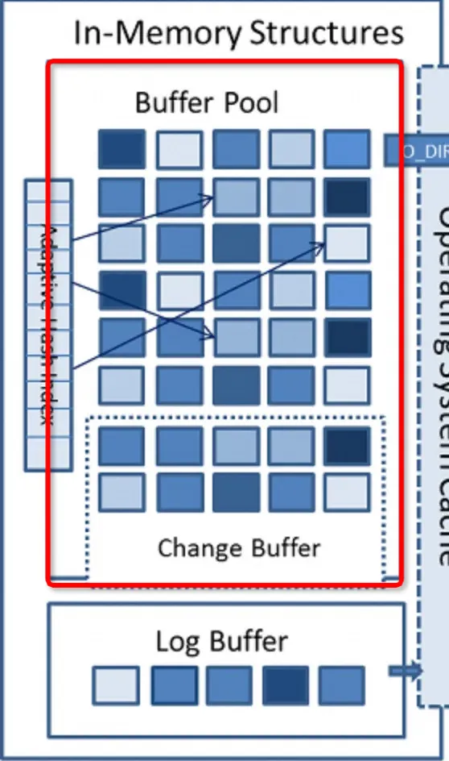
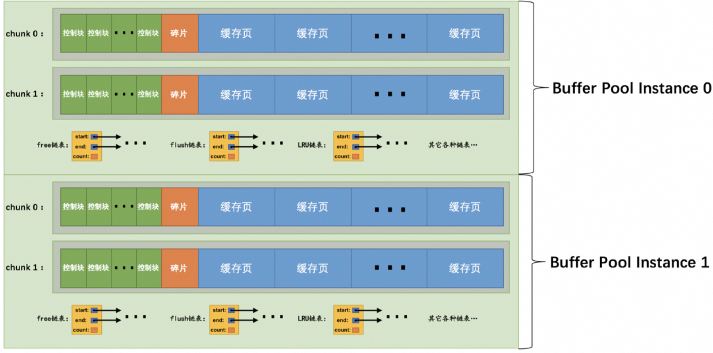

# 一、 BufferPool 基础介绍


 [BufferPool 官方文档地址](https://dev.mysql.com/doc/refman/8.3/en/innodb-buffer-pool.html)

## 1.1  Buffer Pool 是什么

Buffer Pool 是 InnoDB 存储引擎用于缓存磁盘中页的内存区域，它的大小直接影响数据库的性能。

- **作用**： 其作用是用来缓存表数据与索引数据，减少磁盘IO操作，提升效率
- **默认大小和调整：** 
  - 默认情况下，Buffer Pool 的大小为 128MB，但可以根据服务器配置和需求进行调整。
  - 通过设置 MySQL 服务器配置文件中的 `innodb_buffer_pool_size` 参数来指定 Buffer Pool 的大小。
- **配置示例：** 
  - 举例：如果服务器有 512GB 内存，可以将数百GB分配给 Buffer Pool，以提高数据库读取性能。
  - 可在配置文件中设置 `innodb_buffer_pool_size` 参数，单位为字节。例如：

```sql
[server]
innodb_buffer_pool_size = 268435456

SHOW VARIABLES LIKE 'innodb_buffer_pool_size%';

[server]
innodb_buffer_pool_size = 51539607552
单位是字节
KB：51539607552 / 1024 = 50331648 KB
MB：51539607552 / (1024 * 1024) = 49152 MB
GB：51539607552 / (1024 * 1024 * 1024) = 48 GB
可以看到我们生产上使用了 48G 的 BufferPool ，当前机器规格是 32C64G
```


-  **最小值限制：** 
   - Buffer Pool 的最小值为 5MB，如果设置的值小于 5MB，则会自动调整为 5MB。
-  **注意事项：** 
   - 在配置 Buffer Pool 大小时，需要根据服务器内存资源和数据库性能需求进行权衡，以达到最佳性能和资源利用效率。

## 1.2 Buffer Pool 内部组成


**内存结构： 控制块+碎片+缓存页**

### 1.2.1 控制块

- **位置**： 控制块被存放到 Buffer Pool 的前边，用于管理每个缓存页的控制信息。
- **存储内容**： 存储着对应缓存页的所属的 表空间编号+页号+缓存页在 Buffer Pool 中的地址+链表节点信息+锁信息 等待
- **内存大小：** 每个缓存页对应的控制信息占用的内存大小是相同的，因此我们将每个页对应的控制信息称为一个控制块。控制块和缓存页是一一对应的关系。 

### 1.2.2 缓存页

- **位置：** 缓存页被存放到 Buffer Pool 的后边，用于存储实际的数据页内容。
- **大小**： 默认情况下，Buffer Pool 中的缓存页大小和磁盘上默认的页大小都是 16KB。 

### 1.2.3 碎片

 每一个控制块都对应一个缓存页，那在分配 足够多的控制块和缓存页后，可能剩余的那点儿空间不够一对控制块和缓存页的大小，用不到了。当然，如果你把 Buffer Pool 的大小设置的刚刚好的话，也可能不会产生碎片 

> 注:Buffer Pool大小为128M指的就是**缓存页**的大小，控制块则一般占5%，所以每次会多申请6M的内存空间用于存放控制块

## 1.3 如何判断一个页是否在 Buffer Pool 中缓存

### 1.3.1 Buffer Pool 管理问题

- Buffer Pool 中的缓存页是用于存储磁盘中页的数据，但如何快速确定某个页是否已经在 Buffer Pool 中呢？
- 传统的方法是遍历 Buffer Pool 中的所有缓存页，这样效率较低，尤其是在大型数据库系统中。

### 1.3.2 哈希表的应用

- **哈希表结构：** 我们可以利用哈希表来解决这个问题。将表空间号和页号作为键，缓存页作为值，创建一个哈希表。
- **快速查找：** 当需要访问某个页的数据时，我们可以通过哈希表快速查找对应的缓存页，而无需遍历整个 Buffer Pool。
- **存在缓存页：** 如果哈希表中存在对应的缓存页，则直接使用该缓存页中的数据，无需加载磁盘数据。
- **不存在缓存页：** 如果哈希表中不存在对应的缓存页，说明该页尚未加载到 Buffer Pool 中。此时，可以从 free 链表中选择一个空闲的缓存页，然后将磁盘中对应的页加载到该缓存页的位置。


需要访问某个页的数据时，先从哈希表查询，如果不存在，就从 free 链表中选出一个空闲的缓冲页，把磁盘的页加载到缓冲页的位置

## 1.4 Buffer Pool 实例化


Buffer Pool 是InnoDB向操作系统申请的一块连续的内存空间，用于缓存数据库页。**在多线程环境下，访问Buffer Pool中的各种链表需要加锁处理**。当Buffer Pool特别大且多线程并发访问量很高时，单一的Buffer Pool可能会影响请求处理速度。因此，我们可以将Buffer Pool拆分成若干个小的Buffer Pool实例，每个实例独立申请内存空间、管理链表等，以提高并发处理能力。

### 1.4.1 配置实例数

在服务器启动时，可以通过设置`innodb_buffer_pool_instances`参数来指定Buffer Pool实例的个数。例如：

```sql
[server]
innodb_buffer_pool_instances = 8

我们生产上就使用了 8个 Buffer Pool 实例，其中每个实例都是独立的，互不影响。每个Buffer Pool实例占用的内存空间可以通过以下公式计算：
innodb_buffer_pool_size / innodb_buffer_pool_instances
```

即总共的Buffer Pool大小除以实例的个数，得到每个实例占用的大小。

### 1.4.2 注意事项

- 当`innodb_buffer_pool_size`的值小于1GB时，设置多个实例是无效的，InnoDB会将`innodb_buffer_pool_instances`的值修改为1。
- 在Buffer Pool大小等于或大于1GB时，建议设置多个Buffer Pool实例。

通过以上方式，可以根据系统负载和并发访问情况，灵活配置Buffer Pool实例，提高数据库的并发处理能力。

## 1.5 Buffer Pool Chunk

### 1.5.1 介绍

在MySQL 5.7.5之后，支持在服务器运行期间调整Buffer Pool大小，但是重新调整Buffer Pool大小会耗费大量时间，因为需要重新向操作系统申请内存空间并复制数据。
为了解决这个问题，MySQL引入了Buffer Pool Chunk的概念。一个Buffer Pool实例由若干个chunk组成，每个chunk代表一片连续的内存空间，包含缓存页与其对应的控制块。


### 1.5.2 特点

- **动态调整**：在服务器运行期间可以以chunk为单位增加或减少内存空间，无需重新申请一大片内存并复制数据。
- **参数设置**：通过启动参数`innodb_buffer_pool_chunk_size`指定每个chunk的大小，默认为128M。
- **注意事项**：无法在服务器运行期间修改`innodb_buffer_pool_chunk_size`，因为重新调整chunk大小会耗费大量时间。

为什么不能动态修改chunk大小？
修改`innodb_buffer_pool_chunk_size`会导致重新申请内存空间并复制数据，耗费大量时间。而且每个chunk的大小会比设置值大约5%，以确保有足够的内存空间存储缓存页与其对应的控制块。
通过Buffer Pool Chunk的机制，MySQL在运行期间可以更加灵活地调整Buffer Pool的大小，提高了性能和效率。

## 1.6 Buffer Pool 的配置规则

### 1.6.1 介绍

- `innodb_buffer_pool_size`必须是`innodb_buffer_pool_chunk_size × innodb_buffer_pool_instances`的倍数，以确保每个Buffer Pool实例中包含的chunk数量相同。
- 若在服务器启动时，`innodb_buffer_pool_chunk_size × innodb_buffer_pool_instances`大于`innodb_buffer_pool_size`，则`innodb_buffer_pool_chunk_size`会被自动设置为`innodb_buffer_pool_size / innodb_buffer_pool_instances`的值。

### 1.6.2 示例与解释

#### 示例1：`innodb_buffer_pool_size = 8G`

```powershell
-- 启动MySQL服务器时的设置
mysqld --innodb-buffer-pool-size=8G --innodb-buffer-pool-instances=16

-- 查询当前配置
SHOW VARIABLES LIKE 'innodb_buffer_pool_size';
-- 输出：innodb_buffer_pool_size: 8589934592（8G）

-- 若设定的大小不是2G的整数倍，系统会将其调整为最接近的2G的整数倍
```

#### 示例2：innodb_buffer_pool_size = 9G

```sql
-- 启动MySQL服务器时的设置
mysqld --innodb-buffer-pool-size=9G --innodb-buffer-pool-instances=16

-- 查询当前配置
SHOW VARIABLES LIKE 'innodb_buffer_pool_size';
-- 输出：innodb_buffer_pool_size: 10737418240（10G）

-- 若设定的大小不是2G的整数倍，系统会将其调整为最接近的2G的整数倍

```

#### 示例3：innodb_buffer_pool_size = 2G，innodb_buffer_pool_chunk_size = 256M

```sql
-- 启动MySQL服务器时的设置
mysqld --innodb-buffer-pool-size=2G --innodb-buffer-pool-instances=16 --innodb-buffer-pool-chunk-size=256M

-- 查询当前配置
SHOW VARIABLES LIKE 'innodb_buffer_pool_size';
-- 输出：innodb_buffer_pool_size: 2147483648（2G）

SHOW VARIABLES LIKE 'innodb_buffer_pool_chunk_size';
-- 输出：innodb_buffer_pool_chunk_size: 134217728（128M）

-- 若chunk大小乘以实例数超过了设定的Buffer Pool大小，系统会自动调整chunk大小
-- 2*1024/16=128M

```

### 

