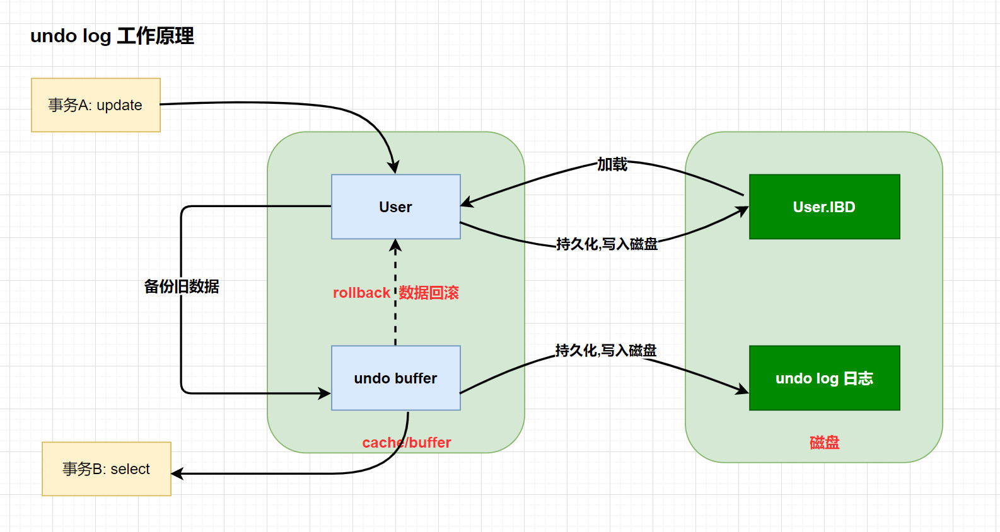
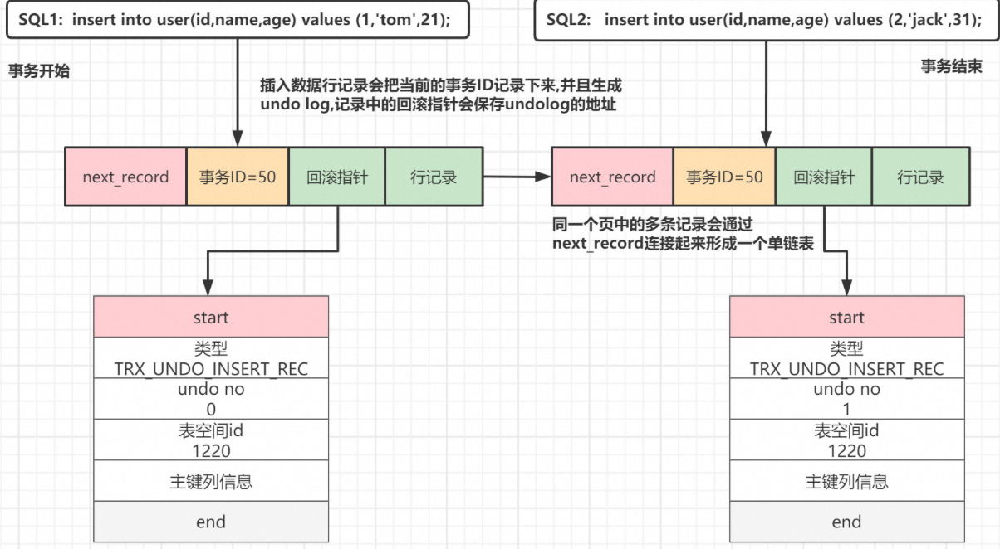

# 一、基本介绍

​	每当我们要对一条记录做改动时（这里的改动可以指 INSERT 、 DELETE 、 UPDATE ），都需要留一手 -> 把回滚时所需的东西都给记下来

​	你插入一条记录时，至少要把这条记录的主键值记下来，之后回滚的时候只需要把这个主键值对应的记录删掉就好了。 

​	你删除了一条记录，至少要把这条记录中的内容都记下来，这样之后回滚时再把由这些内容组成的记录插入到表中就好了。

​	你修改了一条记录，至少要把修改这条记录前的旧值都记录下来，这样之后回滚时再把这条记录更新为旧值 就好了。

​	我们说过 事务 需要保证 原子性 ，也就是事务中的操作要么全部完成，要么什么也不做。但是偏偏有时候事务执 行到一半会出现一些情况，比如：

> - 情况一：事务执行过程中可能遇到各种错误，比如服务器本身的错误，操作系统错误，甚至是突然断电导致 的错误。
> - 情况二：程序员可以在事务执行过程中手动输入 ROLLBACK 语句结束当前的事务的执行
>
> 这两种情况都会导致事务执行到一半就结束，但是事务执行过程中可能已经修改了很多东西，为了保证事务的原 子性，我们需要把东西改回原先的样子，这个过程就称之为 回滚 （英文名： rollback ），这样就可以造成一个 假象：这个事务看起来什么都没做，所以符合 原子性 要求。

undo log是一种用于撤销回退的日志，在数据库事务开始之前，MySQL会先记录更新前的数据到 undo log日志文件里面，当事务回滚时或者数据库崩溃时，可以利用 undo log来进行回退。

- 产生： 事务开始前产生，事务提交时不会立刻删除 undo log ，innodb 会把事务对应的 undo log 放入到删除列表中，后面会通过现场 purge thread 进行回收处理。

注意： undo log 也会产生 redo log ，因为 undo log 也需要持久性保护。

## 1.1 作用总结

1.  **提供回滚操作**： 
    - Undo Log实现了事务的原子性。在数据修改时，除了记录redo log外，还记录了相应的undo log。如果事务执行失败，可以利用undo log进行回滚。
    - Undo Log是**逻辑日志**，记录了数据修改的逻辑操作，如delete操作对应的是insert操作，update操作对应**相反的update操作**。
2.  **提供多版本控制（MVCC）**： 
    - MVCC通过Undo Log实现。当某行数据被其他事务锁定时，可以从undo log中获取该行记录之前的数据版本，从而实现了快照读。
    - 快照读：读取历史版本的数据，不需要加锁，适用于普通SELECT操作。
    - 当前读：读取最新版本的数据，适用于执行修改语句或者特定的SELECT语句。
      - select ... lock in share mode、select ... for update

# 二、工作原理

在更新数据之前，MySQL会提前生成undo log日志，并且在事务提交之前不会立即删除undo log，以确保事务执行失败时可以进行回滚操作。而undo log日志的删除是通过后台的purge线程进行回收处理的。

事务A执行update更新操作时，会按照以下步骤进行：

1. 将旧版本数据备份到对应的undo buffer中。
2. 将undo buffer中的数据持久化到磁盘中的undo log文件中。
3. 执行update操作，将新的数据持久化到磁盘。

在事务A执行的过程中，如果事务B对数据进行了查询，根据MySQL的MVCC机制，事务B会读取到数据的快照版本，即事务A更新之前的版本。这样可以保证事务B读取到的是一致的数据视图，即使事务A正在更新数据。

## 2.1 存储机制

为了保证事务并发操作时，在写各自的undo log时不产生冲突，InnoDB采用`回滚段`的方式来维护undo log的并发写入和持久化。
回滚段概述

- InnoDB使用回滚段来维护并发事务的Undo Log写入和持久化。
- 每个回滚段包含多个Undo Log Segment，是管理Undo Log的基本单位。
- 回滚段数量：InnoDB拥有128个回滚段。
- 每个回滚段中Undo Log Segment数量：每个回滚段包含1024个Undo Log Segment。
- 支持的Undo操作数量：因此，InnoDB支持128 * 1024个Undo操作。

并发事务执行限制

- 最多支持的并发事务数量：由Undo Log Segment数量决定，即128 * 1024。
- 最大支持事务并发数计算：每个事务对应一个Undo Log，最多支持131072个并发事务执行。

### 事务示例

```sql
START TRANSACTION; -- 开启事务A

-- 执行更新操作
UPDATE table_name SET column_name = value WHERE condition;

COMMIT; -- 提交事务A

-- 开启另一个事务B
START TRANSACTION;

-- 执行查询操作
SELECT * FROM table_name WHERE condition;

COMMIT; -- 提交事务B

```

## 2.2  undo Log 的存储

### 事务 ID

事务执行过程中在对某个表执行增、删、改操作时，InnoDB就会给这个事务分配一个唯一的事务ID。
可以通过 `information_schema.INNODB_TRX` 来查询当前系统中运行的事务信息.

```sql
START TRANSACTION;
	select * from test1.a1;
commit;
--trx_id 就是事务ID,InnoDB 在内存维护了一个全局变量来表示事务ID，每当要分配一个事务ID时，就获取这个变量值，然后把这个变量自增1
select 
	trx_id , 
	trx_state ,
    trx_started,
    trx_isolation_level
from information_schema.INNODB_TRX;
```

### 行记录的隐藏列

InnoDB引擎管理的数据表中每行行记录,都存在着三个隐藏列


- `DB_ROW_ID` : 如果没有为表显式的定义主键，并且表中也没有定义唯一索引，那么InnoDB会自动为表添加一个row_id的隐藏列作为主键。
- `DB_TRX_ID` : 事务中对某条记录做增删改时,就会将这个事务的事务ID写入到trx_id中.
- `DB_ROLL_PTR`: 回滚指针,指向undo log的指针

### Insert 语句的 Undo Log 回滚日志结构

插入一条数据对应的undo操作其实就是根据主键删除这条数据就行了。
所以 insert 对应的 undo log 主要是把这条记录的主键记录上


- start、end：指向记录开始和结束的位置。
- 主键列信息：记录INSERT这行数据的主键ID信息，或者唯一列信息。
- table id：表空间ID。
- undo no：在当前事务中 undo log 的编号,从0开始。
- undo type：undo log 的类型，insert语句的undo log类型是 `TRX_UNDO_INSERT_REC`。

### undo 回滚链

通过一个事物操作,我们一起来看一下回滚链的形成


# 三、相关参数

MySQL 与undo相关的参数设置:

```sql
mysql> show variables like '%undo%';
+--------------------------+------------+
| Variable_name            | Value      |
+--------------------------+------------+
| innodb_max_undo_log_size | 1073741824 |
| innodb_undo_directory    | ./         |
| innodb_undo_log_truncate | OFF        |
| innodb_undo_logs         | 128        |
| innodb_undo_tablespaces  | 0          |
+--------------------------+------------+

mysql> show global variables like '%truncate%';
+--------------------------------------+-------+
| Variable_name                        | Value |
+--------------------------------------+-------+
| innodb_purge_rseg_truncate_frequency | 128   |
| innodb_undo_log_truncate             | OFF   |
+--------------------------------------+-------+
```

-  **innodb_max_undo_log_size**
   - 表示每一个undolog对应的日志文件的最大值，默认最大值为1GB大小，默认初始化大小为10MB。
   - 日志文件达到该阈值之后，且参数 `innodb_undo_log_truncate=ON`，才会触发truncate回收（收缩）动作，被truncate后的表空间文件大小缩小到undolog表空间数据文件默认的1OMB大小。否则即便是到达最大值之后，也不会自动回收undolog的表空间。 
-  **innodb_undo_directory**
   - 指定undo log日志的存储目录，默认值为 ./。 
-  **innodb_undo_logs **
   - 在MySQL5.6版本之后，可以通过此参数自定义多少个rollback segment，默认值为128。 
-  **innodb_undo_tablespaces**
   - 设置undo独立表空间个数，范围为0-128， 默认为0，0表示表示不开启独立undo表空间 且 undo日志存储在ibdata文件中。
   - 什么时候需要来设置这个参数 ?
     - 当DB写压力较大时，可以设置独立undo表空间，把undo从 ibdata文件中分离开来，指定 `innodb_undo_directory` 目录存放，可以制定到高速磁盘上，加快undo log 的读写性能。 
-  **innodb_undo_log_truncate**
   表示是否开启自动收缩undolog的表空间的操作。如果配置为`ON`，并且配置了2个或2个以上的undolog表空间数据文件，当某一个日志文件大小超过设置的最大值之后，就会自动的收缩表空间数据文件。 

> 在回收表空间数据文件的时候，被回收的表空间数据文件会临时下线，为了保证undolog一直有地方可以写，此时要保证至少还有1个undolog日志文件是在线的。这就是要求`innodb_undo_tablespaces>=2`的根本原因

 
