# 一、索引定义

MySQL官方对索引定义：是存储引擎用于快速查找记录的一种数据结构。需要额外开辟空间和数据维护工作。
索引是物理数据页存储，在数据文件中（InnoDB，ibd文件），利用数据页(page)存储。
索引可以加快检索速度，但是同时也会降低增删改操作速度，索引维护需要代价。
MySQL默认使用B+树结构管理索引,B+树中的B代表平衡（balance ),在讲B+树之前必须先了解二叉树、平衡二叉树(AVL) 和 B-Tree，因为B+Tree即由这些树逐步优化而来。

# 二、索引的演进

下面是一张数据库的表,有两列,分别是 Col1 和 Col2
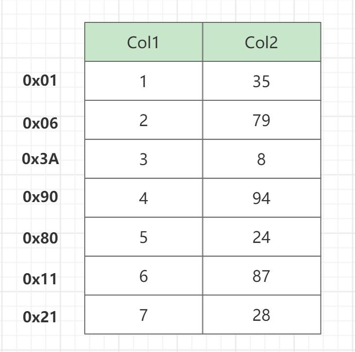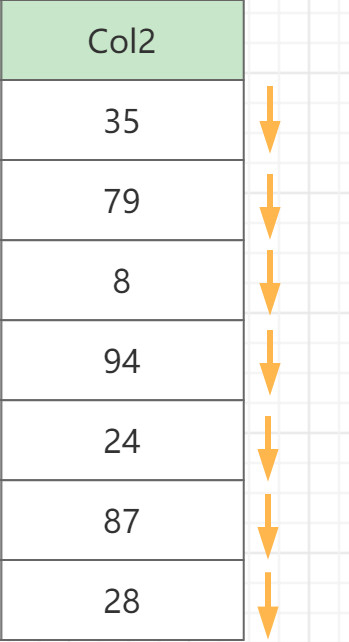
我们来查找一下col2=89的这行数据,SQL语句如下:

```sql
select * from a where col2 = 87
```

没有用索引时执行上面的查询 , 数据从磁盘一条一条拿来对比最终找到结果，如果数据表很大,数据又在表尾的话,需要花费非常多的时间检索,效率低下。

## 2.1  二叉查找树

为了加快查找,可以维护一个二叉树,二叉树具有以下性质：左子树的键值小于根的键值，右子树的键值大于根的键值。 每个节点分别保存字段数据和一个指向对应数据记录物理地址的指针.
这样查找时 就可以使用二叉树查找获取相应的数据,从而快速检索出符合条件的记录
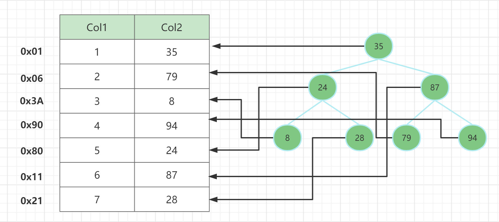
对该二叉树的节点进行查找发现深度为1的节点的查找次数为1,深度为2的查找次数为2,深度为n的节点的查找次数为n,因此其平均查找次数为 (1+2+2+3+3+3+3) / 6 = 2.8次.

**二叉查找树的缺点**
MySQL 索引底层使用的并不是二叉树,因为二叉树存在一个很大的缺陷,就是在存储有序的数据时,最终的排列结构会形成一个单向链表,对于读取某个指定节点时效率会很低.
测试链接: [https://www.cs.usfca.edu/~galles/visualization/BST.html](https://www.cs.usfca.edu/~galles/visualization/BST.html)
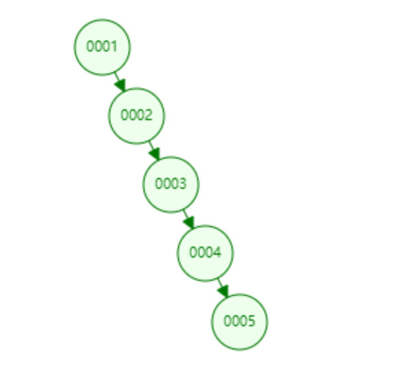

## 2.2 平衡二叉树 (AVL Tree)

二叉查找树存在不平衡的问题，那么可以通过树的叶子节点自动旋转和调整，让二叉树始终保持基本平衡的状态，这样就能够保持二叉查找树的最佳性能。AVL树 就是基于以上思路的自调整平衡二叉树.
平衡二叉树（AVL树）在符合二叉查找树的条件下，**还满足任何节点的两个子树的高度最大差为1**。
**AVL 树与非AVL树对比**

- 左边是AVL树，它的任何节点的两个子树的高度差<=1

  右边的不是AVL树，其根节点的左子树高度为3，而右子树高度为1； 
  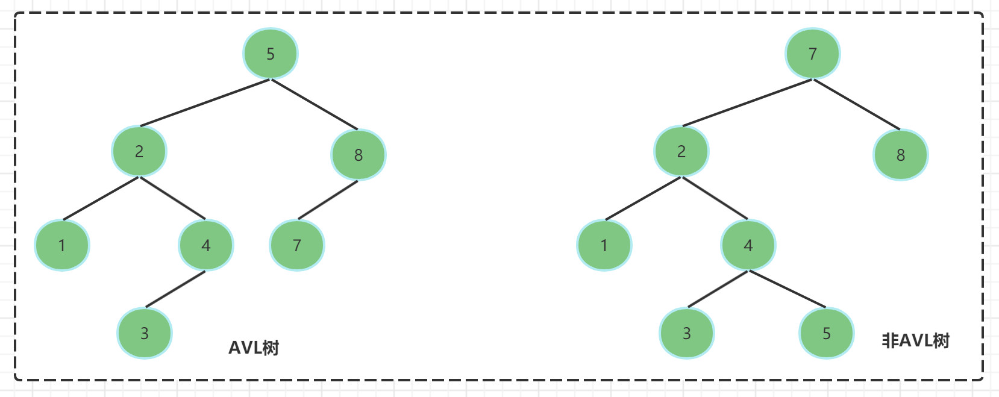

**AVL树的旋转方式**
AVL树失去平衡之后，可以通过旋转使其恢复平衡. 接下来我们来介绍一下两种失去平衡的情况下对应的旋转方式.

- LL旋转(左左旋转),根节点的左子树高度比右子树高度高2. 恢复步骤:
  1. 将根节点的左孩子作为新根节点
  2. 将新根节点的右孩子作为原来根节点的左孩子
  3. 将原根节点的作为新根节点的右孩子
- 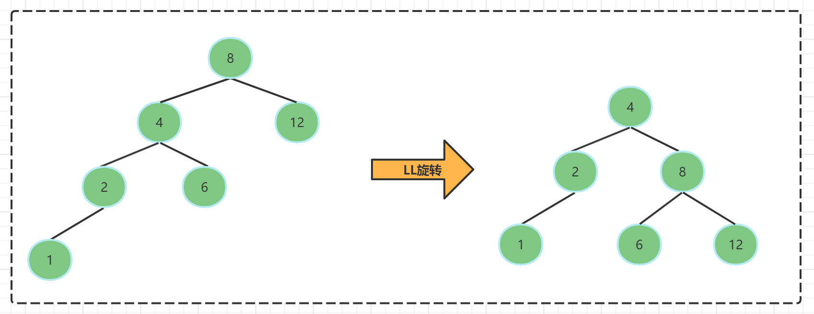
- RR旋转(右右旋转) ,根节点的右子树高度比左子树高度高2,旋转方法与LL旋转对称
  1. 将根节点的右孩子作为新根节点
  2. 将新根节点的左孩子作为原来根节点的右孩子
  3. 将原根节点的作为新根节点的左孩子
- 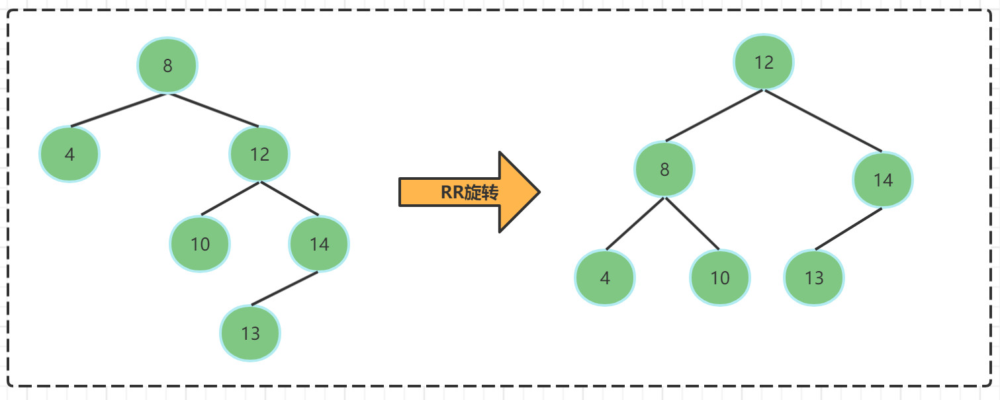

**AVL树的优缺点**

- 优点
  - 叶子节点的层级减少
  - 形态上能够保持平衡
  - 查询效率提升,大量的顺序插入也不会导致查询性能的降低.
- 缺点
  - 一个节点最多分裂出两个子节点, 树的高度太高,导致IO次数过多
  - 节点里面只保存着一个关键字,每次操作获取的目标数据太少

## 2.3 B-Tree

因为AVL树存在的缺陷,MySQL并没有把它作为索引存储的数据结构.**如何减少磁盘IO是数据库提升性能的关键,**每个节点尽可能多的存储一些数据,每次磁盘IO就能多加载一些数据到内存,B-Tree就是基于这样的思想设计的.

### B-Tree介绍

B-Tree是一种平衡的多路查找树,B树**允许一个节点存放多个数据. 这样可以在尽可能减少树的深度的同时,存放更多的数据(把瘦高的树变的矮胖)**. 
B-Tree中所有节点的子树个数的最大值称为B-Tree的阶,用m表示.一颗m阶的B树,如果不为空,就必须满足以下条件.

- m阶的B-Tree满足以下条件:
  1. 每个节点最多拥有m-1个关键字(根节点除外),也就是m个子树
  2. 根节点至少有两个子树(可以没有子树,有就必须是两个)
  3. 分支节点至少有(m/2)颗子树 (除去根节点和叶子节点其他都是分支节点)
  4. 所有叶子节点都在同一层,并且以升序排序

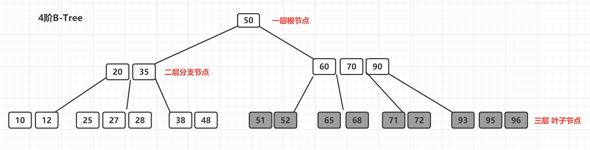

- 什么是B-Tree的阶 ?所有节点中，节点【60,70,90】拥有的子节点数目最多，四个子节点（灰色节点），所以可以上面的B-Tree为4阶B树

### B-Tree结构存储索引的特点

为了描述B-Tree首先定义一条记录为一个键值对[key, data] ，key为记录的键值，对应表中的主键值(聚簇索引)，data为一行记录中除主键外的数据。对于不同的记录，key值互不相同

- 索引值和data数据分布在整棵树结构中
- 白色块部分是指针,存储着子节点的地址信息。
- 每个节点可以存放多个索引值及对应的data数据
- 树节点中的多个索引值从左到右升序排列

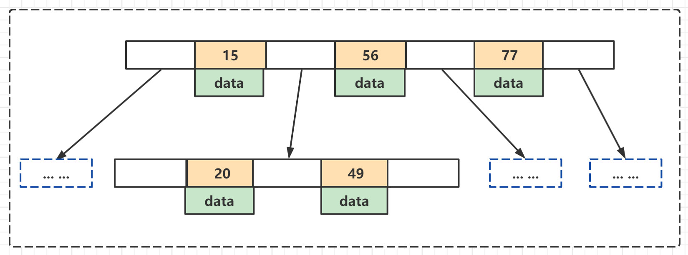

**B-Tree的查找操作**
B-Tree的每个节点的元素可以视为一次I/O读取，树的高度表示最多的I/O次数，在相同数量的总元素个数下，每个节点的元素个数越多，高度越低，查询所需的I/O次数越少.
B-Tree的查找可以分为3步:

1. 首先要查找节点,因为B-Tree通常是在磁盘上存储的,所以这步需要进行磁盘IO操作
2. 第二步查找关键字,当找到某个节点后将该节点**读入内存中**, 然后通过顺序或者折半查找来查找关键字,如果命中就结束查找。
3. 若没有找到关键字，则需要判断大小来找到合适的分支继续查找,如果已经找到了叶子节点,就结束查询。

下面我们演示一下在一个3阶B-Tree中查找元素21的过程
演示地址: [https://www.cs.usfca.edu/~galles/visualization/BTree.html](https://www.cs.usfca.edu/~galles/visualization/BTree.html)

```
插入顺序: 32 3 12 54 1 9 14 21 54 65 66
```

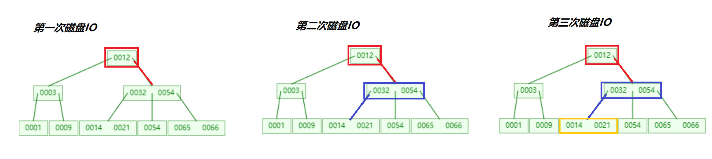

**B-Tree总结**

- 优点: B树可以在内部节点存储键值和相关记录数据，因此把频繁访问的数据放在靠近根节点的位置将大大提高热点数据的查询效率。
- 缺点: B树中每个节点不仅包含数据的key值,还有data数据. 所以当data数据较大时,会导致每个节点存储的key值减少,并且导致B树的层数变高.增加查询时的IO次数.
- 使用场景: B树主要应用于文件系统以及部分数据库索引，如MongoDB，大部分关系型数据库索引则是使用B+树实现

## 2.4 B+Tree

B+Tree是在B-Tree基础上的一种优化，使其更适合实现存储索引结构，InnoDB存储引擎就是用B+Tree实现其索引结构。

### 2.4.1 B+Tree的特征

- 非叶子节点只存储键值信息.
- 所有叶子节点之间都有一个链指针.
- 数据记录都存放在叶子节点中.

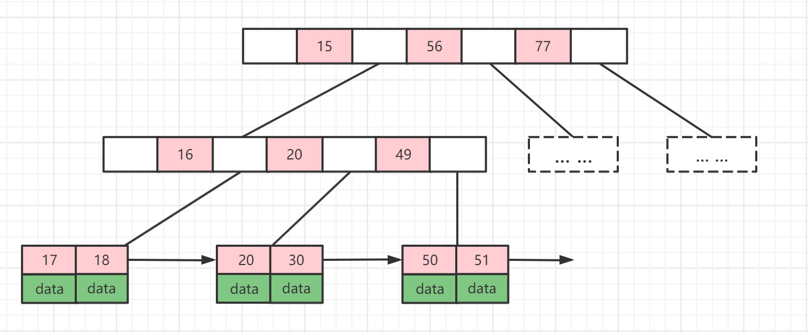

### 2.4.2 B+Tree的优势

1. B+Tree是B Tree的变种，B Tree能解决的问题，B+Tree也能够解决（降低树的高度，增大节点存储数据量）
2. B+Tree扫库和扫表能力更强，如果我们要根据索引去进行数据表的扫描，对B Tree进行扫描，需要把整棵树遍历一遍，而B+Tree只需要遍历他的所有叶子节点即可（叶子节点之间有引用）。
3. B+Tree磁盘读写能力更强，他的根节点和支节点不保存数据区，所有根节点和支节点同样大小的情况下，保存的关键字要比B Tree要多。而叶子节点不保存子节点引用。所以，B+Tree读写一次磁盘加载的关键字比B Tree更多。
4. B+Tree排序能力更强，如上面的图中可以看出，B+Tree天然具有排序功能。
5. B+Tree查询效率更加稳定，每次查询数据，查询IO次数一定是稳定的。当然这个每个人的理解都不同，因为在B Tree如果根节点命中直接返回，确实效率更高。

### 2.4.3 一颗B+Tree可以存放多少数据

MySQL设计者将一个B+Tree的节点的大小设置为等于一个页. (这样做的目的是每个节点只需要一次I/O就可以完全载入), InnoDB的一个页的大小是16KB,所以每个节点的大小也是16KB, **并且B+Tree的根节点是保存在内存中**的,子节点才是存储在磁盘上.
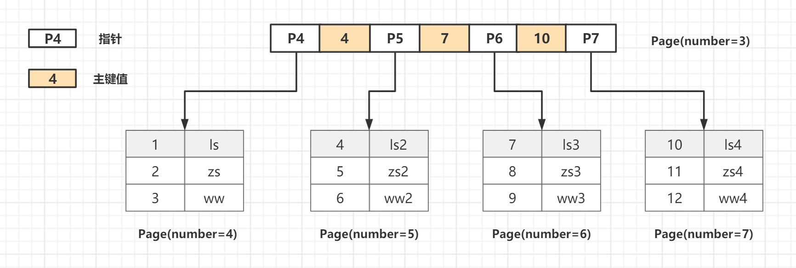

假设一个B+树高为2，即存在一个根节点和若干个叶子节点，那么这棵B+树的存放总记录数为：根节点指针数*单个叶子节点记录行数.

- **计算根节点指针数**: 假设表的主键为INT类型,占用的就是4个字节,或者是BIGINT占用8个字节, 指针大小为6个字节,那么一个页(就是B+Tree中的一个节点) ,大概可以存储: 16384B / (4B+6B) = 1638 ,一个节点最多可以存储**1638**个索引指针.
- **计算每个叶子节点的记录数**:我们假设一行记录的数据大小为1k,那么一页就可以存储16行数据,16KB / 1KB = 16.
- **一颗高度为2的B+Tree可以存放的记录数为**: 1638 * 16=26208 条数据记录
  -  同样的原理可以推算出一个高度3的B+Tree可以存放: 1638 * 1638 * 16 = 42928704条这样的记录.

**所以InnoDB中的B+Tree高度一般为1-3层,就可以满足千万级别的数据存储**,在查找数据时一次页的查找代表一次 IO，所以通过主键索引查询通常只需要 1-3 次 IO 操作即可查找到数据。

## 2.5 Hash索引

MySQL中索引的常用数据结构有两种: 一种是BTree,另一种则是Hash.
Hash底层实现是由Hash表来实现的，是根据键值 <key,value> 存储数据的结构。非常适合根据key查找value值，也就是单个key查询，或者说等值查询。
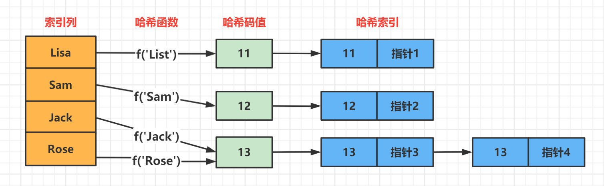
对于每一行数据，存储引擎都会对所有的索引列计算一个哈希码，哈希码是一个较小的值,如果出现哈希码值相同的情况会拉出一条链表.
**Hsah索引的优点**

- 因为索引自身只需要存储对应的Hash值,所以索引结构非常紧凑, 只需要做等值比较查询，而不包含排序或范围查询的需求，都适合使用哈希索引 .
- 没有哈希冲突的情况下,等值查询访问哈希索引的数据非常快.(如果发生Hash冲突,存储引擎必须遍历链表中的所有行指针,逐行进行比较,直到找到所有符合条件的行).

**Hash索引的缺点**

- 哈希索引只包含哈希值和行指针，而不存储字段值，所以不能使用索引中的值来避免读取行。
- 哈希索引只支持等值比较查询。不支持任何范围查询和部分索引列匹配查找。
- 哈希索引数据并不是按照索引值顺序存储的，所以也就无法用于排序。

## 2.6  聚簇索引与非聚簇索引

**聚簇索引(主键索引)**: 将数据存储与索引放到了一块,索引结构的叶子节点保存了行数据.
**非聚簇索引(非主键/二级索引)**: 将数据与索引分开存储，索引结构的叶子节点指向了数据对应的位置.
在InnoDB引擎中，主键索引采用的就是聚簇索引结构存储。
假设有一个 A表 表中字段有: ( id PK , name KEY , sex ,level),表中id是聚集索引, name是普通索引.
表中有四条记录: 

| **id** | **name** | **sex** | **level** |
| ------ | -------- | ------- | --------- |
| 1      | ls       | 0       | A         |
| 3      | zs       | 0       | A         |
| 5      | ww       | 1       | B         |
| 9      | sq       | 0       | C         |

### 2.6.1 聚簇索引（聚集索引）

聚簇索引（聚集索引）聚簇索引是一种数据存储方式，InnoDB的聚簇索引就是按照主键顺序构建 B+Tree结构。B+Tree 的叶子节点就是行记录，行记录和主键值紧凑地存储在一起。 这也意味着 InnoDB 的主键索引就是数据表本身，它按主键顺序存放了整张表的数据，占用的空间就是整个表数据量的大小。通常说的**主键索引**就是聚集索引。InnoDB的表要求必须要有聚簇索引：

- 如果表定义了主键，则主键索引就是聚簇索引
- 如果表没有定义主键，则第一个非空unique列作为聚簇索引
- 否则InnoDB会从建一个隐藏的row-id作为聚簇索引
- 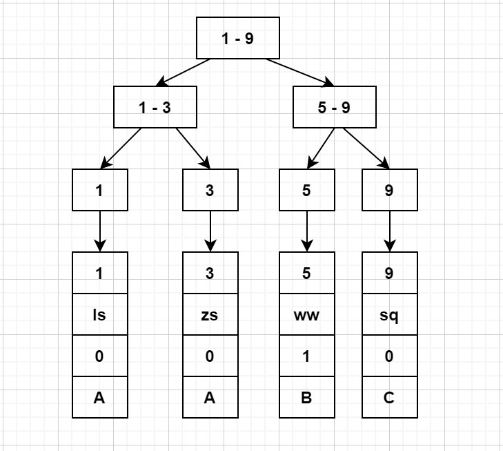

### 2.6.2 非聚簇索引(二级索引)

InnoDB的二级索引，是根据索引列构建 B+Tree结构。但在 B+Tree 的叶子节点中只存了索引列和主键的信息。二级索引占用的空间会比聚簇索引小很多， 通常创建辅助索引就是为了提升查询效率。一个表InnoDB只能创建一个聚簇索引，但可以创建多个辅助索引。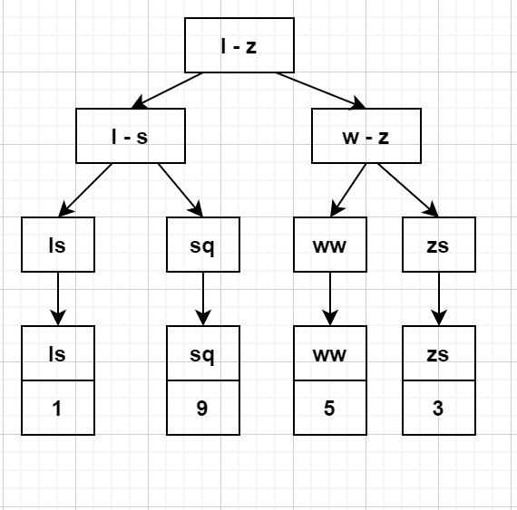

### 2.6.3 使用聚簇索引时要注意的问题

- 当使用主键为聚簇索引时，主键最好不要使用uuid，因为uuid的值太过离散，不适合排序且可能出线新增加记录的uuid，会插入在索引树中间的位置，导致索引树调整复杂度变大，消耗更多的时间和资源。
- 建议使用int类型的自增，方便排序并且默认会在索引树的末尾增加主键值，对索引树的结构影响最小。而且，主键值占用的存储空间越大，辅助索引中保存的主键值也会跟着变大，占用存储空间，也会影响到IO操作读取到的数据量。

### 2.6.4 使用非聚簇索引(二级索引) 要注意的问题

#### 回表

我们来执行这样一条 select * from A where name = 'ls'; 
 MySQL在执行这条SQL时的过程是这样的:

- 在通过name进行查询时,需要扫描两遍索引树
  - 第一遍: 先通过普通索引定位到 主键值 = 1
  - 第二遍: 根据主键值在聚集索引中定位到具体的记录

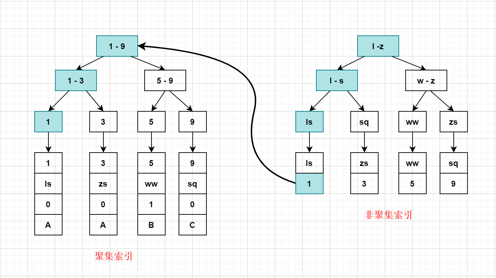**回表: 先根据普通索引查询到主键值，再根据主键值在聚集索引中获取行记录,这就是回表. 回表查询,相对于只扫描一遍聚集索引树的性能 要低一些**

#### 使用覆盖索引来避免回表

- **什么是覆盖索引:**如果一个索引包含了所有需要查询的字段的值 (**不需要回表**)，这个索引就是覆盖索引。覆盖索引是一种避免回表查询的优化策略: **只需要在一棵索引树上就能获取**SQL所需的所有列数据，无需回表，速度更快。
- **具体的实现方式: **将被查询的字段建立普通索引或者**联合索引**，这样的话就可以直接返回索引中的数据，不需要再通过聚集索引去定位行记录，避免了回表的情况发生。比如: 下面这样一条SQL语句,就使用到了覆盖索引.

```sql
SELECT user_name,user_age,user_level FROM users 
WHERE user_name = 'tom' AND user_age = 17;
```

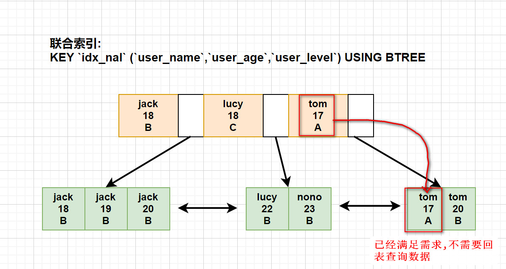

#### 索引条件下推

索引条件下推在数据库查询中起着至关重要的作用，它可以大大提高查询性能，尤其是在涉及大量数据时。以下是一个具体的例子来说明其作用：
假设我们有一个名为 `orders` 的订单表，其中包含了大量订单记录，每条记录都有一个名为 `order_date` 的字段表示订单日期。现在我们想要查询某一天的订单数量。

- 没有索引条件下推时的情况：

```sql
SELECT COUNT(*) FROM orders WHERE order_date = '2024-04-16';
```

如果数据库没有索引条件下推功能，那么它将不得不在整个订单表中逐行扫描，检查每个订单的日期是否等于 '2024-04-16'。这将会消耗大量的时间和资源，特别是当订单数量非常庞大时，查询的性能将会非常低下。

- 有索引条件下推时的情况：

如果数据库支持索引条件下推，它将会尝试将条件应用到订单表的索引上，例如 order_date 索引。这样，数据库就可以直接在索引中查找订单日期等于 '2024-04-16' 的记录，而不需要扫描整个订单表。这样做可以大大提高查询的效率和性能。

