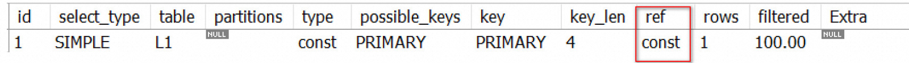
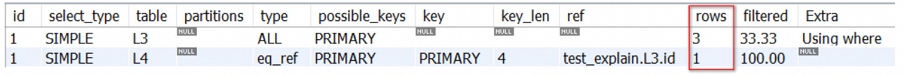

# 一、Explain 概述

使用 `EXPLAIN` 关键字可以模拟优化器来执行SQL查询语句，从而知道MySQL是如何处理我们的SQL语句的。分析出查询语句或是表结构的性能瓶颈。

## 1.1 MySQL 查询过程


通过explain我们可以获得以下信息：

- 表的读取顺序
- 数据读取操作的操作类型
- 哪些索引可以被使用
- 哪些索引真正被使用
- 表的直接引用
- 每张表的有多少行被优化器查询了

Explain使用方式: **explain+sql语句**, 通过执行explain可以获得sql语句执行的相关信息

```sql
explain select * from L1;
```


# 二、Explain 详解

[https://dev.mysql.com/doc/refman/8.0/en/explain-output.html#explain_type](https://dev.mysql.com/doc/refman/8.0/en/explain-output.html#explain_type)

## 2.1 前置准备

```sql
-- 创建数据库
CREATE DATABASE test_explain CHARACTER SET 'utf8';

-- 创建表
CREATE TABLE L1(id INT PRIMARY KEY AUTO_INCREMENT,title VARCHAR(100) );
CREATE TABLE L2(id INT PRIMARY KEY AUTO_INCREMENT,title VARCHAR(100) );
CREATE TABLE L3(id INT PRIMARY KEY AUTO_INCREMENT,title VARCHAR(100) );
CREATE TABLE L4(id INT PRIMARY KEY AUTO_INCREMENT,title VARCHAR(100) );

-- 每张表插入3条数据
INSERT INTO L1(title) VALUES('001'),('002'),('003');
INSERT INTO L2(title) VALUES('004'),('005'),('006');
INSERT INTO L3(title) VALUES('007'),('008'),('009');
INSERT INTO L4(title) VALUES('010'),('011'),('012');
```

## 2.2  字段说明

| 列名          | 描述                                                         |
| ------------- | ------------------------------------------------------------ |
| id            | 每个SELECT关键字对应的唯一标识符。                           |
| select_type   | 查询类型，指示了查询的类型，例如简单查询、联合查询、子查询等。 |
| table         | 表名，指示了查询涉及的表。                                   |
| partitions    | 匹配的分区信息，如果表被分区了，这里会显示哪些分区被访问。   |
| type          | 针对单表的访问方法，表示了查询中使用的访问方法，例如全表扫描、索引扫描等。 |
| possible_keys | 可能用到的索引，显示了查询中可以使用的索引。                 |
| key           | 实际上使用的索引，指示了查询中实际使用的索引。               |
| key_len       | 实际使用到的索引长度，显示了查询中实际使用的索引的长度。     |
| ref           | 当使用索引列等值查询时，与索引列进行等值匹配的对象信息。     |
| rows          | 预估的需要读取的记录条数，显示了查询时估计需要读取的记录条数。 |
| filtered      | 某个表经过搜索条件过滤后剩余记录条数的百分比，显示了经过搜索条件过滤后实际返回的记录百分比。 |
| Extra         | 一些额外的信息，提供了关于查询执行的其他信息，如排序操作、临时表使用等。 |

### 2.2.1 Id 字段说明

#### Id 的生成规则

select查询的序列号，包含一组数字，表示查询中执行select子句或操作表的顺序

- 每个查询语句中的每个 SELECT 关键字都会被分配一个唯一的 id 值。 
- 这个 id 值是在使用 EXPLAIN 语句时返回结果的第一个列。
- 例如，如果查询中只有一个 SELECT 关键字，则 EXPLAIN 结果中只会有一条记录，id 列为 1。

#### 示例

#####  id 相同执行顺序从上至下

```sql
EXPLAIN SELECT * FROM  L1,L2,L3 WHERE L1.id=L2.id AND L2.id = L3.id;
```


##### id 不同，如果是子查询，id的序号会递增，id值越大优先级越高，越先被执行

```sql
EXPLAIN SELECT * FROM L2 WHERE id = (
  SELECT id FROM L1 WHERE id =
    (SELECT L3.id FROM L3 WHERE L3.title = '007')
);
```


### 2.2.2 select_type 字段说明

我们只要知道了某个小查询的 select_type 属性，就知道了这个小查询在整个大查询中扮演了一个什么角色

| **名称**             | **描述**                                                     |
| -------------------- | ------------------------------------------------------------ |
| SIMPLE               | 简单的 SELECT 查询（不包含 UNION 或子查询）                  |
| PRIMARY              | 大查询中的最左边的小查询（外层 SELECT）                      |
| UNION                | 大查询中除了最左边的小查询外的其他小查询（UNION 或 UNION ALL 后面的查询） |
| UNION RESULT         | 针对 UNION 查询结果的临时表操作                              |
| SUBQUERY             | 不相关的子查询的第一个 SELECT                                |
| DEPENDENT SUBQUERY   | 相关的子查询的第一个 SELECT                                  |
| DEPENDENT UNION      | 对于 UNION 查询中依赖于外层查询的子查询                      |
| DERIVED              | 通过物化方式执行的子查询（派生表）                           |
| MATERIALIZED         | 子查询通过物化方式执行                                       |
| UNCACHEABLE SUBQUERY | 无法缓存的子查询                                             |
| UNCACHEABLE UNION    | 无法缓存的 UNION 子查询的后续 SELECT 查询                    |

#### 【Simple】简单 Select 查询

**查询语句中不包含 UNION 或者子查询的查询都算作是 SIMPLE 类型**，比方说下边这个单表查询的 select_type 的值就是 SIMPLE 

##### 简单查询

```sql
EXPLAIN SELECT * FROM L1 where id = 1;
```


##### 连接查询

**当然，连接查询也算是 SIMPLE 类型**

```sql
EXPLAIN SELECT * FROM  L1,L2,L3 WHERE L1.id=L2.id AND L2.id = L3.id;
```


#### 【PRIMARY】包含任何复杂的子部分，最左侧就是 PRIMARY

对于包含 UNION 、 UNION ALL 或者子查询的大查询来说，它是由几个小查询组成的，其中最左边的那个查询 的 select_type 值就是 PRIMARY

```plsql
EXPLAIN SELECT * FROM L2 WHERE id = (
  SELECT id FROM L1 WHERE id =
    (SELECT L3.id FROM L3 WHERE L3.title = '007')
);
```

<br />可以看到上表中最左侧的记录是 L2

#### 【SUBQUERY】在select或where列表中包含了子查询

```plsql
EXPLAIN SELECT * FROM L2 WHERE id = (
  SELECT id FROM L1 WHERE id =
    (SELECT L3.id FROM L3 WHERE L3.title = '007')
);
```

<br />可以看到，外层查询的 select_type 就是 PRIMARY ，子查询的 select_type 就是 SUBQUERY 。<br />**需要大家注意 的是，由于select_type为SUBQUERY的子查询由于会被物化 [ 放入临时表 ]，所以只需要执行一遍。**

#### 【UNION】UNION 查询小查询的 TYPE

第一个查询是dervied派生表，除了第一个表外，第二个以后的表select_type都是union

```plsql
EXPLAIN SELECT * FROM (select * from L3 union select * from L4)a;
```


#### 【Drived】临时表查询

 在from列表中包含的子查询被标记为derived（派生表），MySQL会递归执行这些子查询，把结果放到临时表中<br />

#### 【UNION Result】临时表的查询

MySQL 选择使用临时表来完成 UNION 查询的去重工作，针对该临时表的查询的 select_type 就是 UNION RESULT<br />

### 2.2.3 table 字段说明

规定 EXPLAIN语句输出的每条记录都对应着某个单表的访问方法，该条记录的table列代表着该表的表名

### 2.2.4 type 字段说明

> The join type. For descriptions of the different types.

连接类型描述了在获取数据时所使用的扫描方式，是查询优化的重要指标。以下是各种连接类型，按照从最佳类型到最差类型进行排序：

1. **system**: 适用于表只有一行记录的情况。
2. **const**: 使用主键或唯一索引进行等值查询，只返回一行结果。
3. **eq_ref**: 使用唯一索引进行等值查询，返回匹配的行。
4. **ref**: 使用普通索引进行等值查询，返回匹配的行。
5. **ref_or_null**: 使用普通索引进行等值查询或NULL值查询，返回匹配的行。
6. **index_merge**: 将多个单列索引合并使用。
7. **unique_subquery**: 子查询使用唯一索引进行等值查询。
8. **index_subquery**: 子查询使用索引进行等值查询。
9. **range**: 使用索引进行范围查询，返回匹配的行。
10. **index**: 对索引进行完整扫描，返回匹配的行。
11. **ALL**: 对表进行完整扫描，返回所有行。

一般来说，查询至少应达到 **range** 级别，最好能达到 **ref** 级别，以保证查询的效率。如果无法达到这些级别，则需要对 SQL 进行优化调整。

#### 【System】只有一条记录并且该表使用的存储引擎的统计数据是精确的

```plsql
mysql> CREATE TABLE t(i int) Engine=MyISAM;

Query OK, 0 rows affected (0.05 sec)

mysql> INSERT INTO t VALUES(1); 
Query OK, 1 row affected (0.01 sec)
```

```plsql
mysql> EXPLAIN SELECT * FROM t;
```

上述情况就是 system 

#### 【const】 命中主键索引(primary key) 或者唯一索引(unique),表示通过索引一次就找到数据记录.

因为只匹配一条记录,所以被连接的部分是一个常量. (如果将主键放在 where条件中, MySQL就能将该查询转换为一个常量) 这种类型非常快.

```plsql
explain select * from L1 where id = 3;

-- 为L1表的title字段添加唯一索引
alter table L1 add unique(title);
explain select * from L1 where title = '001'; 
```


#### 【eq_ref】对于前一个表中的每个一行，后表只有一行被扫描。

**只有当联接使用索引的部分都是主键或唯一非空索引时，才会出现这种类型。**<br />**除了system和const类型之外，这是最好的连接类型。**

```plsql
EXPLAIN SELECT L1.id,L1.title FROM L1 
left join L2 on L1.id = L2.id;
```


#### 【ref】使用了普通索引(非唯一索引)

非唯一性索引扫描(使用了普通索引), 对于前表的每一行(row)，后表可能有多于一行的数据被扫描,它返回所有匹配某个单独值的行.

```plsql
-- 为L1表的title字段添加普通索引
alter table L1 add index idx_title (title) ;

EXPLAIN SELECT * FROM L1 inner join L2 on L1.title = L2.title;

```


#### 【range】索引上的范围查询

索引上的范围查询,检索给定范围的行,between，in函数，> 都是典型的范围(range)查询, 例如以下查询: 

```plsql
EXPLAIN SELECT * FROM L1 WHERE L1.id between 1 and  10;
```


**需要注意： 当in函数中的数据很大时,可能会导致效率下降,最终不走索引**

#### 【index】 使用了索引, 但是没有通过索引进行过滤

需要扫描索引上的全部数据 ( 查找所有索引树,比ALL快一些,因为索引文件要比数据文件小 ), 一般是使用了索引进行排序分组.

```plsql
EXPLAIN SELECT * FROM L2 group by id  order by id;

-- 该count查询需要通过扫描索引上的全部数据来计数
EXPLAIN SELECT count(*) FROM L2;
```


#### 【ALL】没有使用到任何索引

```plsql
EXPLAIN SELECT * FROM L3 inner join L4 on L3.title = L4.title ;
```


#### 【总结】

| type类型 | 解释                                                         |
| -------- | ------------------------------------------------------------ |
| system   | 不进行磁盘IO,查询系统表,仅仅返回一条数据                     |
| const    | 查找主键索引,最多返回1条或0条数据. 属于精确查找              |
| eq_ref   | 查找唯一性索引,返回数据最多一条, 属于精确查找                |
| ref      | 查找非唯一性索引,返回匹配某一条件的多条数据,属于精确查找,数据返回可能是多条. |
| range    | 查找某个索引的部分索引,只检索给定范围的行,属于范围查找. 比如: > 、 < 、in 、between |
| index    | 查找所有索引树,比ALL快一些,因为索引文件要比数据文件小.       |
| ALL      | 不使用任何索引,直接进行全表扫描                              |

### 2.2.5 possible_keys & Keys 说明

- possible_keys : **显示可能应用到这个表上的索引**，一个或者多个，查询设计到的字段如果存在索引，则当前索引将被列出，但不一定被查询实际使用
- key:** 实际使用的索引**
  - 如果为空表示没有使用到索引。为空的情况分析：
    - 没有建立索引
    - 建立了索引，但是索引失效
  - 查询中如果使用了覆盖索引，则该索引仅出现在 key 列表中
- **possible_keys列中的值并不是越多越好，可能使用的索引越多，查询优化器计算查询成本时就得花费更长时间，所以如果可以的话，尽量删除那些用不到的索引**

#### 理论上没有使用索引，但是实际使用了

```sql
EXPLAIN SELECT L3.id FROM L3;
```


#### 理论上和实际都没有使用索引

```sql
EXPLAIN SELECT * FROM L3 WHERE title = '007';
```


#### 理论和实际上都是用了索引

```sql
EXPLAIN SELECT * FROM L2 WHERE title = '004';
```


### 2.2.6 key_len 字段说明

表示索引中使用的字节数, 可以通过该列计算查询中使用索引的长度. <br />key_len 字段能够帮你检查是否充分利用了索引   **ken_len 越长, 说明索引使用的越充分**<br />创建表

```sql
CREATE TABLE L5(
	a INT PRIMARY KEY, 
	b INT NOT NULL, 
	c INT DEFAULT NULL, 
    d CHAR(10) NOT NULL
);
```

使用explain 进行测试

#### 单列索引

```sql
EXPLAIN SELECT * FROM L5 WHERE a > 1 AND b = 1;
```

**观察key_len的值, 索引中只包含了1列 是int类型 ,所以,key_len是4字节。**<br />


#### 多列索引

为 b 字段添加索引，进行测试

```sql
ALTER TABLE L5 ADD INDEX idx_b(b);

-- 执行SQL,这次将b字段也作为条件
EXPLAIN SELECT * FROM L5 WHERE a > 1 AND b = 1;
```

**两列都使用了索引,所以,这里ken_len是8。**<br />


#### 联合索引

```sql
ALTER TABLE L5 ADD INDEX idx_c_b(c,d);

explain select * from L5 where c = 1 and d = ''; 
```


**c字段是int类型 4个字节, d字段是 char(10)代表的是10个字符相当30个字节**

> 数据库的字符集是utf8 一个字符3个字节,d字段是 char(10)代表的是10个字符相当30个字节,多出的一个字节用来表示是联合索引

下面这个例子中,虽然使用了联合索引,但是可以根据ken_len的长度推测出该联合索引只使用了一部分,没有充分利用索引,还有优化空间.

```sql
explain select * from L5 where c = 1 ; 
```


### 2.2.7 ref 字段说明

显示索引的哪一列被使用了，如果可能的话，是一个常数。哪些列或常量被用于查找索引列上的值

```sql
EXPLAIN SELECT * FROM L1 WHERE  L1.id=1;
```



说明 L1.id=1 ，1 是一个常量

### 2.2.8 rows 字段说明

表示MySQL根据表统计信息及索引选用情况,估算的找到所需的记录所需要读取的行数<br />L3中的title没有添加索引, 所以L3中有3条记录,就需要读取3条记录进行查找.

```sql
EXPLAIN SELECT * FROM L3,L4 WHERE L3.id = L4.id AND L3.title LIKE '007'; 
```



> 需要注意的是 rows只是一个估算值,并不准确 .所以rows行数过大的问题并不值得过多考虑，主要分析的还是索引是否使用正确了

### 2.2.9 filtered 字段说明

它指返回结果的行占需要读到的行(rows列的值)的百分比<br />当单表查询采用全表扫描方式时，MySQL需要估算满足搜索条件的记录数量。<br />当单表查询采用索引方式时，MySQL需要估算除了索引覆盖的搜索条件外，还有多少记录满足其他搜索条件。

```sql
EXPLAIN SELECT * FROM s1 WHERE key1 > 'z' AND common_field = 'a'; 
```

- rows列显示满足key1 > 'z'条件的记录数为266条。
- filtered列表示在这266条记录中，有多少满足其他搜索条件（例如common_field = 'a'）。在这个例子中，filtered值为10.00%，表示在这266条记录中有10.00%满足common_field = 'a'条件。

### 2.2.10 extra 

Extra 是 EXPLAIN 输出中另外一个很重要的列，该列显示MySQL在查询过程中的一些详细信息.<br />准备数据

```sql
CREATE TABLE users (
	uid INT PRIMARY KEY AUTO_INCREMENT,
	uname VARCHAR(20),
	age INT(11)
);
 
INSERT INTO users VALUES(NULL, 'lisa',10);
INSERT INTO users VALUES(NULL, 'lisa',10);
INSERT INTO users VALUES(NULL, 'rose',11);
INSERT INTO users VALUES(NULL, 'jack', 12);
INSERT INTO users VALUES(NULL, 'sam', 13);
```

#### Using filesort

执行结果Extra为`Using filesort`，这说明，得到所需结果集，需要对所有记录进行文件排序。这类SQL语句性能极差，需要进行优化。<br />典型的，在一个没有建立索引的列上进行了order by，就会触发filesort，常见的优化方案是，在order by的列上添加索引，避免每次查询都全量排序。 

```sql
EXPLAIN SELECT * FROM users ORDER BY age;
```


####  Using temporary

表示MySQL需要使用临时表来存储结果集，常见于排序和分组查询 

```sql
EXPLAIN SELECT COUNT(*),uname FROM users GROUP BY uname;
```


#### Using where

意味着全表扫描或者在查找使用索引的情况下,但是还有查询条件不在索引字段当中.<br />需要注意的是： 

   1. 返回所有记录的SQL，不使用where条件过滤数据，大概率不符合预期，对于这类SQL往往需要进行优化；
   2. 使用了where条件的SQL，并不代表不需要优化，往往需要配合explain结果中的type（连接类型）来综合判断。例如本例查询的 age 未设置索引，所以返回的type为ALL，仍有优化空间，可以建立索引优化查询。

```sql
EXPLAIN SELECT * FROM users WHERE age=10;
```


#### Using index

表示直接访问索引就能够获取到所需要的数据(覆盖索引) , 不需要通过索引回表. 

```sql
-- 为uname创建索引
alter table users add index idx_uname(uname);

EXPLAIN SELECT uid,uname FROM users WHERE uname='lisa';
```

<br /> **Using join buffer**<br />使用了连接缓存, 会显示join连接查询时,MySQL选择的查询算法  . 

```sql
EXPLAIN SELECT * FROM users u1 LEFT JOIN (SELECT * FROM users WHERE age = 1) u2 ON u1.age = u2.age;
```

 <br />`Using join buffer (Block Nested Loop)` 说明，需要进行嵌套循环计算, 这里每个表都有五条记录，内外表查询的type都为ALL。<br />问题在于 两个关联表的关联使用了字段 age，并且age字段未建立索引，就会出现这种情况。 

#### Using index condition

查找使用了索引 (但是只使用了一部分,一般是指联合索引)，但是需要回表查询数. 

```sql
explain select * from L5 where c > 10 and d = '';
```

<br />**Extra主要指标的含义(有时会同时出现)**

- `using index` ：使用覆盖索引的时候就会出现
- `using where`：在查找使用索引的情况下，需要回表去查询所需的数据
- `using index condition`：查找使用了索引，但是需要回表查询数据
- `using index & using where`：查找使用了索引，但是需要的数据都在索引列中能找到，所以不需要回表查询数据