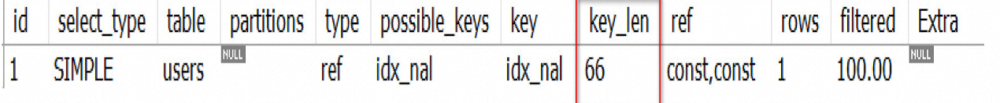

# 一、数据准备

## 1.1 创建数据库、表,插入数据

```plsql
create database idx_optimize character set 'utf8';

CREATE TABLE users(
  id INT PRIMARY KEY AUTO_INCREMENT,
  user_name VARCHAR(20) NOT NULL COMMENT '姓名',
  user_age INT NOT NULL DEFAULT 0 COMMENT '年龄',
  user_level VARCHAR(20) NOT NULL COMMENT '用户等级',
  reg_time TIMESTAMP NOT NULL DEFAULT CURRENT_TIMESTAMP COMMENT '注册时间'
);

INSERT INTO users(user_name,user_age,user_level,reg_time)
VALUES('tom',17,'A',NOW()),('jack',18,'B',NOW()),('lucy',18,'C',NOW());
```

## 1.2 创建联合索引

```plsql
ALTER TABLE users ADD INDEX idx_nal (user_name,user_age,user_level) USING BTREE;
```

# 二、优化原则示例

## 2.1 最左匹配原则

如果创建的是联合索引,就要遵循该法则. 使用索引时，where后面的条件需要从索引的最左前列开始使用,并且不能跳过索引中的列使用。

### 2.1.1 场景说明

#### 场景 1： 按照索引字段顺序使用，三个字段都使用了索引,没有问题。

```plsql
EXPLAIN SELECT * FROM users WHERE user_name = 'tom' 
AND user_age = 17 AND user_level = 'A';
```


#### 场景 2 ： 直接跳过user_name使用索引字段，索引无效，未使用到索引

```plsql
EXPLAIN SELECT * FROM users WHERE user_age = 17 AND user_level = 'A';
```


#### 场景 3： 不按照创建联合索引的顺序,使用索引

```plsql
EXPLAIN SELECT * FROM users WHERE 
user_age = 17 AND user_name = 'tom' AND user_level = 'A';
```


> where后面查询条件顺序是 user_age、user_level、user_name与我们创建的索引顺序user_name、user_age、user_level不一致，为什么还是使用了索引，原因是因为MySql底层优化器对其进行了优化。

### 2.1.2 原理分析

MySQL创建联合索引的规则是: 首先会对联合索引**最左边**的字段进行**排序**  ( 例子中是 `user_name` ), **在第一个字段的基础之上** 再对第二个字段进行排序 ( 例子中是 `user_age` ) 
所以: 最佳左前缀原则其实是和B+树的结构有关系, 最左字段肯定是有序的, 第二个字段则是无序的(**联合索引的排序方式是: 先按照第一个字段进行排序,如果第一个字段相等再根据第二个字段排序**). 所以如果直接使用第二个字段 `user_age` 通常是使用不到索引的.


## 2.2 不要在索引列上做计算

不要在索引列上做任何操作，比如计算、使用函数、自动或手动进行类型转换,会导致索引失效，从而使查询转向全表扫描。

### 数据准备

```plsql
INSERT INTO users(user_name,user_age,user_level,reg_time) VALUES('11223344',22,'D',NOW());
```

### 场景分析

#### 场景1:  使用系统函数 left()函数,对user_name进行操作

```plsql
EXPLAIN SELECT * FROM users WHERE LEFT(user_name, 6) = '112233';
```


#### 场景2:  字符串不加单引号 (隐式类型转换)

> varchar类型的字段，在查询的时候不加单引号,就需要进行隐式转换, 导致索引失效，转向全表扫描。

```plsql
EXPLAIN SELECT * FROM users WHERE user_name = 11223344;
```


## 2.3 范围查询列失效

> 在编写查询语句时, where条件中如果有范围条件, 并且范围条件之后还有其他过滤条件,   那么范围条件之后的列就都将会索引失效. 

### 场景 1 ：条件单独使用user_name时,  type=ref,   key_len=62

>   user_name VARCHAR(20) NOT NULL COMMENT '姓名',
>   utf8 字符集一个字符 3 个字节 3*20=60 ,估计还有两个字节用来表示联合索引

```plsql
-- 条件只有一个 user_name
EXPLAIN SELECT * FROM users WHERE user_name = 'tom';
```


### 场景2 : 条件增加一个 user_age ( 使用常量等值) ,type= ref  ,  key_len = 66

>   user_age INT NOT NULL DEFAULT 0 COMMENT '年龄',
>   int 4 个字节 =3*20+4+2=66

```plsql
EXPLAIN SELECT * FROM users WHERE user_name = 'tom' AND user_age = 17;
```



### 场景 3 ： 使用全值匹配,索引都利用上了

 `type = ref`  , `key_len = 128`  , 索引都利用上了

```plsql
EXPLAIN SELECT * FROM users WHERE user_name = 'tom' 
AND user_age = 17 AND user_level = 'A';
```


### 场景 4 : 使用范围查询，user_level 索引未使用

 avg > 17 , `type = range`  ,  `key_len = 66`   , 与场景3 比较,可以发现 `user_level` 索引没有用上.

```plsql
EXPLAIN SELECT * FROM users WHERE user_name = 'tom' 
AND user_age = 17 AND user_level = 'A';
```


## 2.4 避免使用 is null 、is not null 、!=、or

### is Null 导致索引失效

```plsql
EXPLAIN SELECT * FROM users WHERE user_name IS NULL;
```


> Impossible Where: 表示where条件不成立, 不能返回任何行

### is not null 导致索引失效

```plsql
EXPLAIN SELECT * FROM users WHERE user_name IS NOT NULL;
```


###  `!= ` 和 `or` 会使索引失效

```plsql
EXPLAIN SELECT * FROM users WHERE user_name != 'tom';

EXPLAIN SELECT * FROM users WHERE user_name = 'tom' or user_name = 'jack';
```


## 2.5 like 使用 % 开头导致索引失效

like查询为范围查询，%出现在左边，则索引失效。%出现在右边索引未失效.

### 2.5.1  失效场景分析

#### % x % 索引失效

```plsql
EXPLAIN SELECT * FROM users WHERE user_name LIKE '%tom%';

EXPLAIN SELECT * FROM users WHERE user_name LIKE '%tom';
```


#### % x 索引失效

```plsql
EXPLAIN SELECT * FROM users WHERE user_name LIKE 'tom%';
```


### 2.5.2  失效的解决办法

#### 使用覆盖索引

```plsql
EXPLAIN SELECT user_name FROM users WHERE user_name LIKE '%jack%';

EXPLAIN SELECT user_name,user_age,user_level FROM users WHERE user_name LIKE '%jack%';
```


通过使用覆盖索引 `type = index`,并且 `extra = Using index`,从全表扫描变成了全索引扫描

#### 创建一个新字段，倒排存储，并且建立索引

```plsql
SELECT * FROM users WHERE invert_name LIKE 'xx%';
```

### 2.5.3 失效的原理分析

1.  **%号在右:** 由于B+树的索引顺序，是按照首字母的大小进行排序，%号在右的匹配又是匹配首字母。所以可以在B+树上进行有序的查找，查找首字母符合要求的数据。所以有些时候可以用到索引. 
2.  **%号在左:**  是匹配字符串尾部的数据，我们上面说了排序规则，尾部的字母是没有顺序的，所以不能按照索引顺序查询，就用不到索引. 
3.  **两个%%号:**  这个是查询任意位置的字母满足条件即可，只有首字母是进行索引排序的，其他位置的字母都是相对无序的，所以查找任意位置的字母是用不上索引的. 

# 三、总结

- **最左前缀法则要遵守**
- **索引列上不计算**
- **范围之后全失效**
- **覆盖索引记住用。**
- **不等于、is null、is not null、or导致索引失效。**
- **like百分号加右边，加左边导致索引失效，解决方法：使用覆盖索引。**