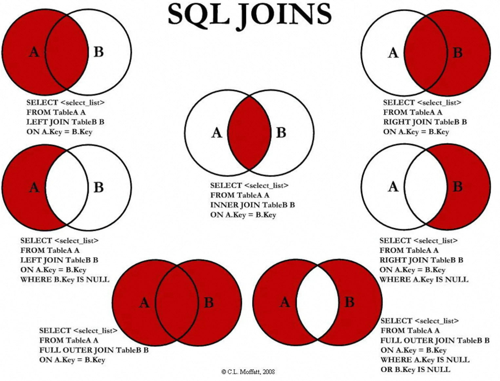

# 一、join 优化原理

## 1.1 基本连接方式介绍


JOIN 是 MySQL 用来进行联表操作的，用来匹配两个表的数据，筛选并合并出符合我们要求的结果集。

## 1.2  驱动表的定义

### 1.2.1 什么是驱动表

- 多表关联查询时,**第一个被处理的表就是驱动表**,使用驱动表去关联其他表.
- 驱动表的确定非常的关键,**会直接影响多表关联的顺序**,也决定后续关联查询的性能

### 1.2.2 选择驱动表的基本原则

在对最终的结果集没有影响的前提下,优先选择结果集最小的那张表作为驱动表

## 1.3 常见的 Join 算法

### 1.3.1 Simple Nested-Loop Join（ 简单的嵌套循环连接 ) 

简单来说嵌套循环连接算法就是一个双层for 循环 ，通过循环外层表的行数据，逐个与内层表的所有行数据进行比较来获取结果
**这种算法是最简单的方案，性能也一般。对内循环没优化。**

#### 例子

```plsql
-- 连接用户表与订单表 连接条件是 u.id = o.user_id
select * from user t1 left join order t2 on t1.id = t2.user_id;
-- user表为驱动表,order表为被驱动表
```

转化成代码的思路是: 

```plsql
for(user表行 uRow : user表){
    for(Order表的行 oRow : order表){
        if(uRow.id = oRow.user_id){
            return uRow;
        }
    }
}
```

匹配流程如下所示： 


### 1.3.2 Index Nested-Loop Join（ 索引嵌套循环连接 ）

-  Index Nested-Loop Join 其优化的思路:  **主要是为了减少内层表数据的匹配次数** , 最大的区别在于，用来进行 join 的字段已经在被驱动表中建立了索引。 
-  从原来的  `匹配次数 = 外层表行数 * 内层表行数` , 变成了  `匹配次数 = 外层表的行数 * 内层表索引的高度`  ，极大的提升了 join的性能。 
-  当  `order`  表的   `user_id`  为索引的时候执行过程会如下图： 


**注意：使用Index Nested-Loop Join 算法的前提是匹配的字段必须建立了索引。**

### 1.3.3 Block Nested-Loop Join( 块嵌套循环连接 )

-  如果 join 的字段有索引，MySQL 会使用 INL 算法。如果没有的话，MySQL 会如何处理？ 
-  因为不存在索引了，所以被驱动表需要进行扫描。这里 MySQL 并不会简单粗暴的应用 SNL 算法，而是加入了 buffer 缓冲区，降低了内循环的个数，也就是被驱动表的扫描次数。 


-  在外层循环扫描 user表中的所有记录。扫描的时候，**会把需要进行 join 用到的列都缓存到 buffer 中**。buffer 中的数据有一个特点，里面的记录不需要一条一条地取出来和 order 表进行比较，而是整个 buffer 和 order表进行批量比较。 
-  如果我们把 buffer 的空间开得很大，可以容纳下 user 表的所有记录，那么 order 表也只需要访问一次。 
-  MySQL 默认 buffer 大小 256K，如果有 n 个 join 操作，会生成 n-1 个 join buffer。 

```sql
mysql> show variables like '%join_buffer%';
+------------------+--------+
| Variable_name    | Value  |
+------------------+--------+
| join_buffer_size | 262144 |
+------------------+--------+

mysql> set session join_buffer_size=262144;
Query OK, 0 rows affected (0.00 sec)
```

## 1.4 总结

1.  永远用小结果集驱动大结果集(其本质就是减少外层循环的数据数量) 
2.  为匹配的条件增加索引(减少内层表的循环匹配次数) 
3.  增大join buffer size的大小（一次缓存的数据越多，那么内层包的扫表次数就越少） 
4.  减少不必要的字段查询（字段越少，join buffer 所缓存的数据就越多 

# 二、in 和 exist 函数

上面我们说了 小表驱动大表,就是小的数据集驱动大的数据集, 主要是为了减少数据库的连接次数,根据具体情况的不同,又出现了两个函数 `exists` 和 `in`  函数

## 2.1 数据准备

```plsql
-- 部门表
CREATE TABLE department (
  id INT(11) PRIMARY KEY,
  deptName VARCHAR(30) ,
  address VARCHAR(40) 
) ;

-- 部门表测试数据
INSERT INTO `department` VALUES (1, '研发部', '1层');
INSERT INTO `department` VALUES (2, '人事部', '3层');
INSERT INTO `department` VALUES (3, '市场部', '4层');
INSERT INTO `department` VALUES (5, '财务部', '2层');

-- 员工表
CREATE TABLE employee (
  id INT(11) PRIMARY KEY,
  NAME VARCHAR(20) ,
  dep_id INT(11) ,
  age INT(11) ,
  salary DECIMAL(10, 2)
);

-- 员工表测试数据
INSERT INTO `employee` VALUES (1, '鲁班', 1, 15, 1000.00);
INSERT INTO `employee` VALUES (2, '后裔', 1, 22, 2000.00)
INSERT INTO `employee` VALUES (4, '阿凯', 2, 20, 3000.00);
INSERT INTO `employee` VALUES (5, '露娜', 2, 30, 3500.00);
INSERT INTO `employee` VALUES (6, '李白', 3, 25, 5000.00);
INSERT INTO `employee` VALUES (7, '韩信', 3, 50, 5000.00);
INSERT INTO `employee` VALUES (8, '蔡文姬', 3, 35, 4000.00);
INSERT INTO `employee` VALUES (3, '孙尚香', 4, 20, 2500.00);
```

## 2.2 in 函数

假设: department表的数据小于 employee表数据, 将所有部门下的员工都查出来,应该使用 in 函数

```plsql
-- 编写SQL,使in 函数
SELECT * FROM employee e WHERE e.dep_id IN (SELECT id FROM department);
```

### 执行原理

1.  `in` 语句, 只执行一次, 将 `department`  表中的所有id字段查询出来并且缓存. 
2.  检查 `department`  表中的id与 `employee` 表中的    `dep_id` 是否相等, 如果相等 添加到结果集, 直到遍历完`department`  所有的记录. 


```java
-- 先循环: select id from department; 相当于得到了小表的数据
for(i = 0; i < $dept.length; i++){  -- 小表
	-- 后循环: select * from employee where e.dep_id  = d.id;
	for(j = 0 ; j < $emp.legth; j++){  -- 大表
	
		if($dept[i].id == $emp[j].dep_id){
			$result[i] = $emp[j]
			break;
		}
		
	}
}
```

### 结论

**如果子查询得出的结果集记录较少，主查询中的表较大且又有索引时应该用 `in`**

## 2.3 exist 函数

假设: department表的数据大于 employee表数据, 将所有部门下的的员工都查出来,应该使用 exists 函数.

```java
 SELECT * FROM employee e WHERE EXISTS 
(SELECT id FROM department d WHERE d.id = e.dep_id);
```

### 特点

`exists` 子句返回的是一个 布尔值，如果有返回数据，则返回值是`true`，反之是`false`。
如果结果为 `true`  , **外层的查询语句会进行匹配,否则 外层查询语句将不进行查询或者查不出任何记录**


### 执行原理分析

```java
-- 先循环: SELECT * FROM employee e;
-- 再判断: SELECT id FROM department d WHERE d.id = e.dep_id

for(j = 0; j < $emp.length; j++){  -- 小表

-- 遍历循环外表，检查外表中的记录有没有和内表的的数据一致的, 匹配得上就放入结果集。
	if(exists(emp[i].dep_id)){   -- 大表
		$result[i] = $emp[i];
	}
}
```

## 2.4 in vs exist

-  如果子查询得出的结果集记录较少，主查询中的表较大且又有索引时应该用 `in` 
-  如果主查询得出的结果集记录较少，子查询中的表较大且又有索引时应该用  `exists` 
-  一句话:  **in后面跟的是小表，exists后面跟的是大表。** 