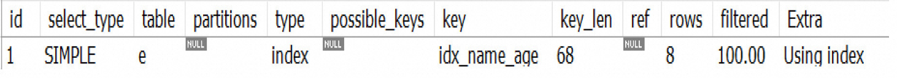
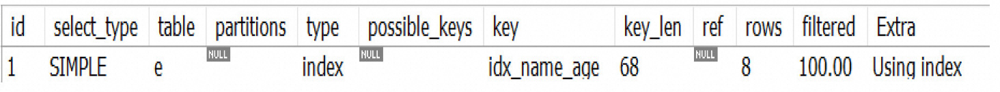

MySQL中的两种排序方式

-  索引排序: 通过有序索引顺序扫描直接返回有序数据 
-  额外排序: 对返回的数据进行文件排序 

ORDER BY优化的核心原则: **尽量减少额外的排序，通过索引直接返回有序数据。** 

# 一、索引排序

因为索引的结构是B+树，索引中的数据是按照一定顺序进行排列的，所以在排序查询中如果能利用索引，就能避免额外的排序操作。EXPLAIN分析查询时，Extra显示为Using index。

比如查询条件是 `where age = 21 order by name`，那么查询过程就是会找到满足 `age = 21` 的记录，而符合这条的所有记录一定是按照 name 排序的，所以也不需要额外进行排序.

# 二、额外排序

所有不是通过索引直接返回排序结果的操作都是Filesort排序，也就是说进行了额外的排序操作。EXPLAIN分析查询时，Extra显示为Using filesort。

## 2.1 按照执行位置划分

### 2.1.1 Sort_Buffer

MySQL 为每个线程各维护了一块内存区域 sort_buffer ，用于进行排序。sort_buffer 的大小可以通过 sort_buffer_size 来设置。

```java
mysql> show variables like '%sort_buffer_size%';
+-------------------------+---------+
| Variable_name           | Value   |
+-------------------------+---------+
| sort_buffer_size        | 262144  |
+-------------------------+---------+

mysql> select 262144 / 1024;
+---------------+
| 262144 / 1024 |
+---------------+
|      256.0000 |
+---------------+
```

> 注: sort_Buffer_Size 并不是越大越好，由于是connection级的参数，过大的设置+高并发可能会耗尽系统内存资源。

### 2.1.2 Sort_Buffer + 临时文件

如果加载的记录字段总长度（可能是全字段也可能是 rowid排序的字段）小于 sort_buffer_size 便使用 sort_buffer 排序；如果超过则使用 sort_buffer + 临时文件进行排序。
临时文件种类：
临时表种类由参数 tmp_table_size 与临时表大小决定，如果内存临时表大小超过 tmp_table_size ，那么就会转成磁盘临时表。因为磁盘临时表在磁盘上，所以使用内存临时表的效率是大于磁盘临时表的。

## 2.2 按照执行方式划分

执行方式是由 `max_length_for_sort_data` 参数与用于排序的单条记录字段长度决定的，如果用于排序的单条记录字段长度 `<= max_length_for_sort_data` ，就使用全字段排序；反之则使用 rowid 排序。

```java
mysql> show variables like 'max_length_for_sort_data';
+--------------------------+-------+
| Variable_name            | Value |
+--------------------------+-------+
| max_length_for_sort_data | 1024  |
+--------------------------+-------+
```

### 全字段排序

全字段排序就是将查询的所有字段全部加载进来进行排序。

- 优点：查询快，执行过程简单
- 缺点：需要的空间大。

```java
select name,age,add from user where addr = '北京' order by name limit 1000; -- addr有索引
```


上面查询语句的执行流程:

1.  初始化 sort_buffer，确定放入 name、age、addr 这3个字段。 
2.  从索引 addr 中找到第一个满足 addr=`北京` 的主键ID（ID_x）。 
3.  到主键索引中找到 ID_x，取出整行，取 name、addr、age 3个字段的值，存入 sort_buffer。 
4.  从索引 addr 取下一个记录的主键ID。 
5.  重复3、4，直到 addr 值不满足条件。 
6.  对 sort_buffer 中的数据按照 name 做快速排序。 
7.  把排序结果中的前1000行返回给客户端。 

### rowid 排序

rowid 排序相对于全字段排序，不会把所有字段都放入sort_buffer。所以在sort buffer中进行排序之后还得回表查询。
缺点：会产生更多次数的回表查询，查询可能会慢一些。
优点：所需的空间更小

```sql
select name,age,add from user where addr = '北京' order by name limit 1000; -- addr有索引
```

假设 name、age、addr3个字段定义的总长度为36，而 max_length_for_sort_data = 16，就是单行的长度超了，MySQL认为单行太大，需要换一个算法。
	放入 sort_buffer 的字段就会只有要排序的字段 name，和主键 id，那么排序的结果中就少了 addr 和 age，就需要回表了。

上面查询语句的执行流程:

1. 初始化 sort_buffer，确定放入2个字段，name 和 id。
2. 从索引 addr 中找到第一个满足addr=’北京’的主键ID（ID_x）。
3. 到主键索引中取出整行，把 name、id 这2个字段放入 sort_buffer。
4. 从索引 addr 取下一个记录的主键ID。
5. 重复3、4，直到addr值不满足条件。
6. 对 sort_buffer 中的数据按照 name 做快速排序。
7. 取排序结果中的前1000行，并按照 id 的值到原表中取出 name、age、addr 3个字段的值返回给客户端。

## 2.3 总结

-  **如果 MySQL 认为内存足够大，会优先选择全字段排序，把需要的字段都放到 sort_buffer中**， 这样排序后就会直接从内存里面返回查询结果了，不用再回到原表去取数据。 
-  MySQL 的一个设计思想：如果内存够，就要多利用内存，尽量减少磁盘访问。 对于 InnoDB 表来说，rowid 排序会要求回表多造成磁盘读，因此不会被优先选择。 

# 三、排序优化

## 添加索引

为 `employee`表 创建索引

```java
-- 联合索引
ALTER TABLE employee ADD INDEX idx_name_age(NAME,age);

-- 为薪资字段添加索引
ALTER TABLE employee ADD INDEX idx_salary(salary);
```

查看 `employee` 表的索引情况

```java
SHOW INDEX FROM employee; 
```


## 场景分析

### 【生效】 只查询用于排序的索引字段

查询 name, age 两个字段, 并使用 name 与 age 行排序

```java
EXPLAIN SELECT e.name, e.age FROM employee e ORDER BY e.name,e.age;
```


### 【无效】 排序字段在多个索引中

-  查询 `name , salary` 字段, 并使用 `name` 与 `salary` 排序 

```sql
EXPLAIN SELECT e.name, e.salary FROM employee e ORDER BY e.name,e.salary;
```

 

### 【有效】只查询用于排序的索引字段和主键

-  查询 `id , name` , 使用 `name` 排序 

```sql
EXPLAIN SELECT e.id, e.name FROM employee e ORDER BY e.name;
```

 

### 【无效】 查询主键之外的没有添加索引的字段

-  查询 `dep_id` ,使用 `name` 进行排序 

```sql
EXPLAIN SELECT e.dep_id FROM employee e ORDER BY e.name;
EXPLAIN SELECT id, e.dep_id FROM employee e ORDER BY e.name;
EXPLAIN SELECT * FROM employee e ORDER BY e.name;
```

 

### 【无效】 排序字段顺序与索引列顺序不一致

-  使用联合索引时, ORDER BY子句也要求, 排序字段顺序和联合索引列顺序匹配。 

```sql
EXPLAIN SELECT e.name, e.age FROM employee e ORDER BY e.age,e.name;
```

 

### 【无效】where 条件是 范围查询时

-  比如 添加一个条件 :  `age > 18` ,然后再根据 `age` 排序. 

```sql
EXPLAIN SELECT e.name, e.age FROM employee e WHERE e.age > 10 ORDER BY e.age;
```

 

-  **注意: ORDERBY子句不要求必须索引中第一列,没有仍然可以利用索引排序。但是有个前提条件，只有在等值过滤时才可以，范围查询时不可以** 

```sql
EXPLAIN SELECT e.name, e.age FROM employee e WHERE e.age = 18 ORDER BY e.age;
```

 

### 【无效】升降序不一致,无法利用索引排序

-  ORDER BY排序字段要么全部正序排序，要么全部倒序排序，否则无法利用索引排序。 

```sql
-- 升序
EXPLAIN SELECT e.name, e.age FROM employee e ORDER BY e.name , e.age ;

-- 降序
EXPLAIN SELECT e.name, e.age FROM employee e ORDER BY e.name DESC, e.age DESC;
```

 

-  name字段升序,age字段降序,索引失效 

```sql
EXPLAIN SELECT e.name, e.age FROM employee e ORDER BY e.name, e.age DESC;
```

 