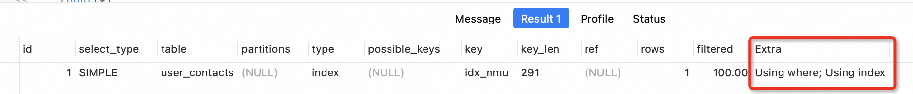
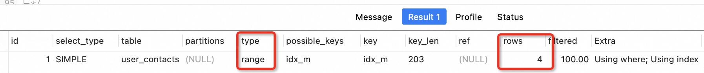
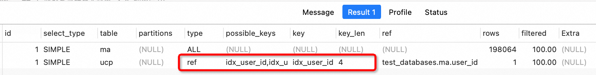

# 一、单表优化

## 1.1 数据准备

下面是一张`用户通讯表`的表结构信息,这张表来源于真实企业的实际项目中,有接近500万条数据.

```sql
CREATE TABLE user_contacts (
  id INT(11) NOT NULL AUTO_INCREMENT,
  user_id INT(11) DEFAULT NULL COMMENT '用户标识',
  mobile VARCHAR(50) DEFAULT NULL COMMENT '手机号',
  NAME VARCHAR(20) DEFAULT NULL COMMENT '姓名',
  version INT(11) NOT NULL DEFAULT '0' COMMENT '版本',
  create_by VARCHAR(64) DEFAULT NULL COMMENT '创建者',
  create_date DATETIME NOT NULL COMMENT '创建时间',
  update_by VARCHAR(64) DEFAULT NULL COMMENT '更新者',
  update_date DATETIME NOT NULL COMMENT '更新时间',
  remarks VARCHAR(255) DEFAULT NULL COMMENT '备注信息',
  del_flag CHAR(1) NOT NULL DEFAULT '0' COMMENT '删除标识',
  PRIMARY KEY (id)
);

```

```sql
DELIMITER //

CREATE PROCEDURE insert_random_user_contacts()
BEGIN
    DECLARE i INT DEFAULT 1;

    WHILE i <= 100000 DO
        INSERT INTO user_contacts (user_id, mobile, name, version, create_by, create_date, update_by, update_date, remarks, del_flag) 
        VALUES (FLOOR(RAND() * 100000), 
                CONCAT('138', FLOOR(RAND() * 1000000000)), 
                CONCAT('姓名', i), 
                1, 
                'admin', 
                NOW(), 
                'admin', 
                NOW(), 
                CONCAT('备注', i), 
                '0');
        SET i = i + 1;
    END WHILE;
END //

DELIMITER ;
```

```sql
call insert_random_user_contacts();
```

## 1.2 需求分析

### 1.2.1 查询所有名字中包含李的用户姓名和手机号,并根据user_id字段排序

```plsql
SELECT NAME, mobile FROM  user_contacts WHERE NAME LIKE '李%' ORDER BY user_id;
```

```plsql
EXPLAIN SELECT NAME, mobile FROM  user_contacts WHERE NAME LIKE '%李%' ORDER BY user_id;
```


分析的结果显示: type=ALL 是最坏的情况,并且Extra中还出现了 Using FIlesort(文件排序未使用到索引),所以必须优化

#### 添加联合索引

```plsql
ALTER TABLE user_contacts ADD INDEX idx_nmu(NAME,mobile,user_id);
```

```plsql
EXPLAIN SELECT NAME, mobile FROM  user_contacts WHERE NAME LIKE '%李%' ORDER BY user_id;
```


分析结果显示: type连接类型提升到了index级别,通过索引就获取到了全部数据,但是Extra字段中还是存在 Using filesort. 

#### 索引调整

继续优化, 根据最佳左前缀法则,之后最左侧列是有序的, 在创建联合索引时,正确的顺序应该是: **user_id,NAME,mobile**

```plsql
-- 删除索引
DROP INDEX idx_nmu ON user_contacts 

-- 添加重新排序后的索引
ALTER TABLE user_contacts ADD INDEX idx_unm(user_id,NAME,mobile);
```

执行查询,发现type=index , Using filesort没有了.

```plsql
EXPLAIN SELECT NAME, mobile FROM  user_contacts WHERE NAME LIKE '%李%' ORDER BY user_id;
```



### 1.2.2 统计手机号是135、136、186、187开头的用户数量.

```plsql
EXPLAIN  SELECT COUNT(*) FROM user_contacts 
WHERE mobile LIKE '135%' OR mobile LIKE '136%' OR mobile LIKE '186%' OR mobile LIKE '187%';
```


- `type=index` : 用到了索引,但是进行了索引全表扫描

- `key=idx_unm`: 使用到了联合索引,但是效果并不是很好

- `Extra=Using where; Using index`:  查询的列被索引覆盖了,但是无法通过该索引直接获取数据

  综合上面的执行计划给出的信息,需要进行优化.

#### 单独建立索引

1.  经过上面的分析,发现联合索引没有发挥作用,所以尝试对 mobile字段单独建立索引 

```sql
ALTER TABLE user_contacts ADD INDEX idx_m(mobile);
```


2.  再次执行,得到下面的分析结果 

```sql
EXPLAIN  SELECT COUNT(*) FROM user_contacts 
WHERE mobile LIKE '135%' OR mobile LIKE '136%' OR mobile LIKE '186%' OR mobile LIKE '187%';
```



- `**type=range**`: 使用了索引进行范围查询,常见于使用>，>=，<，<=，BETWEEN，IN() 或者 like 等运算符的查询中。 
- `key=idx_m`: mysql选择了我们为mobile字段创建的索引,进行数据检索
- `rows=1575026`: 为获取所需数据而进行扫描的行数,比之前减少非常多
- `using index & using where`：查找使用了索引，但是需要的数据都在索引列中能找到，所以不需要回表查询数据

### 1.2.3 Count 区别分析

进行统计操作时,count中的统计条件可以三种选择:

```sql
EXPLAIN  SELECT COUNT(*) FROM user_contacts 
WHERE mobile LIKE '135%' OR mobile LIKE '136%' OR mobile LIKE '186%' OR mobile LIKE '187%';

EXPLAIN  SELECT COUNT(id) FROM user_contacts 
WHERE mobile LIKE '135%' OR mobile LIKE '136%' OR mobile LIKE '186%' OR mobile LIKE '187%';

EXPLAIN  SELECT COUNT(1) FROM user_contacts 
WHERE mobile LIKE '135%' OR mobile LIKE '136%' OR mobile LIKE '186%' OR mobile LIKE '187%';
```

- count(*) ：  包括了所有的列,在统计时 **不会忽略列值为null**的数据
- count(1) ： 用1表示代码行,在统计时,不会忽略列值为null的数据
- count(列名)： 在统计时,会忽略列值为空的数据,就是说某个字段的值为null时不统计

| 场景           | 最优选择    | 原因                                                         |
| -------------- | ----------- | ------------------------------------------------------------ |
| 列名为主键     | count(列名) | 主键列具有唯一性，数据库引擎可以更快地计算该列中的非空值数量。 |
| 列名不是主键   | count(1)    | count(1) 只需检查行是否存在，不必关心具体的列数据，执行速度更快。 |
| 表没有主键     | count(1)    | count(1) 只需检查行是否存在，不涉及具体列的读取，比 count(*) 更快。 |
| 表只有一个字段 | count(*)    | count(*) 返回表中所有行的数量，不受特定列是否为主键的影响，同时避免了检查特定列是否为 NULL 的开销。 |

### 1.2.4 查询2017-2-16日,新增的用户联系人信息. 查询字段: name , mobile

```plsql
EXPLAIN SELECT NAME,mobile FROM user_contacts  WHERE DATE_FORMAT(create_date,'%Y-%m-%d')='2017-02-16';
```


#### 创建索引

分析 type=all 表示走的全表扫描，为 create_date 创建索引

```plsql
ALTER TABLE user_contacts ADD INDEX idx_cd(create_date);

EXPLAIN SELECT NAME,mobile FROM user_contacts  WHERE DATE_FORMAT(create_date,'%Y-%m-%d')='2017-02-16';
```


#### 类型转化

添加索引后,发现并没有使用到索引 `key=null`
分析: create_date字段是datetime类型 ,转换为日期再匹配,需要查询出所有行进行过滤, 所以导致索引失效.
使用 between ... and ... ,使索引生效

```plsql
EXPLAIN SELECT NAME,mobile FROM user_contacts  WHERE create_date 
BETWEEN '2017-02-16 00:00:00' AND '2017-02-16 23:59:59';
```


### 1.2.5 获取用户通讯录表第10万条数据开始后的100条数据

```plsql
EXPLAIN SELECT * FROM user_contacts uc LIMIT 100000,100;

-- 查询记录量越来越大，所花费的时间也会越来越多
EXPLAIN SELECT * FROM user_contacts uc LIMIT 1000000,1000;

EXPLAIN SELECT * FROM user_contacts uc LIMIT 2000000,10000;

EXPLAIN SELECT * FROM user_contacts uc LIMIT 3000000,100000;
```


LIMIT 子句可以被用于指定 SELECT 语句返回的记录数。需注意以下几点：
limit a,b : 

- 第一个参数指定第一个返回记录行的偏移量，注意从0开始 
- 第二个参数指定返回记录行的最大数目 

limit offset

- 初始记录行的偏移量是 0 
- 如果只给定一个参数：它表示返回最大的记录行数目 

#### 通过索引进行分页

- 直接进行limit操作 会产生全表扫描,速度很慢. Limit限制的是从结果集的M位置处取出N条输出,其余抛弃
- **假设ID是连续递增的**,我们根据查询的页数和查询的记录数可以算出查询的id的范围，然后配合 limit使用

```plsql
EXPLAIN SELECT * FROM user_contacts WHERE id  >= 100001 LIMIT 100;
```


type类型提升到了 range级别

#### 利用子查询进行优化

```plsql
-- 首先定位偏移位置的id
SELECT id FROM user_contacts LIMIT 100000,1;

-- 根据获取到的id值向后查询.
EXPLAIN SELECT * FROM user_contacts WHERE id >=
(SELECT id FROM user_contacts LIMIT 100000,1) LIMIT 100;
```


# 二、多表优化

## 2.1 数据准备

### 用户手机认证表

- 该表约有19 万数据,保存的是通过手机认证后的用户数据


- 关联字段: `user_id`

```sql
CREATE TABLE `mob_autht` (
  `id` int(11) NOT NULL AUTO_INCREMENT COMMENT '标识',
  `user_id` int(11) NOT NULL COMMENT '用户标识',
  `mobile` varchar(11) NOT NULL COMMENT '手机号码',
  `seevc_pwd` varchar(12) NOT NULL COMMENT '服务密码',
  `autht_indc` varchar(1) NOT NULL DEFAULT '0' COMMENT '认证标志',
  `verson` int(11) NOT NULL DEFAULT '0' COMMENT '版本',
  `create_by` varchar(64) DEFAULT NULL COMMENT '创建者',
  `create_date` datetime NOT NULL COMMENT '创建时间',
  `update_by` varchar(64) DEFAULT NULL COMMENT '更新者',
  `update_date` datetime NOT NULL COMMENT '更新时间',
  `remarks` varchar(255) DEFAULT NULL COMMENT '备注信息',
  `del_flag` char(1) NOT NULL DEFAULT '0' COMMENT '删除标识',
  PRIMARY KEY (`id`)
) ;
```

```sql
DELIMITER //

CREATE PROCEDURE generate_mob_autht_data()
BEGIN
    DECLARE i INT DEFAULT 1;

    WHILE i <= 110000 DO
        INSERT INTO mob_autht (user_id, mobile, seevc_pwd, autht_indc, verson, create_by, create_date, update_by, update_date, remarks, del_flag) 
        VALUES (FLOOR(RAND() * 1000000), 
                CONCAT('138', FLOOR(RAND() * 100000000)), 
                LEFT(MD5(RAND()), 8), -- 截取MD5哈希值的前8个字符作为服务密码
                IF(RAND() > 0.5, '1', '0'), 
                0, 
                'admin', 
                NOW(), 
                'admin', 
                NOW(), 
                CONCAT('备注', i), 
                '0');
        SET i = i + 1;
    END WHILE;
END //

DELIMITER ;
```

```sql
call generate_mob_autht_data;
```

### 紧急人联系表

- 该表约有22万数据,注册成功后,用户添加的紧急联系人信息.
- 关联字段: `user_id`

```sql
CREATE TABLE `ugncy_cntct_psn` (
  `id` int(11) NOT NULL AUTO_INCREMENT COMMENT '标识',
  `psn_info_id` int(11) DEFAULT NULL COMMENT '个人信息标识',
  `user_id` int(11) NOT NULL COMMENT '向钱用户标识',
  `cntct_psn_name` varchar(10) NOT NULL COMMENT '联系人姓名',
  `cntct_psn_mob` varchar(11) NOT NULL COMMENT '联系手机号',
  `and_self_rltn_cde` char(2) NOT NULL COMMENT '与本人关系代码 字典表关联',
  `verson` int(11) NOT NULL DEFAULT '0' COMMENT '版本',
  `create_by` varchar(64) DEFAULT NULL COMMENT '创建者',
  `create_date` datetime NOT NULL COMMENT '创建时间',
  `update_by` varchar(64) DEFAULT NULL COMMENT '更新者',
  `update_date` datetime NOT NULL COMMENT '更新时间',
  `remarks` varchar(255) DEFAULT NULL COMMENT '备注信息',
  `del_flag` char(1) NOT NULL DEFAULT '0' COMMENT '删除标识',
  PRIMARY KEY (`id`)
) ;
```

```sql
DELIMITER //

CREATE PROCEDURE generate_ugncy_cntct_psn_data()
BEGIN
    DECLARE i INT DEFAULT 1;

    WHILE i <= 110000 DO
        INSERT INTO ugncy_cntct_psn (psn_info_id, user_id, cntct_psn_name, cntct_psn_mob, and_self_rltn_cde, verson, create_by, create_date, update_by, update_date, remarks, del_flag) 
        VALUES (FLOOR(RAND() * 1000000), 
                FLOOR(RAND() * 1000000), 
                CONCAT('联系人', i), 
                CONCAT('138', FLOOR(RAND() * 100000000)), 
                '01', 
                0, 
                'admin', 
                NOW(), 
                'admin', 
                NOW(), 
                CONCAT('备注', i), 
                '0');
        SET i = i + 1;
    END WHILE;
END //

DELIMITER ;

```

```sql
call generate_ugncy_cntct_psn_data;
```


### 借款申请表

- 该表约有11万数据,保存的是每次用户申请借款时 填写的信息
  - 
- 关联字段: `user_id`

```sql
CREATE TABLE `loan_apply` (
  `id` INT(11) NOT NULL AUTO_INCREMENT COMMENT '借款申请标识',
  `loan_nbr` VARCHAR(50) NOT NULL COMMENT '借款编号',
  `user_id` INT(11) NOT NULL COMMENT '用户标识',
  `idnt_info_id` INT(11) DEFAULT NULL COMMENT '身份信息标识',
  `psn_info_id` INT(11) DEFAULT NULL COMMENT '个人信息标识',
  `mob_autht_id` INT(11) DEFAULT NULL COMMENT '手机认证标识',
  `bnk_card_id` INT(11) DEFAULT NULL COMMENT '银行卡标识',
  `apply_limit` DECIMAL(16,2) NOT NULL DEFAULT '0.00' COMMENT '申请额度',
  `apply_tlmt` INT(3) NOT NULL COMMENT '申请期限',
  `apply_time` DATETIME NOT NULL COMMENT '申请时间',
  `audit_limit` DECIMAL(16,2) NOT NULL COMMENT '审核额度',
  `audit_tlmt` INT(3) NOT NULL COMMENT '审核期限',
  `audit_time` DATETIME DEFAULT NULL COMMENT '审核时间',
  `cfrm_limit` DECIMAL(16,2) NOT NULL DEFAULT '0.00' COMMENT '确认额度',
  `cfrm_tlmt` INT(3) NOT NULL COMMENT '确认期限',
  `cfrm_time` DATETIME DEFAULT NULL COMMENT '确认时间',
  `loan_sts_cde` CHAR(1) NOT NULL COMMENT '借款状态:0 未提交 1 提交申请(初始) 2 已校验 3 通过审核4 未通过审核 5开始放款 6放弃借款 7 放款成功 ',
  `audit_mod_cde` CHAR(1) NOT NULL COMMENT '审核模式：1 人工 2 智能',
  `day_rate` DECIMAL(16,8) NOT NULL DEFAULT '0.00000000' COMMENT '日利率',
  `seevc_fee_day_rate` DECIMAL(16,8) NOT NULL DEFAULT '0.00000000' COMMENT '服务费日利率',
  `normal_paybk_tot_day_rate` DECIMAL(16,8) NOT NULL DEFAULT '0.00000000' COMMENT '正常还款总日利率',
  `ovrdu_fee_day_rate` DECIMAL(16,8) DEFAULT NULL COMMENT '逾期违约金日利率',
  `day_intr_amt` DECIMAL(16,2) NOT NULL DEFAULT '0.00' COMMENT '日利率金额',
  `seevc_fee_day_intr_amt` DECIMAL(16,2) NOT NULL DEFAULT '0.00' COMMENT '服务日利率金额',
  `normal_paybk_tot_intr_amt` DECIMAL(16,2) NOT NULL DEFAULT '0.00' COMMENT '综合日利率金额',
  `cnl_resn_time` DATETIME DEFAULT NULL COMMENT '放弃时间',
  `cnl_resn_cde` CHAR(8) DEFAULT NULL COMMENT '放弃原因：关联字典代码',
  `cnl_resn_othr` VARCHAR(255) DEFAULT NULL COMMENT '放弃的其他原因',
  `verson` INT(11) NOT NULL DEFAULT '0' COMMENT '版本',
  `create_by` VARCHAR(64) DEFAULT NULL COMMENT '创建者',
  `create_date` DATETIME NOT NULL COMMENT '创建时间',
  `update_by` VARCHAR(64) DEFAULT NULL COMMENT '更新者',
  `update_date` DATETIME NOT NULL COMMENT '更新时间',
  `remarks` VARCHAR(255) DEFAULT NULL COMMENT '备注信息',
  `loan_dst_cde` CHAR(1) NOT NULL DEFAULT '0' COMMENT '0,未分配; 1,已分配',
  `del_flag` CHAR(1) NOT NULL DEFAULT '0' COMMENT '删除标识',
  `last_loan_apply_id` INT(11) DEFAULT NULL COMMENT '上次借款申请标识',
  PRIMARY KEY (`id`),
  UNIQUE KEY `ind_loan_nbr` (`loan_nbr`) USING BTREE
) ;
```

```sql
DELIMITER //

CREATE PROCEDURE generate_loan_apply_data()
BEGIN
    DECLARE i INT DEFAULT 1;

    WHILE i <= 110000 DO
        INSERT INTO loan_apply (loan_nbr, user_id, idnt_info_id, psn_info_id, mob_autht_id, bnk_card_id, apply_limit, apply_tlmt, apply_time, audit_limit, audit_tlmt, audit_time, cfrm_limit, cfrm_tlmt, cfrm_time, loan_sts_cde, audit_mod_cde, day_rate, seevc_fee_day_rate, normal_paybk_tot_day_rate, ovrdu_fee_day_rate, day_intr_amt, seevc_fee_day_intr_amt, normal_paybk_tot_intr_amt, cnl_resn_time, cnl_resn_cde, cnl_resn_othr, verson, create_by, create_date, update_by, update_date, remarks, loan_dst_cde, del_flag, last_loan_apply_id) 
        VALUES (CONCAT('LN', LPAD(i, 6, '0')), 
                FLOOR(RAND() * 1000000), 
                FLOOR(RAND() * 1000000), 
                FLOOR(RAND() * 1000000), 
                FLOOR(RAND() * 1000000), 
                FLOOR(RAND() * 1000000), 
                ROUND(RAND() * 100000, 2), 
                FLOOR(RAND() * 100), 
                NOW(), 
                ROUND(RAND() * 100000, 2), 
                FLOOR(RAND() * 100), 
                NOW(), 
                ROUND(RAND() * 100000, 2), 
                FLOOR(RAND() * 100), 
                NOW(), 
                FLOOR(RAND() * 7), 
                IF(RAND() > 0.5, '1', '2'), 
                ROUND(RAND(), 8), 
                ROUND(RAND(), 8), 
                ROUND(RAND(), 8), 
                ROUND(RAND(), 8), 
                ROUND(RAND() * 1000, 2), 
                ROUND(RAND() * 1000, 2), 
                ROUND(RAND() * 1000, 2), 
                NOW(), 
                LPAD(FLOOR(RAND() * 100), 8, '0'), 
                CONCAT('其他原因', i), 
                0, 
                'admin', 
                NOW(), 
                'admin', 
                NOW(), 
                CONCAT('备注', i), 
                IF(RAND() > 0.5, '1', '0'), 
                '0', 
                NULL);
        SET i = i + 1;
    END WHILE;
END //

DELIMITER ;

```

```sql
call generate_loan_apply_data;
```

## 2.2 需求分析&执行

### 2.2.1 查询 所有认证用户的手机号及认证用户的紧急联系人的姓名和手机号信息

```sql
explain select 
	ma.mobile '认证用户手机号',
    ucp.cntct_psn_name '紧急联系人姓名',
    ucp.cntct_psn_mob '紧急联系人手机号'
from mob_autht ma left join ugncy_cntct_psn ucp 
on ma.user_id = ucp.user_id;
```


type 类型都是 all ，使用了全表扫描

#### 增加索引

针对mob_autht user_id 增加索引

```sql
ALTER TABLE mob_autht add index idx_user_id(user_id);
```


-  根据小结果及驱动大结果集的原则, `mob_autht`  是驱动表,驱动表即使建立索引也不会生效. 
-  一般情况下: 左外连接左表是驱动表,右外连接右表就是驱动表. 
-  explain分析结果的第一行的表,就是驱动表 

针对 unc 表 user_id 增加索引

```sql
alter table ugncy_cntct_psn add index idx_user_id1(user_id);
```


可以看到被驱动表已经走索引了。

### 2.2.2 获取紧急联系人数量 > 8 的用户手机号信息

```sql
-- 1.获取紧急联系人>8的,用户ID
SELECT user_id , COUNT(user_id) c FROM ugncy_cntct_psn GROUP BY user_id HAVING c > 8;

-- 2.获取认证用户的ID与手机号
SELECT user_id, mobile FROM mob_autht

-- 3.将上面两条SQL进行JOIN连接
SELECT 
 ucp.user_id,
 COUNT(ucp.user_id),
 m.user_id,
 m.mobile
FROM ugncy_cntct_psn ucp
INNER JOIN (SELECT user_id, mobile FROM mob_autht) m ON m.user_id = ucp.user_id
GROUP BY ucp.user_id HAVING COUNT(ucp.user_id) > 8 ;
```

> 1055 - Expression #4 of SELECT list is not in GROUP BY clause and contains nonaggregated column 'm.mobile' which is not functionally dependent on columns in GROUP BY clause; this is incompatible with sql_mode=only_full_group_by, Time: 0.001000s
> 解决： 

```sql
SET sql_mode=(SELECT REPLACE(@@sql_mode,'ONLY_FULL_GROUP_BY',''));
```


- `Using temporary` : MySQL 创建了临时表,来保存结果.
- `Using filesort` : 使用了文件排序

优化: 上面这种情况的原因是ySQL对所有 `GROUP BY col1，col2...`的字段进行了排序,如果用户想要避免排序结果的消耗，则可以指定 `ORDER By NULL` 来禁止排序

```sql
EXPLAIN SELECT 
 ucp.user_id,
 COUNT(ucp.user_id),
 m.user_id,
 m.mobile
FROM ugncy_cntct_psn ucp
INNER JOIN (SELECT user_id, mobile FROM mob_autht) m ON m.user_id = ucp.user_id
GROUP BY ucp.user_id HAVING COUNT(ucp.user_id) > 8 ORDER BY NULL;
```


### 2.2.3 获取所有智能审核的用户手机号和申请额度、申请时间、审核额度

```sql
EXPLAIN SELECT 
    ma.mobile '用户认证手机号',
    la.apply_limit '申请额度',
     la.apply_time '申请时间',
    la.audit_limit '审核额度'
FROM mob_autht ma inner JOIN loan_apply la ON ma.id = la.mob_autht_id
WHERE la.audit_mod_cde = '2'; 
```


#### 增加索引

-  查询 `loan_apply`表,使用的条件字段为 `audit_mod_cde` ,因为该字段没有添加索引,导致  `type=ALL` 发生全表扫描, 
-  为`audit_mod_cde` 字段添加索引,来提高查询效率. 

```sql
ALTER TABLE loan_apply ADD INDEX idx_amc(audit_mod_cde); 
```


添加索引后type的类型确实提升了,但是需要注意的扫描的行还是很高,并且 Extra字段的值为 `Using where` 表示: 通过索引访问时,需要再回表访问所需的数据.

> 注意: 如果执行计划中显示走了索引，但是rows值很高，extra显示为using where，那么执行效果就不会很好。因为索引访问的成本主要在回表上.

-  `audit_mod_cde`  字段的含义是审核模式,只有两个值: 1 人工 2 智能 ,所以在根据该字段进行查询时,会有大量的相同数据. 
-  比如: 统计一下 `audit_mod_cde = '2'`  的数据总条数,查询结果是9万多条,该表的总数接近11万条,查询出的数据行超过了表的总记录数的30%, 这时就不建议添加索引 ( 比如有1000万的数据，就算平均分后结果集也有500万条,结果集还是太大，查询效率依然不高 ). 

```sql
SELECT COUNT(*) FROM loan_apply; -- 109181条

SELECT COUNT(*) FROM loan_apply la WHERE la.audit_mod_cde = '2' ; -- 91630条
```

**总结: 唯一性太差的字段不需要创建索引,即便用于where条件.**

### 分区查询

如果一定要根据状态字段进行查询,我们可以根据业务需求 添加一个日期条件,比如获取某一时间段的数据,然后再区分状态字段.

```sql
-- 获取2017年 1月1号~1月5号的数据
EXPLAIN SELECT 
    ma.mobile '用户认证手机号',
    la.apply_time '申请时间',
    la.apply_limit '申请额度',
    la.audit_limit '审核额度'
FROM  loan_apply la  INNER JOIN mob_autht ma  ON la.mob_autht_id = ma.id 
WHERE apply_time BETWEEN '2017-01-01 00:00:00' 
AND  '2017-01-05 23:59:59' AND la.audit_mod_cde = '2';  
```


`extra = Using index condition;` : 只有一部分索引生效

`MRR` 算法: 通过范围扫描将数据存入 `read_rnd_buffer_size` ，然后对其按照 Primary Key（RowID）排序，最后使用排序好的数据进行顺序回表，因为 InnoDB 中叶子节点数据是按照 Primary Key（RowID）进行排列的，这样就转换随机IO为顺序IO了，从而减小磁盘的随机访问.