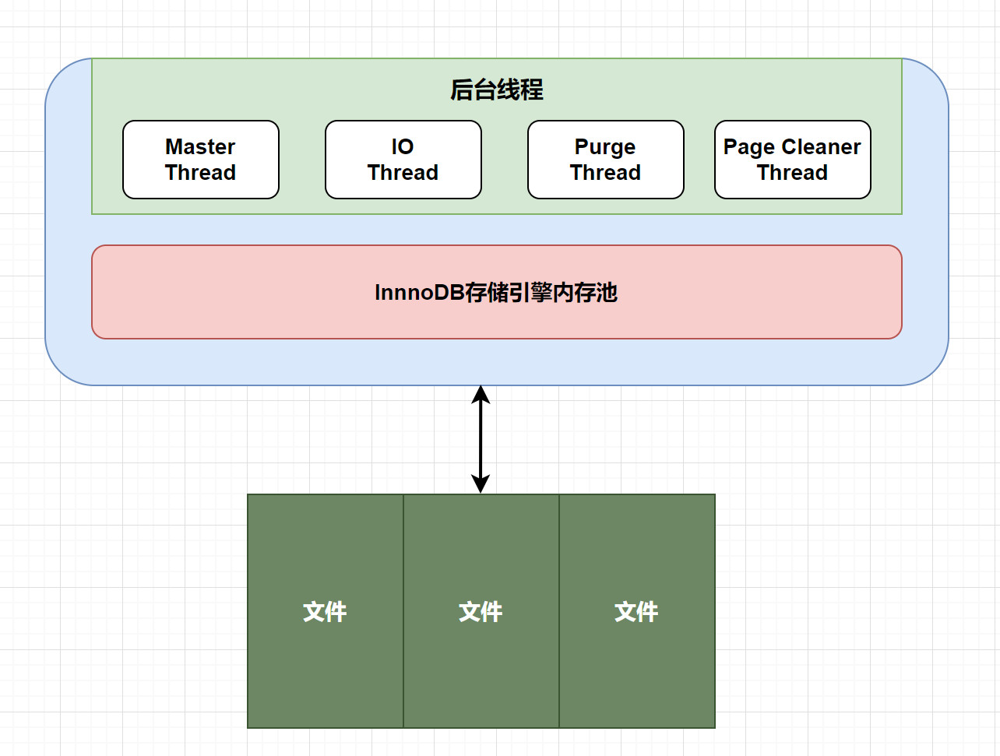

## 1.3 线程模型



多线程模型

- InnoDB存储引擎采用多线程模型，其后台运行多个不同的后台线程，每个线程负责处理特定的任务。

后台线程功能

1.  **刷新内存池数据：** 后台线程负责定期刷新内存池中的数据，以确保缓冲池中的内存缓存保持最新的数据。 
2.  **数据文件刷新：** 将已修改的数据文件刷新到磁盘文件，确保数据持久化，防止数据丢失。 
3.  **异常恢复：** 在数据库发生异常的情况下，后台线程负责恢复数据库到正常运行状态，保障数据库的稳定性和可靠性。 

后台线程种类

1.  **刷新线程（flush thread）：** 负责将缓冲池中的脏页刷新到磁盘上的数据文件。 
2.  **检查点线程（checkpoint thread）：** 定期触发检查点操作，将缓冲池中的数据页刷新到数据文件，并记录最后一个检查点的LSN（日志序列号）。 
3.  **日志写入线程（log write thread）：** 将日志缓冲池中的日志写入磁盘上的日志文件，保证事务的持久性。 
4.  **后台IO线程（background IO thread）：** 负责处理后台IO操作，如读取和写入数据文件等。 

### 1.3.1 IO Thread

在InnoDB中，大量采用了异步IO（AIO）技术来进行读写处理，这一特性可以显著提高数据库的性能。通过异步IO，InnoDB能够在进行IO操作时不阻塞其他线程的执行，从而更高效地处理读写请求。

IO线程配置


在InnoDB 1.0版本之前，共有4个IO Thread，分别是：

- **write thread**：负责写操作，将缓存脏页刷新到磁盘。
- **read thread**：负责读取操作，将数据从磁盘加载到缓存页。
- **insert buffer thread**：负责将写缓冲内容刷新到磁盘。
- **log thread**：负责将日志缓冲区内容刷新到磁盘。

而在后续版本中，read thread和write thread分别增大到了4个，总共有10个IO线程。


要查看InnoDB的IO线程状态，可以使用MySQL的命令`show engine innodb status;`，该命令将显示当前InnoDB引擎的详细状态信息，包括IO线程的数量和状态等。

```sql
FILE I/O
--------
I/O thread 0 state: waiting for i/o request (insert buffer thread)
I/O thread 1 state: waiting for i/o request (log thread)
I/O thread 2 state: waiting for i/o request (read thread)
I/O thread 3 state: waiting for i/o request (read thread)
I/O thread 4 state: waiting for i/o request (read thread)
I/O thread 5 state: waiting for i/o request (read thread)
I/O thread 6 state: waiting for i/o request (write thread)
I/O thread 7 state: waiting for i/o request (write thread)
I/O thread 8 state: waiting for i/o request (write thread)
I/O thread 9 state: waiting for i/o request (write thread)
Pending normal aio reads: [0, 0, 0, 0] , aio writes: [0, 0, 0, 0] ,
 ibuf aio reads:, log i/o's:, sync i/o's:
Pending flushes (fsync) log: 0; buffer pool: 0
681521 OS file reads, 1808551 OS file writes, 1586763 OS fsyncs
0.00 reads/s, 0 avg bytes/read, 0.12 writes/s, 0.12 fsyncs/s
```

### 1.3.2 purge Thread

Thread事务提交之后，其使用的undo日志将不再需要，因此需要Purge Thread回收已经分配的undo页。

```sql
mysql> show variables like '%innodb_purge_threads%';

+----------------------+-------+
| Variable_name        | Value |
+----------------------+-------+
| innodb_purge_threads | 4     |
+----------------------+-------+
1 row in set (0.01 sec)
```


InnoDB1.2+开始，支持多个Purge Thread 这样做的目的为了加快回收undo页（释放内存）

### 1.3.3 Page Clean Thread

作用是将脏数据刷新到磁盘，脏数据刷盘后相应的redo log也就可以覆盖，即可以同步数据，又能达到redo log循环使用的目的。会调用write thread线程处理。

```sql
mysql> show variables like '%innodb_page_cleaners%';
+----------------------+-------+
| Variable_name        | Value |
+----------------------+-------+
| innodb_page_cleaners | 1     |
+----------------------+-------+
```

### 1.3.4 Master Thread

#### 主要功能

InnoDB的Master Thread是主线程，担负着调度其他各个线程的重要任务，其优先级最高。主要功能包括：

- 异步刷新缓冲池中的数据到磁盘，以保证数据的一致性。
- 调度各个线程执行特定的任务，包括脏页的刷新、undo页的回收、redo日志的刷新、合并写缓冲等。

#### 操作频率及具体操作

##### 每1秒的操作：

1.  **刷新脏页数据到磁盘：** 

- 根据脏页比例达到75%才执行刷新操作。
- 刷新脏页的数量受到innodb_io_capacity参数的控制，该参数默认值为200。

示例输出： 

```sql
mysql> show variables like 'innodb_io_capacity';
+--------------------+-------+
| Variable_name      | Value |
+--------------------+-------+
| innodb_io_capacity | 200   |
+--------------------+-------+
```