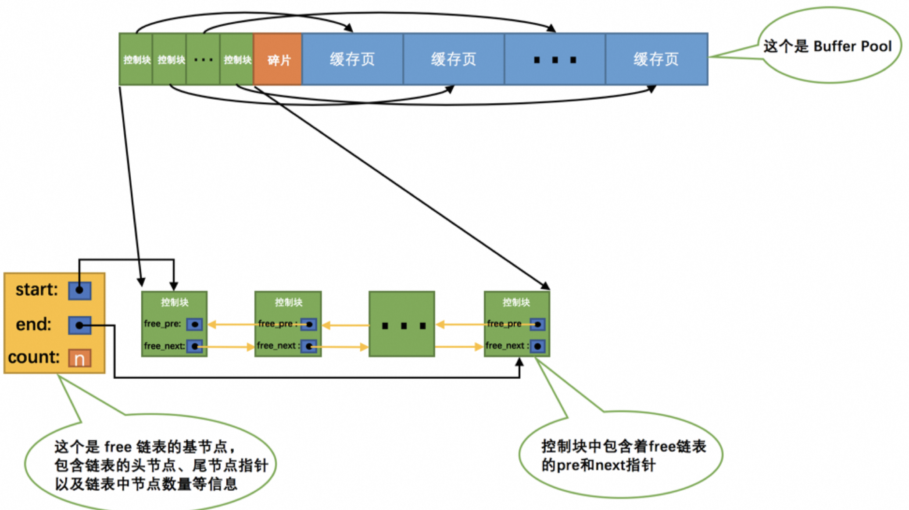
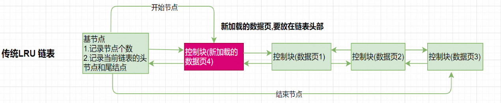
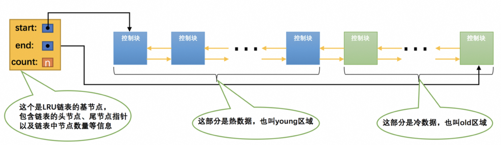

# 一、 Page 管理机制

Buffer Pool 的底层采用链表数据结构管理Page。在InnoDB访问表记录和索引时会在Page页中缓存，以后使用可以减少磁盘IO操作，提升效率。

## 1.1 Page 页的分类


- free page ： **空闲page**，未被使用
- clean page：被使用page，**数据没有被修改过**
- dirty page：脏页，被使用page，数据被修改过，**页中数据和磁盘的数据**产生了不一致

## 1.2 Page 页如何管理

针对上述的三种各类型，InnoDB 通过三种链表结构来维护和管理

### 1.2.1 Free List

- **问题：** 当从磁盘上读取一个页到 Buffer Pool 中时，需要确定该页放置在哪个缓存页的位置，以及如何区分哪些缓存页是空闲的，哪些已被使用。
- **解决方案：** 利用控制块来记录缓存页的使用情况，并维护一个空闲链表（free链表）。
- **总结**： 空闲缓冲区，管理free page

####  初始化过程

- 在 MySQL 服务器启动时，首先完成对 Buffer Pool 的初始化过程。
- 初始化过程包括向操作系统申请 Buffer Pool 的内存空间，并将其划分成若干对控制块和缓存页。

#### 空闲链表管理

- **空闲链表结构：** 将所有空闲的缓存页对应的控制块组成一个链表，即空闲链表。
- **初始化状态：** 刚完成初始化的 Buffer Pool 中，所有缓存页都是空闲的，因此每个缓存页对应的控制块都会被加入到空闲链表中。
- **空闲链表示意图：** 假设 Buffer Pool 可容纳的缓存页数量为 n，空闲链表的效果图如下所示：



- ** 基节点:** 从图中可以看出，为了管理好 Free 链表使用了一个 基节点，它不记录缓存页信息(单独申请空间)，它里面就存放了free链表的头节点的地址，尾节点的地址，还有free链表里当前有多少个节点。
  -  **内存分配：** 链表基节点的内存空间单独申请，不包含在为 Buffer Pool 申请的一大片连续内存空间之内。 
  -  **内存占用：** 在 MySQL 5.7.21 版本中，每个基节点只占用 40 字节大小的内存空间。 

#### 空闲页的使用流程

- **空闲链表的使用：** 当需要从磁盘中加载一个页到 Buffer Pool 中时，我们从空闲链表中取一个空闲的缓存页。
- **填写控制块信息：** 将该缓存页对应的控制块的信息填写上，包括该页所在的表空间、页号等信息。
- **节点移除：** 将该缓存页对应的空闲链表节点从链表中移除，表示该缓存页已经被使用。

### 1.2.2 Flush List

InnoDB引擎为了提高处理效率，在每次修改缓冲页后，并不是立刻把修改刷新到磁盘上，而是在未来的某个时间点进行刷新操作. 所以需要使用到flush链表存储脏页，凡是被修改过的缓冲页对应的控制块都会作为节点加入到flush链表.
flush链表的结构与free链表的结构相似


> 注: 脏页不但存在于flush链表，也在LRU链表中，但是两种互不影响，LRU链表负责管理page的可用性和释放，而flush链表负责管理脏页的刷盘操作。

### 1.2.3 LRU List

> Buffer Pool 对应的内存大小毕竟是有限的，如果需要缓存的页占用的内存大小超过了 Buffer Pool 大小，也就 是 free链表 中已经没有多余的空闲缓存页的时候岂不是很尴尬，发生了这样的事儿该咋办？
> 当然是把某些旧的缓存页从 Buffer Pool 中移除，然后再把新的页放进来 【数据淘汰策略】
> 淘汰的目标： 提高缓存命中率

####  普通 LRU 算法

LRU = Least Recently Used（最近最少使用）: 就是末尾淘汰法，新数据从链表头部加入，释放空间时从末尾淘汰.


1. 当要访问某个页时，如果不在Buffer Pool，需要把该页加载到缓冲池,并且把该缓冲页对应的控制块作为节点添加到LRU链表的头部。
2. 当要访问某个页时，如果在Buffer Pool中，则直接把该页对应的控制块移动到LRU链表的头部
3. 当需要释放空间时,从最末尾淘汰

也就是说：只要我们使用到某个缓存页，就把该缓存页调整到 LRU链表 的头部，这样 LRU链表 尾部就是最近最少使用的缓存页

##### 普通LRU链表的优缺点

| 优点                                                         | 缺点                                                         |
| ------------------------------------------------------------ | ------------------------------------------------------------ |
| 所有最近使用的数据都在链表表头，最近未使用的数据都在链表表尾,保证热数据能最快被获取到。 | 如果发生全表扫描（比如：没有建立合适的索引 or 查询时使用select * 等），则有很大可能将真正的热数据淘汰掉. |

由于MySQL中存在预读机制，很多预读的页都会被放到LRU链表的表头。如果这些预读的页都没有用到的话，这样，会导致很多尾部的缓冲页很快就会被淘汰。

##### 问题分析

情况一：InnoDB预读机制

- **线性预读**：当顺序访问某个区的页面超过`innodb_read_ahead_threshold 默认 56`值时，会异步读取下一个区的全部页面到Buffer Pool中。
- **随机预读**：当Buffer Pool中已缓存某个区的13个连续页面时，会异步读取本区所有页面到Buffer Pool。
- 预读可能导致缓存命中率下降，因为未使用的预读页面会占据LRU链表头部，导致常用页面被淘汰。

情况二：全表扫描查询

- 全表扫描意味着访问表中所有页，特别是对记录较多的表。
- 每次全表扫描会将所有页加载到Buffer Pool中，影响其他查询语句的性能。
- 频繁全表扫描会导致Buffer Pool中常用页被替换，降低缓存命中率。

##### 解决方案

1.  **调整预读参数**： 
    - 合理设置`innodb_read_ahead_threshold`和`innodb_random_read_ahead`，避免过多预读或随机预读。
    - 根据系统负载和查询模式动态调整参数值，以优化缓存利用率。
2.  **优化查询语句**： 
    - 避免全表扫描，优化查询条件并建立合适的索引。
    - 提高查询效率，减少对Buffer Pool的冲击，避免频繁替换常用页。

注意事项：

- 预读机制在某些情况下可能并不适用，需要根据实际情况进行调整。
- 查询语句的优化是提高缓存命中率的关键，需要结合索引和查询条件进行综合考虑。

#### 改进 LRU 算法



- InnoDB将LRU链表分成两半，即young区域和old区域。
  - 一部分存储使用频率非常高的缓存页，所以这一部分链表也叫做 热数据 ，或者称 young区域 。 
  - 另一部分存储使用频率不是很高的缓存页，所以这一部分链表也叫做 冷数据 ，或者称 old区域 。
- 这个划分成两截的比例可以通过系统变量`innodb_old_blocks_pct`来确定，表示old区域在LRU链表中所占的比例,默认是 37%

```sql
mysql> SHOW VARIABLES LIKE 'innodb_old_blocks_pct';
+-----------------------+-------+
| Variable_name | Value |
+-----------------------+-------+
| innodb_old_blocks_pct | 37 |
+-----------------------+-------+
```

##### 优化场景分析

1. **针对预读的页面优化：** 
   - 控制块会放到old区域的头部，使得预读到Buffer Pool却不进行后续访问的页面从old区域逐出，不影响young区域的频繁使用页面。
2. **针对全表扫描的优化：** 
   - 当进行全表扫描时，首次加载到Buffer Pool的页放到old区域头部，但后续访问会将页面放到young区域头部，使得高频率页面顶掉低频率页面。
   - 设定一个时间间隔，如果页面的访问时间间隔小于该值，则页面不会从old区域移动到young区域的头部，否则移动到young区域头部。
   - 这个时间间隔由系统变量`innodb_old_blocks_time`控制，单位为毫秒，默认为1000ms。

##### 基础优化参数

- `innodb_old_blocks_pct`：控制old区域在LRU链表中所占的比例，可以在启动时或者运行时设置。
- `innodb_old_blocks_time`：控制页面访问时间间隔，决定是否将页面从old区域移动到young区域的头部。

## 1.3  刷新脏页到磁盘

后台线程定期将脏页刷新到磁盘，以确保数据持久化。刷新路径主要有两种：

1.  **LRU链表刷新（BUF_FLUSH_LRU）**： 
    - 后台线程定期从LRU链表尾部开始扫描页面，数量由系统变量`innodb_lru_scan_depth`指定。
    - 发现脏页时，将其刷新到磁盘。
    - 目的是将部分冷数据刷新到磁盘，以释放内存空间。
2.  **Flush链表刷新（BUF_FLUSH_LIST）**： 
    - 后台线程定期从flush链表中刷新部分页面到磁盘。
    - 刷新速率取决于系统繁忙程度。
    - 目的是根据系统负载情况将脏页刷新到磁盘。

在某些情况下，后台线程刷新脏页的速度较慢，导致用户线程在加载磁盘页到Buffer Pool时无可用缓存页。
此时，可能会尝试释放LRU链表尾部的未修改页面，或者同步刷新LRU链表尾部的一个脏页到磁盘。
这种刷新单个页面到磁盘的方式称为**BUF_FLUSH_SINGLE_PAGE**。

在系统特别繁忙时，可能出现用户线程批量刷新脏页的情况，这会严重降低处理速度，因为磁盘速度较慢。
这种情况通常发生在redo日志的checkpoint时，属于一种迫不得已的情况。
