## 1.2 磁盘结构

https://dev.mysql.com/doc/refman/8.0/en/innodb-tablespace.html

InnoDB磁盘主要包含Tablespaces，InnoDB Data Dictionary、Doublewrite Buffer、redo log和Undo Logs。

- Tablespaces: 表空间分为系统表空间（ibdata1文件）、临时表空间、常规表空间、Undo表空间以及file-per-table表空间。系统表空间又包括双写缓冲区（Doublewrite Buffer）、Change Buffer等
- Doublewrite buffer：innodb 将数据页写到文件之前存放的位置。8.0.20版本之前，doublewrite buffer存放在InnoDB系统表空间中，8.0.20版本后存放在doublewrite中
- Redo log：存储的是log buffer刷到磁盘的数据
- Undo log：存在于global临时表空间中，用于事务的回滚

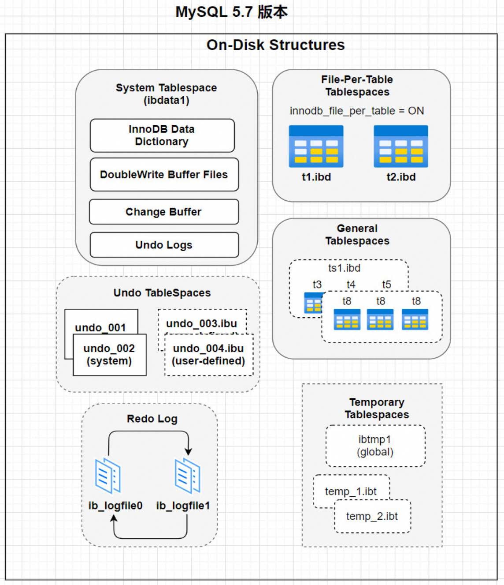

### 1.2.1 表空间 ( Tablespaces )

InnoDB 其实是使用 页 为基本单位来管理存储空间的，默认的 页 大小为 16KB 。 对于 InnoDB 存储引擎来说，每个索引都对应着一棵 B+ 树，该 B+ 树的每个节点都是一个数据页，数据页之 间不必要是物理连续的，因为数据页之间有 双向链表 来维护着这些页的顺序。 InnoDB 的聚簇索引的叶子节点存储了完整的用户记录，也就是所谓的索引即数据，数据即索引。

为了更好的管理这些页，InnoDB 提出了表空间的概念，对应了文件系统上一个或者多个真实文件

#### 系统表空间 （The System Tablespace）

- 存储内容: 包含InnoDB数据字典，Doublewrite Buffer，Change Buffer，Undo Logs的存储区域。系统表空间也默认包含任何用户在系统表空间创建的表数据和索引数据。
- 具体结构： 默认情况下，InnoDB会在数据目录下创建一个名为 ibdata1 的文件，大小为 12M。这个文件就是对应的系统表空间在文件系统上的表示。为什么只有12M呢？因为这个文件是所谓的自扩展文件，即当不够用的时候它会自动增加文件大小。

```sql
[root@localhost ~]# cd /var/lib/mysql 
[root@localhost mysql]# ll ibdata*
-rw-r----- 1 mysql mysql 79691776 1月  25 06:42 ibdata1
```

- 系统表空间是一个共享的表空间因为它是被多个表共享的。该空间的数据文件通过参数`innodb_data_file_path`控制，默认值是 `ibdata1:12M:autoextend` (文件名为ibdata1、12MB、自动扩展)。

```sql
mysql> show variables like '%innodb_data_file_path%';
+-----------------------+------------------------+
| Variable_name         | Value                  |
+-----------------------+------------------------+
| innodb_data_file_path | ibdata1:12M:autoextend |
+-----------------------+------------------------+
1 row in set (0.38 sec)
```

我们还可以将系统表空间对应的文件路径配置到数据目录之外，甚至可以配置到单独的磁盘分区上。涉及到的启动参数是innodb_data_file_path和innodb_data_home_dir，具体的配置逻辑较为复杂，需要根据实际情况进行调整。

#### 独立表空间

**默认开启**，独立表空间是一个单表表空间，该表创建于自己的数据文件中，而非创建于系统表空间中。当`innodb_file_per_table`选项开启时，表将被创建于表空间中。否则，innodb将被创建于系统表空间中。

```sql
mysql> show variables like '%innodb_file_per_table%';
+-----------------------+-------+
| Variable_name         | Value |
+-----------------------+-------+
| innodb_file_per_table | ON    |
+-----------------------+-------+
1 row in set (0.14 sec)
```

每个表文件表空间由一个.ibd数据文件代表，该文件默认被创建于数据库目录中。

比如我们使用了 独立表空间 去存储 xx 数据库下的 test 表的话，那么在该表所在数据库对应的 xiaohaizi 目录下会为 test 表创建这两个文件：

test.frm test.ibd

#### 共享 VS 独立表空间

| 优缺点 | 共享表空间                                                   | 独立表空间                                       |
| ------ | ------------------------------------------------------------ | ------------------------------------------------ |
| 优点   | 可以将表空间分成多个文件存放到各个磁盘上，方便管理。         | 每个表都有独立的表空间，数据和索引分开存放。     |
|        | 空间文件大小不受表大小的限制。                               | 可以实现单表在不同的数据库中移动。               |
|        | 数据和文件放在一起方便管理。                                 | 空间可以回收，删除或清空表后存储空间立即返回。   |
| 缺点   | 所有数据和索引存放到一个文件中，对于大量删除操作后表空间中会有大量空隙，不适合某些应用。 | 单表增加过大可能会导致表空间过大，如超过100个G。 |


#### 通用表空间（General Tablespaces） 

-  MySQL 5.7开始支持通用表空间管理功能,类似于系统表空间，也是共享表空间，可以存储多个表的数据。 
-  通用表空间为通过create tablespace语法创建的共享表空间。通用表空间可以创建于mysql数据目录外的其他表空间(自定义存储路径)，其可以容纳多张表，且其支持所有的行格式。 
-  相比File-per-table表空间，通用表空间由于多表共享表空间，消耗的内存会更少一点，具有潜在的内存优势。（占用的磁盘空间会更小） 

##### 指定存储路径创建一张表

###### 方式1: 指定 data directory 

```shell
[root@localhost ~]# mkdir -p /mdata/general
[root@localhost ~]# cd /mdata/general/

# 设置文件所有者为mysql(第一个mysql是用户,第二个为用户组)
[root@localhost general]# chown mysql.mysql /mdata/general/
```

 

```sql
-- 连接mysql,选择数据库创建表,并且将该表创建于刚刚创建的通用表空间目录
mysql> create table test1.test_ger(a int) data directory='/mdata/general';
Query OK, 0 rows affected (0.50 sec)
```

 

```shell
[root@localhost general]# tree
.
└── test1
    └── test_ger.ibd

1 directory, 1 file

[root@localhost general]# cd /var/lib/mysql/test1/
[root@localhost test1]# ll
-rw-r----- 1 mysql mysql  8554 1月  29 01:41 test_ger.frm
-rw-r----- 1 mysql mysql    33 1月  29 01:41 test_ger.isl
#cat test_ger.isl 一个文本文件，内容就是idb文件的路径，做了一个链接
[root@localhost test1]# cat test_ger.isl 
/mdata/general/test1/test_ger.ibd
```

######  方式2: 使用通用表空间 

```sql
-- 1.创建通用表空间 (file_block_size就是指定page_size大小)
mysql> create tablespace ger_space add datafile '/mdata/general/ger_space.ibd' file_block_size=16384;
Query OK, 0 rows affected (0.15 sec)

-- 查看目录
[root@localhost mysql]# cd /mdata/general/
[root@localhost general]# ll ger*
-rw-r----- 1 mysql mysql 65536 1月  29 01:56 ger_space.ibd

-- 查看通用表空间信息
mysql> select * from information_schema.innodb_sys_tablespaces where name = 'ger_space'\G;
*************************** 1. row ***************************
         SPACE: 153
          NAME: ger_space
          FLAG: 2048
   FILE_FORMAT: Any
    ROW_FORMAT: Any
     PAGE_SIZE: 16384 --页大小16K
 ZIP_PAGE_SIZE: 0
    SPACE_TYPE: General
 FS_BLOCK_SIZE: 4096
     FILE_SIZE: 65536
ALLOCATED_SIZE: 32768
1 row in set (0.00 sec)

-- 在通用表空间创建一张表
mysql> create table test1.test_ger2(a int) tablespace=ger_space;
Query OK, 0 rows affected (0.13 sec)

-- 查看表信息
mysql> show create table test_ger2;
+-----------+----------------------------------------------------------------------------------------------------------------------------------+
| Table     | Create Table                                                                                                                     |
+-----------+----------------------------------------------------------------------------------------------------------------------------------+
| test_ger2 | CREATE TABLE `test_ger2` (
  `a` int(11) DEFAULT NULL
) /*!50100 TABLESPACE `ger_space` */ ENGINE=InnoDB DEFAULT CHARSET=utf8mb4 |
```

####  撤销表空间（Undo Tablespaces） 

-  撤销表空间，用来保存回滚日志，即undo logs, undo Log 的数据默认在系统表空间ibdata1文件中 
-  可以通过 `innodb_undo_directory`属性 查看回滚表空间的位置。默认路径是mysql的数据存储路径。 

```sql
mysql> show variables like 'innodb_undo_directory';
+-----------------------+-------+
| Variable_name         | Value |
+-----------------------+-------+
| innodb_undo_directory | ./    |
+-----------------------+-------+
```

-  InnoDB使用的undo表空间由 `innodb_undo_tablespaces` 配置选项控制，设置undo独立表空间个数，范围为0-128， 默认为0，0表示不开启独立undo表空间 ,且 undo日志存储在ibdata1文件中。 

```sql
mysql> show variables like '%innodb_undo_tablespace%';
+-------------------------+-------+
| Variable_name           | Value |
+-------------------------+-------+
| innodb_undo_tablespaces | 0     |
+-------------------------+-------+
1 row in set (0.01 sec)
```

**什么时候需要来设置这个参数 ?**
	当DB写压力较大时，可以设置独立undo表空间，把undo从 ibdata文件中分离开来，指定 `innodb_undo_directory` 目录存放，可以制定到高速磁盘上，加快undo log 的读写性能。 

-  undo日志使用共享表空间存在的问题: 因为共享表空间不会自动收缩,**即使事务关闭,undo log也会一直占用空间**, 所以可能会出现因为大事物而导致ibdata1文件过大的问题.
- 解决办法： MySQL5.7中引入了一个新的参数 `innodb_undo_log_truncate`**表示是否开启自动收缩undolog的表空间的操作**。如果配置为`ON`，并且配置了2个或2个以上的undolog表空间数据文件，当某一个日志文件大小超过设置的最大值之后，就会自动的收缩表空间数据文件。 

在回收表空间数据文件的时候，被回收的表空间数据文件会临时下线，为了保证undolog一直有地方可以写，此时要保证至少还有1个undolog日志文件是在线的。这就是要求`innodb_undo_tablespaces>=2`的根本原因

-   8.0 对于undo log存储的进一步优化： 

- 从MySQL8.0版本开始，MySQL默认对undo进行了分离操作，也就是说，不需要在初始化中手动配置参数，默认会在datadir目录下生成两个undo表空间文件undo_001 和 undo002 并且可以在线的增加和删除undo表空间文件, 进行动态扩容和收缩.
  查询undo log信息 

```sql
mysql> select tablespace_name, file_name from information_schema.files where file_type like 'undo log';
+-----------------+------------+
| TABLESPACE_NAME | FILE_NAME  |
+-----------------+------------+
| innodb_undo_001 | ./undo_001 |
| innodb_undo_002 | ./undo_002 |
+-----------------+------------+

-- 文件位置 /var/lib/mysql
[root@localhost mysql]# ll undo*
-rw-r-----. 1 mysql mysql 16777216 12月 31 00:21 undo_001
-rw-r-----. 1 mysql mysql 16777216 12月 31 00:21 undo_002
```

 

####  临时表空间（Temporary Tablespaces） 

-  用户**创建的临时表和磁盘内部临时表创建于共享临时表空间中**。MySQL 5.7起，开始采用独立的临时表空间,命名ibtmp1文件，初始化12M，且默认无上限。 
-  全局临时表空间默认是数据目录的ibtmp1文件，所有临时表共享,可以通过`innodb_temp_data_file_path` 属性指定临时表空间的位置。 

```sql
mysql> select @@innodb_temp_data_file_path;
+------------------------------+
| @@innodb_temp_data_file_path |
+------------------------------+
| ibtmp1:12M:autoextend        |
+------------------------------+
1 row in set (0.00 sec)
```


需要注意的是: 临时表空间最好是设置最大增长限制,否则可能会导致 ibtmp1文件过大,占用过多的磁盘空间. 

```sql
-- 设置了上限的大小，当数据文件达到最大大小时，查询将失败，并显示一条错误消息，表明表已满，查询不能往下执行，避免 ibtmp1 过大 (需要生成临时表的SQL无法被执行,一般这种SQL效率也比较低，可借此机会进行优化)
innodb_temp_data_file_path=ibtmp1:12M:autoextend:max:500M
```

-  `tmp_table_size` 参数配置内部内存临时表的大小。 

```sql
mysql> set global tmp_table_size=16*1024*1024;
Query OK, 0 rows affected (0.00 sec)

mysql> show variables like 'tmp_table_size';
+----------------+----------+
| Variable_name  | Value    |
+----------------+----------+
| tmp_table_size | 16777216 |
+----------------+----------+
1 row in set (0.00 sec)
```

注: 如果内存中的临时表超出限制，MySQL自动将其转换为磁盘上的MyISAM表tmp_table_size最大值是18446744073709551615

-  如何监控临时表与临时表空间使用情况 

```sql
mysql> show status like '%tmp%';
+-------------------------+-------+
| Variable_name           | Value |
+-------------------------+-------+
| Created_tmp_disk_tables | 0     |
| Created_tmp_files       | 6     |
| Created_tmp_tables      | 11    |
+-------------------------+-------+
3 rows in set (0.00 sec)
```

##### 优化建议

1.  **控制临时表创建比例：** 

- 建议确保 `Created_tmp_disk_tables` 和 `Created_tmp_tables` 之比不超过25%。
- 若 `Created_tmp_disk_tables` 数量较多，应检查是否存在大量慢查询或者频繁使用临时表的SQL语句。

1.  **优化临时表空间配置：** 

- 增加 `tmp_table_size` 的值，以提供更多的内存供临时表使用。
- 调整临时表空间的大小能够有效减少创建临时表的频率，提高性能。

1.  **定期重启实例：** 

- 可以选择择机重启MySQL实例，以释放 `ibtmp1` 文件。与 `ibdata1` 不同，`ibtmp1` 会在重启时被重新初始化，而 `ibdata1` 不会。

1.  **监控和优化SQL语句：** 

- 定期检查并优化执行效率低下的SQL语句，尽量避免频繁创建临时表。
- 注意检查是否有索引缺失或者索引使用不当的情况，优化查询性能。

1.  **使用合适的存储引擎：** 

- 根据业务需求和数据特点选择合适的存储引擎，例如InnoDB或者MyISAM，在某些场景下可能有不同的性能表现。

1.  **数据库参数优化：** 

- 定期审查数据库参数配置，根据实际情况调整参数以提高数据库性能和稳定性。
- 特别关注与临时表相关的参数，如 `tmp_table_size`、`max_heap_table_size` 等。

### 1.2.2 数据字典 ( Data Dictionary )

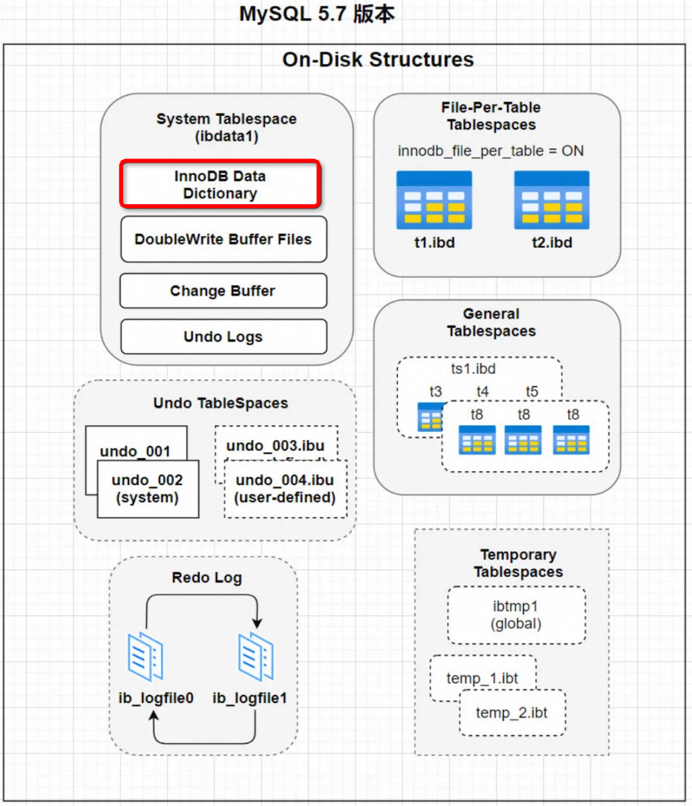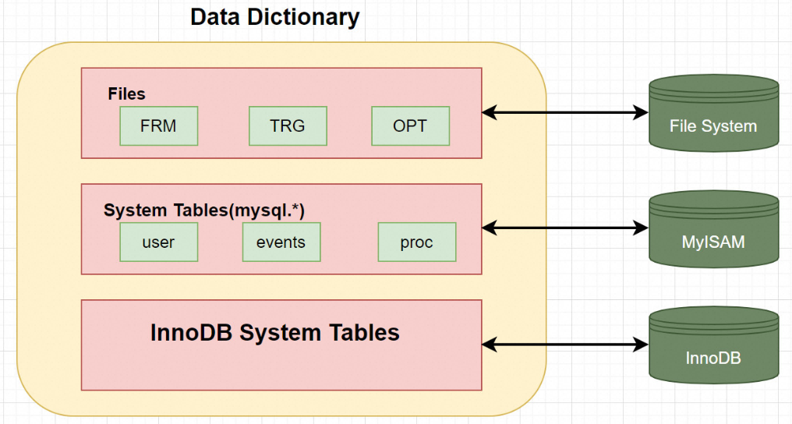

MySQL中的数据字典是一个重要的组成部分，它包含了数据库的各种元数据信息，如表结构、数据库名或表名、字段的数据类型、视图、索引、存储过程、触发器等内容。


#### 组成部分

1. 表结构：包括表名、字段名、字段类型、字段约束等信息。
2. 数据库名或表名：标识数据库和表的名称。
3. 字段的数据类型：定义了每个字段的数据类型，如整型、字符型等。
4. 视图：虚拟表，由一个或多个表的行或列组成，可以简化复杂查询。
5. 索引：提高数据检索效率的数据结构，包括主键索引、唯一索引、普通索引等。
6. 存储过程：存储在数据库中的一组SQL语句，可被重复调用。
7. 触发器：与表相关联的一段SQL代码，当指定的事件发生时自动执行。

#### 特点

- InnoDB数据字典由内部系统表组成，这些表包含用于查找表、索引和表字段等对象的元数据。
- 在MySQL 8.0之前，由于历史原因，数据字典元数据在一定程度上与InnoDB表元数据文件（.frm文件）中存储的信息重叠。

注: MySQL8.0版本以后 将所有原先存放于数据字典文件中的信息，全部存放到数据库系统表中，即将之前版本的 .frm,.opt等文件都移除了，不再通过文件的方式存储数据字典信息

### 1.2.3 双写缓冲区 ( Doublewrite Buffer Files)

#### 写失效 (部分页失效)

- InnoDB的页和操作系统的页大小不一致，InnoDB页大小一般为16K，操作系统页大小为4K，InnoDB的页写入到磁盘时，一个页需要分4次写。
- 如果存储引擎正在写入页的数据到磁盘时发生了宕机，可能出现页只写了一部分的情况，比如只写了4K，就宕机了，这种情况叫做部分写失效（partial page write），可能会导致数据丢失。


#### 双写缓冲区 Doublewrite Buffer

为了解决写失效问题，InnoDB实现了双写缓冲区，它位于系统表空间，是一个存储区域。**在BufferPool的页刷新到磁盘真正位置前**，数据**会先被存储在双写缓冲区**。这样在宕机重启时，即使发生数据页损坏，可以通过该页的副本来还原该页，然后再进行redo log重做，确保了数据页的可靠性。

默认情况下启用双写缓冲区，可以通过将 `innodb_doublewrite` 设置为0 来禁用。


```sql
mysql> show variables like '%innodb_doublewrite%';
+--------------------+-------+
| Variable_name      | Value |
+--------------------+-------+
| innodb_doublewrite | ON    |
+--------------------+-------+
1 row in set (0.01 sec)
```

#### 数据双写流程

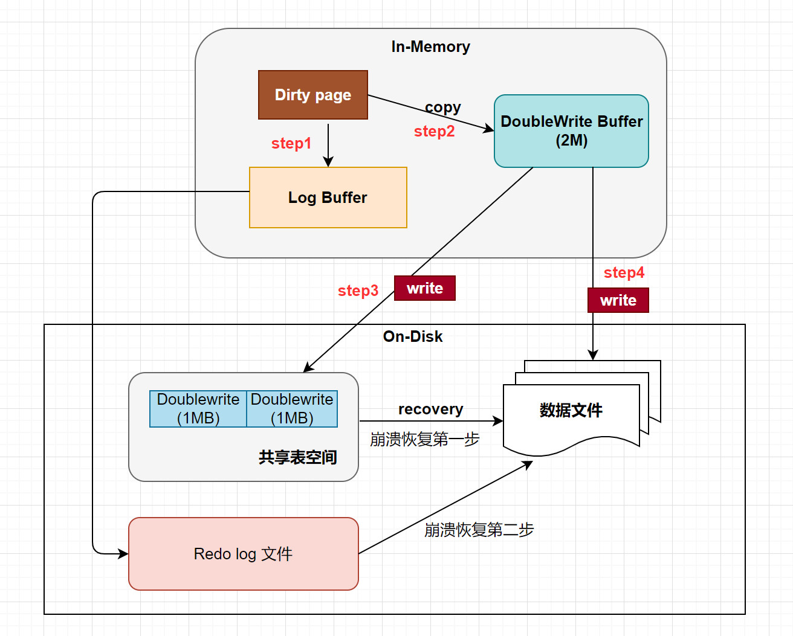

- Step 1：脏页刷新到磁盘前，先写入双写缓冲区。
- Step 2：使用 memcpy 函数将脏页复制到内存中的双写缓冲区。
- Step 3：将双写缓冲区的数据分两次，每次1MB，顺序写入共享表空间的物理磁盘上。
- Step 4：完成双写缓冲区的写入后，再将双写缓冲区中的页写入各个表的独立表空间文件中。


为啥写两次，刷一次数据文件保存数据不就可以了，为什么还要写共享表空间 ?

- 性能提升： 共享表空间是在ibdata文件中划出的连续空间，专门用于存储双写缓冲区的数据。在这个过程中，双写缓冲区中的数据是连续存储的，因此写入磁盘时可以实现顺序写入。顺序写入通常比随机写入更快，因为它可以最大程度地减少磁盘头寻址的时间，从而提高了磁盘写入性能。
- 数据可靠性： 完成共享表空间的写入后，再将数据写入到各个表的独立表空间文件中。这时，数据的写入变为离散的，因为每个表的独立表空间文件都是分散在磁盘上的。虽然这种写入方式可能比较慢，但它确保了数据的分散存储，提高了数据的可靠性。即使出现了硬件故障或其他意外情况，只影响到了某个表的数据文件，其他表的数据仍然是安全的。

双写缓冲区在写入过程中发生了宕机，数据页仍然有可能丢失。双写缓冲区的设计是为了**减少写失效（partial page write）的风险**，但并不能完全消除它

#### Change buffer

系统表空间中的change buffer是内存缓冲池中change buffer的备份，也就是说被持久化到了系统表空间中。在崩溃恢复的时候会从系统表空间的change buffer中读取信息到buffer pool。

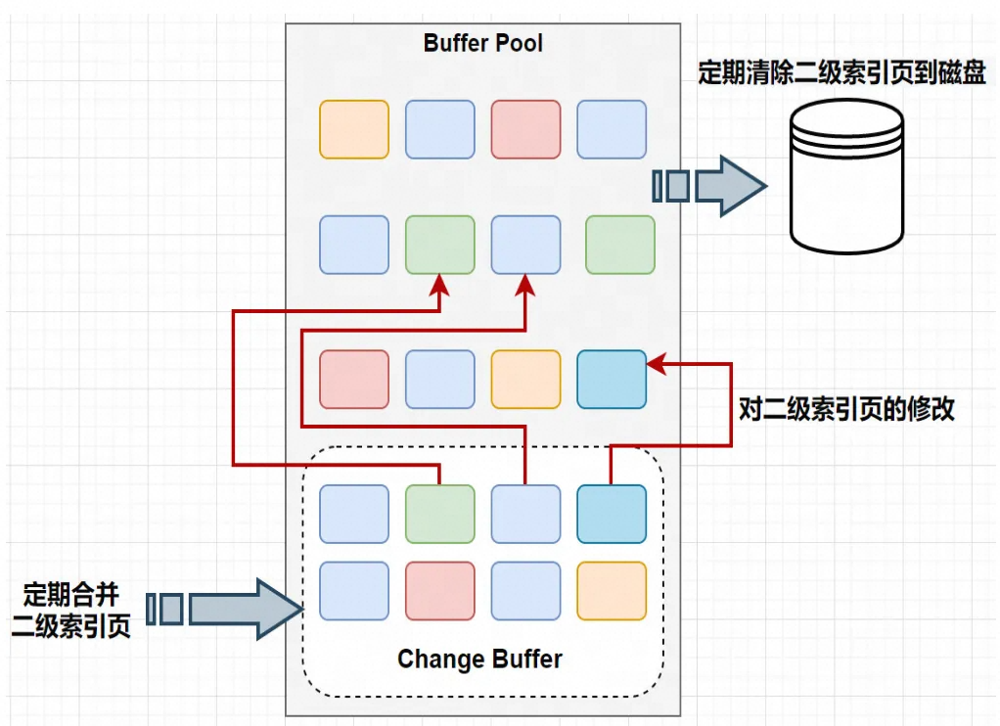

### 1.2.4 重做日志 ( redo log ) 

#### 背景介绍

-  **持久性要求：** 对于已提交的事务，即使系统发生崩溃，其对数据库的更改也不能丢失。
-  **问题：** 

- 在事务提交前将所有修改的页面刷新到磁盘浪费资源。
- 随机IO导致刷新速度慢。

-  **解决方案：** 

- 【数据副本】记录事务执行过程中所做的修改，称为 Redo 日志。
- 【顺序写入】Redo Log 就是 WAL

- **什么是 WAL**: 

- WAL 的全称是 Write-Ahead Logging，中文称为预写式日志，是一种数据安全写入机制。在 MySQL 中，redo log 就是采用了 WAL 机制。

- 为什么使用WAL？

- 磁盘的写操作是随机 IO，比较耗性能。通过将每一次的更新操作先写入日志中，然后再写入磁盘，就可以将随机写操作转变为顺序写操作，从而提高性能。WAL 的核心在于将随机写转变为了顺序写，降低了客户端的延迟，提升了系统的吞吐量。

#### 基本概念

InnoDB 引擎对数据的更新，是先将更新记录写入 redo log 日志，然后在系统空闲的时候或者是按照设定的更新策略再将日志中的内容更新到磁盘之中。这种技术可以大大减少 IO 操作的频率，提升数据刷新的效率。

- redo log：被称作重做日志,包括两部分：

- 一个是内存中的日志缓冲：`redo log buffer`
- 另一个是磁盘上的日志文件： `redo log file` 。 

- 当故障发生致使内存数据丢失后，InnoDB会在重启时，经过重放 redo，将Page恢复到崩溃之前的状态 **通过Redo log可以实现事务的持久性 。**

#### 脏页落盘流程

- mysql 每执行一条 DML 语句，先将记录写入 redo log buffer ( redo日志记录的是事务对数据库做了哪些修改 ) 。后续某个时间点再一次性将多个操作记录写到 redo log file 


当进行数据页的修改操作时: 

- 首先修改在缓冲池中的页，然后再以一定的频率刷新到磁盘上。
- 页从缓冲池刷新回磁盘的操作并不是在每次页发生更新时触发，而是通过一种称为`CheckPoint`的机制刷新回磁盘。 

#### CheckPoint

如果重做日志可以无限地增大，同时缓冲池也足够大，那么是不需要将缓冲池中页的新版本刷新回磁盘。因为当发生宕机时，完全可以通过重做日志来恢复整个数据库系统中的数据到宕机发生的时刻。


- 文件结构： 

- 可以配置为一组文件，例如，4 个文件，每个文件大小为 1GB，总共可记录 4GB 的操作。
- 写入时从头开始写，写到末尾后又回到开头，形成循环写的机制。
- Write Position： 写入偏移量
- Checkpoint： 检查点

- 作用：

- 提速： 缩短数据库的恢复时间 
- 刷脏： 缓冲池不够用时，将脏页刷新到磁盘 
- 崩溃恢复： 重做日志不可用时，刷新脏页。 

- 刷脏的时机： 

- sharp checkpoint：强制落盘。把内存中所有的脏页都执行落盘操作。**只有当关闭数据库之前才会执行**。
- fuzzy checkpoint：模糊落盘。把一部分脏页执行落盘操作

- 【定期执行】Master Thrad Checkpoint 主线程定时将脏页写入磁盘 每秒或每10s执行一次脏页。
- 【脏页淘汰】FLUSH_LRU_LIST buffer pool有脏页换出，执行落盘
- 【redo log 满】Async/Sync Flush checkpoint 当redo log快写满的时候执行落盘

- 当redo log超过75%小于90%会执行异步落盘
- 当redo log超过90%，会执行同步落盘操作。会阻塞写操作。

- 【脏页占比过高】Dirty Page too much checkpoint 如果buffer pool中脏页太多，脏页率超过75%执行落盘

- 总结：  CheckPoint机制的重要性在于确保数据库系统在发生宕机或异常情况时能够快速恢复到一个一致的状态，同时有效管理缓冲池中的脏页。

#### Redo Log 持久化

缓冲区数据一般情况下是无法直接写入磁盘的，中间必须经过操作系统缓冲区( OS Buffer )。因此， redo log buffer 写入 redo logfile 实际上是先写入 OS Cache，然后再通过系统调用 fsync() 将其刷到 redo log file.


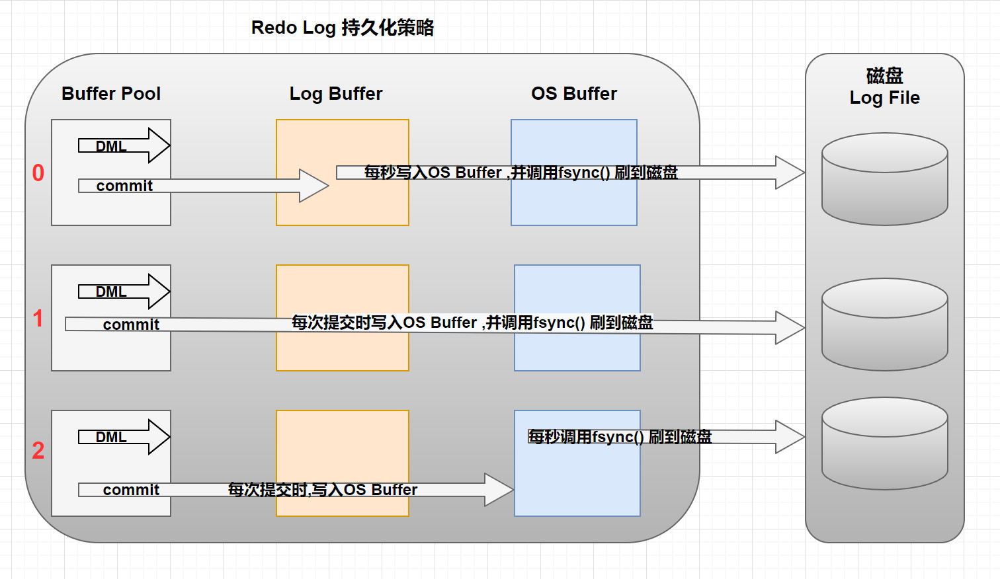

1.  存在于redo log buffer 内存区域中 
2.  向磁盘写入,但是没有真正写入磁盘,而是保存在文件系统缓存中 
3.  持久化到磁盘 

Redo Buffer 持久化到 redo log 的策略，可通过`Innodb_flush_log_at_trx_commit` 设置：

| 参数值             | 含义                                                         |
| ------------------ | ------------------------------------------------------------ |
| 0 (延迟写)         | 事务提交时不会将 `redo log buffer`中日志写入到 `os buffer`，而是每秒写入 `os cache`并调用 `fsync()`写入到 `redo log file`中。也就是说设置为0时是(大约)每秒刷新写入到磁盘中的，当系统崩溃，会丢失1秒钟的数据。 |
| 1  (实时写,实时刷) | 事务每次提交都会将 `redo log buffer`中的日志写入 `os cache`并调用 `fsync()`刷到 `redo log file`中。这种方式即使系统崩溃也不会丢失任何数据，但是因为每次提交都写入磁盘，IO的性能较差。 |
| 2 (实时写, 延时刷) | 每次提交都仅写入到 `os buffer`，然后是每秒调用 `fsync()`将 `os cache`中的日志写入到 `redo log file`。 |

- **一般建议选择取值 1，数据不会丢**
- 这里类似于 RocketMQ 内存写成功，但是刷盘失败: [rocketmq 最佳实践](https://github.com/apache/rocketmq/blob/develop/docs/cn/best_practice.md#3-日志的打印)

这意味着在事务提交后，数据页的修改可能仍然在内存中，并没有立即刷新到磁盘上。MySQL会根据自身的策略将内存中的数据页刷新到磁盘，这个过程可能会在事务提交后的某个时间点发生。

问题： 如果事务没有提交的时候,redo log buffer中的部分日志有可能被持久化到磁盘吗 ?

回答： 以下两种场景都会触发持久化

- redo log buffer 占用的空间即将达到 innodb_log_buffer_size 一半的时候，后台线程会主动写盘。 
- 并行的事务提交的时候，顺带将某个未提交的事务的redo log buffer 持久化到磁盘。因为redo log buffer 是共享的，因此一些正在执行中的事务的redo log信息也有可能被持久化到磁盘中。 

#### Redo Log 日志格式

| **日志类型** | **描述**                           | **举例**                                                     |
| ------------ | ---------------------------------- | ------------------------------------------------------------ |
| 物理日志     | 记录每个页中存储的具体值及修改操作 | 某个事物将系统表空间中的第100个页面中偏移量为1000处的那个字节的值1改为2. |
| 逻辑日志     | 记录数据变动的逻辑过程或SQL语句    | 把一个page页中的一个数据从1改为2，再从2改为3,逻辑日志就会记录1->2,2->3这个数据变化的过程. |

类似于 AOF & RDB 的区别，感兴趣的可以看 Redis 部分。

redo日志属于物理日志, 只是记录一下事务对数据库做了哪些修改。 

##### 通用结构 


1. **type**: 该条日志的类型
2. **space ID** : 表空间ID
3. **page number** : 页号
4. **data** : 该条redo日志的具体内容

##### 日志类型

redo log根据在页面中写入数据的多少,将redo日志划分为几种不同的类型(MySQL5.7中有53种类型)。 

-  **MLOG_1BYTE (type=1)** : 表示在页面的某个偏移量处写入**1字节**的redo日志类型。 
-  **MLOG_2BYTE (type=2)** : 表示在页面的某个偏移量处写入**2字节**的redo日志类型。 
-  **MLOG_4BYTE (type=4)** : 表示在页面的某个偏移量处写入 **4字节** 的redo日志类型。 
-  **MLOG_8BYTE (type=8)** : 表示在页面的某个偏移量处写入**8字节**的redo日志类型。 


-  **MLOG_WRITE_STRING（type=30）**: 表示在页面的某个偏移量处写入一串数据，但是因为不能确定写入的具体数据占用多少字节，所以需要在日志结构中添加一个len字段。


#### 组提交

- MySQL 为了优化磁盘持久化的开销，会有一个 组提交（group commit）的机制
- 每个InnDB存储引擎至少有1个重做日志文件组（group），每个文件组下至少有两个重做日志文件，默认的为`ib_logfile0`、`ib_logfile1`

- redo log 的组提交（group commit）是一种优化策略，用于提高数据库的性能和吞吐量。在 MySQL 中，redo log 的组提交是指将多个事务的提交操作合并成一个批量提交操作，从而减少磁盘 IO 操作的次数，提高系统的效率。
- 具体来说，当多个事务同时提交时，MySQL 可以将它们的提交操作合并成一个组，然后一次性将这个组的提交操作写入到 redo log 文件中。这样做的好处是可以减少磁盘 IO 操作的次数，因为将多个提交操作合并成一个批量提交操作后，可以减少文件系统的写入开销和磁盘的随机写入次数，从而提高系统的性能和吞吐量。

1. 事务日志组路径，当前目录表示MyQSL数据目录为日志组目录.

```sql
mysql> show variables like 'innodb_log_group_home_dir';
+---------------------------+-------+
| Variable_name             | Value |
+---------------------------+-------+
| innodb_log_group_home_dir | ./    |
+---------------------------+-------+
1 row in set (0.00 sec)

[root@localhost mysql]# ll ib_log*
-rw-r----- 1 mysql mysql 50331648 1月  29 03:39 ib_logfile0
-rw-r----- 1 mysql mysql 50331648 7月  11 2020 ib_logfile1
```

1. 事务日志组中的事务日志文件个数,默认是2个.

```sql
mysql> show variables like 'innodb_log_files_in_group';
+---------------------------+-------+
| Variable_name             | Value |
+---------------------------+-------+
| innodb_log_files_in_group | 2     |
+---------------------------+-------+
1 row in set (0.01 sec)
```

1. 日志组中每个重做日志的大小一致，并循环使用；

```plain
mysql> show variables like 'innodb_log_file_size';
+----------------------+----------+
| Variable_name        | Value    |
+----------------------+----------+
| innodb_log_file_size | 50331648 |
+----------------------+----------+
1 row in set (0.00 sec)
```


InnoDB 以环型方式(circular fashion)写入数据到重做日志文件，当文件满了的时候，会自动切换到`日志文件2`，当重做`日志文件2`也写满时，会再切换到重做`日志文件1`； 

- **write pos**: 表示日志当前记录的位置，当ib_logfile_4写满后，会从ib_logfile_1从头开始记录；
- **check point**: 表示将日志记录的修改写进磁盘，完成数据落盘，数据落盘后checkpoint会将日志上的相关记录擦除掉，即 `write pos -> checkpoint`  之间的部分是redo log空着的部分，用于记录新的记录，`checkpoint -> write pos` 之间是redo log 待落盘的数据修改记录
- 如果 write pos 追上 checkpoint，表示写满，这时候不能再执行新的更新，得停下来先擦掉一些记录，把 checkpoint 推进一下。 

Redo log 记录了事务对数据库做了哪些修改，属于物理日志，包括不同类型的日志记录，如 MLOG_1BYTE、MLOG_2BYTE、MLOG_4BYTE、MLOG_8BYTE 和 MLOG_WRITE_STRING。

### 1.2.5 撤销日志 ( undo log )

#### 基本介绍

我们说过 事务 需要保证 原子性 ，也就是事务中的操作要么全部完成，要么什么也不做。但是偏偏有时候事务执 行到一半会出现一些情况，比如：

- 情况一：事务执行过程中可能遇到各种错误，比如服务器本身的错误，操作系统错误，甚至是突然断电导致 的错误。
-  情况二：程序员可以在事务执行过程中手动输入 ROLLBACK 语句结束当前的事务的执行。


这两种情况都会导致事务执行到一半就结束，但是事务执行过程中可能已经修改了很多东西，为了保证事务的原 子性，我们需要把东西改回原先的样子，这个过程就称之为 回滚 （英文名： rollback ），这样就可以造成一个 假象：这个事务看起来什么都没做，所以符合 原子性 要求。

undo log是一种用于撤销回退的日志，在数据库事务开始之前，MySQL会先记录更新前的数据到 undo log日志文件里面，当事务回滚时或者数据库崩溃时，可以利用 undo log来进行回退。

- 产生： 事务开始前产生，事务提交时不会立刻删除 undo log ，innodb 会把事务对应的 undo log 放入到删除列表中，后面会通过现场 purge thread 进行回收处理。

注意： undo log 也会产生 redo log ，因为 undo log 也需要持久性保护。

#### 作用

1.  **提供回滚操作**： 

- Undo Log实现了事务的原子性。在数据修改时，除了记录redo log外，还记录了相应的undo log。如果事务执行失败，可以利用undo log进行回滚。
- Undo Log是**逻辑日志**，记录了数据修改的逻辑操作，如delete操作对应的是insert操作，update操作对应**相反的update操作**。

1.  **提供多版本控制（MVCC）**： 

- MVCC通过Undo Log实现。当某行数据被其他事务锁定时，可以从undo log中获取该行记录之前的数据版本，从而实现了快照读。
- 快照读：读取历史版本的数据，不需要加锁，适用于普通SELECT操作。
- 当前读：读取最新版本的数据，适用于执行修改语句或者特定的SELECT语句。

- select ... lock in share mode、select ... for update

#### 工作原理

在更新数据之前，MySQL会提前生成undo log日志，并且在事务提交之前不会立即删除undo log，以确保事务执行失败时可以进行回滚操作。而undo log日志的删除是通过后台的purge线程进行回收处理的。

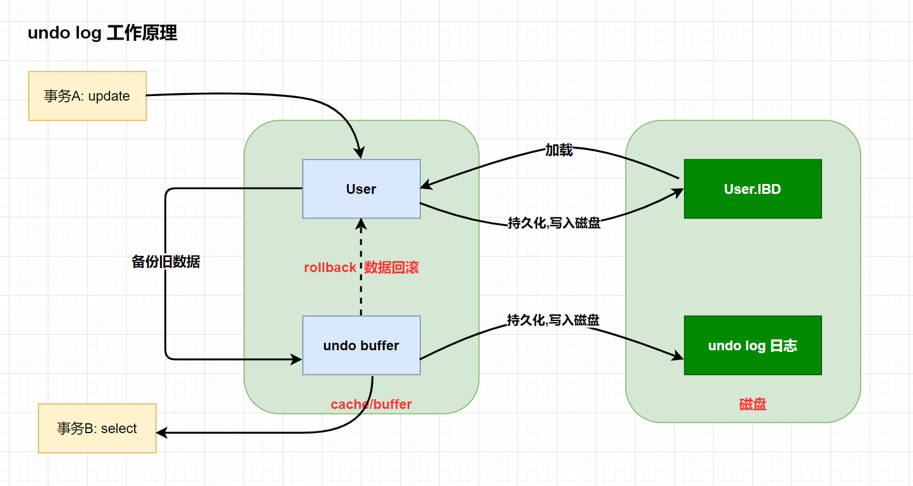

事务A执行update更新操作时，会按照以下步骤进行：


1. 将旧版本数据备份到对应的undo buffer中。
2. 将undo buffer中的数据持久化到磁盘中的undo log文件中。
3. 执行update操作，将新的数据持久化到磁盘。


在事务A执行的过程中，如果事务B对数据进行了查询，根据MySQL的MVCC机制，事务B会读取到数据的快照版本，即事务A更新之前的版本。这样可以保证事务B读取到的是一致的数据视图，即使事务A正在更新数据。

#### 存储机制

为了保证事务并发操作时，在写各自的undo log时不产生冲突，InnoDB采用`回滚段`的方式来维护undo log的并发写入和持久化。


1. 回滚段概述
   InnoDB使用回滚段来维护并发事务的Undo Log写入和持久化。
   每个回滚段包含多个Undo Log Segment，是管理Undo Log的基本单位。
2. 回滚段数量和Undo Log Segment数量
   回滚段数量：InnoDB拥有128个回滚段。
   每个回滚段中Undo Log Segment数量：每个回滚段包含1024个Undo Log Segment。
   支持的Undo操作数量：因此，InnoDB支持128 * 1024个Undo操作。
3. 并发事务执行限制
   最多支持的并发事务数量：由Undo Log Segment数量决定，即128 * 1024。
   最大支持事务并发数计算：每个事务对应一个Undo Log，最多支持131072个并发事务执行。

```sql
START TRANSACTION; -- 开启事务A

-- 执行更新操作
UPDATE table_name SET column_name = value WHERE condition;

COMMIT; -- 提交事务A

-- 开启另一个事务B
START TRANSACTION;

-- 执行查询操作
SELECT * FROM table_name WHERE condition;

COMMIT; -- 提交事务B
```

##### 事务 ID

事务执行过程中在对某个表执行增、删、改操作时，InnoDB就会给这个事务分配一个唯一的事务ID。

可以通过 `information_schema.INNODB_TRX` 来查询当前系统中运行的事务信息.

```sql
START TRANSACTION;
	select * from test1.a1;
commit;
--trx_id 就是事务ID,InnoDB 在内存维护了一个全局变量来表示事务ID，每当要分配一个事务ID时，就获取这个变量值，然后把这个变量自增1
select 
	trx_id , 
	trx_state ,
    trx_started,
    trx_isolation_level
from information_schema.INNODB_TRX;
```

##### 行记录的隐藏列

InnoDB引擎管理的数据表中每行行记录,都存在着三个隐藏列


- `DB_ROW_ID` : 如果没有为表显式的定义主键，并且表中也没有定义唯一索引，那么InnoDB会自动为表添加一个row_id的隐藏列作为主键。
- `DB_TRX_ID` : 事务中对某条记录做增删改时,就会将这个事务的事务ID写入到trx_id中.
- `DB_ROLL_PTR`: 回滚指针,指向undo log的指针

##### Insert 语句的 Undo Log 回滚日志结构

插入一条数据对应的undo操作其实就是根据主键删除这条数据就行了。

所以 insert 对应的 undo log 主要是把这条记录的主键记录上


- start、end：指向记录开始和结束的位置。
- 主键列信息：记录INSERT这行数据的主键ID信息，或者唯一列信息。
- table id：表空间ID。
- undo no：在当前事务中 undo log 的编号,从0开始。
- undo type：undo log 的类型，insert语句的undo log类型是 `TRX_UNDO_INSERT_REC`。

#### undo 回滚链

通过一个事物操作,我们一起来看一下回滚链的形成

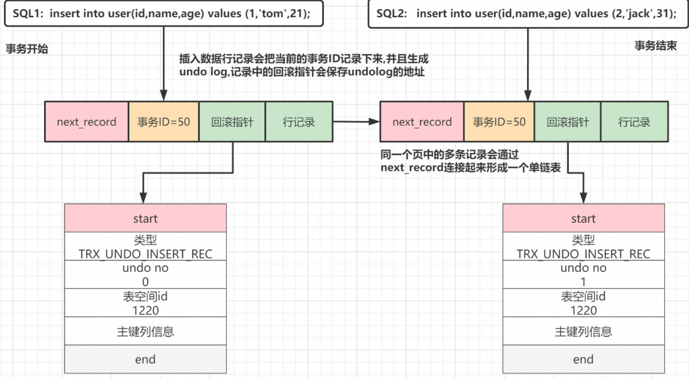


#### undo Log 相关参数

MySQL 与undo相关的参数设置:

```sql
mysql> show variables like '%undo%';
+--------------------------+------------+
| Variable_name            | Value      |
+--------------------------+------------+
| innodb_max_undo_log_size | 1073741824 |
| innodb_undo_directory    | ./         |
| innodb_undo_log_truncate | OFF        |
| innodb_undo_logs         | 128        |
| innodb_undo_tablespaces  | 0          |
+--------------------------+------------+

mysql> show global variables like '%truncate%';
+--------------------------------------+-------+
| Variable_name                        | Value |
+--------------------------------------+-------+
| innodb_purge_rseg_truncate_frequency | 128   |
| innodb_undo_log_truncate             | OFF   |
+--------------------------------------+-------+
```

-  **innodb_max_undo_log_size**
  表示每一个undolog对应的日志文件的最大值，默认最大值为1GB大小，默认初始化大小为10MB。
  日志文件达到该阈值之后，且参数 `innodb_undo_log_truncate=ON`，才会触发truncate回收（收缩）动作，被truncate后的表空间文件大小缩小到undolog表空间数据文件默认的1OMB大小。否则即便是到达最大值之后，也不会自动回收undolog的表空间。 
-  **innodb_undo_directory**
  指定undo log日志的存储目录，默认值为 ./。 
-  **innodb_undo_logs** 
  在MySQL5.6版本之后，可以通过此参数自定义多少个rollback segment，默认值为128。 
-  **innodb_undo_tablespaces**
  设置undo独立表空间个数，范围为0-128， 默认为0，0表示表示不开启独立undo表空间 且 undo日志存储在ibdata文件中。
  什么时候需要来设置这个参数 ?
  当DB写压力较大时，可以设置独立undo表空间，把undo从 ibdata文件中分离开来，指定 `innodb_undo_directory` 目录存放，可以制定到高速磁盘上，加快undo log 的读写性能。 
-  **innodb_undo_log_truncate**
  表示是否开启自动收缩undolog的表空间的操作。如果配置为`ON`，并且配置了2个或2个以上的undolog表空间数据文件，当某一个日志文件大小超过设置的最大值之后，就会自动的收缩表空间数据文件。 

在回收表空间数据文件的时候，被回收的表空间数据文件会临时下线，为了保证undolog一直有地方可以写，此时要保证至少还有1个undolog日志文件是在线的。这就是要求`innodb_undo_tablespaces>=2`的根本原因

 

### 1.2.6 二进制日志 ( binlog )

####  基本概念

binlog是一个二进制格式的文件，用于记录`用户对数据库更新的SQL`语句信息，例如更改数据库表和更改内容的SQL语句都会记录到binlog里，但是不会记录SELECT和SHOW这类操作。

#### 特点 

- binlog在MySQL的Server层实现(引擎共用)
- binlog为逻辑日志,记录的是一条SQL语句的原始逻辑 

- binlog不限制大小,追加写入,不会覆盖以前的日志.
- 默认情况下，binlog日志是二进制格式的，不能使用查看文本工具的命令（比如，cat，vi等）查看，而使用mysqlbinlog解析查看。

开启Binlog日志有以下两个最重要的使用场景: 

- `主从复制`：在主库中开启Binlog功能，这样主库就可以把Binlog传递给从库，从库拿到Binlog后实现数据恢复达到主从数据一致性。
- `数据恢复`：通过mysqlbinlog工具来恢复数据。

#### 日志的三种模式 

#####  ROW（row-based replication, RBR）

日志中会记录每一行数据被修改的情况，然后在slave端对相同的数据进行修改。

- 优点：能清楚记录每一个行数据的修改细节，能完全实现主从数据同步和数据的恢复。而且不会出现某些特定情况下存储过程或function，以及trigger的调用和触发器无法被正确复制的问题。
- 缺点：批量操作，会产生大量的日志，尤其是alter table会让日志暴涨。 

##### STATMENT（statement-based replication, SBR）

**记录每一条修改数据的SQL语句**（批量修改时，记录的不是单条SQL语句，**而是批量修改的SQL语句事件**）, slave在复制的时候SQL进程会解析成和原来master端执行过的相同的SQL再次执行。简称SQL语句复制。

- 优点：日志量小，减少磁盘IO，提升存储和恢复速度
- 缺点：在某些情况下会导致主从数据不一致，比如last_insert_id()、now()等函数。   

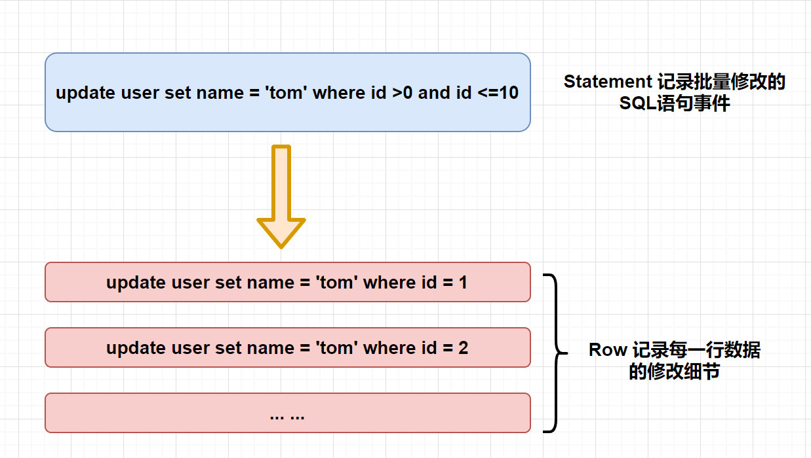

#####  MIXED（mixed-based replication, MBR）

以上两种模式的混合使用，一般会使用**STATEMENT模式保存binlog**，对于STATEMENT模式无法复制的操作使用ROW模式保存binlog，MySQL会根据执行的SQL语句选择写入模式。 

**企业场景如何选择binlog的模式**

1.  如果生产中使用MySQL的特殊功能相对少（存储过程、触发器、函数）。选择默认的语句模式，Statement。 
2.  如果生产中使用MySQL的特殊功能较多的，可以选择Mixed模式。 
3.  如果生产中使用MySQL的特殊功能较多，又希望数据最大化一致，此时最好Row 模式；但是要注意，该模式的binlog日志量增长非常快. 

- 跳过语句模式：默认情况下，MySQL复制使用的是语句模式（Statement mode），即主服务器上执行的SQL语句会被发送到从服务器执行。然而，对于某些存储过程，MySQL可能无法正确复制执行过程中的SQL语句，因为存储过程可能包含了诸如非确定性函数、临时表等语句，这些语句在从服务器上可能无法正确执行，从而导致复制的不一致性。
- 函数依赖：存储过程中可能会调用其他存储过程或自定义函数，而这些函数的结果可能会因为主服务器和从服务器上的数据不一致而产生不同的结果，导致数据不一致。
- 依赖外部数据：存储过程可能会依赖外部的数据或环境变量，而这些数据在主服务器和从服务器上可能不同，导致存储过程的执行结果不一致。
- 并发执行问题：如果多个客户端同时执行存储过程，可能会出现并发执行的问题，从而导致数据不一致。

#### Binlog写入机制

**binlog文件结构**

- MySQL的binlog文件中记录的是对数据库的各种修改操作，用来表示修改操作的数据结构是Log event。不同的修改操作对应的不同的log event。

- 比较常用的log event有：`Query event`、`Row event`、`Xid event`等。binlog文件的内容就是各种Log event的集合。


##### binlog落盘策略

binlog 的写入顺序: `binlog cache (write)` -> `OS cache`  -> `(fsync) disk.`

- write表示: 写入文件系统缓存,fsync表示持久化到磁盘的时机
- binlog刷数据到磁盘由参数sync_binlog进行配置 

- sync_binlog=0 的时候，表示每次提交事务都只 write,不 fsync;
- sync_binlog=1 的时候，表示每次提交事务都会执行 fsync;
- sync_binlog=N(N>1) 的时候，表示每次提交事务都 write，但累积 N 个事务后才 fsync。

```sql
mysql> show variables like '%sync_binlog%';
+---------------+-------+
| Variable_name | Value |
+---------------+-------+
| sync_binlog   | 1     |
+---------------+-------+
1 row in set (0.00 sec)
```

注意: 不建议将这个参数设成 0，比较常见的是将其设置为 100~1000 中的某个数值。如果设置成0，主动重启丢失的数据不可控制。设置成1，效率低下，设置成N(N>1)，则主机重启，**造成最多N个事务的binlog日志丢失，但是性能高，丢失数据量可控**。

#####  binlog 写入流程

##### 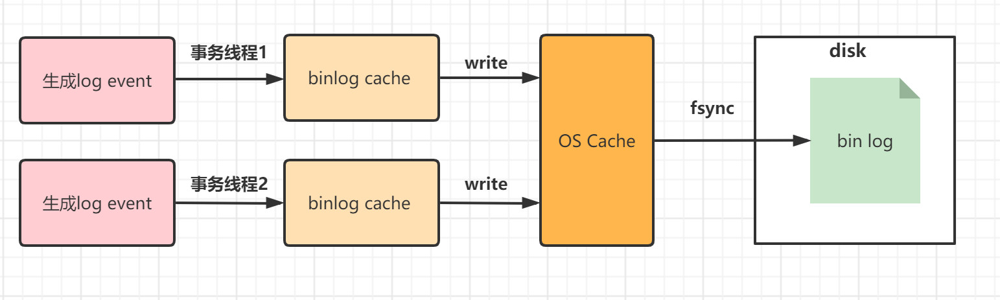

1. 根据记录模式和操作触发event事件生成log event.
2. 事务执行过程中，先把日志(log event) 写到binlog cache，事务提交的时候，再把binlog cache写到binlog文件中。
3. binlog cache，系统为每个线程分配了一片binlog cache内存 (每个线程都有自己的binlog cache，共用一份binlog文件) .
4. 事务提交的时候，执行器把binlog cache里完整的事务写入binlog中。并清空binlog cache.


#####  redo log 和 binlog的区别 

| **特性**      | **redo log**                             | **binlog**                                       |
| ------------- | ---------------------------------------- | ------------------------------------------------ |
| 引擎支持      | InnoDB 引擎特有                          | MySQL 的 Server 层实现，所有引擎都可以使用       |
| 日志类型      | 物理日志                                 | 逻辑日志                                         |
| 记录内容      | 记录的是“在XXX数据页上做了XXX修改”       | 记录的是原始逻辑，其记录是对应的 SQL 语句        |
| 日志写入方式  | 循环写                                   | 追加写                                           |
| 写入空间管理  | 需要 write pos 和 check point 搭配       | 写到一定大小会切换到下一个，并不会覆盖以前的日志 |
| 用途          | 作为服务器异常宕机后事务数据自动恢复使用 | 可以作为主从复制和数据恢复使用                   |
| CrashSafe能力 | 有                                       | 没有                                             |

CrashSafe指MySQL服务器宕机重启后，能够保证：

- 所有已经提交的事务的数据仍然存在。
- 所有没有提交的事务的数据自动回滚。

#####  Binlog命令操作

######  使用sql命令查看binlog文件 

###### 启用Binlog 

```shell
vim /etc/my.cnf

--增加下面几个参数
binlog-format=ROW
log-bin=mysqlbinlog
server-id=1

-- 重启mysql
systemctl restart mysqld
```

- **binlog-format**: 文件模式 
- **log-bin**: mysql会根据这个配置自动设置log_bin为on状态，自动设置log_bin_index文件为你指定的文件名后跟.index
- **server-id**=1:  随机指定一个不能和其他集群中机器重名的字符串，如果只有一台机器，那就可以随便指定了 


 启动成功之后，我们可以登陆查看我们的配置是否起作用 

```shell
mysql> show variables like '%log_bin%';
+---------------------------------+----------------------------------+
| Variable_name                   | Value                            |
+---------------------------------+----------------------------------+
| log_bin                         | ON                               |
| log_bin_basename                | /var/lib/mysql/mysqlbinlog       |
| log_bin_index                   | /var/lib/mysql/mysqlbinlog.index |
| log_bin_trust_function_creators | OFF                              |
| log_bin_use_v1_row_events       | OFF                              |
| sql_log_bin                     | ON                               |
+---------------------------------+----------------------------------+
```

- **log_bin**: 是否开启binlog日志
- **log_bin_basename**: 基础文件名 
- **log_bin_index** : binlog文件的索引文件，管理所有binlog文件
- **sql_log_bin**: 表示当前会话是否记录 bin log，默认值on(当sql_log_bin关闭后，主库服务器上的改动不记录bin log，不会复制到从库)。 

###### 查看binlog文件列表

```shell
  mysql> show binary logs;
+--------------------+-----------+
  | Log_name           | File_size |
  +--------------------+-----------+
  | mysqlbinlog.000001 |       177 |
  | mysqlbinlog.000002 |       177 |
  | mysqlbinlog.000003 |       154 |
  +--------------------+-----------+
```

###### 查看正在写入的binlog文件

```sql
  show master status;
```

###### 查看binlog文件信息

使用show binlog events命令查询到的每一行数据就是一个binlog管理事件 

```sql
mysql> show binlog events;
+--------------------+-----+----------------+-----------+-------------+---------------------------------------+
| Log_name           | Pos | Event_type     | Server_id | End_log_pos | Info                                  |
+--------------------+-----+----------------+-----------+-------------+---------------------------------------+
| mysqlbinlog.000001 |   4 | Format_desc    |         1 |         123 | Server ver: 5.7.30-log, Binlog ver: 4 |
| mysqlbinlog.000001 | 123 | Previous_gtids |         1 |         154 |                                       |
| mysqlbinlog.000001 | 154 | Stop           |         1 |         177 |                                       |
+--------------------+-----+----------------+-----------+-------------+-----------
```

参数说明 

-  **Log_name**：当前事件所在的binlog文件名称； 
-  **Pos**：当前事件的开始位置，每个事件都占用固定的字节大小，结束位置(**End_log_position**)减去Pos，就是这个事件占用的字节数。 

第一个事件位置并不是从0开始，而是从4。Mysql通过文件中的前4个字节，来判断这是不是一个binlog文件。这种方式很常见，很多格式文件，如pdf、doc、jpg等，都会通常前几个特定字符判断是否是合法文件。

-  **Event_type**：表示事件的类型； 
-  **Server_id**：表示产生这个事件的mysql server_id，通过设置my.cnf中的server-id选项进行配置； 
-  **End_log_position**：下一个事件的开始位置； 
-  **Info**：当前事件的描述信息。 

######  查看指定binlog文件内容 

```sql
mysql> show binlog events in 'mysqlbinlog.000001'\G;
*************************** 1. row ***************************
   Log_name: mysqlbinlog.000001
        Pos: 4
 Event_type: Format_desc
  Server_id: 1
End_log_pos: 123
       Info: Server ver: 5.7.30-log, Binlog ver: 4
*************************** 2. row ***************************
   Log_name: mysqlbinlog.000001
        Pos: 123
 Event_type: Previous_gtids
  Server_id: 1
End_log_pos: 154
       Info: 
*************************** 3. row ***************************
   Log_name: mysqlbinlog.000001
        Pos: 154
 Event_type: Stop
  Server_id: 1
End_log_pos: 177
     Info: 
3 rows in set (0.00 sec)
```

###### 使用mysqlbinlog命令查看binlog文件

-  mysql给我们提供了一个用于查看binlog日志的工具，叫做**mysqlbinlog** 

```sql
[root@localhost mysql]# mysqlbinlog mysqlbinlog.000001
/*!50530 SET @@SESSION.PSEUDO_SLAVE_MODE=1*/;
  /*!50003 SET @OLD_COMPLETION_TYPE=@@COMPLETION_TYPE,COMPLETION_TYPE=0*/;
DELIMITER /*!*/;
  # at 4
  #220125  6:40:35 server id 1  end_log_pos 123 CRC32 0x1e570724  Start: binlog v 4, server v 5.7.30-log created 220125  6:40:35 at startup
  ROLLBACK/*!*/;
BINLOG '
  4wvwYQ8BAAAAdwAAAHsAAAAAAAQANS43LjMwLWxvZwAAAAAAAAAAAAAAAAAAAAAAAAAAAAAAAAAA
AAAAAAAAAAAAAAAAAADjC/BhEzgNAAgAEgAEBAQEEgAAXwAEGggAAAAICAgCAAAACgoKKioAEjQA
  ASQHVx4=
  '/*!*/;
  # at 123
  #220125  6:40:35 server id 1  end_log_pos 154 CRC32 0x43fa19f1  Previous-GTIDs
  # [empty]
  # at 154
  #220125  6:41:17 server id 1  end_log_pos 177 CRC32 0x205de899  Stop
  SET @@SESSION.GTID_NEXT= 'AUTOMATIC' /* added by mysqlbinlog */ /*!*/;
  DELIMITER ;
  # End of log file
  /*!50003 SET COMPLETION_TYPE=@OLD_COMPLETION_TYPE*/;
  /*!50530 SET @@SESSION.PSEUDO_SLAVE_MODE=0*/;
```

  输出指定position位置的binlog日志 

```plain
 mysqlbinlog --start-position='154' --stop-position='177'
```

  输出指定position位置的binlog日志到指定文件中 

```plain
mysqlbinlog --start-position='154' --stop-position='177' mysqlbinlog.000001 > test.log
```

  输出指定position位置的binlog日志到压缩文件中 

```plain
mysqlbinlog --start-position="指定开始位置" --stop-position="指定结束位置" binlog文件|gzip > 压缩文件名
```

  输出指定开始时间的binlog日志 

```plain
mysqlbinlog --start-datetime="yyyy-MM-dd HH:mm:ss" binlog文件
```

### 1.2.7 新版本结构演变

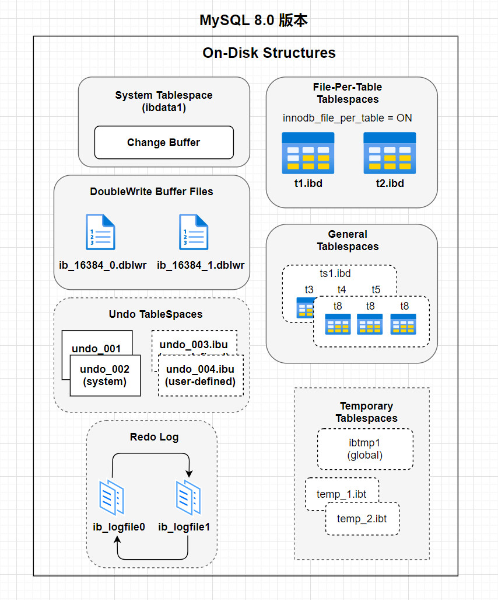

-  MySQL 5.7 版本 

  -  将 Undo日志表空间从共享表空间 ibdata 文件中分离出来，可以在安装 MySQL 时由用户自行指定文件大小和数量。 

  -  增加了 temporary 临时表空间，里面存储着临时表或临时查询结果集的数据。 

  -  Buffer Pool 大小可以动态修改，无需重启数据库实例。 

-  MySQL 8.0 版本 

  - 将InnoDB表的数据字典和Undo都从共享表空间ibdata中彻底分离出来了，以前需要ibdata中数据字典与独立表空间ibd文件中数据字典一致才行，8.0版本就不需要了。

  - temporary 临时表空间也可以配置多个物理文件，而且均为 InnoDB 存储引擎并能创建索引，这样加快了处理的速度。

  - 用户可以像 Oracle 数据库那样设置一些表空间，每个表空间对应多个物理文件，每个表空间可以给多个表使用，但一个表只能存储在一个表空间中。

  - 将Doublewrite Buffer从共享表空间ibdata中也分离出来了。