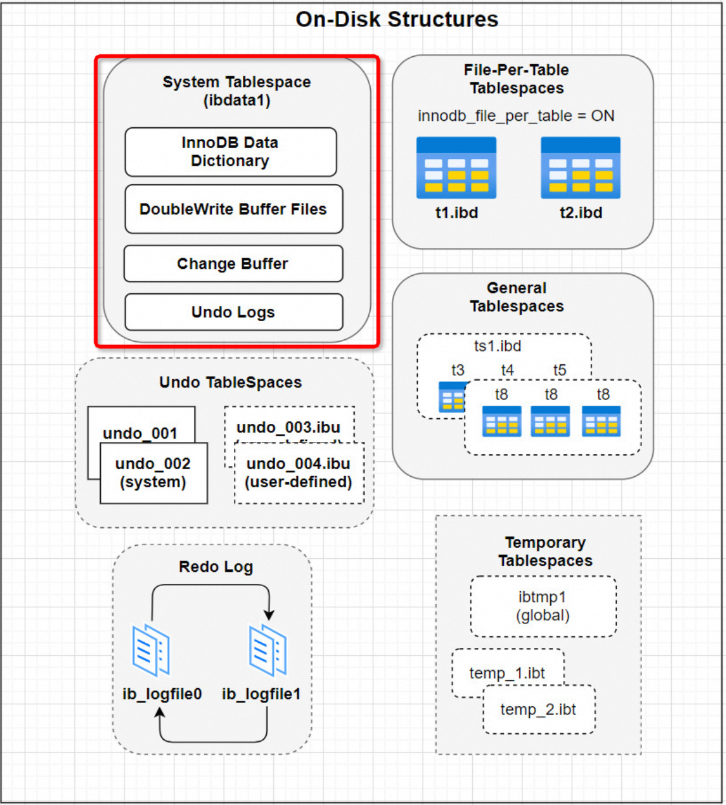
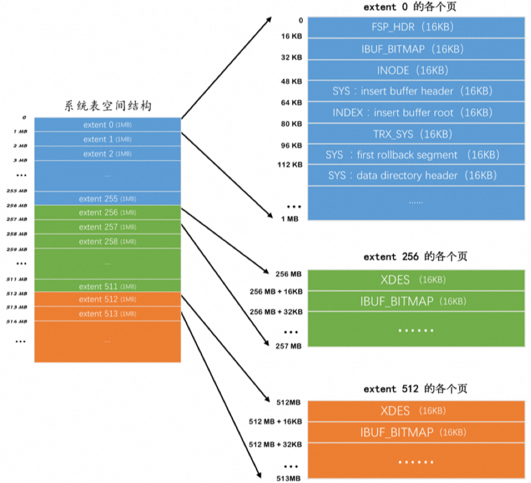

# 一、表空间介绍

InnoDB 其实是使用 页 为基本单位来管理存储空间的，默认的 页 大小为 16KB 。 对于 InnoDB 存储引擎来说，每个索引都对应着一棵 B+ 树，该 B+ 树的每个节点都是一个数据页，数据页之 间不必要是物理连续的，因为数据页之间有 双向链表 来维护着这些页的顺序。 InnoDB 的聚簇索引的叶子节点存储了完整的用户记录，也就是所谓的索引即数据，数据即索引。
为了更好的管理这些页，InnoDB 提出了表空间的概念，对应了文件系统上一个或者多个真实文件

## 1.1  系统表空间 （The System Tablespace）

系统表空间与独立表空间的一个非常明显的不同之处就是在表空间开头有许多记录整个系统属性的页面


- 存储内容: 包含InnoDB数据字典，Doublewrite Buffer，Change Buffer，Undo Logs的存储区域。系统表空间也默认包含任何用户在系统表空间创建的表数据和索引数据。
- 具体结构： 默认情况下，InnoDB会在数据目录下创建一个名为 ibdata1 的文件，大小为 12M。这个文件就是对应的系统表空间在文件系统上的表示。为什么只有12M呢？因为这个文件是所谓的自扩展文件，即当不够用的时候它会自动增加文件大小。

```sql
[root@localhost ~]# cd /var/lib/mysql 
[root@localhost mysql]# ll ibdata*
-rw-r----- 1 mysql mysql 79691776 1月  25 06:42 ibdata1
```

- 系统表空间是一个共享的表空间因为它是被多个表共享的。该空间的数据文件通过参数`innodb_data_file_path`控制，默认值是 `ibdata1:12M:autoextend` (文件名为ibdata1、12MB、自动扩展)。

```sql
mysql> show variables like '%innodb_data_file_path%';
+-----------------------+------------------------+
| Variable_name         | Value                  |
+-----------------------+------------------------+
| innodb_data_file_path | ibdata1:12M:autoextend |
+-----------------------+------------------------+
1 row in set (0.38 sec)
```

我们还可以将系统表空间对应的文件路径配置到数据目录之外，甚至可以配置到单独的磁盘分区上。涉及到的启动参数是innodb_data_file_path和innodb_data_home_dir，具体的配置逻辑较为复杂，需要根据实际情况进行调整。

## 1.2 独立表空间

**默认开启**，独立表空间是一个单表表空间，该表创建于自己的数据文件中，而非创建于系统表空间中。当`innodb_file_per_table`选项开启时，表将被创建于表空间中。否则，innodb将被创建于系统表空间中。

```sql
mysql> show variables like '%innodb_file_per_table%';
+-----------------------+-------+
| Variable_name         | Value |
+-----------------------+-------+
| innodb_file_per_table | ON    |
+-----------------------+-------+
1 row in set (0.14 sec)
```

每个表文件表空间由一个.ibd数据文件代表，该文件默认被创建于数据库目录中。
比如我们使用了 独立表空间 去存储 xx 数据库下的 test 表的话，那么在该表所在数据库对应的 test 目录下会为 test 表创建这两个文件：
test.frm test.ibd

###  共享 VS 独立表空间

| 优缺点 | 共享表空间 | 独立表空间 |
| ------ | ---------- | ---------- |
| 优点   |            |            |

- 可以将表空间分成多个文件存放到各个磁盘上，方便管理。
  | 
- 每个表都有独立的表空间，数据和索引分开存放。
  |
  |  | 
- 空间文件大小不受表大小的限制。
  | 
- 可以实现单表在不同的数据库中移动。
  |
  |  | 
- 数据和文件放在一起方便管理。
  | 
- 空间可以回收，删除或清空表后存储空间立即返回。
  |
  | 缺点 | 
- 所有数据和索引存放到一个文件中，对于大量删除操作后表空间中会有大量空隙，不适合某些应用。
  | 
- 单表增加过大可能会导致表空间过大，如超过100个G。
  |

## 1.3  通用表空间（General Tablespaces） 

-  MySQL 5.7开始支持通用表空间管理功能,类似于系统表空间，也是共享表空间，可以存储多个表的数据。 
-  通用表空间为通过create tablespace语法创建的共享表空间。通用表空间可以创建于mysql数据目录外的其他表空间(自定义存储路径)，其可以容纳多张表，且其支持所有的行格式。 
-  相比File-per-table表空间，通用表空间由于多表共享表空间，消耗的内存会更少一点，具有潜在的内存优势。（占用的磁盘空间会更小） 

### 举例

- 需求：指定存储路径创建一张表

#### 方式1: 指定 data directory 

```shell
[root@localhost ~]# mkdir -p /mdata/general
[root@localhost ~]# cd /mdata/general/

# 设置文件所有者为mysql(第一个mysql是用户,第二个为用户组)
[root@localhost general]# chown mysql.mysql /mdata/general/
```

```sql
-- 连接mysql,选择数据库创建表,并且将该表创建于刚刚创建的通用表空间目录
mysql> create table test1.test_ger(a int) data directory='/mdata/general';
Query OK, 0 rows affected (0.50 sec)
```

```shell
[root@localhost general]# tree
.
└── test1
    └── test_ger.ibd

1 directory, 1 file

[root@localhost general]# cd /var/lib/mysql/test1/
[root@localhost test1]# ll
-rw-r----- 1 mysql mysql  8554 1月  29 01:41 test_ger.frm
-rw-r----- 1 mysql mysql    33 1月  29 01:41 test_ger.isl
#cat test_ger.isl 一个文本文件，内容就是idb文件的路径，做了一个链接
[root@localhost test1]# cat test_ger.isl 
/mdata/general/test1/test_ger.ibd
```

#### 方式2: 使用通用表空间 

```sql
-- 1.创建通用表空间 (file_block_size就是指定page_size大小)
mysql> create tablespace ger_space add datafile '/mdata/general/ger_space.ibd' file_block_size=16384;
Query OK, 0 rows affected (0.15 sec)

-- 查看目录
[root@localhost mysql]# cd /mdata/general/
[root@localhost general]# ll ger*
-rw-r----- 1 mysql mysql 65536 1月  29 01:56 ger_space.ibd

-- 查看通用表空间信息
mysql> select * from information_schema.innodb_sys_tablespaces where name = 'ger_space'\G;
*************************** 1. row ***************************
         SPACE: 153
          NAME: ger_space
          FLAG: 2048
   FILE_FORMAT: Any
    ROW_FORMAT: Any
     PAGE_SIZE: 16384 --页大小16K
 ZIP_PAGE_SIZE: 0
    SPACE_TYPE: General
 FS_BLOCK_SIZE: 4096
     FILE_SIZE: 65536
ALLOCATED_SIZE: 32768
1 row in set (0.00 sec)

-- 在通用表空间创建一张表
mysql> create table test1.test_ger2(a int) tablespace=ger_space;
Query OK, 0 rows affected (0.13 sec)

-- 查看表信息
mysql> show create table test_ger2;
+-----------+----------------------------------------------------------------------------------------------------------------------------------+
| Table     | Create Table                                                                                                                     |
+-----------+----------------------------------------------------------------------------------------------------------------------------------+
| test_ger2 | CREATE TABLE `test_ger2` (
  `a` int(11) DEFAULT NULL
) /*!50100 TABLESPACE `ger_space` */ ENGINE=InnoDB DEFAULT CHARSET=utf8mb4 |
```

## 1.4 撤销表空间（Undo Tablespaces） 

-  撤销表空间，用来保存回滚日志，即undo logs, undo Log 的数据默认在系统表空间ibdata1文件中 
-  可以通过 `innodb_undo_directory`属性 查看回滚表空间的位置。默认路径是mysql的数据存储路径。 

```sql
mysql> show variables like 'innodb_undo_directory';
+-----------------------+-------+
| Variable_name         | Value |
+-----------------------+-------+
| innodb_undo_directory | ./    |
+-----------------------+-------+
```

-  InnoDB使用的undo表空间由 `innodb_undo_tablespaces` 配置选项控制，设置undo独立表空间个数，范围为0-128， 默认为0，0表示不开启独立undo表空间 ,且 undo日志存储在ibdata1文件中。 

```sql
mysql> show variables like '%innodb_undo_tablespace%';
+-------------------------+-------+
| Variable_name           | Value |
+-------------------------+-------+
| innodb_undo_tablespaces | 0     |
+-------------------------+-------+
1 row in set (0.01 sec)
```

**什么时候需要来设置这个参数 ?**
	当DB写压力较大时，可以设置独立undo表空间，把undo从 ibdata文件中分离开来，指定 `innodb_undo_directory` 目录存放，可以制定到高速磁盘上，加快undo log 的读写性能。 

-  undo日志使用共享表空间存在的问题: 因为共享表空间不会自动收缩,**即使事务关闭,undo log也会一直占用空间**, 所以可能会出现因为大事物而导致ibdata1文件过大的问题.
-  解决办法： MySQL5.7中引入了一个新的参数 `innodb_undo_log_truncate`**表示是否开启自动收缩undolog的表空间的操作**。如果配置为`ON`，并且配置了2个或2个以上的undolog表空间数据文件，当某一个日志文件大小超过设置的最大值之后，就会自动的收缩表空间数据文件。 

> 在回收表空间数据文件的时候，被回收的表空间数据文件会临时下线，为了保证undolog一直有地方可以写，此时要保证至少还有1个undolog日志文件是在线的。这就是要求`innodb_undo_tablespaces>=2`的根本原因

8.0 对于undo log存储的进一步优化： 

- 从MySQL8.0版本开始，MySQL默认对undo进行了分离操作，也就是说，不需要在初始化中手动配置参数，默认会在datadir目录下生成两个undo表空间文件undo_001 和 undo002 并且可以在线的增加和删除undo表空间文件, 进行动态扩容和收缩.
- 查询undo log信息 

```sql
mysql> select tablespace_name, file_name from information_schema.files where file_type like 'undo log';
+-----------------+------------+
| TABLESPACE_NAME | FILE_NAME  |
+-----------------+------------+
| innodb_undo_001 | ./undo_001 |
| innodb_undo_002 | ./undo_002 |
+-----------------+------------+

-- 文件位置 /var/lib/mysql
[root@localhost mysql]# ll undo*
-rw-r-----. 1 mysql mysql 16777216 12月 31 00:21 undo_001
-rw-r-----. 1 mysql mysql 16777216 12月 31 00:21 undo_002
```

## 1.5 临时表空间（Temporary Tablespaces） 

-  用户**创建的临时表和磁盘内部临时表创建于共享临时表空间中**。MySQL 5.7起，开始采用独立的临时表空间,命名ibtmp1文件，初始化12M，且默认无上限。 
-  全局临时表空间默认是数据目录的ibtmp1文件，所有临时表共享,可以通过`innodb_temp_data_file_path` 属性指定临时表空间的位置。 

```sql
mysql> select @@innodb_temp_data_file_path;
+------------------------------+
| @@innodb_temp_data_file_path |
+------------------------------+
| ibtmp1:12M:autoextend        |
+------------------------------+
1 row in set (0.00 sec)
```

需要注意的是: 临时表空间最好是设置最大增长限制,否则可能会导致 ibtmp1文件过大,占用过多的磁盘空间. 

```sql
-- 设置了上限的大小，当数据文件达到最大大小时，查询将失败，并显示一条错误消息，表明表已满，查询不能往下执行，避免 ibtmp1 过大 (需要生成临时表的SQL无法被执行,一般这种SQL效率也比较低，可借此机会进行优化)
innodb_temp_data_file_path=ibtmp1:12M:autoextend:max:500M
```

-  `tmp_table_size` 参数配置内部内存临时表的大小。 

```sql
mysql> set global tmp_table_size=16*1024*1024;
Query OK, 0 rows affected (0.00 sec)

mysql> show variables like 'tmp_table_size';
+----------------+----------+
| Variable_name  | Value    |
+----------------+----------+
| tmp_table_size | 16777216 |
+----------------+----------+
1 row in set (0.00 sec)
```

> 注: 如果内存中的临时表超出限制，MySQL自动将其转换为磁盘上的MyISAM表tmp_table_size最大值是18446744073709551615

-  如何监控临时表与临时表空间使用情况 

```sql
mysql> show status like '%tmp%';
+-------------------------+-------+
| Variable_name           | Value |
+-------------------------+-------+
| Created_tmp_disk_tables | 0     |
| Created_tmp_files       | 6     |
| Created_tmp_tables      | 11    |
+-------------------------+-------+
3 rows in set (0.00 sec)
```

### 优化建议

1.  **控制临时表创建比例：** 
    - 建议确保 `Created_tmp_disk_tables` 和 `Created_tmp_tables` 之比不超过25%。
    - 若 `Created_tmp_disk_tables` 数量较多，应检查是否存在大量慢查询或者频繁使用临时表的SQL语句。
2.  **优化临时表空间配置：** 
    - 增加 `tmp_table_size` 的值，以提供更多的内存供临时表使用。
    - 调整临时表空间的大小能够有效减少创建临时表的频率，提高性能。
3.  **定期重启实例：** 
    - 可以选择择机重启MySQL实例，以释放 `ibtmp1` 文件。与 `ibdata1` 不同，`ibtmp1` 会在重启时被重新初始化，而 `ibdata1` 不会。
4.  **监控和优化SQL语句：** 
    - 定期检查并优化执行效率低下的SQL语句，尽量避免频繁创建临时表。
    - 注意检查是否有索引缺失或者索引使用不当的情况，优化查询性能。
5.  **使用合适的存储引擎：** 
    - 根据业务需求和数据特点选择合适的存储引擎，例如InnoDB或者MyISAM，在某些场景下可能有不同的性能表现。
6.  **数据库参数优化：** 
    - 定期审查数据库参数配置，根据实际情况调整参数以提高数据库性能和稳定性。
    - 特别关注与临时表相关的参数，如 `tmp_table_size`、`max_heap_table_size` 等。
