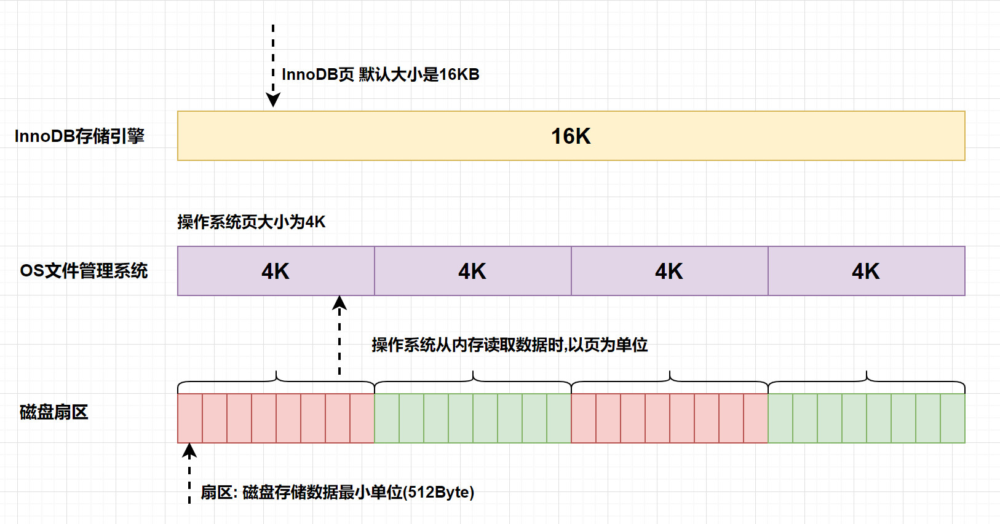

# 一、双写缓冲区 ( Doublewrite Buffer Files)

## 1.1 背景介绍

### 写失效 (部分页失效)

- InnoDB的页和操作系统的页大小不一致，InnoDB页大小一般为16K，操作系统页大小为4K，InnoDB的页写入到磁盘时，一个页需要分4次写。
- 如果存储引擎正在写入页的数据到磁盘时发生了宕机，可能出现页只写了一部分的情况，比如只写了4K，就宕机了，这种情况叫做部分写失效（partial page write），可能会导致数据丢失。



## 1.2 双写缓冲区 Doublewrite Buffer

为了解决写失效问题，InnoDB实现了双写缓冲区，它位于系统表空间，是一个存储区域。
**在BufferPool的页刷新到磁盘真正位置前**，数据**会先被存储在双写缓冲区**。
这样在宕机重启时，即使发生数据页损坏，可以通过该页的副本来还原该页，然后再进行redo log重做，确保了数据页的可靠性。

## 1.3 配置开关

默认情况下启用双写缓冲区，可以通过将 `innodb_doublewrite` 设置为0 来禁用。

```sql
mysql> show variables like '%innodb_doublewrite%';
+--------------------+-------+
| Variable_name      | Value |
+--------------------+-------+
| innodb_doublewrite | ON    |
+--------------------+-------+
1 row in set (0.01 sec)
```

## 1.4 数据双写流程


- Step 1：脏页刷新到磁盘前，先写入双写缓冲区。
- Step 2：使用 memcpy 函数将脏页复制到内存中的双写缓冲区。
- Step 3：将双写缓冲区的数据分两次，每次1MB，顺序写入共享表空间的物理磁盘上。
- Step 4：完成双写缓冲区的写入后，再将双写缓冲区中的页写入各个表的独立表空间文件中。

### 1.4.1 双写的原因

为啥写两次，刷一次数据文件保存数据不就可以了，为什么还要写共享表空间 ?

- **性能提升**： 共享表空间是在ibdata文件中划出的连续空间，专门用于存储双写缓冲区的数据。在这个过程中，双写缓冲区中的数据是连续存储的，因此写入磁盘时可以实现顺序写入。顺序写入通常比随机写入更快，因为它可以最大程度地减少磁盘头寻址的时间，从而提高了磁盘写入性能。
- **数据可靠性**： 完成共享表空间的写入后，再将数据写入到各个表的独立表空间文件中。这时，数据的写入变为离散的，因为每个表的独立表空间文件都是分散在磁盘上的。虽然这种写入方式可能比较慢，但它确保了数据的分散存储，提高了数据的可靠性。即使出现了硬件故障或其他意外情况，只影响到了某个表的数据文件，其他表的数据仍然是安全的。

双写缓冲区在写入过程中发生了宕机，数据页仍然有可能丢失。双写缓冲区的设计是为了**减少写失效（partial page write）的风险**，但并不能完全消除它

# 二、 Change buffer

系统表空间中的change buffer是内存缓冲池中change buffer的备份，也就是说被持久化到了系统表空间中。在崩溃恢复的时候会从系统表空间的change buffer中读取信息到buffer pool。

