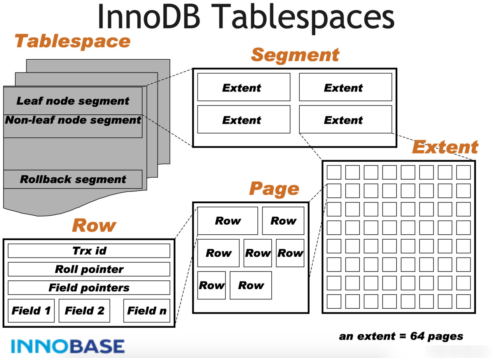
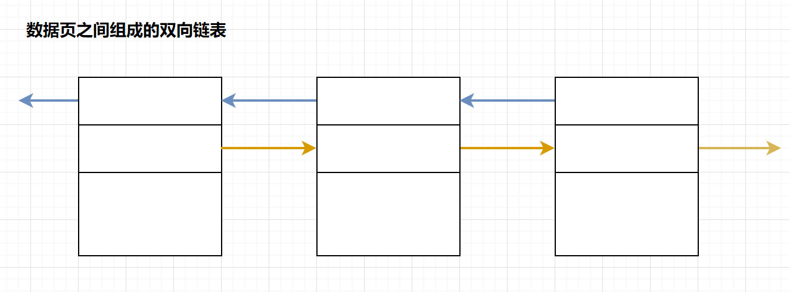
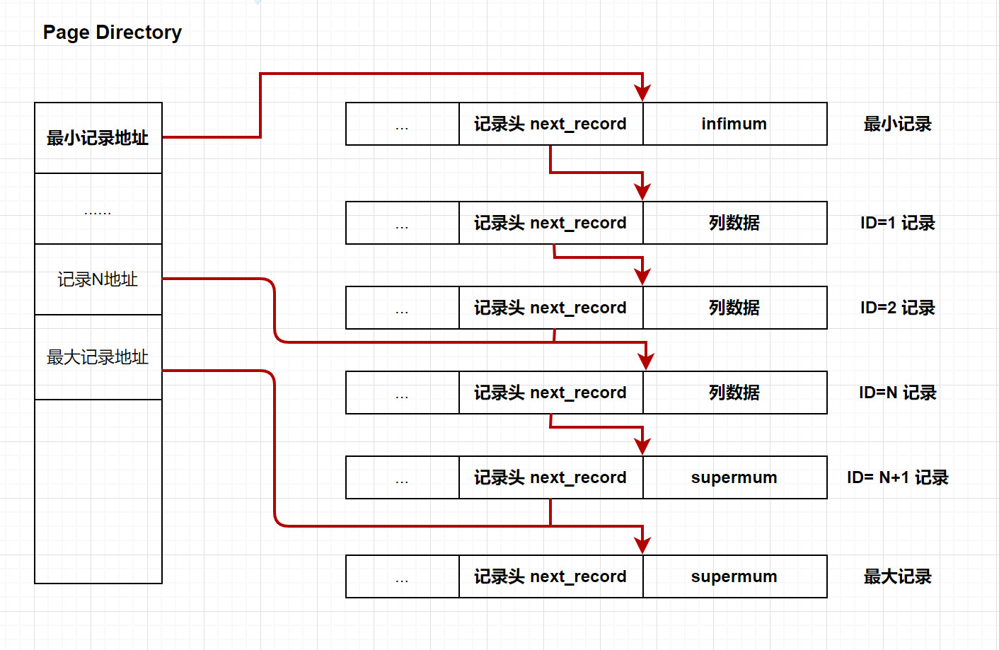
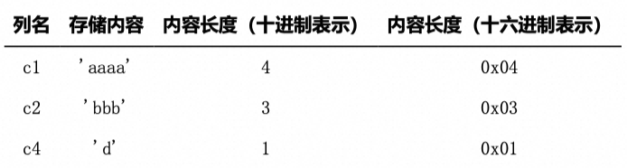
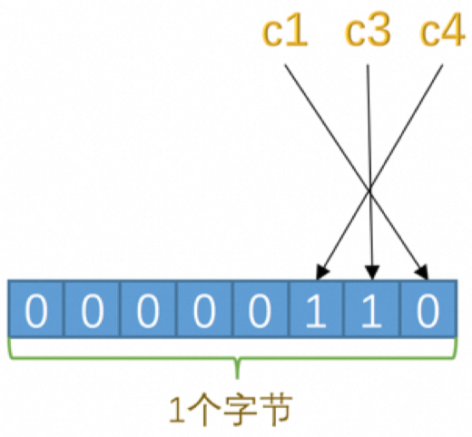
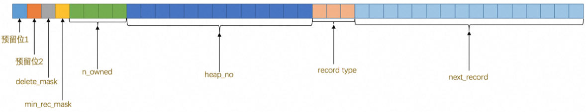
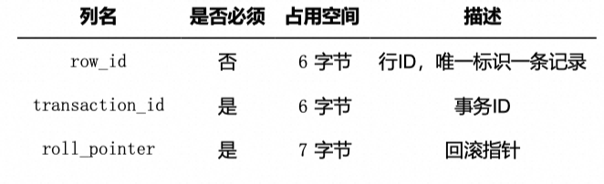
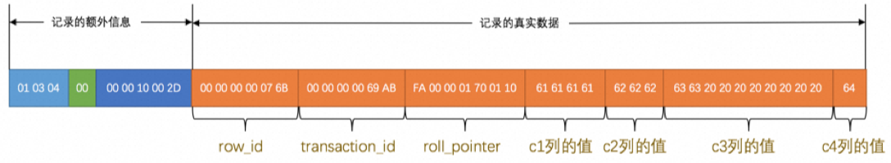
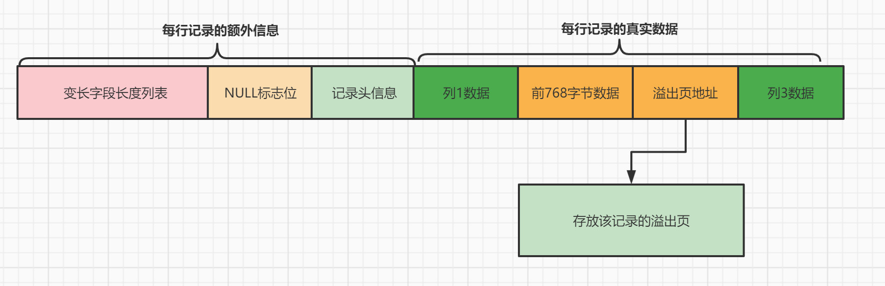

## 1.4 数据文件

### 1.4.1 表空间文件结构



InnoDB表空间文件结构主要包括：Tablespace（表空间）、Segment（段）、Extent（区）、Page（页）、Row（行）。

####  Tablespace（表空间）

1. 表空间是InnoDB存储引擎逻辑结构的最高层，用于存储多个ibd数据文件，用于存储表的记录和索引。一个文件包含多个段。
2. 表空间分为：系统表空间、独占表空间、通用表空间、临时表空间、Undo表空间。

#### Segment（段）

1. 段是磁盘上空间分配和回收的申请者，是一个逻辑概念，用来管理物理文件，段是为了保持叶子节点在磁盘上的连续，可以实现更好的顺序I/O操作。
2. 常见的段有数据段、索引段、回滚段等。其中索引段就是非叶子结点部分，而数据段就是叶子结点部分，回滚段用于数据的回滚和多版本控制。

#### Extent（区）

1. 区是由连续页组成的空间，每个区的默认大小都是1MB，一个区中有64个连续的页。为了保证区中页的连续性，扩展的时候InnoDB存储引擎一次从磁盘申请4~5个区。

#### Page（页）

1. 页是区的基本组成单元，用于存储数据。默认每一个页的存储大小为16k。包含了多种类型的页，如数据页、undo页、系统页、事务数据页、大的BLOB对象页等。

####  Row（行）

1. InnoDB的数据是按行进行存放的，每个页存放的行记录最多允许存放16KB / 2 -200行的记录，即7992行记录。每行记录根据不同的行格式、不同的数据类型，会有不同的存储方式。
2. 行包含了记录的字段值、事务ID、回滚指针、字段指针等信息。

### 1.4.2 Page 结构

InnoDB存储引擎的Page是整个存储系统的最小单位，用于存储数据库相关的所有内容，包括数据行记录、系统信息等。

Page分为几种类型，常见的页类型有数据页（B+tree Node）Undo页（Undo Log Page）系统页（System Page） 事务数据页（Transaction System Page）等


| 名称               | 占用大小 | 说明                                |
| ------------------ | -------- | ----------------------------------- |
| File Header        | 38字节   | 文件头, 描述页信息                  |
| Page Header        | 56字节   | 页头,页的状态                       |
| Infimum + Supremum | 26字节   | 最大和最小记录,这是两个虚拟的行记录 |
| User Records       | 不确定   | 用户记录,存储数据行记录             |
| Free Space         | 不确定   | 空闲空间,页中还没有被使用的空间     |
| Page Directory     | 不确定   | 页目录,存储用户记录的相对位置       |
| File Trailer       | 8字节    | 文件尾,校验页是否完整               |

-  File Header 字段用于记录 Page 的头信息，其中比较重要的是 FIL_PAGE_PREV 和 FIL_PAGE_NEXT 字段，通过这两个字段，我们可以找到该页的上一页和下一页，实际上所有页通过两个字段可以形成一条双向链表 
-  Page Header 字段用于记录 Page 的状态信息。 
-  Infimum 和 Supremum 是两个伪行记录，Infimum（下确界）记录比该页中任何主键值都要小的值，Supremum （上确界）记录比该页中任何主键值都要大的值，这个伪记录分别构成了页中记录的边界。 
-  User Records 中存放的是实际的数据行记录 
-  Free Space 中存放的是空闲空间，被删除的行记录会被记录成空闲空间 
-  Page Directory 记录着与二叉查找相关的信息 
-  File Trailer 存储用于检测数据完整性的校验和等数据。 

页结构整体上可以分为三大部分，分别为通用部分(文件头、文件尾)、存储记录空间、索引部分。

#### 通用部分 (File Header & File Trailer)

通用部分 : 主要指文件头和文件尾，将页的内容进行封装，通过文件头和文件尾校验的CheckSum方式来确保页的传输是完整的。

其中比较重要的是在文件头中的 `FIL_PAGE_PREV` 和 `FIL_PAGE_NEXT` 字段，通过这两个字段，我们可以找到该页的上一页和下一页，实际上所有页通过两个字段可以形成一条双向链表



#### 记录部分 (User Records & Free Space)

页的主要作用是存储记录，所以“最小和最大记录”和“用户记录”部分占了页结构的主要空间。另外空闲空间是个灵活的部分，当有新的记录插入时，会从空闲空间中进行分配用于存储新记录


#### 数据目录部分 (Page Directory)

- 数据页中行记录按照主键值由小到大顺序串联成一个单链表(**页中记录是以单向链表的形式进行存储的**)，且单链表的链表头为最小记录，链表尾为最大记录。
- 并且为了更快速地定位到指定的行记录，通过`Page Directory`实现目录的功能，借助`Page Directory`使用二分法快速找到需要查找的行记录。



### 1.4.3 行记录格式

#### 行格式分类

表的行格式决定了它的行是如何物理存储的，这反过来又会影响查询和DML操作的性能。如果在单个page页中容纳更多行，查询和索引查找可以更快地工作，缓冲池中所需的内存更少，写入更新时所需的I/O更少。

InnoDB存储引擎支持四种行格式：Redundant、Compact、Dynamic 和 Compressed .

查询MySQL使用的行格式,默认为: dynamic

```sql
mysql> show variables like 'innodb_default_row_format';
+---------------------------+---------+
| Variable_name             | Value   |
+---------------------------+---------+
| innodb_default_row_format | dynamic |
+---------------------------+---------+
```


指定行格式语法

```sql
CREATE TABLE <table_name(column_name)> ROW_FORMAT=行格式名称
ALTER TABLE <table_name> ROW_FORMAT=行格式名称
```

#### COMPACT 行记录格式


- Compact 设计目标是高效地存储数据，一个页中存放的行数据越多，其性能就越高。
- Compact 行记录由两部分组成: 记录放入额外信息和 记录的真实数据.

以这条记录为例



##### 记录额外信息部分

服务器为了描述一条记录而添加了一些额外信息(元数据信息)，这些额外信息分为3类，分别是: 变长字段长度列表、NULL值列表和记录头信息. 

###### 变长字段长度列表

- MySQL支持一些变长的数据类型，比如VARCHAR(M)、VARBINARY(M)、各种TEXT类型，各种BLOB类型
- 这些变长的数据类型占用的存储空间分为两部分： 

- 真正的数据内容
- 占用的字节数

- 变长字段的长度是不固定的，所以在存储数据的时候要把这些数据占用的字节数也存起来，读取数据的时候才能根据这个长度列表去读取对应长度的数据。
  在`Compact`行格式中，把所有变长类型的列的长度都存放在记录的开头部位形成一个列表，按照列的顺序逆序存放,这个列表就是 **变长字段长度列表**。 

###### NULL值列表	

- 表中的某些列可能会存储NULL值，如果把这些NULL值都放到记录的真实数据中会比较浪费空间，所以Compact行格式把这些值为NULL的列存储到NULL值列表中。( 如果表中所有列都不允许为 NULL，就不存在NULL值列表 ) 

- 例如：  c1 、 c3 、 c4 这3个列中 c3 和 c4 的值都为 NULL ，所以这3个列对应的二进制位的情况如下



最终记录是


######  记录头信息

- 记录头信息是由固定的5个字节组成，5个字节也就是40个二进制位，不同的位代表不同的意思，这些头信息会在后面的一些功能中看到。 



| 名称         | 大小(单位:bit) | 描述                                                         | 补充说明                                                     |
| ------------ | -------------- | ------------------------------------------------------------ | ------------------------------------------------------------ |
| 预留位1      | 1              | 没有使用                                                     |                                                              |
| 预留位2      | 1              | 没有使用                                                     |                                                              |
| delete_mask  | 1              | 标记该记录是否被删除                                         | 这个属性标记着当前记录是否被删除，占用1个二进制位，值为0 的时候代表记录并没有被删除，为1 的时候代表记录被删除掉了 |
| min_rec_mask | 1              | 标记该记录是否是本层B+树的非叶子节点中的最小记录             | B+树的每层非叶子节点中的最小记录都会添加该标记。             |
| n_owned      | 4              | 表示当前分组中管理的记录数                                   | 代表每个分组里，所拥有的记录的数量，一般是分组里主键最大值才有的。 |
| heap_no      | 13             | 表示当前记录在记录堆中的位置信息                             | 在数据页的User Records中插入的记录是一条一条紧凑的排列的，这种紧凑排列的结构又被称为堆。为了便于管理这个堆，把记录在堆中的相对位置给定一个编号——heap_no。所以heap_no这个属性表示当前记录在本页中的位置。 |
| record_type  | 3              | 表示当前记录的类型: 0 表示普通记录, 1 表示B+树非叶子节点记录, 2 表示最小记录,3表示最大记录 | 这个属性表示当前记录的类型，一共有4种类型的记录， 0 表示普通用户记录， 1 表示B+树非叶节点记录， 2 表示最小记录， 3 表示最大记录。 |
| next_record  | 16             | 表示下一条记录的相对位置                                     | 表示从当前记录的真实数据到下一条记录的真实数据的地址偏移量，可以理解为指向下一条记录地址的指针。值为正数说明下一条记录在当前记录后面，为负数说明下一条记录在当前记录的前面。 |


#####  记录真实数据部分

记录的真实数据除了插入的那些列的数据，MySQL会为每个记录默认的添加一些列（也称为隐藏列），具体的列如下： 



实际上这几个列的真正名称其实是：DB_ROW_ID、DB_TRX_ID、DB_ROLL_PTR，我们为了美观才写成了row _id、transaction_id和roll_pointer。


生成隐藏主键列的方式有: 

1. 服务器会在内存中维护一个全局变量，每当向某个包含隐藏的row_id列的表中插入一条记录时，就会把该变量的值当作新记录的row_id列的值，并且把该变量自增1。
2. 每当这个变量的值为256的倍数时，就会将该变量的值刷新到系统表空间的页号为7的页面中一个Max Row ID的属性处。
3. 当系统启动时，会将页中的Max Row ID属性加载到内存中，并将该值加上256之后赋值给全局变量，因为在上次关机时该全局变量的值可能大于页中Max Row ID属性值。

##### Compact中的行溢出机制

**什么是行溢出 ?**

MySQL中是以页为基本单位进行磁盘与内存之间的数据交互。每个页的大小是16KB，即16384字节。对于varchar(m)类型列，最多可以存储65532个字节，而一些大的数据类型如TEXT可以存储更多。

- 行溢出问题

- 当一个表中存在大字段时，例如varchar(m)类型列或者TEXT类型列，一个页就无法存储一条完整的记录。这时就会发生行溢出，多出的数据会被存储在另外的溢出页中，被称为溢出页。这种字段被称为页外列。

- 总结： 如果某些字段信息过长，无法存储在B树节点中，这时候会被单独分配空间，此时被称为溢出页，该字段被称为页外列。

InnoDB 规定一页至少存储两条记录(B+树特点)，如果页中只能存放下一条记录，InnoDB存储引擎会自动将行数据存放到溢出页中。当发生行溢出时，数据页只保存了前768字节的前缀数据，接着是20个字节的偏移量，指向行溢出页。



#### 其他行记录格式

##### DYNAMIC 和 COMPRESSED 行记录格式

DYNAMIC 和 COMPRESSED新格式引入的功能有：数据压缩、增强型长列数据的页外存储和大索引前缀。
Compressed 和 Dynamic 行记录格式与 Compact 行记录格式是类似的，区别是在处理行溢出时,数据页不会存储真实数据的前768字节(完全溢出)，只存储20个字节的指针来指向溢出页。 


Compressed 与 Dynamic 相比，**Compressed 存储的行数据会以zlib的算法进行压缩以节省空间**，因此对于 BLOB、TEXT、VARCHAR 这类大长度类型的数据能够进行非常有效的存储。

MySQL5.7 默认的行记录格式是 `Dynamic`。

##### Redundant


Redundant是 MySQL5.0 版本之前 InnoDB 的行记录存储方式。 