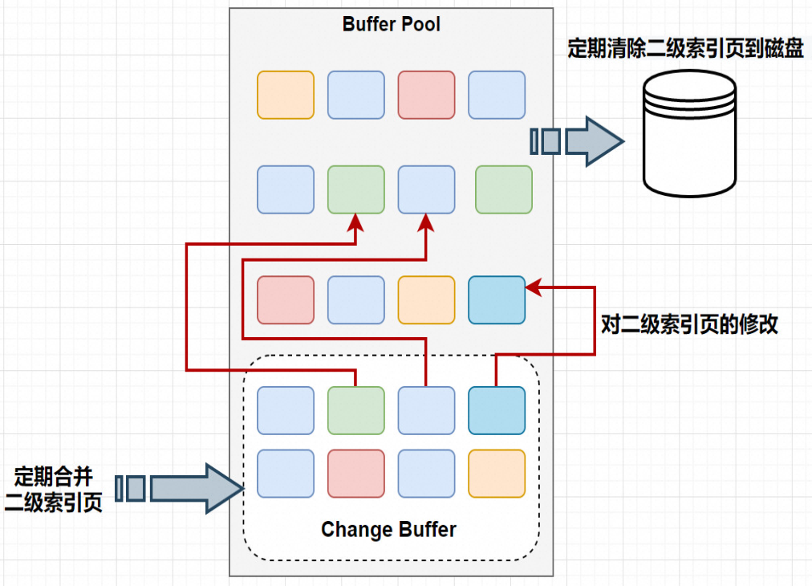

# 一、 Change Buffer基本概念

Change Buffer：写缓冲区,是针对**二级索引(辅助索引)** 页的更新优化措施。
作用: 在进行DML操作时，如果请求的是 辅助索引（非唯一键索引）没有在缓冲池 中时，并不会立刻将磁盘页加载到缓冲池，而是在CB记录缓冲变更，等未来数据被读取时，再将数据合并恢复到BP中。
ChangeBuffer占用BufferPool空间，默认占25%，最大允许占50%，可以根据读写 业务量来进行调整。参数innodb_change_buffer_max_size;

1. ChangeBuffer**用于存储SQL变更操作，比如Insert/Update/Delete等SQL语句**
2. ChangeBuffer中的每个变更操作都有其对应的数据页，并且该数据页未加载到缓存中；
3. 当ChangeBuffer中变更操作对应的数据页加载到缓存中后，InnoDB会把变更操作Merge到数据页上；
4. InnoDB会定期加载ChangeBuffer中操作对应的数据页到缓存中，并Merge变更操作；

# 二、 Change Buffer更新流程

- 情况1: 对于唯一索引来说，需要将数据页读入内存，判断到没有冲突，插入这个值，语句执行结束；
- 情况2: 对于普通索引来说，则是将更新记录在 change buffer，流程如下:
  1. 更新一条记录时，该记录在BufferPool存在，直接在BufferPool修改，一次内存操作。
     1. 如果该记录在BufferPool不存在（没有命中），在不影响数据一致性的前提下，InnoDB 会将这些更新操作缓存在 change buffer 中不用再去磁盘查询数据，避免一次磁盘IO。
     2. 当下次查询记录时，会将数据页读入内存，然后执行change buffer中与这个页有关的操作.通过这种方式就能保证这个数据逻辑的正确性。

> **写缓冲区，仅适用于非唯一普通索引页，为什么？**

- 如果在索引设置唯一性，在进行修改时，InnoDB必须要做唯一性校验，因此必须查询磁盘，做一次IO操作。会直接将记录查询到BufferPool中，然后在缓冲池修改，不会在ChangeBuffer操作。

> **什么情况下进行 merge ?**

将 change buffer 中的操作应用到原数据页，得到最新结果的过程称为**merge** change buffer，实际上它是可以持久化的数据。也就是说，change buffer 在内存中有拷贝，也会被写入到磁盘上,以下情况会进行持久化:

      1. 访问这个数据页会触发 merge
      2. 系统有后台线程会定期 merge。
      3. 在数据库正常关闭（shutdown）的过程中，也会执行 merge 操作。

> Change Buffer 的使用场景

- change buffer 的主要目的就是将记录的变更动作缓存下来,所以在merge发生之前应 当尽可能多的缓存变更信 息,这样 change buffer的优势发挥的就越明显.
- 应用场景: 对于写多读少的业务来说，页面在写完以后马上被访问到的概率比较小，此时 change buffer 的使用 效果最好。这种业务模型常见的就是账单类、日志类的系统。

# 三、 Change Buffer VS 刷脏

| **特点** | **Change Buffer** | **刷脏（Flush）**                      |
| -------- | ----------------- | -------------------------------------- |
| 作用对象 | 对索引的修改操作  | 将内存中的脏数据写入磁盘上的数据文件中 |
| 操作对象 | 索引              | 数据页                                 |
| 触发条件 | 索引的修改        | 系统checkpoint、redo log写满等因素触发 |
| 性能影响 | 可提高写入性能    | 可能影响性能，特别是在高负载情况下     |

### 

