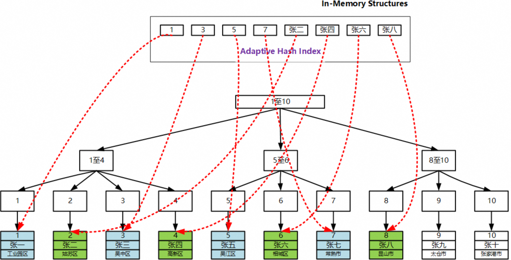

### 自适应哈希索引

[https://developer.aliyun.com/article/1230086](https://developer.aliyun.com/article/1230086)

#### 什么是自适应哈希索引？

自适应哈希索引是MySQL InnoDB存储引擎中的一种索引结构，用于加速查询。它根据查询模式和数据分布动态地调整自身的大小，以提高性能。

上图就是通过自适应哈希索引降低寻址的开销

#### 工作原理

1.  **动态调整大小：** 自适应哈希索引根据查询模式和数据分布动态调整自身的大小，使得常用的索引值在内存中，从而提高查询性能。 
2.  **统计信息：** InnoDB存储引擎通过监控每个索引值的访问频率来收集统计信息，根据统计信息动态调整哈希索引的大小。 
3.  **内存中的索引结构：** 自适应哈希索引主要存在于内存中，加速对索引列的查询，提高查询性能。 

#### 优势

1.  **减少磁盘IO：** 自适应哈希索引可以将常用的索引值保存在内存中，减少了磁盘IO操作，提高了查询性能。 
2.  **适应性强：** 根据查询模式和数据分布动态调整大小，适应性更强，能够适应不同的工作负载和数据分布情况。 
3.  **无需手动干预：** 自适应哈希索引不需要手动创建或调整，系统会根据实际情况自动管理索引的大小和结构。 

#### 注意事项

1.  **索引冲突：** 自适应哈希索引可能会出现哈希冲突，需要额外的处理机制来解决。 
2.  **适用范围：** 自适应哈希索引适用于频繁访问的索引列，对于很少被访问的列可能效果不明显。 
3.  **版本要求：** 自适应哈希索引是InnoDB存储引擎的特性，因此只能在使用InnoDB存储引擎的MySQL数据库中使用。 
