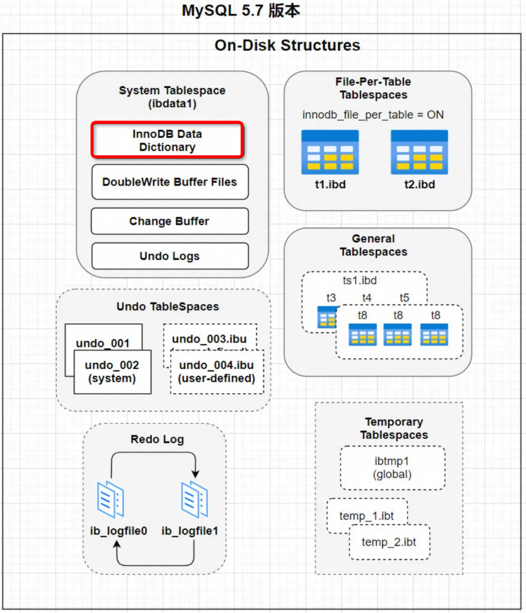
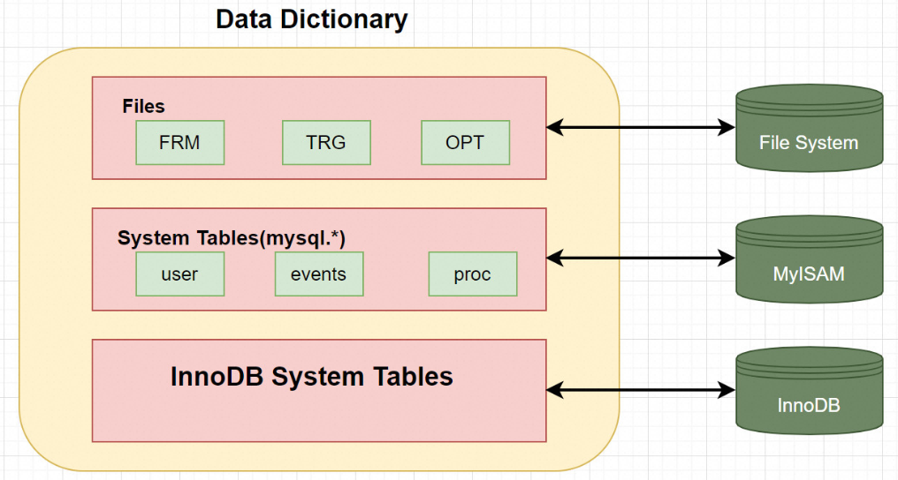

# 一、数据字典 ( Data Dictionary )

## 1.1 背景介绍

> 我们平时使用 INSERT 语句向表中插入的那些记录称之为用户数据，MySQL只是作为一个软件来为我们来保管这 些数据，提供方便的增删改查接口而已。但是每当我们向一个表中插入一条记录的时候，MySQL先要校验一下插 入语句对应的表存不存在，插入的列和表中的列是否符合，如果语法没有问题的话，还需要知道该表的聚簇索引 和所有二级索引对应的根页面是哪个表空间的哪个页面，然后把记录插入对应索引的 B+ 树中。所以说，MySQL 除了保存着我们插入的用户数据之外，还需要保存许多额外的信息，比方说：
>
> - 某个表属于哪个表空间，表里边有多少列
> - 表对应的每一个列的类型是什么 
> - 该表有多少索引，每个索引对应哪几个字段，该索引对应的根页面在哪个表空间的哪个页面 
> - 该表有哪些外键，外键对应哪个表的哪些列 
> - 某个表空间对应文件系统上文件路径是什么 
> - balabala ... 还有好多，不一一列举了

## 1.2 基础结构

可以看到 MySQL中的数据字典是一个重要的组成部分，它包含了数据库的各种元数据信息，如表结构、数据库名或表名、字段的数据类型、视图、索引、存储过程、触发器等内容。

### 1.2.1 核心存储内容

1. 表结构：包括表名、字段名、字段类型、字段约束等信息。
2. 数据库名或表名：标识数据库和表的名称。
3. 字段的数据类型：定义了每个字段的数据类型，如整型、字符型等。
4. 视图：虚拟表，由一个或多个表的行或列组成，可以简化复杂查询。
5. 索引：提高数据检索效率的数据结构，包括主键索引、唯一索引、普通索引等。
6. 存储过程：存储在数据库中的一组SQL语句，可被重复调用。
7. 触发器：与表相关联的一段SQL代码，当指定的事件发生时自动执行。

## 1.3 特点

- InnoDB数据字典由内部系统表组成，这些表包含用于查找表、索引和表字段等对象的元数据。
- 在MySQL 8.0之前，由于历史原因，数据字典元数据在一定程度上与InnoDB表元数据文件（.frm文件）中存储的信息重叠。

> 注: MySQL8.0版本以后 将所有原先存放于数据字典文件中的信息，全部存放到数据库系统表中，即将之前版本的 .frm,.opt等文件都移除了，不再通过文件的方式存储数据字典信息

### 

