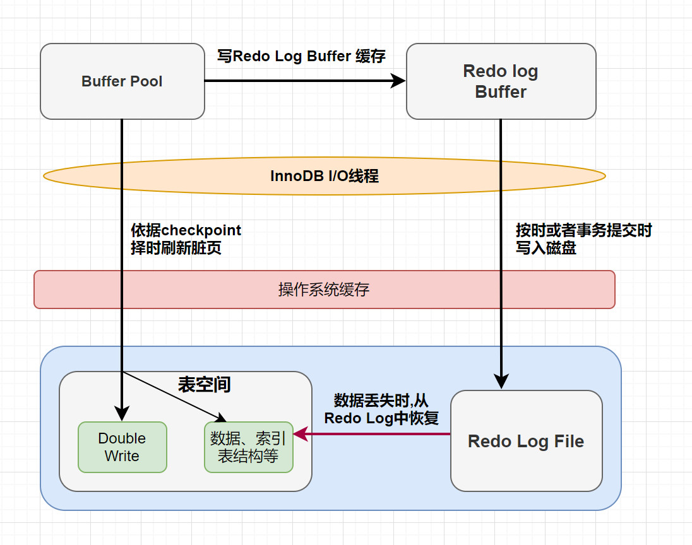
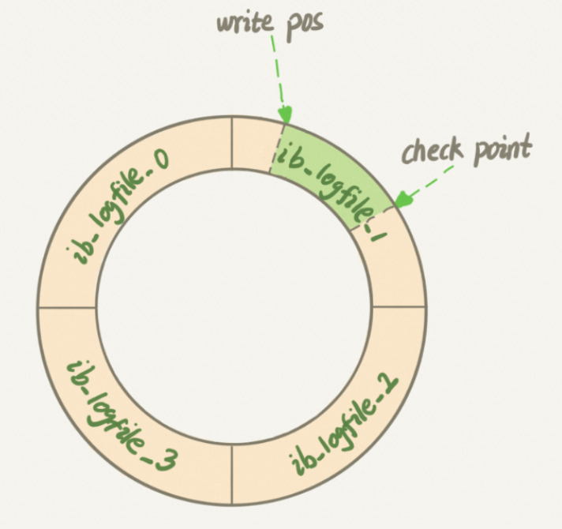
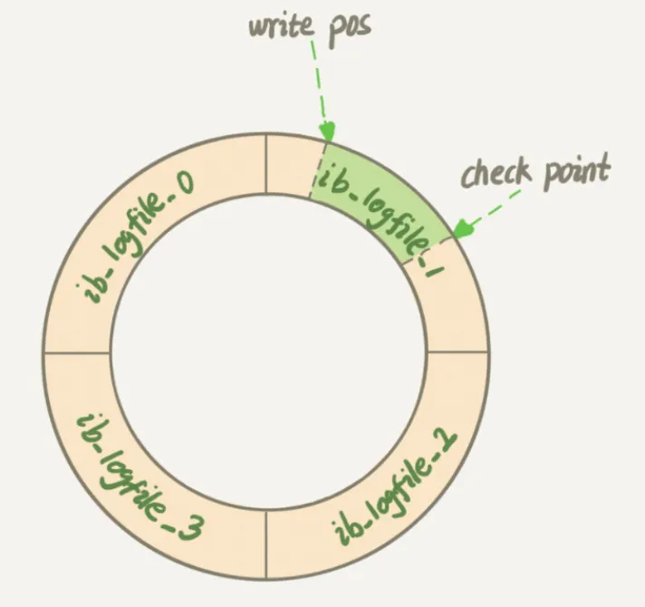

### 2.4 重做日志 ( redo log ) 

#### 背景介绍

-  **持久性要求：** 对于已提交的事务，即使系统发生崩溃，其对数据库的更改也不能丢失。
-  **问题：** 
   - 在事务提交前将所有修改的页面刷新到磁盘浪费资源。
   - 随机IO导致刷新速度慢。
-  **解决方案：** 
   - 【数据副本】记录事务执行过程中所做的修改，称为 Redo 日志。
   - 【顺序写入】Redo Log 就是 WAL
-  **什么是 WAL**: 
   - WAL 的全称是 Write-Ahead Logging，中文称为预写式日志，是一种数据安全写入机制。在 MySQL 中，redo log 就是采用了 WAL 机制。
   - 为什么使用WAL？
     - 磁盘的写操作是随机 IO，比较耗性能。通过将每一次的更新操作先写入日志中，然后再写入磁盘，就可以将随机写操作转变为顺序写操作，从而提高性能。WAL 的核心在于将随机写转变为了顺序写，降低了客户端的延迟，提升了系统的吞吐量。

#### 基本概念

InnoDB 引擎对数据的更新，是先将更新记录写入 redo log 日志，然后在系统空闲的时候或者是按照设定的更新策略再将日志中的内容更新到磁盘之中。这种技术可以大大减少 IO 操作的频率，提升数据刷新的效率。

- redo log：被称作重做日志,包括两部分：
  - 一个是内存中的日志缓冲：`redo log buffer`
  - 另一个是磁盘上的日志文件： `redo log file` 。 
- 当故障发生致使内存数据丢失后，InnoDB会在重启时，经过重放 redo，将Page恢复到崩溃之前的状态 **通过Redo log可以实现事务的持久性 。**

#### 脏页落盘流程

- mysql 每执行一条 DML 语句，先将记录写入 redo log buffer ( redo日志记录的是事务对数据库做了哪些修改 ) 。后续某个时间点再一次性将多个操作记录写到 redo log file 


当进行数据页的修改操作时: 

   - 首先修改在缓冲池中的页，然后再以一定的频率刷新到磁盘上。
   - 页从缓冲池刷新回磁盘的操作并不是在每次页发生更新时触发，而是通过一种称为`CheckPoint`的机制刷新回磁盘。 

#### CheckPoint

> 如果重做日志可以无限地增大，同时缓冲池也足够大，那么是不需要将缓冲池中页的新版本刷新回磁盘。因为当发生宕机时，完全可以通过重做日志来恢复整个数据库系统中的数据到宕机发生的时刻。



- 文件结构： 
  - 可以配置为一组文件，例如，4 个文件，每个文件大小为 1GB，总共可记录 4GB 的操作。
  - 写入时从头开始写，写到末尾后又回到开头，形成循环写的机制。
  - Write Position： 写入偏移量
  - Checkpoint： 检查点
- 作用：
  - 提速： 缩短数据库的恢复时间 
  - 刷脏： 缓冲池不够用时，将脏页刷新到磁盘 
  - 崩溃恢复： 重做日志不可用时，刷新脏页。 
- 刷脏的时机： 
  - sharp checkpoint：强制落盘。把内存中所有的脏页都执行落盘操作。**只有当关闭数据库之前才会执行**。
  - fuzzy checkpoint：模糊落盘。把一部分脏页执行落盘操作
    - 【定期执行】Master Thrad Checkpoint 主线程定时将脏页写入磁盘 每秒或每10s执行一次脏页。
    - 【脏页淘汰】FLUSH_LRU_LIST buffer pool有脏页换出，执行落盘
    - 【redo log 满】Async/Sync Flush checkpoint 当redo log快写满的时候执行落盘
      - 当redo log超过75%小于90%会执行异步落盘
      - 当redo log超过90%，会执行同步落盘操作。会阻塞写操作。
  - 【脏页占比过高】Dirty Page too much checkpoint 如果buffer pool中脏页太多，脏页率超过75%执行落盘
- 总结：  CheckPoint机制的重要性在于确保数据库系统在发生宕机或异常情况时能够快速恢复到一个一致的状态，同时有效管理缓冲池中的脏页。

#### Redo Log 持久化

缓冲区数据一般情况下是无法直接写入磁盘的，中间必须经过操作系统缓冲区( OS Buffer )。因此， redo log buffer 写入 redo logfile 实际上是先写入 OS Cache，然后再通过系统调用 fsync() 将其刷到 redo log file.


      1.  存在于redo log buffer 内存区域中 
      2.  向磁盘写入,但是没有真正写入磁盘,而是保存在文件系统缓存中 
      3.  持久化到磁盘 

Redo Buffer 持久化到 redo log 的策略，可通过`Innodb_flush_log_at_trx_commit` 设置：

| 参数值             | 含义                                                         |
| ------------------ | ------------------------------------------------------------ |
| 0 (延迟写)         | 事务提交时不会将 `redo log buffer`中日志写入到 `os buffer`，而是每秒写入 `os cache`并调用 `fsync()`写入到 `redo log file`中。也就是说设置为0时是(大约)每秒刷新写入到磁盘中的，当系统崩溃，会丢失1秒钟的数据。 |
| 1  (实时写,实时刷) | 事务每次提交都会将 `redo log buffer`中的日志写入 `os cache`并调用 `fsync()`刷到 `redo log file`中。这种方式即使系统崩溃也不会丢失任何数据，但是因为每次提交都写入磁盘，IO的性能较差。 |
| 2 (实时写, 延时刷) | 每次提交都仅写入到 `os buffer`，然后是每秒调用 `fsync()`将 `os cache`中的日志写入到 `redo log file`。 |

- **一般建议选择取值 1，数据不会丢**
- 这里类似于 RocketMQ 内存写成功，但是刷盘失败: [rocketmq 最佳实践](https://github.com/apache/rocketmq/blob/develop/docs/cn/best_practice.md#3-%E6%97%A5%E5%BF%97%E7%9A%84%E6%89%93%E5%8D%B0)

> 这意味着在事务提交后，数据页的修改可能仍然在内存中，并没有立即刷新到磁盘上。MySQL会根据自身的策略将内存中的数据页刷新到磁盘，这个过程可能会在事务提交后的某个时间点发生。

问题： 如果事务没有提交的时候,redo log buffer中的部分日志有可能被持久化到磁盘吗 ?
回答： 以下两种场景都会触发持久化

- redo log buffer 占用的空间即将达到 innodb_log_buffer_size 一半的时候，后台线程会主动写盘。 
- 并行的事务提交的时候，顺带将某个未提交的事务的redo log buffer 持久化到磁盘。因为redo log buffer 是共享的，因此一些正在执行中的事务的redo log信息也有可能被持久化到磁盘中。 

#### Redo Log 日志格式

| **日志类型** | **描述**                           | **举例**                                                     |
| ------------ | ---------------------------------- | ------------------------------------------------------------ |
| 物理日志     | 记录每个页中存储的具体值及修改操作 | 某个事物将系统表空间中的第100个页面中偏移量为1000处的那个字节的值1改为2. |
| 逻辑日志     | 记录数据变动的逻辑过程或SQL语句    | 把一个page页中的一个数据从1改为2，再从2改为3,逻辑日志就会记录1->2,2->3这个数据变化的过程. |

类似于 AOF & RDB 的区别，感兴趣的可以看 Redis 部分。


##### 通用结构 


      1. **type**: 该条日志的类型
      2. **space ID** : 表空间ID
      3. **page number** : 页号
      4. **data** : 该条redo日志的具体内容

##### 日志类型

redo log根据在页面中写入数据的多少,将redo日志划分为几种不同的类型(MySQL5.7中有53种类型)。 

   -  **MLOG_1BYTE (type=1)** : 表示在页面的某个偏移量处写入**1字节**的redo日志类型。 
   -  **MLOG_2BYTE (type=2)** : 表示在页面的某个偏移量处写入**2字节**的redo日志类型。 
   -  **MLOG_4BYTE (type=4)** : 表示在页面的某个偏移量处写入 **4字节** 的redo日志类型。 
   -  **MLOG_8BYTE (type=8)** : 表示在页面的某个偏移量处写入**8字节**的redo日志类型。 


   -  **MLOG_WRITE_STRING（type=30）**: 表示在页面的某个偏移量处写入一串数据，但是因为不能确定写入的具体数据占用多少字节，所以需要在日志结构中添加一个len字段。


#### 组提交

- MySQL 为了优化磁盘持久化的开销，会有一个 组提交（group commit）的机制
- 每个InnDB存储引擎至少有1个重做日志文件组（group），每个文件组下至少有两个重做日志文件，默认的为`ib_logfile0`、`ib_logfile1`
  - redo log 的组提交（group commit）是一种优化策略，用于提高数据库的性能和吞吐量。在 MySQL 中，redo log 的组提交是指将多个事务的提交操作合并成一个批量提交操作，从而减少磁盘 IO 操作的次数，提高系统的效率。
  - 具体来说，当多个事务同时提交时，MySQL 可以将它们的提交操作合并成一个组，然后一次性将这个组的提交操作写入到 redo log 文件中。这样做的好处是可以减少磁盘 IO 操作的次数，因为将多个提交操作合并成一个批量提交操作后，可以减少文件系统的写入开销和磁盘的随机写入次数，从而提高系统的性能和吞吐量。

1. 事务日志组路径，当前目录表示MyQSL数据目录为日志组目录.

```sql
mysql> show variables like 'innodb_log_group_home_dir';
+---------------------------+-------+
| Variable_name             | Value |
+---------------------------+-------+
| innodb_log_group_home_dir | ./    |
+---------------------------+-------+
1 row in set (0.00 sec)

[root@localhost mysql]# ll ib_log*
-rw-r----- 1 mysql mysql 50331648 1月  29 03:39 ib_logfile0
-rw-r----- 1 mysql mysql 50331648 7月  11 2020 ib_logfile1
```

2. 事务日志组中的事务日志文件个数,默认是2个.

```sql
mysql> show variables like 'innodb_log_files_in_group';
+---------------------------+-------+
| Variable_name             | Value |
+---------------------------+-------+
| innodb_log_files_in_group | 2     |
+---------------------------+-------+
1 row in set (0.01 sec)
```

3. 日志组中每个重做日志的大小一致，并循环使用；

```
mysql> show variables like 'innodb_log_file_size';
+----------------------+----------+
| Variable_name        | Value    |
+----------------------+----------+
| innodb_log_file_size | 50331648 |
+----------------------+----------+
1 row in set (0.00 sec)
```


InnoDB 以环型方式(circular fashion)写入数据到重做日志文件，当文件满了的时候，会自动切换到`日志文件2`，当重做`日志文件2`也写满时，会再切换到重做`日志文件1`； 

- **write pos**: 表示日志当前记录的位置，当ib_logfile_4写满后，会从ib_logfile_1从头开始记录；
- **check point**: 表示将日志记录的修改写进磁盘，完成数据落盘，数据落盘后checkpoint会将日志上的相关记录擦除掉，即 `write pos -> checkpoint`  之间的部分是redo log空着的部分，用于记录新的记录，`checkpoint -> write pos` 之间是redo log 待落盘的数据修改记录
- 如果 write pos 追上 checkpoint，表示写满，这时候不能再执行新的更新，得停下来先擦掉一些记录，把 checkpoint 推进一下。 

Redo log 记录了事务对数据库做了哪些修改，属于物理日志，包括不同类型的日志记录，如 MLOG_1BYTE、MLOG_2BYTE、MLOG_4BYTE、MLOG_8BYTE 和 MLOG_WRITE_STRING。
