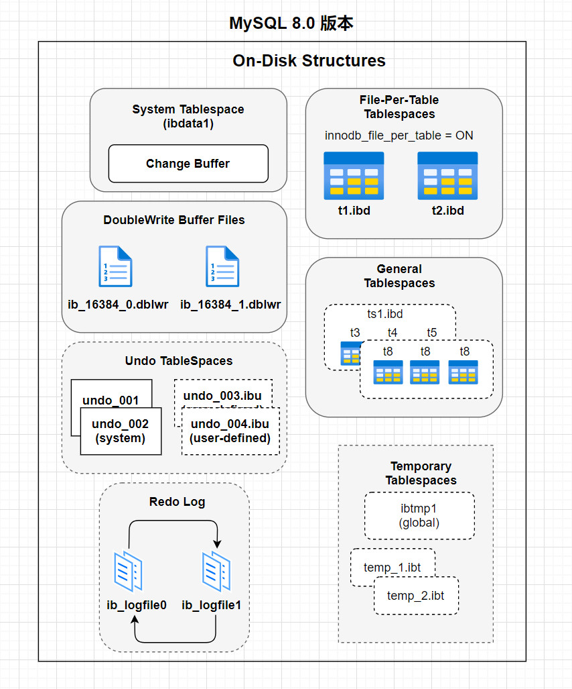

### 

-  MySQL 5.7 版本 
   -  将 Undo日志表空间从共享表空间 ibdata 文件中分离出来，可以在安装 MySQL 时由用户自行指定文件大小和数量。 
   -  增加了 temporary 临时表空间，里面存储着临时表或临时查询结果集的数据。 
   -  Buffer Pool 大小可以动态修改，无需重启数据库实例。 
-  MySQL 8.0 版本 
   - 将InnoDB表的数据字典和Undo都从共享表空间ibdata中彻底分离出来了，以前需要ibdata中数据字典与独立表空间ibd文件中数据字典一致才行，8.0版本就不需要了。
   - temporary 临时表空间也可以配置多个物理文件，而且均为 InnoDB 存储引擎并能创建索引，这样加快了处理的速度。
   - 用户可以像 Oracle 数据库那样设置一些表空间，每个表空间对应多个物理文件，每个表空间可以给多个表使用，但一个表只能存储在一个表空间中。
   - 将Doublewrite Buffer从共享表空间ibdata中也分离出来了。
