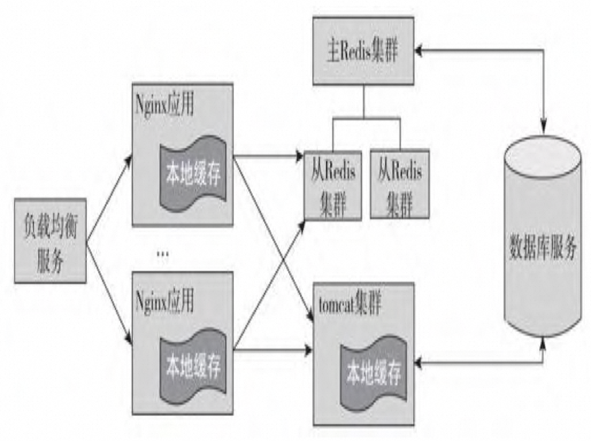
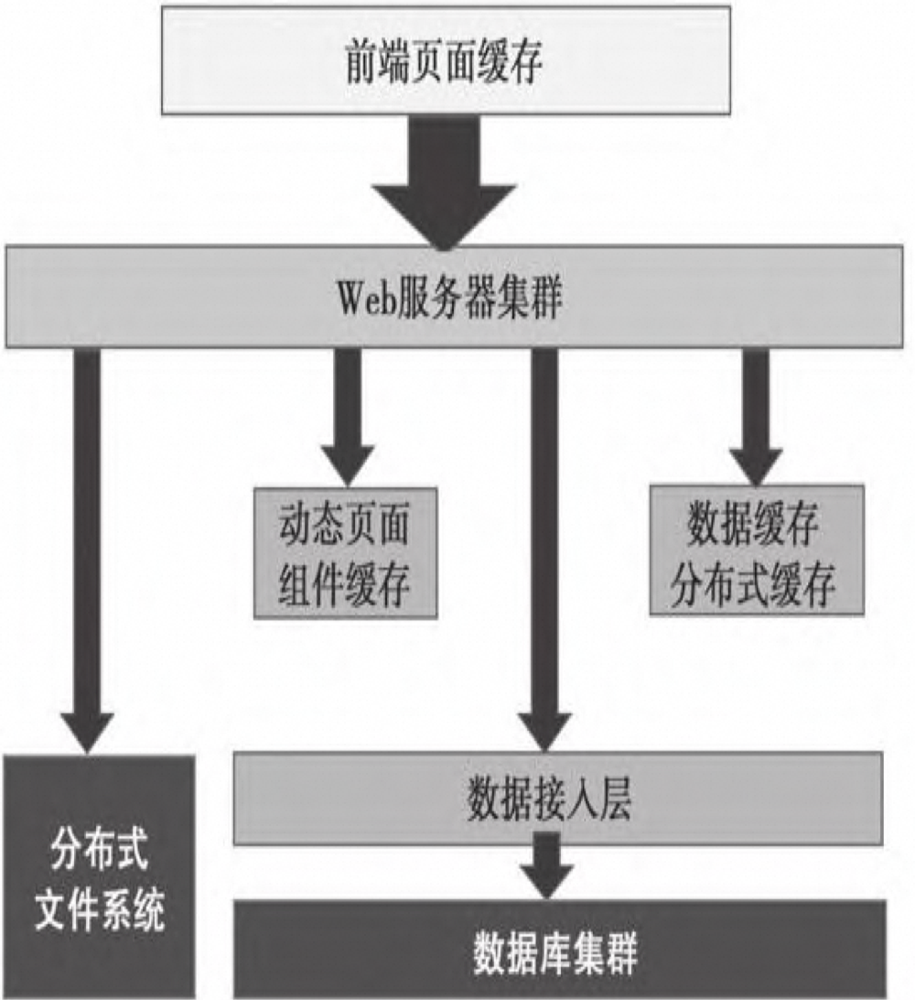
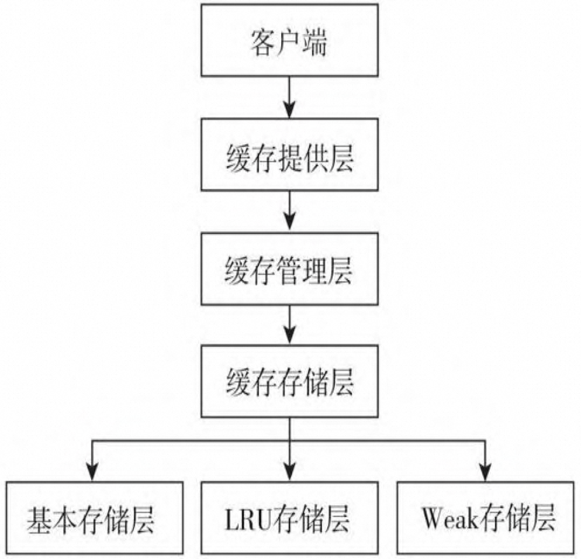
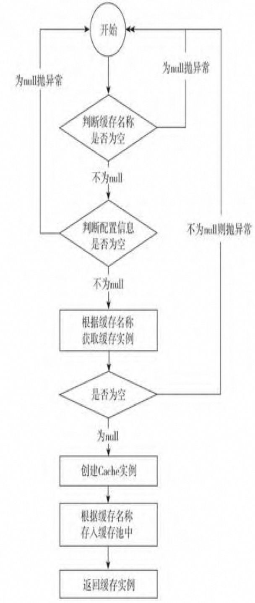
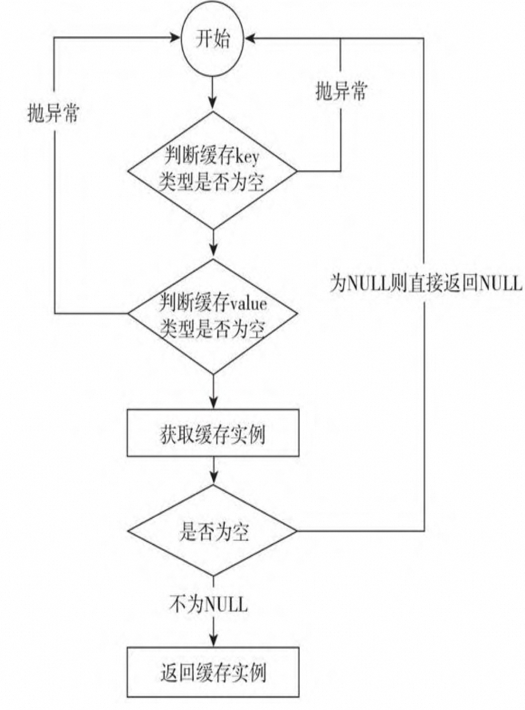

# 一、背景

## 1.1 什么是缓存

缓存：存储在计算机上的一个原始数据复制集，以便于访问——维基百科

## 1.2 为什么用缓存

- 提升用户体验： 【即效率、效益和基本主观满意度】CAST

- 使用者的状态、系统性能及环境，不同的人对于同样的软件可能有不同的主观感受，而且不同的人对于软件性能关心的视角也不同。

- 提升系统的性能: 缓存离用户最近，利用缓存可以最小化系统的工作量，能够降低系统的链路

- 响应时间： 指系统对用户请求做出响应的时间，与人对软件性能的主观感受是非常一致的，它完整地记录了整个系统处理请求的时间，

- 响应时间= 呈现时间（取决于页面）+系统响应时间【网络传输+应用延迟时间】

- 延迟时间： 网络传输+应用延迟
- 吞吐量： 系统在单位时间内处理请求的数量

- 无并发的系统，吞吐量与响应时间成反比

- 并发用户数： 并发用户数能够笼统的概括系统性能指标
- 资源利用率： 资源利用率能够反馈资源的占用情况

## 1.3 缓存的分类

### 软件位置划分

#### 客户端缓存

- 页面缓存： 页面自身元素缓存【之前渲染的页面保存为文件 localStorage 存储】+服务端对静态页面进行缓存 【CDN】
- 浏览器缓存: 

- 通过请求头：  [e-tag](https://developer.mozilla.org/zh-CN/docs/Web/HTTP/Headers/ETag)标记文件 id ,if-modified-sincence 标识更新时间， [http 协议](https://developer.mozilla.org/zh-CN/docs/Web/HTTP/Headers/Last-Modified),通过发送下载时间给服务端，服务端如果发现没有变更则返回 304-not modified ，客户端收到后可以直接使用缓存文件
- Cache-control 和 Expires 一致，Cache-Control 选择更多。 [cache-control](https://developer.mozilla.org/zh-CN/docs/Web/HTTP/Headers/Cache-Control)
- Cache-control|Expires > last-modified/etag

- APP 缓存: 内存缓存、数据库缓存，文件缓存，用于 均衡网速、流量

#### 服务端缓存

- 数据库缓存： 

- MySQL 的查询缓存，通过下面命令进行判断是否合理，核心考察缓存命中率

```java
SHOW VARIABLES LIKE '%query_cache%';

have_query_cache	YES
query_cache_limit	1048576
query_cache_min_res_unit	1024
query_cache_size	3145728
query_cache_type	OFF
query_cache_wlock_invalidate	OFF
```

- Innodb 的缓存性能： innodb_buffer_pool_size,可以通过

```java
SHOW VARIABLES LIKE 'innodb_buffer_pool_size%';
innodb_buffer_pool_size	51539607552  48G
```

- （Innodb_buffer_pool_read_requestsInnodb_buffer_pool_reads）/Innodb_buffer_pool_read_requests*1 00%计算缓存命中率，并根据命中率来调整innodb_buffer_pool_size 参数大小进行优化。

- 平台缓存： Ehcache、GuaCache [JVM]
- 应用缓存： Redis 【新浪微博】、memCache 等



#### 网络中的缓存

- 代理缓存：  较流行的是Squid，它支持建立复杂的缓存层级 结构，拥有详细的日志、高性能缓存以及用户认证支持
- 边缘缓存： 例如 Nginx、CDN

正向代理主要处理客户端请求,反向代理主要处理服务器端响应

- 正向代理:指客户端通过代理服务器请求目标服务器的行为,即代理服务器代表客户端去请求目标服务器。客户端和代理服务器之间通过协议进行通讯。
- 反向代理:指目标服务器通过代理服务器来响应客户端请求的行为。客户端直接请求代理服务器,然后由代理服务器去选择目标服务器来进行响应。代理服务器和目标服务器之间采用内部协议通讯。

 

### 宿主层次划分

| **类型**                              | **描述**                                                     |
| ------------------------------------- | ------------------------------------------------------------ |
| 本地缓存/进程内缓存[L1 L2 L3] JVM jVM | 存储在应用服务器本地的缓存模式，通常位于同一个JVM内。 本地缓存也称为进程内缓存，直接访问进程所属内存，无需进程间通信，速度最快。 可分为堆内缓存和堆外缓存。堆内缓存会对垃圾回收产生影响，而堆外缓存则会增加序列化和反序列化的开销。 |
| 进程间缓存                            | 当进程内缓存较大时，重启后需要重新加载缓存，导致系统启动缓慢。可通过在本机单独启动一个进程来专门存放缓存，并通过Domain Socket进行通信。 |
| 远程缓存                              | 需要跨服务器访问的缓存，数据存放于单独的缓存服务器上。  典型的远程缓存包括Memcached和Redis等。 |
| 二级缓存                              | 是本地缓存和远程缓存的结合，用于互联网系统。对于易变的数据，散列到分布式部署的远程缓存，减少数据库层访问以提升性能。对于不易改变但访问量大的数据，则进一步放置到本地缓存中，以获得更高的访问性能。 |



- 大型网站的架构示意图

## 1.4 基础理论

### CAP 理论

- C：一致性被称为原子对象，任何的读写都应该看起来是“原子”的， 或串行的。写后面的读一定能读到前面写的内容。所有的读写请求都好像被 全局排序。
- A：对任何非失败节点都应该在有限时间内给出请求的回应。（请求的 可终止性）
- P：允许节点之间丢失任意多的消息，当网络分区发生时，节点之间的 消息可能会完全丢失。

- 一致性（C）：在分布式系统中的所有数据备份，在同一时刻是否有同样的值。（等同于所有节点访问同一份最新的数据副本）
- 可用性（A）：在集群中一部分节点故障后，集群整体是否还能响应客 户端的读写请求。（对数据更新具备高可用性）
- 分区容忍性（P）：以实际效果而言，分区相当于对通信的时限要求。 系统如果不能在一定时限内达成数据一致性，就意味着发生了分区的情况， 必须就当前操作在C和A之间做出选择。 


- 当网络发生分区时,由于通信路线中断,不可能同时满足一致性和可用性。

- 一致性需要每个请求返迴之前保证所有分布式节点都达成一致,这与分区情况下不同节点暂时失联是矛盾的。

- 但是由于网络是不可靠的,分区故障是无法避免的。那么在分区期间,系统要么选择延迟请求得到一致应答(C优先),要么返回可用但可能不一致的快速应答(A优先)。
- 所以在分布式系统,我们只能做到优先满足CAP中的任何两项,而第三项必须作出让步。


todo ： 待确认

| **模型**  | **一致性（Consistency）** | **可用性（Availability）** | **分区容忍性（Partition Tolerance）** | **不能满足的原因**                                           |
| --------- | ------------------------- | -------------------------- | ------------------------------------- | ------------------------------------------------------------ |
| Redis     | 是                        | 否                         | 是                                    | Redis集群在节点选举期间可能出现部分不可用，牺牲了可用性。    |
| ZooKeeper | 是                        | 否                         | 是                                    | ZooKeeper集群在Leader选举期间可能出现部分不可用，牺牲了可用性。 |

### BASE 理论

- BASE 分别是基本可用性（Basically Available）、柔性事务（Soft State）和最终一致性（Eventually Consistent）的缩写

例如 RocketMQ 的事物消息

### JSR 规范

[📎JSR107FinalSpecification.pdf](https://www.yuque.com/attachments/yuque/0/2024/pdf/2310873/1712149109133-cda5ea7f-0e04-44c5-8350-c976f999cd57.pdf)

Map<String,<Map<String,Object>>> = Cache 用户信息缓存

<Map<String,Object> = > Entry 


Spring-Data-Cache

1. **基础概念**：介绍了核心接口，包括CachingProvider、CacheManager、Cache、Entry和ExpiryPolicy，以及它们的职责和关系。

2. CacheProvider 创建 CacheManager
3. CacheManager 管理 Cache
4. Cache 类似 Map 的数据结构并且存储 Key 为索引的值
5. Entry： 是存储在 Cache 中的 Key-Value 
6. ExpiryPolicy : 缓存过期策略

7. **一致性模型**：讨论了缓存操作的一致性行为，包括默认一致性模型和可能的其他一致性模型。
8. **缓存拓扑**：描述了缓存条目可能存储的位置，包括本地和分布式环境。
9. **执行上下文**：解释了EntryProcessors、CacheEntryListeners、CacheLoaders、CacheWriters和ExpiryPolicys在缓存操作中的执行环境。
10. **再入性**：讨论了在这些接口的实现中可能限制的再入性。
11. **简单示例**：提供了一个创建和使用缓存的基本示例。
12. **CacheManagers**：详细介绍了CacheManager的职责，包括如何获取、配置、创建、关闭和销毁缓存。
13. **缓存**：描述了Cache接口及其方法，以及如何使用它来执行缓存操作。
14. **缓存注释**：**介绍了一组用于简化缓存交互的注释，如****@CacheDefaults****、****@CacheResult****、****@CachePut****、****@CacheRemove****和****@CacheRemoveAll****。**
15. **管理**：讨论了如何启用和禁用缓存的管理功能和统计信息。
16. **可移植性建议**：提供了一系列建议，以确保应用程序在使用Java Caching API的不同实现之间具有良好的可移植性。



客户端层：使用者直接通过该层与数据进行交互。 

缓存提供层：主要对缓存管理层的生命周期进行维护，负责缓存管理 层的创建、保存、获取以及销毁。

缓存管理层：主要对缓存客户端的生命周期进行维护，负责缓存客户 端的创建、保存、获取以及销毁。

缓存存储层：负责数据以什么样的形式进行存储。

基本存储层：是以普通的ConcurrentHashMap为存储核心，数据不淘 汰。 

LRU存储层：是以最近最少用为原则进行的数据存储和缓存淘汰机制。 

Weak存储层：是以弱引用为原则的数据存储和缓存淘汰机制。

## 1.5 通用逻辑




