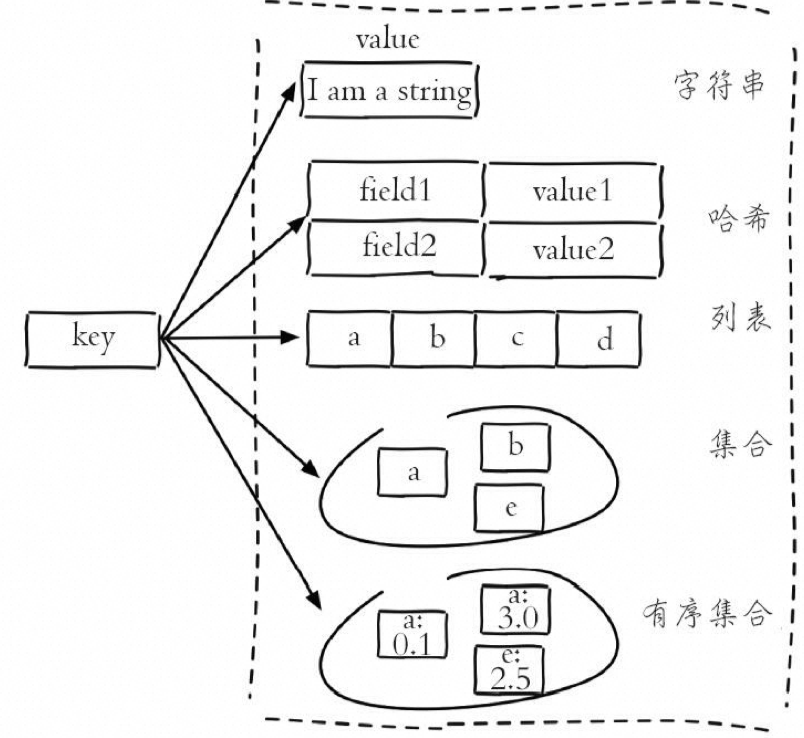
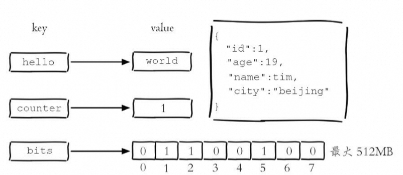
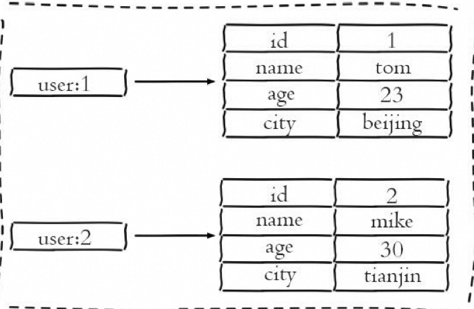
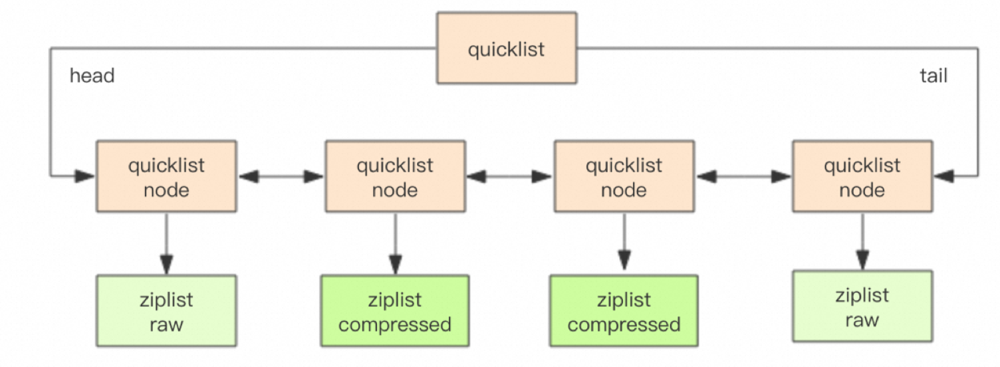
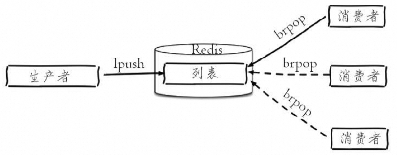
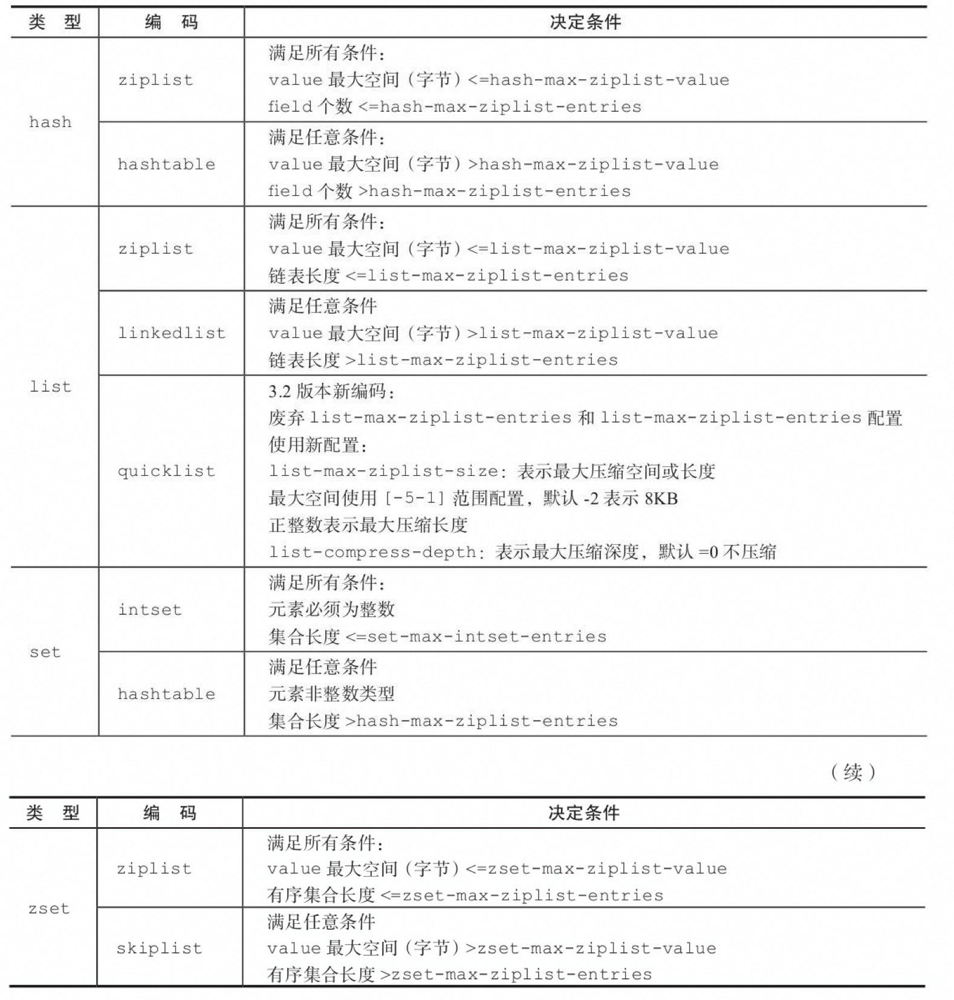

# 三、Redis 数据类型和使用场景



- Hash：对象类型的数据，购物车
- List：队列/栈
- Set：String类型的无序集合，intset，抽奖、签到、打卡，商品评价标签
- Sorted Set：存储有序的元素，ziplist，skiplist+ dict，排行榜
- Geo：地理位置信息
- Hyperloglogs：基于基数的统计
- Streams：流计算

## 3.1 基础命令

| **命令**           | **作用**             | **示例**        | **返回值** |
| ------------------ | -------------------- | --------------- | ---------- |
| keys *             | 查看所有键           | keys *          | 所有键列表 |
| dbsize             | 键总数               | dbsize          | 键的总数   |
| exists key         | 检查键是否存在       | exists java     | 1 或 0     |
| del key [key]      | 删除键               | del java        | 删除个数   |
| expire key seconds | 设置键的过期时间     | expire hello 10 | 1 或 0     |
| ttl key            | 查看键的剩余过期时间 | ttl hello       | 剩余时间   |
| type key           | 查看键的数据结构类型 | type hello      | 数据类型   |


### 3.1.1 单个键管理

| **功能**       | **命令**                                                     | **说明**                                                     |
| -------------- | ------------------------------------------------------------ | ------------------------------------------------------------ |
| 键重命名       | **rename key newkey**                                        | 将指定键重命名为新键名。如果新键名已存在，则会覆盖原有键的值。 |
| 随机返回一个键 | **randomkey**                                                | 从当前数据库中随机返回一个键的名称。                         |
| 键过期         | **expire key seconds**                                       | 设置键在指定秒数后过期。                                     |
|                | **expireat key timestamp**                                   | 设置键在指定时间戳后过期。                                   |
|                | **pexpire key milliseconds**                                 | 以毫秒为单位设置键在指定毫秒数后过期。                       |
|                | **pexpireat key milliseconds-timestamp**                     | 以毫秒为单位设置键在指定毫秒级时间戳后过期。                 |
|                | **ttl key**                                                  | 获取键的剩余过期时间（单位：秒）。                           |
|                | **pttl key**                                                 | 获取键的剩余过期时间（单位：毫秒）。                         |
|                | **persist key**                                              | 移除键的过期时间，使其永久有效。                             |
| 键迁移         | **move key db**                                              | 将指定键移动到另一个数据库。                                 |
|                | **dump key**+**restore key ttl value**                       | 在不同 Redis 实例之间进行数据迁移。                          |
|                | `migrate host port key                   | "" destination-db timeout [copy] [replace] [keys key [key ...]]` |                                                              |

### 3.1.2 键的遍历

对应 mysql limit 

| **功能**         | **命令**                                            | **说明**                                                     |
| ---------------- | --------------------------------------------------- | ------------------------------------------------------------ |
| 全量遍历键       | **keys pattern**                                    | 返回匹配给定模式的所有键。**pattern** 可以包含通配符，如 ***** 匹配所有键，**?** 匹配单个字符，**[]** 匹配指定范围的字符。**Keys 命令可能会导致 Redis 阻塞，不建议在生产环境中使用，但在某些情况下，如数据量较小或者在从节点上执行，可以使用。** |
| 渐进式遍历       | **scan cursor [match pattern] [count number]**      | 使用游标方式逐步遍历所有键。**cursor** 是游标值，从 0 开始，每次遍历完毕后会返回新的游标值。**match** 可选参数用于模式匹配，**count** 可选参数表示每次遍历的键个数，默认为 10。Scan 命令可以有效避免阻塞，但无法保证完全遍历所有键。可用于检测过期或闲置时间、寻找大对象等场景。 |
| 面向哈希类型扫描 | **hscan key cursor [match pattern] [count number]** | 渐进式遍历哈希类型键的所有字段。与 **scan** 类似，但专用于哈希类型。 |
| 面向集合类型扫描 | **sscan key cursor [match pattern] [count number]** | 渐进式遍历集合类型键的所有元素。与 **scan** 类似，但专用于集合类型。 |
| 面向有序集合扫描 | **zscan key cursor [match pattern] [count number]** | 渐进式遍历有序集合类型键的所有成员。与 **scan** 类似，但专用于有序集合类型。 |

## 3.2 字符串



- Redis的字符串类型是最基础的数据结构。
- 所有键都是字符串类型，其他数据结构都是在字符串类型基础上构建的。
- 值可以是简单字符串、复杂字符串（如JSON、XML）、数字（整数、浮点数）甚至是二进制（图片、音频、视频），但值的最大大小不能超过512MB。

### 3.2.1 命令

#### 常用命令

1. **设置值**

- **set key value [ex seconds] [px milliseconds] [nx|xx]**: 设置键的值，并可选地设置过期时间和条件。
- **setex key seconds value**: 设置键的值，并同时设置过期时间（秒）。
- **setnx key value**: 仅当键不存在时设置键的值。
- **setxx key value**: 仅当键存在时设置键的值。

1. **获取值**

- **get key**: 获取键的值。
- **mget key [key ...]**: 批量获取多个键的值。

1. **批量操作**

- **mset key value [key value ...]**: 批量设置多个键值对。
- **mget key [key ...]**: 批量获取多个键的值。

1. **计数**

- **incr key**: 对键的值进行自增操作。
- **decr key**: 对键的值进行自减操作。
- **incrby key increment**: 对键的值进行指定数字的自增操作。
- **decrby key decrement**: 对键的值进行指定数字的自减操作。
- **incrbyfloat key increment**: 对键的值进行浮点数的自增操作。

#### 不常用命令

1. **追加值**

- **append key value**: 向键的值尾部追加字符串。

1. **字符串长度**

- **strlen key**: 返回键的值的长度。

1. **设置并返回原值**

- **getset key value**: 设置键的值并返回键原来的值。

1. **设置指定位置的字符**

- **setrange key offset value**: 设置键值的指定位置的字符。

1. **获取部分字符串**

- **getrange key start end**: 获取键值的指定范围的子字符串。

#### 时间复杂度

| **命令**    | **时间复杂度** |
| ----------- | -------------- |
| set         | O(1)           |
| get         | O(1)           |
| mset        | O(N)           |
| mget        | O(N)           |
| incr        | O(1)           |
| decr        | O(1)           |
| incrby      | O(1)           |
| decrby      | O(1)           |
| incrbyfloat | O(1)           |
| append      | O(1)           |
| strlen      | O(1)           |
| getset      | O(1)           |
| setrange    | O(1)           |
| getrange    | O(N)           |

### 3.2.2 内部编码

Redis字符串类型的内部编码与底层数据结构密切相关，不同的编码方式会对应不同的底层数据结构，如下所示：

- int：采用8个字节的长整型存储，底层数据结构为整数类型, 节省内存空间和提高访问速度。

```shell
127.0.0.1:6379> set key 8653 OK
127.0.0.1:6379> object encoding key "int"
```

- embstr：对于小于等于39个字节的字符串，采用内嵌字符串编码，底层数据结构为简单的字符数组,避免额外的内存分配和释放操作。

```shell
# 小于等于39个字节的字符串：embstr
127.0.0.1:6379> set key "hello,world" OK
127.0.0.1:6379> object encoding key "embstr"
```

- raw：对于大于39个字节的字符串，采用原始字符串编码，底层数据结构为动态字符串（dynamic string），通常是一个结构体，内部包含了指向字符数组的指针以及该字符串的长度等信息。

```shell
# 大于39个字节的字符串：raw
127.0.0.1:6379> set key "one string greater than 39 byte........." OK
127.0.0.1:6379> object encoding key "raw"
127.0.0.1:6379> strlen key (integer) 40
```

### 3.2.3 应用场景

#### 缓存功能

典型的缓存使用场景是将 Redis 作为缓存层，通过 Redis 快速获取数据，减轻后端数据库的压力。下面是模拟的代码示例：

```java
UserInfo getUserInfo(long id){
    String userRedisKey = "user:info:" + id;
    String value = redis.get(userRedisKey);
    UserInfo userInfo;
    if (value != null) {
        userInfo = deserialize(value);
    } else {
        userInfo = mysql.get(id);
        if (userInfo != null) {
            redis.setex(userRedisKey, 3600, serialize(userInfo));
        }
    }
    return userInfo;
}
```

#### 计数功能

Redis 可以作为计数的基础工具，用于实现快速计数和查询缓存的功能。以下是一个简单的示例：

```java
long incrVideoCounter(long id) {
    String key = "video:playCount:" + id;
    return redis.incr(key);
}
```

#### 共享 Session

使用 Redis 可以集中管理用户的 Session 信息，解决分布式 Web 服务中的 Session 分散管理问题，确保用户登录状态的一致性。示例代码如下：

```java
// 在登录时将用户的 Session 信息存储到 Redis
redis.setex(sessionId, 3600, serialize(userInfo));

// 在需要获取 Session 信息时，直接从 Redis 中获取
UserInfo userInfo = deserialize(redis.get(sessionId));
```

#### 限速功能

通过 Redis 实现对特定操作的限速，如限制用户获取验证码的频率、限制 IP 地址的访问频率等。示例代码如下：

```java
String phoneNum = "138xxxxxxxx";
String key = "shortMsg:limit:" + phoneNum;

// SET key value EX 60 NX
String isExists = redis.set(key, "1", "EX 60", "NX");

if (isExists != null || redis.incr(key) <= 5) {
    // 允许操作
} else {
    // 限速
}
```

## 3.3 哈希

### 3.3.1 命令

| **命令**                                | **示例**                                   | **说明**                                         |
| --------------------------------------- | ------------------------------------------ | ------------------------------------------------ |
| hset key field value                    | hset user:1 name tom                       | 为指定键的哈希类型设置字段及其对应的值           |
| hget key field                          | hget user:1 name                           | 获取指定键的哈希类型中指定字段的值               |
| hdel key field [field ...]              | hdel user:1 name                           | 删除指定键的哈希类型中一个或多个字段             |
| hlen key                                | hlen user:1                                | 计算指定键的哈希类型中字段的数量                 |
| hmset key field value [field value ...] | hmset user:1 name mike age 12 city tianjin | 批量设置指定键的哈希类型中的多个字段及其对应的值 |
| hexists key field                       | hexists user:1 name                        | 判断指定键的哈希类型中是否存在指定字段           |
| hkeys key                               | hkeys user:1                               | 获取指定键的哈希类型中所有字段的名称             |
| hvals key                               | hvals user:1                               | 获取指定键的哈希类型中所有字段的值               |
| hgetall key                             | hgetall user:1                             | 获取指定键的哈希类型中所有字段及其对应的值       |
| hincrby key field increment             | hincrby user:1 age 1                       | 将指定键的哈希类型中指定字段的值按指定增量增加   |
| hstrlen key field                       | hstrlen user:1 name                        | 计算指定键的哈希类型中指定字段的值的字符串长度   |

### 3.3.2 内部编码

哈希类型是 Redis 中常用的数据结构之一，其内部编码有两种：ziplist（压缩列表）和hashtable（哈希表）。

根据哈希类型元素个数和值的大小，Redis会动态选择使用合适的内部编码来存储数据。

- ziplist（压缩列表）：

- 当哈希类型元素个数小于 hash-max-ziplist-entries 配置（默认512个）且所有值都小于 hash-max-ziplist-value 配置（默认64字节）时，Redis会使用ziplist作为哈希的内部实现。
- Ziplist 使用紧凑的结构实现多个元素的连续存储，因此在节省内存方面比 hashtable 更加优秀。

- hashtable（哈希表）：

- 当哈希类型无法满足 ziplist 的条件时，Redis会使用 hashtable 作为哈希的内部实现。因为此时 ziplist 的读写效率会下降，而 hashtable 的读写时间复杂度为O（1）。

下面是示例演示了哈希类型的内部编码，以及相应的变化：

当field个数比较少且没有大的value时，内部编码为ziplist：

```powershell
127.0.0.1:6379> hmset hashkey f1 v1 f2 v2 OK
127.0.0.1:6379> object encoding hashkey "ziplist"
```

当有value大于64字节时，内部编码会由ziplist变为hashtable：

```powershell
127.0.0.1:6379> hset hashkey f3 "one string is bigger than 64 byte...忽略..." OK
127.0.0.1:6379> object encoding hashkey "hashtable"
```

当field个数超过512，内部编码也会由ziplist变为hashtable：

```powershell
127.0.0.1:6379> hmset hashkey f1 v1 f2 v2 f3 v3 ...忽略... f513 v513 OK
127.0.0.1:6379> object encoding hashkey "hashtable"
```

这种动态选择内部编码的机制有效地节省了内存空间，并提高了 Redis 在处理哈希类型数据时的效率。


### 3.3.3 应用场景

#### 缓存用户信息



将用户信息存储为哈希类型，每个用户的属性作为field，属性值作为value。这种方式相比于使用字符串序列化缓存用户信息更加直观，并且在更新操作上更为便捷。

```java
UserInfo getUserInfo(long id) {
    String userRedisKey = "user:info:" + id;
    Map<String, String> userInfoMap = redis.hgetAll(userRedisKey);
    UserInfo userInfo;
    if (userInfoMap != null) {
        userInfo = transferMapToUserInfo(userInfoMap);
    } else {
        userInfo = mysql.get(id);
        redis.hmset(userRedisKey, transferUserInfoToMap(userInfo));
        redis.expire(userRedisKey, 3600);
    }
    return userInfo;
}
```

#### 缓存对象属性

类似于缓存用户信息，哈希类型也可用于缓存对象的属性。每个对象的属性作为field，属性值作为value。这样可以在对象更新时只更新相应的属性，而不需要更新整个对象。

#### 数据存储和索引

哈希类型可以用于存储数据并建立索引，例如存储文章内容和相应的标签。文章内容可以作为value，而标签可以作为field，这样可以快速地根据标签检索到相关的文章内容。

#### 统计数据

哈希类型可以用于存储统计数据，例如用户的访问次数、订单数量等。每个用户或对象的ID作为key，相应的统计数据作为field和value。这样可以方便地对数据进行更新和查询。

### 3.3.4 优缺点分析

使用哈希类型缓存用户信息的优缺点如下：

#### 优点

- 简单直观，易于理解和实现。
- 每个属性都支持更新操作，可以灵活地更新部分属性而不影响其他属性。
- 如果合理使用哈希类型的内部编码和控制字段数量，可以有效地减少内存占用。

#### 缺点

- 在使用hashtable作为内部实现时，会消耗更多的内存。
- **如果哈希表的field数量过多，会导致内存占用增加，需要合理控制field数量。**
- Redis不支持复杂的关系查询，因此在模拟关系型数据库的复杂查询时开发困难，维护成本高。

### 3.3.5 用户信息缓存方案比较

| **方案**         | **优点**                                                     | **缺点**                                                     | **适用场景**                                                 |
| ---------------- | ------------------------------------------------------------ | ------------------------------------------------------------ | ------------------------------------------------------------ |
| 原生字符串类型   | 简单直观每个属性支持更新操作                                 | 占用过多的键内存占用量较大 用户信息内聚性较差，不利于维护    | 适用于简单的数据结构，且数据量较小的场景                     |
| 序列化字符串类型 | 简化编程可提高内存使用效率（如果合理使用序列化）             | 序列化和反序列化有一定开销 更新属性需要反序列化、更新、再序列化，操作复杂且开销较大 | 适用于需要简化编程且数据结构较为复杂的场景，数据量较小、读取频率高、更新频率低 |
| 哈希类型         | 简单直观  每个用户属性使用一对field-value，内存空间使用相对较少（如果合理使用） | 需要控制哈希内部编码的转换，转换为hashtable会消耗更多内存无法针对某个 field  进行失效处理 | 适用于结构化数据，且字段较多的场景，需要减少内存空间的使用、提高数据存取效率的场景 |

## 3.4 列表

### 3.4.1 命令

| **操作类型** | **描述**                   | **命令**                              | **示例用法**              |
| ------------ | -------------------------- | ------------------------------------- | ------------------------- |
| 添加操作     | 从右向左插入元素到列表。   | **rpush key value [value ...]**       | **rpush listkey c b a**   |
| 添加操作     | 从左向右插入元素到列表。   | **lpush key value [value ...]**       | **lpush listkey c b a**   |
| 添加操作     | 向某个元素前或者后插入元素 | linsert key before\|after pivot value |                           |
| 查找         | 获取指定范围内的元素列表。 | **lrange key start end**              | **lrange listkey 1 3**    |
| 查找         | 获取指定索引下标的元素。   | **lindex key index**                  | **lindex listkey -1**     |
| 查找         | 获取列表长度。             | **llen key**                          | **llen listkey**          |
| 删除         | 从列表左侧弹出元素。       | **lpop key**                          | **lpop listkey**          |
| 删除         | 从列表右侧弹出元素。       | **rpop key**                          | **rpop listkey**          |
| 删除         | 删除指定元素。             | **lrem key count value**              | **lrem listkey 4 a**      |
| 删除         | 按照索引范围修剪列表。     | **ltrim key start end**               | **ltrim listkey 1 3**     |
| 修改         | 修改指定索引下标的元素。   | **lset key index newValue**           | **lset listkey 2 python** |
| 阻塞操作     | 从左至右阻塞弹出元素。     | **blpop key [key ...] timeout**       | **blpop list:test 3**     |
| 阻塞操作     | 从右至左阻塞弹出元素。     | **brpop key [key ...] timeout**       | **brpop list:test 3**     |

### 3.4.2 内部编码



Redis 列表类型的内部编码主要有两种：ziplist（压缩列表）和 linkedlist（链表）。选择合适的内部编码类型取决于列表的大小和元素的特性。

1. **ziplist（压缩列表）**：

- 当列表的元素个数小于 **list-max-ziplist-entries** 配置（默认 512 个），并且列表中每个元素的值都小于 **list-max-ziplist-value** 配置（默认 64 字节）时，Redis 会选用 ziplist 作为列表的内部实现来减少内存的使用。
- ziplist 是一种紧凑且高效的数据结构，适用于存储少量元素且元素值较小的列表。

1. **linkedlist（链表）**：

- 当列表类型无法满足 ziplist 的条件时，Redis 会使用 linkedlist 作为列表的内部实现。
- linkedlist 是一种灵活的数据结构，适用于存储大量元素或者元素值较大的列表。

#### 示例演示

1. 当元素个数较少且没有大元素时，内部编码为 ziplist：

```plain
bashCopy code
127.0.0.1:6379> rpush listkey e1 e2 e3
(integer) 3
127.0.0.1:6379> object encoding listkey
"ziplist"
```

2.1 当元素个数超过 512 个，内部编码变为 linkedlist：

```plain
bashCopy code
127.0.0.1:6379> rpush listkey e4 e5 ...忽略... e512 e513
(integer) 513
127.0.0.1:6379> object encoding listkey
"linkedlist"
```

2.2 或者当某个元素超过 64 字节，内部编码也会变为 linkedlist：

```plain
bashCopy code
127.0.0.1:6379> rpush listkey "one string is bigger than 64 byte...............
................."
(integer) 4
127.0.0.1:6379> object encoding listkey
"linkedlist"
```


### 3.4.3 应用场景

#### 1. 消息队列

消息队列常用于解耦系统组件，实现异步通信和削峰填谷等功能。在 Redis 中，可以使用 **lpush** 和 **brpop** 命令组合来实现阻塞队列：

- 生产者客户端使用 **lpush** 从列表左侧插入元素。
- 多个消费者客户端使用 **brpop** 命令阻塞式地获取列表尾部的元素。

这样设计可以保证消费的负载均衡和高可用性。

#### 2. 文章列表



文章列表通常需要按照一定的规则进行排序和分页展示。在 Redis 中，可以使用列表存储每个用户的文章列表，并进行分页展示：

1. 每篇文章使用哈希结构存储，例如每篇文章有标题、时间戳和内容等属性。

```powershell
hmset article:1 title "xx" timestamp 1476536196 content "xxxx"
hmset article:k title "yy" timestamp 1476512536 content "yyyy"
```

1. 向用户文章列表添加文章，使用 **lpush** 将文章 ID 插入用户文章列表的左侧。

```powershell
lpush user:1:articles article:1 article3 ...
lpush user:k:articles article:5 ...
```

1. 分页获取用户文章列表，使用 **lrange** 命令按照索引范围获取指定用户的文章列表，然后根据文章 ID 获取文章内容。

```powershell
articles = lrange user:1:articles 0 9
for article in articles
    hgetall article
```

#### 开发提示

在使用列表时，可以根据以下口诀选择合适的操作组合：

- **lpush** + **lpop** = 栈（Stack）
- **lpush** + **rpop** = 队列（Queue）
- **lpush** + **ltrim** = 有限集合（Capped Collection）
- **lpush** + **brpop** = 消息队列（Message Queue）

## 3.5 Set 集合

### 3.5.1 命令

| **操作**                   | **命令**                                  | **返回值**               |
| -------------------------- | ----------------------------------------- | ------------------------ |
| 添加元素                   | **sadd key element [element ...]**        | 成功添加的元素个数       |
| 删除元素                   | **srem key element [element ...]**        | 成功删除的元素个数       |
| 计算元素个数               | **scard key**                             | 集合中元素的数量         |
| 判断元素是否在集合中       | **sismember key element**                 | 1（存在）或 0（不存在）  |
| 随机返回指定个数的元素     | **srandmember key [count]**               | 随机元素或元素数组       |
| 从集合中随机弹出元素       | **spop key**                              | 被弹出的元素             |
| 获取所有元素               | **smembers key**                          | 集合中的所有元素         |
| 求多个集合的交集           | **sinter key [key ...]**                  | 交集元素的数组           |
| 求多个集合的并集           | **sunion key [key ...]**                  | 并集元素的数组           |
| 求多个集合的差集           | **sdiff key [key ...]**                   | 差集元素的数组           |
| 保存交集、并集、差集的结果 | **sinterstore destination key [key ...]** | 保存结果的集合的元素个数 |
|                            | **sunionstore destination key [key ...]** | 保存结果的集合的元素个数 |
|                            | **sdiffstore destination key [key ...]**  | 保存结果的集合的元素个数 |

### 3.5.2 内部编码

1. **intset（整数集合）**：当集合中的元素都是整数且元素个数小于 **set-maxintset-entries** 配置（默认512个）时，Redis会选用intset来作为集合的内部实现，从而减少内存的使用。
2. **hashtable（哈希表）**：当集合类型无法满足intset的条件时，Redis会使用hashtable作为集合的内部实现。

示例： 

1. 当元素个数较少且都为整数时，内部编码为intset：

```plain
rubyCopy code
127.0.0.1:6379> sadd setkey 1 2 3 4 (integer) 4
127.0.0.1:6379> object encoding setkey "intset"
```

1. 当元素个数超过512个，内部编码变为hashtable：

```plain
rubyCopy code
127.0.0.1:6379> sadd setkey 1 2 3 4 5 6 ... 512 513 (integer) 509
127.0.0.1:6379> scard setkey (integer) 513
127.0.0.1:6379> object encoding listkey "hashtable"
```

1. 当某个元素不为整数时，内部编码也会变为hashtable：

```plain
rubyCopy code
127.0.0.1:6379> sadd setkey a (integer) 1
127.0.0.1:6379> object encoding setkey "hashtable"
```

### 3.5.3 应用场景

用户的兴趣可以被表示为一组标签，例如，一个用户可能对娱乐、体育感兴趣，而另一个用户可能对历史、新闻感兴趣。以下是使用集合类型实现标签功能的一些功能：

1. **给用户添加标签**：

```ruby
sadd user:1:tags tag1 tag2 tag5
sadd user:2:tags tag2 tag3 tag5
sadd user:k:tags tag1 tag2 tag4
```

1. **给标签添加用户**：

```ruby
sqlCopy code
sadd tag1:users user:1 user:3
sadd tag2:users user:1 user:2 user:3
sadd tagk:users user:1 user:2
```

1. **删除用户下的标签**：

```ruby
srem user:1:tags tag1 tag5
```

1. **删除标签下的用户**：

```ruby
bashCopy code
srem tag1:users user:1
srem tag5:users user:1
```

1. **计算用户共同感兴趣的标签**：

```plain
rubyCopy code
sinter user:1:tags user:2:tags
```

在开发中，需要注意以下几点：

- 用户和标签的关系维护应该在一个事务内执行，以防止部分命令失败造成数据不一致。
- 计算用户共同感兴趣的标签可以使用 **sinter** 命令。

## 3.6 Zset 有序集合

### 3.6.1 命令

| **命令**                                                     | **描述**                       | **时间复杂度** |
| ------------------------------------------------------------ | ------------------------------ | -------------- |
| **zadd key score member [score member ...]**                 | 添加成员及其分数到有序集合     | O(log(N))      |
| **zcard key**                                                | 获取有序集合的成员个数         | O(1)           |
| **zscore key member**                                        | 获取成员的分数                 | O(1)           |
| **zrank key member**                                         | 获取成员的排名（升序）         | O(log(N))      |
| **zrevrank key member**                                      | 获取成员的排名（降序）         | O(log(N))      |
| **zrem key member [member ...]**                             | 删除成员                       | O(log(N)+M)    |
| **zincrby key increment member**                             | 增加成员的分数                 | O(log(N))      |
| **zrange key start end [withscores]**                        | 返回指定排名范围的成员（升序） | O(log(N)+M)    |
| **zrevrange key start end [withscores]**                     | 返回指定排名范围的成员（降序） | O(log(N)+M)    |
| **zrangebyscore key min max [withscores] [limit offset count]** | 返回指定分数范围的成员（升序） | O(log(N)+M)    |
| **zrevrangebyscore key max min [withscores] [limit offset count]** | 返回指定分数范围的成员（降序） | O(log(N)+M)    |
| **zcount key min max**                                       | 返回指定分数范围内的成员个数   | O(log(N))      |
| **zremrangebyrank key start end**                            | 删除指定排名范围的成员         | O(log(N)+M)    |
| **zremrangebyscore key min max**                             | 删除指定分数范围的成员         | O(log(N)+M)    |
| `zinterstore destination numkeys key [key ...] [weights weight [weight ...]] [aggregate sum | min                            | max]` |                                |                |
| `zunionstore destination numkeys key [key ...] [weights weight [weight ...]] [aggregate sum | min                            | max]` |                                |                |

其中，N 表示有序集合的基数（即成员的个数），M 表示返回结果的基数。

### 3.6.2 内部编码

有序集合类型的内部编码有两种：ziplist（压缩列表）和skiplist（跳跃表）。

- **Ziplist（压缩列表）**：当有序集合的元素个数小于zset-max-ziplist-entries配置（默认128个），同时每个元素的值都小于zset-max-ziplist-value配置（默认64字节）时，Redis会用ziplist来作为有序集合的内部实现。Ziplist可以有效减少内存的使用。
- **Skiplist（跳跃表）**：当ziplist条件不满足时，有序集合会使用skiplist作为内部实现，因为此时ziplist的读写效率会下降。

以下是示例说明：

1. 当元素个数较少且每个元素较小时，内部编码为skiplist。

```plain
127.0.0.1:6379> zadd zsetkey 50 e1 60 e2 30 e3 (integer) 3
127.0.0.1:6379> object encoding zsetkey "ziplist"
```

1. 当元素个数超过128个时，内部编码变为ziplist。

```plain
127.0.0.1:6379> zadd zsetkey 50 e1 60 e2 30 e3 12 e4 ...忽略... 84 e129 (integer) 129
127.0.0.1:6379> object encoding zsetkey "skiplist"
```

1. 当某个元素大于64字节时，内部编码也会变为hashtable。

```plain
127.0.0.1:6379> zadd zsetkey 20 "one string is bigger than 64 byte............." (integer) 1
127.0.0.1:6379> object encoding zsetkey "skiplist"
```

### 3.6.3 应用场景

#### 添加用户赞数

 用户上传视频后，根据获得的赞数将用户添加到相应日期的排行榜中。可以使用有序集合的**zadd**和**zincrby**功能。例如，用户mike上传了一个视频，并获得了3个赞：

```ruby
zadd user:ranking:2016_03_15 mike 3
```

如果之后再获得一个赞：

```ruby
zincrby user:ranking:2016_03_15 mike 1
```

#### 取消用户赞数

1. 当用户注销或发生其他需要将用户从排行榜中删除的情况时，可以使用**zrem**命令删除用户。例如，删除用户mike：

```ruby
zrem user:ranking:2016_03_15 mike
```

#### 展示获取赞数最多的十个用户

 使用**zrevrange**命令可以获取指定日期排行榜中获取赞数最多的前十个用户的信息：

```ruby
zrevrange user:ranking:2016_03_15 0 9
```

#### 展示用户信息以及用户分数

可以将用户的详细信息保存在哈希类型中，并通过**hgetall**命令获取用户信息。同时，可以使用**zscore**和**zrank**命令获取用户在排行榜中的分数和排名：

```ruby
hgetall user:info:tom
zscore user:ranking:2016_03_15 mike
zrank user:ranking:2016_03_15 mike
```

以上功能实现了一个基本的排行榜系统，用户可以根据赞数排行查看排名前十的用户，并查看每个用户的详细信息以及其在排行榜中的分数和排名。

### 编码转化机制



# 