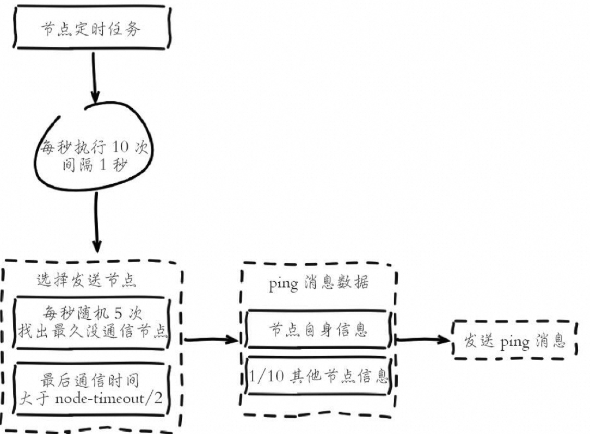

# 四、Redis 高可用和集群

## 4.1 基础理论

分布式系统本质是通过低廉的硬件攒在一起以获得更好的吞吐量、性能以及可用性等。一台设备坏了，可以通过负载均衡和路由到 其他设备上。

分布式系统设计有核心四大块： 

- 心跳检测： 如何检测你还活着？

- 【注册中心】

- 高可用设计： 如何保证高可用
- 容错性： 服务容错如何处理、怎么做重试
- 负载均衡: 负载均衡策略怎么处理

## 4.2 架构说明

### 4.2.1 主从复制

#### 4.2.1.1  基础架构

##### 一主一从


可以直在从节点开启 AOF ，这样可以保证数据安全也能降低持久化对于节点的影响

##### 一主多从


**问题原因：**

- 读占比较大的场景下，**主节点可能会因处理大量读请求而负载过重**，影响系统性能和稳定性。
- 写并发量较高的情况下，多个从节点会导致主节点发送写命令的次数增加，增加网络带宽的消耗和主节点负载，影响服务的稳定性。

**解决方案：**

- 对于读占比较大的场景，可以将读命令发送到从节点上执行，减轻主节点的压力，提高系统整体性能稳定性。
- 尤其对于一些耗时较长的读命令（如**keys**、**sort**等），可以选择在从节点上执行，避免慢查询对主节点造成阻塞，影响线上服务的稳定性。
- 针对写并发量较高的场景，需要控制从节点的数量，避免过多的从节点给主节点带来过多的负担，从而影响服务的稳定性。

**补充分析：**

- 通过读写分离可以充分利用从节点的读性能，提高整体系统的读取效率。
- 但需要注意控制从节点的数量，避免过多的从节点给主节点带来过多的负担，同时也要关注从节点的负载情况，确保从节点能够正常处理读请求。

##### 树状结构


优点：

1. **分散负载**：树状结构可以有效地分散主节点的负载，因为数据可以通过多层从节点传输，而不是直接从主节点传输到所有从节点。
2. **减少网络传输**：由于数据可以在从节点之间传输，树状结构可以减少数据在网络中的传输量，降低了网络带宽的压力。
3. 增强稳定性：通过引入复制中间层，树状结构可以提高整个系统的稳定性。即使某些从节点发生故障，其上游的主节点仍然可以将数据传输给其他从节点，从而保证数据的可用性。

缺点：

1. 复杂性增加：树状结构引入了复制中间层，增加了整个系统的复杂性，包括配置、管理和监控等方面。
2. 单点故障：如果树状结构的中间层出现故障，可能会影响下游所有从节点的数据复制，从而造成系统的单点故障。
3. 网络延迟：由于数据需要通过多层从节点传输，树状结构可能会增加数据复制的延迟，特别是在网络状况不佳的情况下。

#### 4.2.1.2 基础配置

##### 建立复制

在Redis中，参与复制的实例被分为主节点（master）和从节点（slave）。默认情况下，Redis实例都是主节点。每个从节点只能有一个主节点，但是一个主节点可以拥有多个从节点。复制的数据流是单向的，只能由主节点向从节点复制数据。配置复制有以下三种方式：

1. 在配置文件中加入 **slaveof {masterHost} {masterPort}**，随Redis启动生效。
2. 在redis-server启动命令后加入 **--slaveof {masterHost} {masterPort}**，生效。
3. 直接使用命令：**slaveof {masterHost} {masterPort}**，生效。

举例来说，假设本地启动了两个Redis节点，端口分别为6379和6380，执行以下命令将6380节点设置为6379节点的从节点：

```powershell
127.0.0.1:6380> slaveof 127.0.0.1 6379
```

在这个例子中，6379节点是主节点，6380节点是从节点。建立复制关系后，我们可以执行以下命令进行测试：

```powershell
127.0.0.1:6379> set hello redis
OK
127.0.0.1:6379> get hello
"redis"
127.0.0.1:6380> get hello
"redis"
```

从这个运行结果可以看出，复制已经成功工作。主节点6379上的任何修改都可以同步到从节点6380中。

##### 断开复制

**slaveof**命令不仅可以建立复制，还可以在从节点执行 **slaveof no one** 来断开与主节点的复制关系。例如，执行以下命令可以断开6380节点与主节点的复制关系：

```plain
127.0.0.1:6380> slaveof no one
```

断开复制的主要流程如下：

1. 断开与主节点的复制关系。
2. 从节点晋升为主节点。

断开复制后，从节点并不会丢失原有数据，只是无法再获取主节点上的数据变化。

此外，通过 **slaveof** 命令还可以实现切换主节点的操作。执行 **slaveof {newMasterIp} {newMasterPort}** 命令即可，例如将6380节点从原来复制6379节点切换到复制6381节点。

切换主节点的操作流程如下：

1. 断开与旧主节点的复制关系。
2. 与新主节点建立复制关系。
3. 删除从节点当前所有数据。
4. 对新主节点进行复制操作。

在进行切换主节点操作时，务必注意从节点会清空之前所有的数据，因此在线上操作时需要谨慎执行 **slaveof** 命令，避免指向错误的节点或主节点。

##### 只读模式

Redis从节点的 **slave-read-only 配置为 yes**，。这意味着从节点上的写操作将被拒绝，从而确保了数据的一致性。

因为从节点只能从主节点复制数据，主节点对于从节点的任何修改都是不可感知的，所以从节点上的修改可能会导致主从数据不一致的情况发生。特别是在线上环境中，**强烈建议不要修改从节点的只读模式**。如果允许从节点进行写操作，可能会导致数据的混乱和不一致，进而影响系统的可靠性和数据的完整性。

#### 4.2.1.3  核心原理


- nacos 注册中心

```java
private final ScheduledExecutorService scheduler =
     Executors.newScheduledThreadPool(1);
scheduler.schedule(new Runnable() {
       public void run() {
           //发送心跳
           1. 建立连接
           2. 发送内容
       }
     }, 60 * 60, SECONDS);
```

权限验证： masterauth 参数

- redis.config

##### 数据同步

| **项目**           | **描述**                                                     | **配置参数**                                | **查看方式**                                                 | **优化方式**                                                 | **运维技巧**                                         |
| ------------------ | ------------------------------------------------------------ | ------------------------------------------- | ------------------------------------------------------------ | ------------------------------------------------------------ | ---------------------------------------------------- |
| 复制偏移量         | 主节点（Master）和从节点（Slave）维护自身的复制偏移量。 用于判断主从节点的数据同步情况。 | **master_repl_offset****slave_repl_offset** | 使用 **info replication** 命令查看主从节点的复制偏移量。     | 监控主从节点复制偏移量的差值，判定复制健康度。分析偏移量差异，检查网络延迟或命令阻塞等问题。 | 使用偏移量差值判断主从节点的同步情况。               |
| **复制积压缓冲区** | 主节点上的固定长度队列，保存最近已复制的数据。 用于部分复制和复制命令丢失的情况。**默认大小 1M** | **repl-backlog-size**                       | 使用 **info replication** 命令查看复制积压缓冲区的统计信息。 | 监控缓冲区使用情况，调整缓冲区大小以应对不同的复制负载。 提高网络稳定性，减少复制命令丢失的可能性。 | 根据缓冲区使用情况调整缓冲区大小，确保数据可靠性。   |
| 主节点运行ID       | 每个Redis节点启动后分配的40位十六进制字符串作为唯一标识。 用于识别Redis节点，确保从节点正确识别正在复制的主节点。 | **run-id**                                  | 使用 **info server** 命令查看当前节点的运行ID。              | 在需要重新加载配置时，使用 **debug reload** 命令保持运行ID不变，避免不必要的全量复制。 | 使用运行ID识别Redis节点，确保主从复制的正确性。      |
| 复制超时参数       | 控制主从节点复制的超时时间。                                 | **repl-timeout**                            | 在配置文件或运行时参数中查看和设置复制超时参数。 如：**repl-timeout 60** | 根据网络环境调整复制超时参数，确保复制过程的稳定性。 调整超时时间，避免因网络问题导致复制中断。 | 根据网络环境调整复制超时参数，确保复制过程的稳定性。 |


| **条件**         | **全量复制**               | **部分复制**         |
| ---------------- | -------------------------- | -------------------- |
| 用途             | 初次复制场景               | 处理数据丢失场景     |
| 数据量           | 大                         | 小                   |
| 主从节点开销     | 高（发送全部数据）         | 低（只发送增量数据） |
| 网络开销         | 高（发送全部数据）         | 低（只发送增量数据） |
| 偏移量的判断方式 | 从节点定期上报自身偏移量， |                      |


1. **主节点bgsave时间：** 在进行全量复制时，主节点需要执行bgsave命令将当前内存中的数据保存到磁盘上的RDB文件中。这个过程需要占用主节点的CPU和内存资源，并且可能会影响到主节点的性能。
2. **RDB文件网络传输时间：** 主节点在完成bgsave之后，需要将生成的RDB文件通过网络传输给从节点。这个过程的耗时取决于主从节点之间的网络带宽和延迟，特别是对于数据量较大的情况，传输时间可能会很长。
3. **从节点清空数据时间：** 从节点在接收到主节点发送的RDB文件后，需要先清空自身旧数据，然后再加载新的RDB文件。这个过程可能会导致从节点在一段时间内处于不可用状态。
4. **从节点加载RDB的时间：** 从节点在清空旧数据后，需要加载新的RDB文件到内存中。这个过程的耗时取决于RDB文件的大小和从节点的性能。
5. **可能的AOF重写时间：** 如果主节点开启了AOF持久化功能，它在完成全量复制后可能会执行AOF重写操作，将内存中的写命令重新写入到AOF文件中。这个过程可能会占用主节点的CPU和磁盘IO资源，并且可能会导致主节点的性能下降。


###### 优化参数

| **参数名称**                     | **参数描述**                                                 | **默认值**   | **建议值**                                                   |
| -------------------------------- | ------------------------------------------------------------ | ------------ | ------------------------------------------------------------ |
| repl-backlog-size                | 设置主节点上复制积压缓冲区的大小，用于存储最近的写命令数据。增大该值可以减少数据丢失的风险，但会增加内存占用。 | 1MB          | 根据系统内存大小，建议设置为系统内存的 1% 至 10%。           |
| repl-timeout                     | 设置主节点等待从节点响应的超时时间。增加该值可以减少因网络延迟导致的复制失败，但会延长故障检测和恢复的时间。 | 60秒         | 根据网络延迟情况，建议设置为网络延迟的两倍以上。             |
| client-output-buffer-limit slave | 设置主节点在复制期间向从节点发送数据的缓冲区大小限制。增大该值可以缓解数据传输的瓶颈，但会增加内存占用。 | 256MB / 64MB | 根据网络带宽和从节点数量，建议设置为适当大小，不超过系统可用内存的 20%。 |
| repl-diskless-sync               | 启用或禁用无盘复制功能，即主节点生成的RDB文件不保存到硬盘而是直接通过网络发送给从节点。启用无盘复制可以减少磁盘IO开销。 | 关闭         | 根据硬盘性能和网络带宽，可以根据实际情况启用或禁用。         |
| min-slaves-to-write              | 设置当从节点数量达到指定值时，主节点才会执行写命令。可以保证从节点足够健康，避免因从节点数量不足而导致数据丢失。 | 0            | 根据从节点数量和可用性需求，建议设置为 1 或更高。            |
| min-slaves-max-lag               | 设置从节点的复制延迟阈值，即从节点与主节点之间的延迟超过该值时，主节点将停止接收写命令。可以保证从节点的数据及时同步，减少复制延迟。 | 10秒         | 根据系统的复制延迟情况，建议设置为适当的阈值。               |
| slave-serve-stale-data           | 设置从节点在复制期间是否继续响应读命令。如果设置为yes，则从节点会继续响应读命令，即使数据可能过期或不一致。如果设置为no，则从节点只会返回同步中的信息。 | yes          | 根据应用场景的需求，建议设置为 yes 或 no。                   |


### 4.2.2 哨兵

#### 问题

| **问题**                   | **描述**                                               | **哨兵解决方案**                                             |
| -------------------------- | ------------------------------------------------------ | ------------------------------------------------------------ |
| 主节点故障                 | 主节点出现故障导致系统不可用。                         | 哨兵定期监测主节点的健康状态，一旦主节点不可用，自动进行故障转移。 |
| 从节点故障                 | 从节点出现故障可能导致数据同步延迟或不可用。           | 哨兵监控所有从节点的健康状态，如果发现从节点不可用，可以重新配置主从关系，将其他从节点提升为主节点。 |
| 主从节点数据不一致         | 主从节点数据同步可能出现延迟或不一致的情况。           | 哨兵可以监控主从节点的数据同步状态，一旦发现数据不一致，可以采取相应措施，如重新同步数据或重新配置主从关系。 |
| 单点故障                   | 如果所有的哨兵节点都不可用，可能导致整个系统不可用。   | 哨兵采用多个节点的集群部署方式，确保了系统的高可用性。       |
| 故障检测与自动故障转移时延 | 哨兵检测到主节点故障并进行故障转移可能存在一定的时延。 | 哨兵可以配置多个哨兵节点来进行故障检测，增加故障检测的准确性和速度。 |
| 配置管理与自动化配置       | 主从节点的配置管理可能会比较繁琐，需要手动配置。       | 哨兵可以通过自动发现主节点和从节点，并管理主从节点的配置信息，实现了配置的自动化管理。 |


#### 哨兵的架构


故障转移流程


#### 配置

```plain
redis-sentinel-26379.conf
port 26379
daemonize yes
logfile "26379.log"
dir /opt/soft/redis/data
sentinel monitor mymaster 127.0.0.1 6379 2 
sentinel down-after-milliseconds mymaster 30000 
sentinel parallel-syncs mymaster 1 
sentinel failover-timeout mymaster 180000
redis-sentinel redis-sentinel-26379.conf
redis-server redis-sentinel-26379.conf --sentinel
```

#### 部署

如果是 4 个节点，当前挂了一台节点： 3/2+1=2

如果是 3 个节点，当前挂了一台节点： 2/2+1=2

- 为什么哨兵至少三个并且是奇数个的 sentinel 节点

- 领导选举需要过半+1，**奇数节点能够节省一个节点**

可以用哨兵监控多个主节点

#### 优化

| **参数**                                                     | **说明**                                                     | **原理**                                                     |
| ------------------------------------------------------------ | ------------------------------------------------------------ | ------------------------------------------------------------ |
| **sentinel monitor <master-name> <ip> <port> <quorum>**      | 用于设置哨兵监视的主节点，并指定主节点的地址和端口号。       | 设置哨兵监视的主节点后，哨兵会定期检测主节点的健康状态，并在主节点不可用时触发自动故障转移。 **quorum** 参数指定了至少需要多少个哨兵节点同意故障转移才能进行。 |
| **sentinel down-after-milliseconds <master-name> <milliseconds>** | **设置哨兵判定主节点不可用的时间阈值。**                     | 当主节点在指定的时间内未能响应心跳检测时，哨兵将主节点标记为不可用，并触发自动故障转移。通过调整这个参数，可以控制故障转移的触发时间，平衡系统的可用性和灵敏度。 |
| **sentinel parallel-syncs <master-name> <num>**              | **设置哨兵执行故障转移时同时同步数据的从节点数量。****偏移量** | 在进行故障转移时，哨兵需要将新的主节点数据同步给从节点。通过设置并行同步的从节点数量，可以提高故障转移的速度和效率。但需要注意避免对主节点和网络造成过大的负载。 |
| **sentinel failover-timeout <master-name> <milliseconds>**   | 设置哨兵执行故障转移的超时时间。                             | 当主节点不可用时，哨兵会进行自动故障转移。设置故障转移的超时时间可以确保在一定时间内完成故障转移操作，避免系统长时间处于不可用状态。需要根据实际情况调整超时时间，保证故障转移的及时性和稳定性。 |


主观&客观下线


### 4.2.3 Cluster

- 用来解决什么问题，解决大量数据
- 硬件的容量是有限的，	负载均衡、分布式

- 分库分表

- 代理层-》多个副本

代理层： [xx]

- 主从 A
- 主从 B

#### 4.2.3.1 数据分布

| **方案**                                    | **优点**                                                   | **缺点**                                                     | **具体方案**                                                 |                                                              |
| ------------------------------------------- | ---------------------------------------------------------- | ------------------------------------------------------------ | ------------------------------------------------------------ | ------------------------------------------------------------ |
| 节点取余分区HashMap 数组+链表{红黑树}       | 简单易实现，计算成本低。                                   | **节点数量变化时，需要重新计算数据的分布并进行数据迁移，可能导致数据迁移量大**。 | 使用特定的数据（如Redis的键或用户ID），根据节点数量N计算哈希值，用来决定数据映射到哪一个节点上。 | hash（key）%N                                                |
| 一致性哈希分区                              | 加入和删除节点只影响哈希环中相邻的节点，对其他节点无影响。 | 节点变化时，部分数据无法命中，需要手动处理或者忽略这部分数据。 | 为系统中每个节点分配一个token，并构成一个哈希环，根据key计算hash值，在哈希环中顺时针找到第一个大于等于该哈希值的token节点。 |  |
| 虚拟槽分区ThreadLocal 拉链法 只用了一个数组 | 方便数据拆分和集群扩展，每个槽映射的数据通常比较均匀。     | 一般需要使用大范围的槽，可能会导致哈希空间的浪费。           | 使用哈希函数将数据映射到一个固定范围的整数集合中，称为槽，每个节点负责一定数量的槽 |  |

Redis Cluster 就是使用的虚拟槽位分区


| **限制**           | 说明                                                         |
| ------------------ | ------------------------------------------------------------ |
| 有限的批量操作支持 | 只支持具有相同slot值的key执行批量操作，对于映射为不同slot值的key不被支持。 |
| 有限的事务操作支持 | 只支持多个key在同一节点上的事务操作，当多个key分布在不同的节点上时无法使用事务功能。 |
| 最小粒度的数据分区 | key作为数据分区的最小粒度，因此不能将一个大的键值对象如hash、list等映射到不同的节点。 |
| 不支持多数据库空间 | 在单机下的Redis可以支持16个数据库空间，但在集群模式下只能使用一个数据库空间，即db0。 |
| 复制结构限制       | **复制结构只支持一层，从节点只能复制主节点，不支持嵌套树状复制结构。** |

#### 4.2.3.2  搭建

##### 

```shell
#节点端口
port 6379

# 开启集群模式
cluster-enabled yes

# 节点超时时间，单位毫秒
cluster-node-timeout 15000

# 集群内部配置文件
cluster-config-file "nodes-6379.conf"
```


```shell
redis-server conf/redis-6379.conf
```


```shell
cluster meed {ip} {port}
```


```shell
redis-cli -h 127.0.0.1 -p 6379 cluster addslots {0...5461}
redis-cli -h 127.0.0.1 -p 6380 cluster addslots {5462...10922}
redis-cli -h 127.0.0.1 -p 6381 cluster addslots {10923...16383}
```


```shell
cluster replicate cfb28ef1deee4e0fa78da86abe5d24566744411e
```


也可以直接使用： redis-trib.rb 搭建 

#### 4.2.3.3  原理

##### 节点通信

- gessip 协议： 病毒协议



##### 槽位迁移


- 键的遍历应该怎么遍历
- 数据库的迁移

- **线上无感知【不能写入只能读取】**
- 数据的对账，知道当前的进度
- 整体数据的对比

##### 请求转发


```shell
127.0.0.1:6379> set key:test:2 value-2 
(error) MOVED 9252 127.0.0.1:6380

127.0.0.1:6379> cluster keyslot key:test:2
(integer) 9252


cluster info 
key 进行计算>获取到所有的槽位&节点信息->Map<>
```

#### 4.2.3.4  故障转移

- 主观下线：**指某个节点认为**另一个节点不可用，即下线状态，这个状 态并不是最终的故障判定，只能代表一个节点的意见，可能存在误判情况。


- 客观下线：指标记一个节点真正的下线，集群内多个节点都认为该节 点不可用，从而达成共识的结果。如果是持有槽的主节点故障，需要为该节 点进行故障转移。


#### 4.2.3.5 网络分区


大的集群持有半数槽节点可以完成客观下 线并广播fail消息，但是小集群无法接收到fail消息

网络分区会导致分割后的小集群无法收到大集群的fail消息，因此如果故障节点所有的从节点都在小集群内将导致无法完成后续故障转移，因此部署主从结构时需要根据自身机房/机架拓扑结构，降低主从被分区的可能性。


#### 4.2.3.6 节点选举


- 选举延迟最低&数据最新的节点
- 选举周期的概念

#### 4.2.3.7 优化建议

| 消息发送频率       | 跟 **cluster-node-timeout** 密切相关，超过一定时间未通信的节点会发送 **ping** 消息，影响带宽消耗。 |
| ------------------ | ------------------------------------------------------------ |
| 消息数据量         | 每个消息主要包含 **slots** 槽数组（约 2KB）和整个集群约 1/10 的状态数据（约 1KB），影响带宽消耗。 |
| 节点部署的机器规模 | 机器带宽的上限是固定的，集群分布的机器越多，每台机器划分的节点越均匀，整体可用带宽越高，影响带宽消耗。 |
| 示例               | 200 节点的 Redis 集群，部署在 20 台物理机上，每台划分 10 个节点，**cluster-node-timeout** 默认 15 秒，带宽消耗约为 25Mb。 将 **cluster-node-timeout** 设为 20 秒后，带宽消耗降低至 15Mb 以下。 |
| 建议               | 避免部署过大规模的集群，可根据业务需要拆分使用多套集群。适度提高 **cluster-node-timeout** 以降低消息发送频率，但需平衡故障转移速度。 尽量均匀部署集群在更多机器上，避免集中部署。 |


常见问题处理

| **数据倾斜**                                                 | **节点和槽分配不均**：使用 **redis-trib.rb info {host:ip}** 定位不均匀的节点和槽，然后使用 **redis-trib.rb rebalance** 进行平衡。 |
| ------------------------------------------------------------ | ------------------------------------------------------------ |
| **槽对应键数量差异过大**：使用 **cluster countkeysinslot {slot}** 和 **cluster getkeysinslot {slot} {count}** 命令识别和处理过多的键。 |                                                              |
| **集合对象过大**：使用 **redis-cli-bigkeys** 命令识别大集合对象，根据业务场景进行拆分。 |                                                              |
| **内存配置不一致**：确保集群中的所有节点具有相似的内存相关配置。 |                                                              |
| **请求倾斜**                                                 | **合理设计键**：对于热点大集合对象，进行拆分或者使用 **hmget** 替代 **hgetall**，以减少对单个节点的负载。 |
| **避免使用热键作为** **hash_tag**：以防止映射到同一槽。      |                                                              |
| **使用本地缓存**：减少热键调用，特别适用于一致性要求不高的场景。 |                                                              |


故障转移

| **cluster failover**          | 手动触发故障转移，将主节点标记为下线状态，然后选举新的主节点并将从节点升级为主节点。 | 当一个主节点出现故障时，需要手动进行故障转移。             |
| ----------------------------- | ------------------------------------------------------------ | ---------------------------------------------------------- |
|                               |                                                              | 当需要维护主节点时，可以手动将主节点下线并进行故障转移。   |
|                               |                                                              | 在某些紧急情况下，需要迅速将故障节点恢复为正常工作状态。   |
| **cluster failover force**    | 强制执行故障转移，即使当前集群中没有发现主节点故障也会执行。这可能会导致数据丢失和服务中断。 | 用于测试和验证故障转移流程。                               |
|                               |                                                              | 当手动故障转移失败时，可以尝试使用此命令强制执行故障转移。 |
| **cluster failover takeover** | 接管故障节点，使指定的节点（通常是从节点）接管指定的主节点。 | 当需要手动指定某个从节点接管故障的主节点时使用。           |
|                               |                                                              | 当集群中的自动故障转移无法正常工作时，可以手动干预         |

## 4.3 集群的部署和管理

### 4.3.1 常用的集群方式

#### 4.3.1.1 客户端 sharding


key在客户端通过一致性hash进 行sharding。

#### 4.3.1.2 proxy 


proxy实现对后端缓存服务的集群管理。 Proxy同时也是一个集群。有两种方案管理proxy集群，通过LVS或者客户端实现。如果流量较大，LVS也需要考虑进行集群的管理。proxy方案运维复杂， 扩展性较强，可以在proxy上面实现限流等扩展功能。

LVS（Linux Virtual Server）是一个基于 Linux 内核的开源项目，用于构建高可用性和可伸缩性的服务器集群。它是一个软件负载均衡器，可以将来自客户端的请求分发到多个后端服务器上，以实现负载均衡和高可用性。

#### 4.3.1.3 服务集群

[gossip协议](https://icyfenix.cn/distribution/consensus/gossip.html)

服务端集群：主要是Redis的cluster机制，基于Gossip协议实现


## 数据分片方法


- Consistent Hashing
- Twemproxy-Twitter +LVS + Keepalived


## RedisCluster


- 集群的搭建
- 查询路由
- 数据分片原理
- 高可用和主从切换原理
- 通信协议：RESP

# 