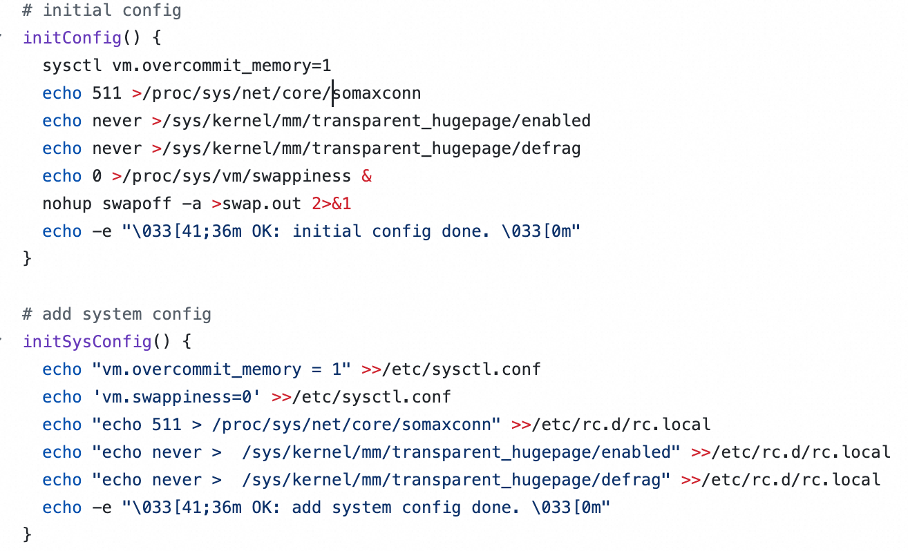
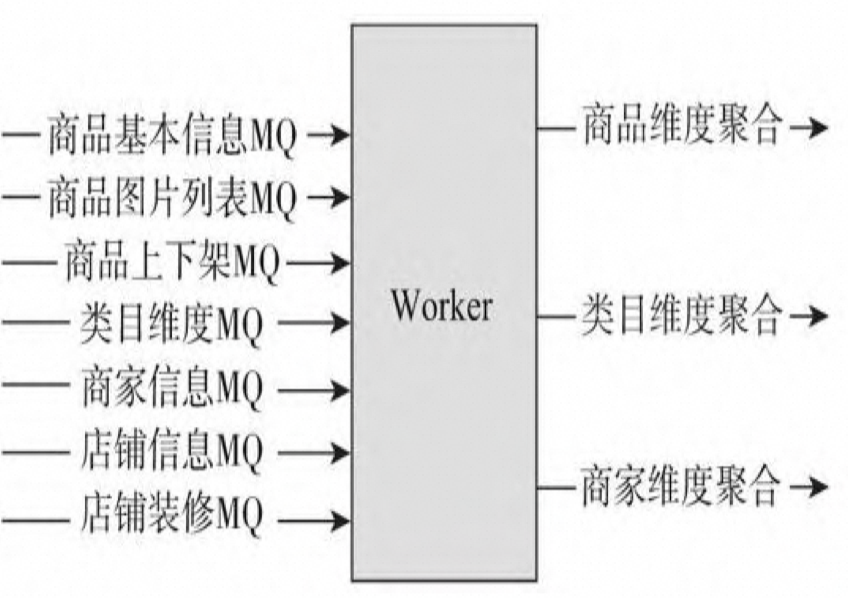
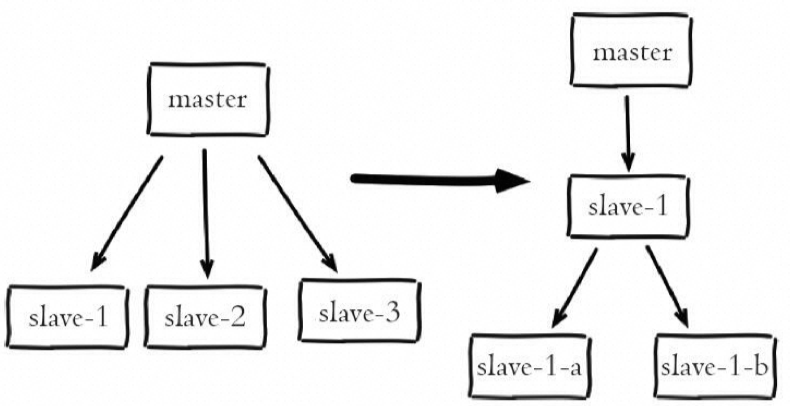

# 五、Redis 性能优化

## 5.1 系统层面的优化

https://github.com/sohutv/cachecloud/blob/main/redis-ecs/script/cachecloud-init.sh



```shell
initConfig() {
  # 支持虚拟内存分配
  sysctl vm.overcommit_memory=1
  # 最大排队连接数设置为 511，一般默认是 128
  echo 511 >/proc/sys/net/core/somaxconn
  # 禁用透明大页，使用传统的小页进行管理，大页可能会导致性能下降或者不稳定
  echo never >/sys/kernel/mm/transparent_hugepage/enabled
  echo never >/sys/kernel/mm/transparent_hugepage/defrag
  # 内核将尽量减少对交换分区（内存数据存储到磁盘上）的使用，提高性能避免不必要的
  echo 0 >/proc/sys/vm/swappiness &
  # 关闭系统上的交换分区，并且输出重定向到文件
  nohup swapoff -a >swap.out 2>&1
  echo -e "\033[41;36m OK: initial config done. \033[0m"
}
```


## 5.2 客户端优化

### 5.2.1 维度化缓存



在电商系统中，一个商品可能包含多个维度的数据，如基础属性、图片列表、上下架状态、规格参数、商品介绍等。针对这种情况，可以采用维度化缓存方案进行优化，以减少更新成本和服务压力。

#### 方案概述

- 将商品数据按照不同维度进行拆分，并对每个维度进行缓存。
- 对于商品变更，只更新变更的部分数据，而不是整个商品数据。
- 对于频繁变更的维度，如上下架状态，通过维度化缓存可以减少服务压力。

#### 实施方式

- 接收MQ进行更新：根据不同维度的变更，通过消息队列（MQ）接收更新消息，对相应维度的缓存进行增量更新。

### 5.2.2 大 Value 优化

在缓存中存在大Value的情况下，特别是在使用Redis等内存数据库时，需要注意缓存的大小限制。针对大Value的缓存，可以考虑以下方案：

- 使用多线程缓存：采用多线程实现的缓存（如Memcached）来缓存大Value，以提高并发读写能力。
- 压缩Value：对Value进行压缩，减小存储空间。
- 拆分Value：将大Value拆分为多个小Value，在客户端进行查询和聚合，以降低单个缓存项的大小。

### 5.2.3 热点缓存

对于访问频率非常高的热点缓存，直接从远程缓存系统中获取可能会导致系统负载过高、响应慢等问题。针对这种情况，可以考虑以下解决方案：

- 增加从缓存：增加更多地从缓存节点，通过负载均衡机制读取从缓存系统的数据，以提高并发读取能力。
- 本地缓存：在客户端所在的应用/代理层本地存储一份热点数据的副本，减少对远程缓存系统的访问，提高响应速度。

- 定期更新策略：对于不那么频繁变化的数据，可以考虑在本地缓存一段时间后，定期从远程缓存系统更新数据，以保持数据的实时性。

### 5.2.4 迁移过程优化

Redis Cluster 模式下集群只对 Redis 的存活负责，不对数据负责。客户端提交请求后，如果这个 key 不归属于这个服务器，会返回 MOVE 命令，客户端需要自行跳转，增加网络一跳。

| 问题                                                     | 描述                                                         |
| -------------------------------------------------------- | ------------------------------------------------------------ |
| 迁移槽过程中网卡流量和CPU压力问题                        | 开发迁移工具，解决网卡流量和CPU压力问题，实现迁移过程中的性能平衡。 当监控程序发现分片流量过大或者key数量过多时，自动启动迁移工具，实现自动迁移。 |
| 对Redis分槽策略进行改造，使得事务及多key操作能够顺利执行 | 改造Redis的分槽策略，使相关性的一组key可以使用统一的前缀，并保存到同一片中。 当key满足特定格式时，只针对其中内容计算hash值，保证事务以及多key操作的正常执行。 |

## 5.3 服务端优化

https://github.com/eishay/jvm-serializers/wiki

### 5.3.1 参数优化

#### 降低主从延迟

repl-disable-tcp-nodelay ：

- [ 默认 ] 关闭状态：主节点产生的命令数据无论大小都会及时发送给从节点，减小主从之间的延迟，但增加网络带宽消耗。适用于网络环境良好的场景，**如同机架或同机房部署**。
- 开启状态：主节点会合并较小的TCP数据包以节省带宽，但会增加主从之间的延迟。适用于网络环境复杂或带宽紧张的场景，**如跨机房部署**。

##### 主从复制参数优化

| **参数名称**                     | **参数描述**                                                 | **默认值**   | **建议值**                                                   |
| -------------------------------- | ------------------------------------------------------------ | ------------ | ------------------------------------------------------------ |
| repl-backlog-size                | 设置主节点上复制积压缓冲区的大小，用于存储最近的写命令数据。增大该值可以减少数据丢失的风险，但会增加内存占用。 | 1MB          | 根据系统内存大小，建议设置为系统内存的 1% 至 10%。           |
| repl-timeout                     | 设置主节点等待从节点响应的超时时间。增加该值可以减少因网络延迟导致的复制失败，但会延长故障检测和恢复的时间。 | 60秒         | 根据网络延迟情况，建议设置为网络延迟的两倍以上。             |
| client-output-buffer-limit slave | 设置主节点在复制期间向从节点发送数据的缓冲区大小限制。增大该值可以缓解数据传输的瓶颈，但会增加内存占用。 | 256MB / 64MB | 根据网络带宽和从节点数量，建议设置为适当大小，不超过系统可用内存的 20%。 |
| repl-diskless-sync               | 启用或禁用无盘复制功能，即主节点生成的RDB文件不保存到硬盘而是直接通过网络发送给从节点。启用无盘复制可以减少磁盘IO开销。 | 关闭         | 根据硬盘性能和网络带宽，可以根据实际情况启用或禁用。         |
| min-slaves-to-write              | 设置当从节点数量达到指定值时，主节点才会执行写命令。可以保证从节点足够健康，避免因从节点数量不足而导致数据丢失。 | 0            | 根据从节点数量和可用性需求，建议设置为 1 或更高。            |
| min-slaves-max-lag               | 设置从节点的复制延迟阈值，即从节点与主节点之间的延迟超过该值时，主节点将停止接收写命令。可以保证从节点的数据及时同步，减少复制延迟。 | 10秒         | 根据系统的复制延迟情况，建议设置为适当的阈值。               |
| slave-serve-stale-data           | 设置从节点在复制期间是否继续响应读命令。如果设置为yes，则从节点会继续响应读命令，即使数据可能过期或不一致。如果设置为no，则从节点只会返回同步中的信息。 | yes          | 根据应用场景的需求，建议设置为 yes 或 no。                   |

### 5.3.2 架构优化


#### 复制风暴



复制风暴是指在Redis中，大量从节点同时对同一主节点或者对同一台机器的多个主节点发起全量复制的过程。这种情况会给主节点或者机器带来大量的开销，包括CPU、内存和带宽消耗。为了规避复制风暴，可以采取以下几个解决方案：

- 单主节点复制风暴： 

- 问题： 

- 单主节点复制风暴通常发生在主节点挂载多个从节点的场景。当主节点重启后，从节点会发起全量复制流程，主节点为每个从节点创建RDB快照。如果在创建完毕之前有多个从节点同时尝试与主节点进行全量同步，主节点会为它们创建多个快照，导致网络带宽消耗严重，延迟增大，甚至导致主从连接断开。

- 解决方案： 

- 包括减少主节点挂载从节点的数量，采用树状复制结构，加入中间层从节点用来保护主节点。树状结构可以将网络开销交给位于中间层的从节点，降低了顶层主节点的压力，但也增加了运维的复杂性。

- 多主节点复制风暴：

- 问题： 

- 多主节点复制风暴发生在多个主节点同时向相同的从节点发起全量复制的情况。这可能导致从节点同时接收多份不同数据源的数据，造成数据的不一致性。

- 解决方案： 

- 包括避免在同一台机器上部署多个主节点，或者采用合适的复制策略确保从节点只接收来自一个主节点的数据。


## 5.4 其他优化

### 5.4.1 提升缓存命中率

缓存场景分析：

- 缓存适合读多写少的场景，否则命中率低，意义不大。
- 业务需求决定了对时效性的要求，直接影响缓存过期时间和更新策略。
- 时效性要求越低，越适合缓存。
- 相同key和请求次数下，缓存时间越长，命中率越高。
- 大多数互联网应用场景都适合使用缓存。

命中率说明： 

- 命中：可以直接通过缓存获取到需要的数据。
- 不命中：无法直接通过缓存获取到想要的数据，需要再次查询数据库或者执行其他的操作。原因可能是由于缓存中根本不存在，或者缓存已经过期。

通常来讲，**缓存的命中率越高则表示使用缓存的收益越高**，应用的性能越好（响应时间越短、吞吐量越高），抗并发的能力越强。

- 缓存设计：

- 缓存粒度越小，命中率越高。单个对象缓存只需在该对象数据发生变化时更新或移除。
- 缓存集合时，任何对象数据变化都需要更新或移除缓存。

- 缓存容量和基础设施：

- 缓存容量有限，易引起失效和淘汰（常采用LRU算法）。
- 缓存技术选型需考虑容量规划和扩展性，分布式缓存易扩展。

- 其他因素：

- 缓存节点故障时需避免缓存失效，可采用一致性Hash算法或节点冗余实现高可用。

- 注意事项：

- 即便缓存时间较短，也能有效利用缓存的收益，特别是在高并发情况下。

####  缓存命中率的查看

```shell
127.0.0.1:6379> INFO
...
# Keyspace
db0:keys=1000,expires=1000,avg_ttl=86400
db1:keys=2000,expires=2000,avg_ttl=3600
...
keyspace_hits:1000000  总的命中次数
keyspace_misses:50000  总的miss次数
...
```

在redis中可以运行info命令查看redis服务的状态信息，

其中 keyspace_hits为总的命中次数，keyspace_misses为总的miss次数

命中率 =keyspace_hits/（keyspace_hits+keyspace_misses）。

#### 命中率的优化方式

- 应用尽可能通过缓存获取数据，避免缓存失效。
- 需要在业务需求、缓存粒度、缓存策略、技术选型等方面进行权衡。
- 聚焦于高频访问、时效性要求不高的热点业务。
- 提高命中率的方法：

- 缓存预加载（预热）。
- 增加存储容量。
- 调整缓存粒度。
- 更新缓存。


### 5.4.2 避免阻塞

https://redis.io/docs/management/optimization/latency/

| **阻塞原因**       | **描述**                                                     | **定位方法**                                                 |
| ------------------ | ------------------------------------------------------------ | ------------------------------------------------------------ |
| fork阻塞           | 在RDB和AOF重写时，主线程调用fork操作产生共享内存的子进程，如果fork操作耗时过长，会导致主线程阻塞。 | 执行**info stats**命令获取**latest_fork_usec**指标，检查fork操作耗时是否过长。 根据系统内存和硬盘性能优化配置。 |
| AOF刷盘阻塞        | 当开启AOF持久化功能时，后台线程每秒进行一次AOF文件的fsync操作。如果硬盘压力大导致fsync操作等待，主线程会阻塞直到后台线程完成fsync操作。 | 观察Redis日志，查看是否出现"Asynchronous AOF fsync is taking too long"警告。 检查**info persistence**统计中的**aof_delayed_fsync**指标。 |
| HugePage写操作阻塞 | 子进程在执行重写期间利用Linux写时复制技术降低内存开销，但如果开启了Transparent HugePages，每次写操作会导致复制内存页单位由4K变为2MB，可能导致写操作耗时过长。 | 观察Redis日志和慢查询日志，检查是否有写操作耗时过长的情况。考虑关闭Transparent HugePages或调整操作系统配置。 |
| CPU竞争            | 进程竞争：当其他进程过度消耗CPU时，影响Redis吞吐量。 绑定CPU：当父子进程绑定在同一个CPU上时，会导致CPU竞争，影响Redis稳定性 [taskset -c <CPU列表> <进程PID]。 | 使用**top**、**sar**等命令查看CPU消耗情况，排查是否有其他进程消耗过多CPU。 考虑取消对Redis进程的CPU绑定。 |
| 内存交换           | 内存交换会导致Redis性能急剧下降，因为Redis保证高性能的前提是所有数据在内存中。 | 使用`cat /proc/[pid]/smaps                                   |
| 网络问题           | 连接拒绝：网络闪断、Redis连接拒绝、连接溢出等原因导致客户端无法连接Redis。 网络延迟：物理拓扑和带宽占用情况导致客户端与Redis之间的通信延迟。网卡软中断：网卡队列只能使用一个CPU，导致无法充分利用多核CPU。 | 观察Redis日志和客户端日志，检查连接拒绝情况。 使用Redis自带的网络延迟测试工具检查延迟情况。使用**top**命令观察软中断情况。 |

### 5.4.3 内存优化

- Redis实际内存消耗主要包括：键值对象、缓冲区内存、内存碎片。

- 通过调整maxmemory控制Redis最大可用内存。当内存使用超出时， 根据maxmemory-policy控制内存回收策略。

- 内存优化的思路包括：

- 精简键值对大小，键值字面量精简，使用高效二进制序列化工具。 、
- 数据优先使用整数，比字符串类型更节省空间。
- 优化字符串使用，避免预分配造成的内存浪费。

# 