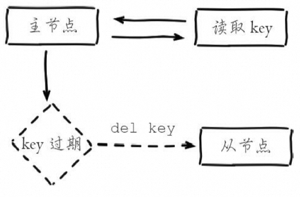
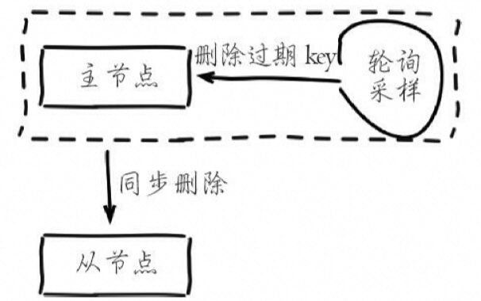

# 六、Redis 灾备方案

## 6.1 存储方案

### 6.1.1  基础对比

|                | **RDB持久化**                                    | **AOF持久化**              |
| -------------- | ------------------------------------------------ | -------------------------- |
| **原理**       | 周期性fork子进程生成持久化文件                   | 每次写入记录命令日志       |
| **文件类型**   | 二进制dump快照文件                               | 文本appendonly日志文件     |
| **触发条件**   | 默认超过300s间隔且有1s内超过1kb数据变更          | 永久性每秒fsync一次        |
| **文件位置**   | 配置文件中指定目录                               | 日志文件appendonly.aof     |
| **写入方式**   | fork后子进程同步写快照，对读写性能影响小，速度高 | 每次写入追加日志           |
| **文件格式**   | RDB二进制密集结构                                | AOF日志易读文本格式        |
| **数据一致性** | 快照间隔时间内可能丢失部分写                     | 实时写入保证数据完整性     |
| **故障恢复**   | 直接加载快照文件重建数据集，恢复更快             | 根据日志回放还原每个写操作 |
| **性能影响**   | fork时可能短暂阻塞客户端                         | 每次写带来额外I/O开销      |
| **自动回收**   | 清理过期快照                                     | AOF重写动态缩小日志        |
| **扩展**       | 作为主从复制基础                                 | 主从 replicate依赖AOF日志  |
| **选择原则**   | 冷备,部分大容量场景                              | 热备,追求数据安全与一致性  |

### 6.1.2 核心配置

RDB

- save 60 10000：RDB最多丢1分钟的数据，那么尽量就是每隔1分钟都生成一个快照

AOF

- auto-aof-rewrite-percentage 100: 就是当前AOF大小膨胀到超过上次100%，上次的两倍
- auto-aof-rewrite-min-size 64mb: 根据你的数据量来定，16mb，32mb

#### 备份方案

- 写crontab定时调度脚本去做数据备份
- 【48 小时】每小时都copy一份rdb的备份，到一个目录中去，仅仅保留最近48小时的备份
- 【月】每天都保留一份当日的rdb的备份，到一个目录中去，仅仅保留最近1个月的备份
- 【清理】每次copy备份的时候，都把太旧的备份给删了
- 【灾备】每天晚上将当前服务器上所有的数据备份，发送一份到远程的云服务上去

每小时copy一次备份，删除48小时前的数据

```shell
crontab -e

0 * * * * sh /usr/local/redis/copy/redis_rdb_copy_hourly.sh
```


redis_rdb_copy_hourly.sh


```shell
#!/bin/sh 

cur_date=`date +%Y%m%d%k`
rm -rf /usr/local/redis/snapshotting/$cur_date
mkdir /usr/local/redis/snapshotting/$cur_date
cp /var/redis/6379/dump.rdb /usr/local/redis/snapshotting/$cur_date

del_date=`date -d -48hour +%Y%m%d%k`
rm -rf /usr/local/redis/snapshotting/$del_date
```


每天copy一次备份


```shell
crontab -e

0 0 * * * sh /usr/local/redis/copy/redis_rdb_copy_daily.sh
```


```shell
redis_rdb_copy_daily.sh

#!/bin/sh 

cur_date=`date +%Y%m%d`
rm -rf /usr/local/redis/snapshotting/$cur_date
mkdir /usr/local/redis/snapshotting/$cur_date
cp /var/redis/6379/dump.rdb /usr/local/redis/snapshotting/$cur_date

del_date=`date -d -1month +%Y%m%d`
rm -rf /usr/local/redis/snapshotting/$del_date
```

每天一次将所有数据上传一次到远程的云服务器上去

rsync


#### 快速恢复


| **场景**                                               | **数据恢复方案**                                             |
| ------------------------------------------------------ | ------------------------------------------------------------ |
| Redis进程挂掉                                          | 直接基于AOF日志文件进行数据恢复，AOF文件记录了每个写操作的指令，重启Redis进程后，通过重播AOF文件中的指令来恢复数据，最多可能丢失一秒的数据。 |
| Redis进程所在机器挂掉                                  | 重启机器后，尝试重启Redis进程，尝试直接基于AOF日志文件进行数据恢复。如果AOF文件未破损，可直接重启Redis进程进行恢复。若AOF文件破损，可以使用redis-check-aof工具修复。 |
| 当前最新的AOF和RDB文件出现丢失/损坏                    | 尝试基于当前机器上最新的RDB数据副本进行数据恢复。如果RDB文件丢失或损坏，可以从其他备份中恢复数据。 |
| 当前机器上的所有RDB文件全部损坏                        | 从远程的云服务上拉取最新的RDB快照来恢复数据。                |
| 发现有重大的数据错误，如某个小时上线的程序导致数据错乱 | 选择某个更早的时间点的RDB数据副本进行恢复，将数据恢复到更早的状态。例如，发现某个时刻的数据错误，可以选择较早的RDB备份进行恢复。 |


## 6.2 缓存灾备处理


1.  **主从机制冗余备份【对等副本】**： 

- **策略**：确保缓存系统采用主从机制，即在集群中的某一部分缓存不可用时，可以通过其他节点补充上去，保持系统的稳定运行。
- **方案**：确保缓存系统采用主从机制，并及时修复故障节点，保证系统的冗余备份可用性。

1.  **部分用户降级【部分降级】**： 

- **策略**：如果缓存导致应用可用性下降，可以考虑通过降级方案让一部分用户先用起来，减轻系统压力，等待缓存恢复。
- **方案**：根据系统承受能力，设计降级方案，将一部分用户转移到备用系统或者采用降级功能，保证核心用户的使用体验。

1.  **逐步减少降级量【逐步恢复】**： 

- **策略**：一旦部分用户降级以减少系统压力，可以逐步减少降级量，逐步恢复系统的正常状态。
- **方案**：一旦缓存系统恢复正常，逐步恢复所有用户的使用权限，直至所有用户都能正常使用系统功能。

1.  **后台Worker预热缓存数据【提前预热】**： 

- **策略**：当缓存系统故障后，后台Worker可以负责预热缓存数据，重新建立缓存，以尽快恢复系统的性能。
- **方案**：通过后台Worker程序，根据业务规则和数据特性，预热缓存数据，尽快恢复系统的性能。

## 6.3 过期策略【重点】

### 策略介绍

https://help.aliyun.com/zh/redis/support/how-does-apsaradb-for-redis-evict-data-by-default

- volatile-lru（默认）：从已设置过期时间（Expire）的Key中，删除最近最少使用的Key（LRU算法），且不会考虑Key是否已经过期。
- volatile-lfu：从已设置过期时间（Expire）的Key中，删除最不常用的Key（LFU算法）。
- volatile-random：从已设置过期时间（Expire）的Key中，随机删除一些Key。
- volatile-ttl：从已设置过期时间（Expire）的Key中，根据存活时间（TTL）从小到大排序进行删除。
- allkeys-lru：从所有Key中，删除最近最少使用的Key（LRU算法）。
- allkeys-lfu：从所有Key中，删除最不常用的Key（LFU算法）。
- allkeys-random：从所有Key中，随机删除一些Key。
- noeviction：不删除任何Key，当内存达到上限时，将无法写入新数据，数据库会返回错误信息。

### 数据删除策略

惰性删除：主节点在处理读取命令时会检查键是否超时，如果超时则执行删除命令，并异步发送删除命令给从节点。从节点不会主动删除超时数据，而是依赖主节点发送的删除命令。



定时删除：Redis主节点通过内部定时任务循环采样一定数量的键，当发现采样的键超时时，执行删除命令，并将删除命令同步给从节点。



# 