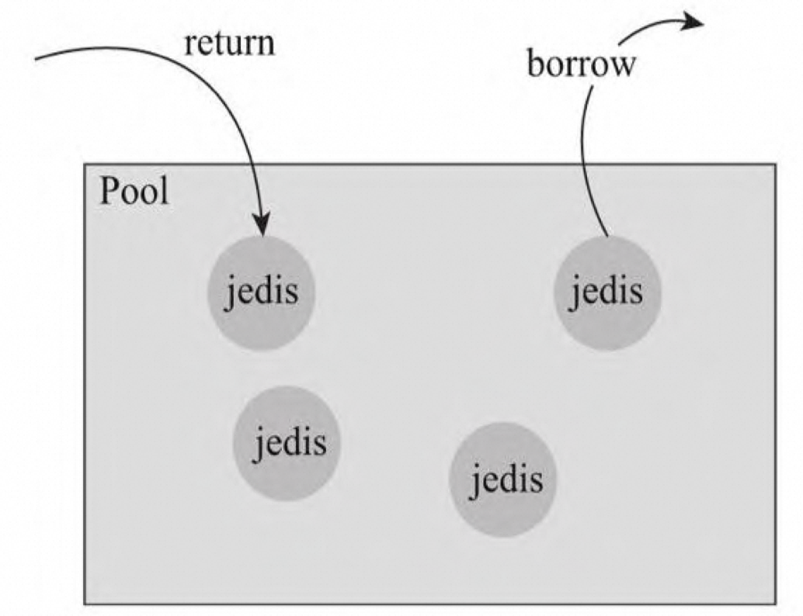
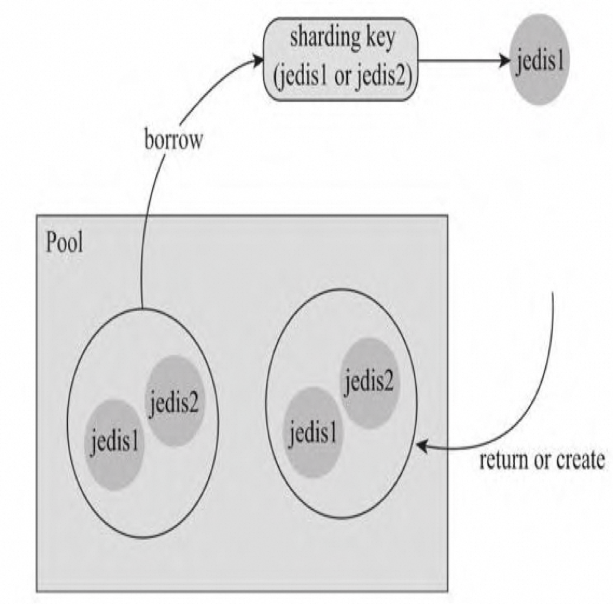
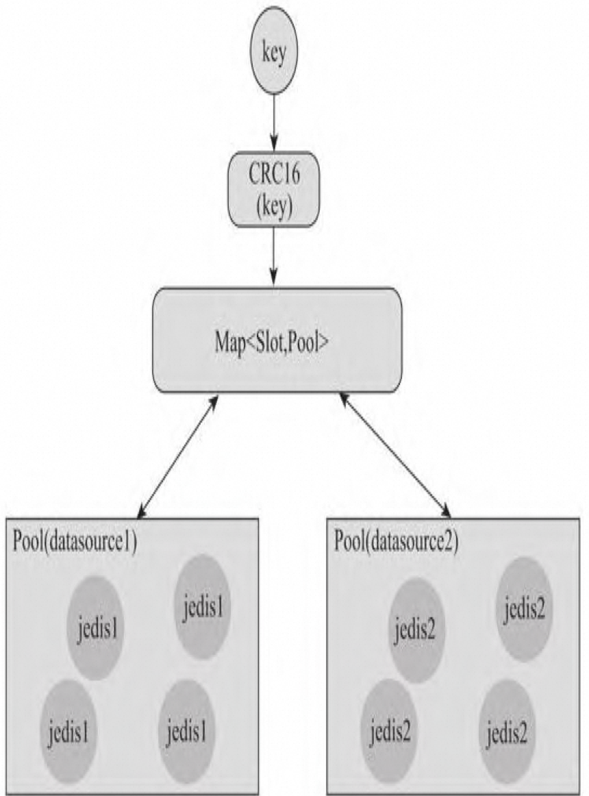
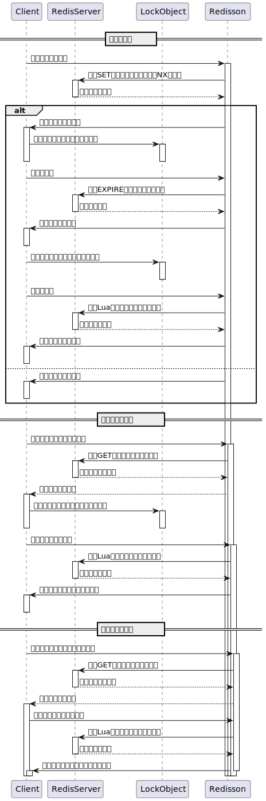

# 八、Redis 的 Java 客户端

## 8.1 Jedis

### 连接池

#### 单点连接池

- Jedis 连接池基于 Common-Pool 



连接池里面放置的是空闲连接，如果被使用 （borrow）掉，连接池就会少一个连接，连接使用完后进行放回 （return），连接池会增加一个可用连接。如果没有可用连接，便会新建连接

#### sharding 连接池



- 比如有两个redis服务进程（redis1， redis2），对key按照sharding策略选择访问哪一个redis。相较于单点连接池，sharding连接池里面的连接为redis1和redis2两个连接。每次申请使用一个连接，实际上是拿到了两个不同的连接，然后通过sharding选择具体访 问哪一个redis。
- 该方案的缺点是**会造成连接的浪费，比如需要访问redis1， 但是实际上也占用redis2的连接**。

#### Cluster 连接池



在客户端启动的时候，会从某一个redis 服务上面，获取到后端cluster集群上面所有的redis服务列表【cluster info】（比如redis1 和redis2），并且对每一个redis服务建立独立的连接池。如果访问后端 redis服务，会先通过CRC16计算访问的key确定slot，再通过slot选择对应的 连接池（比如redis1的pool），再从对应的连接池里面获取连接，访问后端 服务。

### 参数优化方式

- https://help.aliyun.com/zh/redis/use-cases/jedispool-optimization

```java
    public static class JedisPool {
        /**
         * 最大空闲连接数，不能超过Redis 实例的最大连接数
         */
        private int maxIdle = 10;

        /**
         * 最小空闲连接数，不能超过Redis 实例的最大连接数
         */
        private int minIdle = 10;

        /**
         * 最大连接数，不能超过Redis 实例的最大连接数 线上规格最大连接数 6W ，期望QPS 20W，两分片，单个redis  10W ，一次 Redis 平均耗时 1ms ，一个链接的QPS 大约是 1s/1ms =
         * 1000, 最多允许的是= 10W/1000=100,当前设置为40
         */
        private int maxTotal = 40;

        /**
         * 获取连接时的最大等待毫秒数，如果超时就抛异常
         */
        private int maxWaitMillis = 1000;

        /**
         * 在获取连接的时候检查有效性, 默认false,业务量大的时候减少一次 ping 的开销
         */
        private boolean testOnBorrow = false;

        /**
         * 在空闲时检查有效性, 默认false，业务量大的时候减少一次 ping 的开销
         */
        private boolean testOnReturn = false;
    }
```

- 连接池具体实现逻辑: org.apache.commons.pool2.impl.GenericObjectPool#borrowObject(long)
- Redisson

### 问题和解决方式

1. **无法从连接池获取到连接**：

- 原因可能包括连接池设置过小、未正确释放连接、存在慢查询操作、或者服务端阻塞等。
- 解决方法包括适当增加连接池大小、正确释放连接、优化慢查询操作以及排查服务端问题。

1. **客户端读写超时**：

- 可能由于读写超时设置过短、命令执行缓慢、网络异常或Redis服务端阻塞等原因导致。
- 解决方法包括调整超时设置、优化命令执行、排查网络异常或服务端问题。

1. **客户端连接超时**：

- 可能由于连接超时设置过短、Redis服务端阻塞或网络异常等原因导致。
- 解决方法包括调整连接超时设置、排查网络异常或服务端问题。

1. **客户端缓冲区异常**：

- 可能由于输出缓冲区满、长时间闲置连接被服务端主动断开或并发读写等原因导致。
- 解决方法包括调整缓冲区设置、合理管理连接、排查服务端问题。

1. **Lua脚本正在执行**：

- 若Redis正在执行Lua脚本并超过了限制时间，会导致异常。
- 解决方法是等待Lua脚本执行完毕或手动终止执行。

1. **Redis正在加载持久化文件**：

- 若Redis正在加载持久化文件，则客户端无法执行命令。
- 解决方法是等待持久化加载完成。

1. **Redis使用的内存超过maxmemory配置**：

- 若Redis使用内存超过maxmemory设置，则无法执行命令。
- 解决方法包括调整maxmemory设置和排查内存使用情况。

1. **客户端连接数过大**：

- 若客户端连接数超过maxclients设置，则无法建立新连接。
- 解决方法包括调整maxclients设置、排查客户端连接数过多的原因，并可能考虑故障转移。

## 千万不要使用 Lettue

## 分布式锁



# 