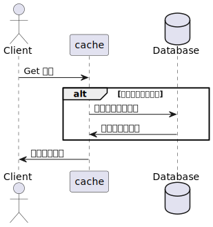

# 九、案例实践&进阶方案

## 9.1 本地缓存组件选型

使用缓存组件时需要重点关注集群方式、集群、缓存命中率。

- 需要关注集群组建方式、缓存统计；还需要考虑缓存开发语言对缓存的影响，如对于JAVA开发的缓存需要考虑GC的影响；
- 最后还要特别关注缓存的命中率，理解影响缓存命中率的因素，及如何提高缓存命中率。

| 对比维度       | Ehcache                               | Guava Cache                    |
| -------------- | ------------------------------------- | ------------------------------ |
| 设计目标与定位 | 专注于提供高性能的分布式缓存          | 定位于提供简单易用的内存缓存库 |
| 主要功能       | 支持多级缓存、分布式、复杂策略等      | 提供基础Get/Put/Remove接口     |
| 性能特点       | 性能高,支持策略优化                   | 性能依赖实现,一般为CHM级别     |
| 缓存策略       | 支持LRU、FIFO等多策略                 | 简单的基于大小的LRU策略        |
| 适用场景       | 大并发、分布式项目                    | 小中型项目或简单内存缓存       |
| 配置方式       | XML/注解/代码配置                     | 主要通过代码配置               |
| 性能监控       | 提供详细监控统计与MXBean              | 仅支持简单的加载与驱逐监听     |
| 持久化能力     | **支持磁盘等持久化 [ 冷数据的存储 ]** | 不支持任何持久化               |
| 事务支持       | 支持读写事务                          | 不支持事务                     |
| 集成度         | 良好地集成与Spring等框架              | 主要作为Guava的一部分使用      |
| 社区支持       | 活跃社区及文档支持                    | 也有一定的社区支持             |
| 配置难易度     | 配置相对复杂                          | 配置简单易上手                 |

## 9.2 本地缓存和分布式缓存的数据一致性方案

### 定时轮询

缺点：因为每台服务器定时轮询的时间点可能不一样，那么不同服务器 刷新最新缓存的时间可能也不一样，这样就会产生数据不一致的问题，对一致性要求不是很高的时候可以使用。

### 主动通知

- 这种方案引入了消息队列，使每台应用服务器的Ehcache同步侦听MQ消息，通过MQ推送或者拉取的方式，这样在一定程度上可以达到准同步更新数据。
- 缺点：因为不同服务器之间的网络速度的原因，所以也不能完全达到强 一致性。基于此原理使用ZooKeeper等分布式协调通知组件也是如此。

- 先操作数据库还是先操作Redis？
- 删除Redis还是更新Redis?

## 9.3 缓存的基础使用模式

- Cache-Aside: 业务代码中管理维护缓存。缓存中间件不关联缓存和实际存储间的逻辑

- 当前机制能够利用数据库成熟的高可用机制，数据库写成功，则进行缓存数据更新。

- Cachs-As-SoR : 把缓存当做记录系统，真实记录的访问在 Cache 组件内部实现。细分如下： 

- Read-Through模式: 当缓存中没有查询到Key对应的Value时,会自动从后端数据源(如数据库)中加载数据放入缓存,然后再返回查询结果。这可以实现数据的预取填充。

读入缓存模式Read-Through

预先刷新缓存模式Refresh-Ahead

这是写进入缓存和数据库模式Write-Through

写进入缓存,后台写入数据库模式Write-Behind

## 9.4  热点数据问题

### 缓存穿透

缓存穿透是指查询一个根本不存在的数据，缓存层和存储层都不会命中

- 内存风险：空值做了缓存意味着缓存层中存了更多的键，需要更多的内存空间。如果是攻击，问题更严重。有效的方法是针对这类数据设置一个较短的过期时间，让其自动剔除。
- 数据一致性风险：缓存层和存储层的数据会有一段时间窗口的不一致，可能会对业务产生影响。例如，过期时间设置为5分钟，如果此时存储层添加了这个数据，那么在这段时间内就会出现缓存层和存储层数据的不一致。可以利用消息系统或者其他方式清除掉缓存层中的空对象，以保持数据一致性。
- 防御机制： 使用 IDS | IPS 入侵检测和入侵防御系统来解决

使用 布隆过滤器来拦截，不推荐使用 ，推荐使用 布谷过滤器 、

**布隆过滤器他的容量有上限且无法扩容**

### 缓存雪崩

缓存崩了导致流量都达到了 DB 层。

1. 保证缓存服务的高可用
2. 依赖隔离组件为后端限流和降级【sentinel】
3. 提前演练

### 热点 Key 

## Big  Key

- 内存空间不均匀（平衡）：例如在Redis Cluster中，bigkey会造成节点 的内存空间使用不均匀。
- 超时阻塞：由于Redis单线程的特性，操作bigkey比较耗时，也就意味 着阻塞Redis可能性增大。
- 网络阻塞： 每次获取bigkey产生的网络流量较大，假设一个bigkey为 1MB，每秒访问量为1000，那么每秒产生1000MB的流量，带宽被占满。

发现： 

- 被动发现： 客户端当抛出异常时打印出所操作的key
- 主动监测： scan+debug object：如果怀疑存在bigkey，可以使用scan命 令渐进的扫描出所有的key，分别计算每个key的serializedlength，找到对应 bigkey进行相应的处理和报警，这种方式是比较推荐的方式。

解决： 

- 拆分复杂数据结构：如果当前key的类型是一个二级数据结构，例如 哈希类型。如果该哈希元素个数较多，可以考虑将当前hash进行拆分，这样 该热点key可以拆分为若干个新的key分布到不同Redis节点上，从而减轻压 力。
- 迁移热点key：以Redis Cluster为例，可以将热点key所在的slot单独 迁移到一个新的Redis节点上，但此操作会增加运维成本。
- 本地缓存加通知机制：可以将热点key放在业务端的本地缓存中，因 为是在业务端的本地内存中，处理能力要高出Redis数十倍，但当数据更新 时，此种模式会造成各个业务端和Redis数据不一致，通常会使用发布订阅 机制来解决类似问题。

### 批量热点数据过过期

使用延迟消息分批失效

## 9.5 不过期缓存和过期缓存的选择

### 不过期缓存场景：

- **适用场景**：数据访问频率高、数据一致性要求较低、数据量不是很大的场景。
- **思路**：采用Cache-Aside模式，即先写数据库，成功后再写入缓存。如果对缓存数据一致性要求不高，可以考虑定期全量同步缓存。
- **注意事项**：

- 不要将写缓存放在事务中，尤其是写入分布式缓存，以免由于网络抖动导致数据库事务阻塞。
- 对于频繁查询的业务（如商品查询），不适合先删缓存再执行数据库事务的方式，因为可能存在事务未提交而另一个系统已经读取缓存的情况。
- 可以考虑使用订阅数据库日志的架构（如使用canal订阅MySQL的binlog）来实现缓存同步，以解决多个事务并发问题。

- **应用场景示例**：用户、分类、商品、价格、订单等数据，当缓存空间充足时可以考虑不过期缓存，使用LRU机制驱逐老的缓存数据。

### 过期缓存机制：

- **适用场景**：缓存其他系统的数据、缓存空间有限、低频热点缓存等场景。
- **思路**：采用懒加载方式，即首先读取缓存，若不命中则查询数据，然后异步写入缓存并设置过期时间，下次读取将命中缓存。
- **注意事项**：

- 针对热点数据，可在应用系统上设置较短的缓存时间。
- 数据可能存在一段时间的不一致情况，需要根据场景来决定如何设置过期时间。

- **应用场景示例**：库存数据

## 多级缓存架构

https://www.yuque.com/huangjinshidai-1wt9t/qpdkdn/ltu4og389ir69r68?singleDoc# 《003 百万并发站点架构 nginx、多级缓存、canal》

## 9.6 Redis 常用运维方式

### 大集群 | 多集群部署

| **缓存部署方式**   | **部署方式**                                                 | **优点**                                                     | **缺点**                                                     |
| ------------------ | ------------------------------------------------------------ | ------------------------------------------------------------ | ------------------------------------------------------------ |
| 统一大集群方式部署 | 将所有Redis集中在一起，形成一个超大的Redis集群，通过代理统一对外提供连接。 | 扩容方便，对使用者无感知；利用率高，运维简单；客户端使用方便，透明。(可以简单地认为链接上了一个内 存无限大的Redis） | 无法实时计算项目配额，导致资源浪费；热点数据可能导致某个节点不可用。 |
| 多集群分散式部署   | 各个Redis相互独立部署，各项目独占一个Redis，隔离性好。       | 隔离性好，项目之间互不影响；灵活性高，可根据项目定制部署。   | 部署麻烦，需单独针对项目部署；(各个项目的定制又各有 不同)客户端使用复杂，需要处理不同Redis的连接。(停机维护需要客户端感知) |

| **问题描述**                                                 | **基本解决思路**                                          | **详细解决方案**                                             |
| ------------------------------------------------------------ | --------------------------------------------------------- | ------------------------------------------------------------ |
| 部署问题： 部署Redis集群通常需要耗费大量时间和精力，手动操作容易出错，而且随着集群规模的增大，管理难度也会增加 | 实现自动化部署方式，一键部署Redis。                       | 使用配置管理工具（如Ansible、Chef、Puppet）编写部署脚本，实现自动化部署Redis的功能。设计部署流程，包括配置管理、监控等方面，确保部署的稳定性和可靠性。 |
| 监控问题： 管理大量的Redis实例和主机需要一个有效的监控系统，以便及时发现和解决性能问题、异常情况等。 | 建立对大量Redis及所在主机的监控体系，提供状态查询和监控。 | 部署监控系统（如Zabbix、Nagios、Prometheus）实时监测Redis集群和主机的状态、性能、负载等情况。设置警报机制，通过邮件、短信等方式及时发现和处理异常情况。 |
| 客户端使用问题： 不同项目使用不同的Redis实例，客户端需要手动配置和管理连接信息，容易出错且不便于维护。 | 简化客户端使用，避免修改配置和重新上传。                  | 提供统一的接入层或配置管理服务（如ZooKeeper、Consul），客户端通过统一接口访问，无需手动修改配置。提供详细的接入文档和技术支持，协助客户端快速接入和使用。 |
| 运维问题： Redis本身是一个小工具，但在实际应用中需要综合考虑监控、诊断、日志分析、自动化运维等方面的问题，需要相应的工具和技术支持。 | 提供分析和运维工具，简化Redis运维流程。                   | 开发或集成运维工具，包括监控、诊断、日志分析、自动化运维等功能（如RedisInsight、Redis Desktop Manager、Redis Commander）。提供培训和技术支持，帮助运维人员更好地管理和维护Redis。 |

### Docker 化部署

| **重点** | **描述**                                                     |
| -------- | ------------------------------------------------------------ |
| 部署方式 | 使用Docker来解决Redis的部署问题。基于Docker的自动化运维平台，通过Docker的RESTful API进行操作，使得新机器配置后可以直接进行自动化部署。 |
| 优点     | 部署快捷方便，通过Docker的自动化运维平台可以轻松进行部署操作。Docker提供了API接口，完全够用，避免了使用kubernetes增加的复杂度。 |
| 缺点     | Redis的网卡容易打满，对网络流量的控制需要使用定制的网络插件，如Contiv netplugin，进行限制和监控。Redis的内存问题较为复杂，内存控制需要考虑used_memory和used_memory_rss等参数，并避免碎片问题导致的内存溢出。 |
| 解决方案 | CPU控制：使用Docker隔离分配进行CPU控制。内存控制：通过自己的监控程序进行内存控制，根据策略进行内存扩容，同时采用数据压缩算法减少Redis的内存占用。网卡控制：使用Contiv netplugin限制Redis的网络流量，确保不同项目之间的网络互不干扰。运维自动化：使用自动化运维平台和监控系统，提高部署效率、监控系统稳定性，自动化管理客户端连接信息和运维工作。 |

## 9.7 基于 CacheCloud 管理 Redis

https://github.com/sohutv/cachecloud

自建基础方案设计：

## 场景示例

 Canel

- 数据预热： 提前把数据读入到缓存

- 监控机制： 需要通过监控机制确保预热数据都写成功了
- 容量评估： 需要评估容量是否允许预热全量数据
- 数据库性能： 语句是否会影响批量数据库操作或者慢 SQL 引发数据库性能问题
- 回滚方案： 紧急回滚便于操作，包括降级开关的设计
- 冷热集群处理： 新建的集群可以先从冷集群中获取 Key，如果获取不到，再从热集群获取，最后回天到冷集群

- 核心流程： 

- 读取缓存：首先尝试从缓存中读取数据。
- 缓存命中：如果缓存命中，则直接返回缓存数据。
- 缓存未命中：如果缓存未命中，则需要查询数据源获取数据。
- 异步写入缓存：获取数据后，将其异步写入缓存中。这样可以降低读取延迟，并且不会阻塞当前请求的处理。
- 设置过期时间：在写入缓存时，设置合适的过期时间。过期时间的选择需要根据业务场景和数据特性来决定。
- 下次读取命中缓存：下次相同的请求再次访问时，如果在过期时间内，则缓存命中，否则继续从数据源获取数据。

- 注意事项：

- 数据不一致性：由于缓存数据的过期时间，可能导致一段时间内缓存中的数据与数据源不一致。因此，需要根据业务场景权衡数据一致性和性能要求，合理设置过期时间。
- 短暂数据一致性问题：对于一些短时间内不一致的数据，可以在业务上忽略或者通过其他手段进行弥补，比如在前端应用上缓存几秒钟的数据，因为这样的短暂不一致是可以被忍受的。
- 缓存清理策略：需要定期清理过期缓存数据，释放缓存空间。通常可以采用LRU（最近最少使用）等策略来淘汰最近最少使用的缓存数据。

# 