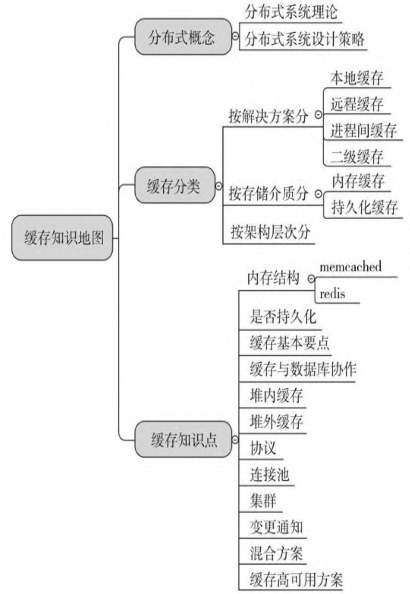

# REF

- 缓存知识地图： 

- [Jedis 连接参数优化](https://help.aliyun.com/zh/redis/use-cases/jedispool-optimization)
- [📎Redis面试题（二）.pdf](https://www.yuque.com/attachments/yuque/0/2024/pdf/2310873/1712149109137-f9d80559-0778-4220-b8f0-29b8a1d35c23.pdf)
- [📎Redis面试题（含答案）_.pdf](https://www.yuque.com/attachments/yuque/0/2024/pdf/2310873/1712149109137-1e82a361-2c6f-4176-a2d8-bda3c0c8d74e.pdf)
-  [📎JSR107FinalSpecification.pdf](https://www.yuque.com/attachments/yuque/0/2024/pdf/2310873/1712149109151-4fdabc37-a571-49cc-89be-df5c681e72d9.pdf)
- [📎Redis开发与运维(完整版).pdf](https://www.yuque.com/attachments/yuque/0/2024/pdf/2310873/1712149109161-07f66f78-ae90-4f37-a69a-e756a1995e47.pdf)
- Base 理论： https://icyfenix.cn/architect-perspective/general-architecture/transaction/distributed.html
- [📎深入分布式缓存：从原理到实践 (于君泽) (Z-Library).pdf](https://www.yuque.com/attachments/yuque/0/2024/pdf/2310873/1712149109438-17a61c62-416c-439c-9f0b-920c820cfd65.pdf)